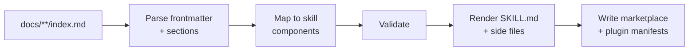

# Documentation as Skills

Source: https://adaptive-enforcement-lab.com/build/documentation-as-skills/

Compile a documentation site into Claude Code skills, so the same markdown that renders a page also ships as a capability the agent loads at authoring time.

> **One Source, Two Delivery Mechanisms**
>
>
> Documentation is **pull**. It waits to be searched for. Skills are **push**. They arrive when the agent needs them. Generating the second from the first means the two cannot drift, because they are the same artifact.
>

## Why It Matters

Engineering knowledge that lives only on a documentation site competes with whatever an AI agent produces from general training data.

The agent answers in seconds without leaving the editor. The docs require someone to feel uncertain, go looking, and read. In that race, correct-but-unread documentation loses.

Compiling docs into skills removes the race. The patterns are present in the agent's context when code is written, carrying the specific decisions a team has already made rather than a plausible generic default.

The trade-off is that generated skills are only as good as their source. A vague page compiles into a vague skill, delivered with more authority and less friction than the page had. This pipeline is a multiplier on documentation quality, not a substitute for it.

## Prerequisites

- A documentation tree with consistent structure, since this pipeline keys on `index.md` files and YAML frontmatter
- YAML frontmatter carrying at minimum `title` and `description` on every page intended to become a skill
- Go 1.26 or later to build the generator
- A GitHub App (or equivalent machine identity) if regeneration runs in CI and must open pull requests

## Key Principles

**One document, one skill.** Each `index.md` under a mapped category directory becomes exactly one skill. Sibling pages are supporting material, not separate skills. This keeps the skill count proportional to concepts rather than files.

**Frontmatter is the routing contract.** The `description` field is the only text the agent sees when deciding whether a skill applies. It is copied verbatim into the generated skill, which makes it the highest-leverage field in the entire source document.

**Structure carries meaning.** Section headings are matched against known component buckets: prerequisites, implementation, anti-patterns, troubleshooting. Documents written with conventional headings extract cleanly; documents with idiosyncratic ones produce thin skills.

**Generation is idempotent.** Running the generator twice against unchanged docs produces byte-identical output. This makes work avoidance in CI trivial: if `git status` is clean, there is nothing to publish.

**Validation is advisory, not blocking.** A skill that fails validation is still written, and the finding is surfaced. Generation of 116 good skills should not be blocked by one document with a short description.

## Implementation

The pipeline has four stages. Each is documented in detail on its own page.

**[Extraction Pipeline](extraction-pipeline.md)**: How documents are discovered, which are skipped, and how a path becomes a plugin and skill name.

**[Skill Anatomy](skill-anatomy.md)**: What a generated skill directory contains, how section mapping works, and the thresholds that decide which optional files appear.

**[Marketplace and Versioning](marketplace-versioning.md)**: How plugin manifests and the marketplace catalog are generated, and how release-please drives version numbers.

**[CI Automation](ci-automation.md)**: Triggering regeneration from a documentation change, authenticating with a GitHub App, and the commit-versus-PR decision.

## When to Apply

| Situation | Use this pattern? |
| --- | --- |
| Documentation already structured with consistent frontmatter | **Yes**, extraction is nearly free |
| Patterns are team-specific and differ from general practice | **Yes**, this is the highest-value case |
| Documentation is prose-heavy with few conventional headings | **Restructure first**, or extraction will produce thin skills |
| Content changes several times per day | **Reconsider**, since regeneration churn may outweigh benefit |
| Fewer than roughly ten documents | **No**, hand-author the skills instead |

## Anti-Patterns

**Hand-editing generated skills.** Any change to a file under the generated plugin tree is destroyed on the next run. Fix the source document instead. Marking the output directory as generated in code review tooling prevents well-meaning edits.

**Skipping the description field.** A missing or vague `description` produces a skill the agent cannot route to. It will exist, consume space in the catalog, and never load.

**Blocking generation on validation failure.** One malformed document should never prevent the other hundred-plus skills from publishing. Report findings, write the output, fix the source.

**Treating skill count as a quality metric.** More skills is not better. Skills that never load are noise; the number worth tracking is how often each one is actually used.

---

**Related:** [Release Pipelines](../release-pipelines/index.md) · [Versioned Documentation](../versioned-docs/index.md) · [Go CLI Architecture](../go-cli-architecture/index.md)
