# Build — Full Reference

Generated from adaptive-enforcement-lab.com. For a scannable index with links to the live docs, see SKILL.md in this skill.

## Overview

Development tools and release processes.

> **Build with Intent**
>
>
> Building secure, tested, versioned software requires more than writing code. It requires **architecture**, **testing discipline**, **release automation**, and **documentation workflows** that scale from prototype to production.
>

### Overview

This section covers the development practices, tooling choices, and automation patterns that turn code into deployable, documented, versioned artifacts.

### What You'll Find Here

**[Go CLI Architecture](go-cli-architecture/index.md)**: Production-grade Go CLIs with Kubernetes integration, testing, and packaging (21 pages)

**[Coverage Patterns](coverage-patterns/coverage-patterns.md)**: Testing strategies and coverage enforcement without slowing development

**[Release Pipelines](release-pipelines/index.md)**: Automated releases with Release Please for conventional commits and semantic versioning (8 pages)

**[Versioned Documentation](versioned-docs/index.md)**: Multi-version docs with Mike to prevent user confusion

**[Documentation as Skills](documentation-as-skills/index.md)**: Compile documentation into Claude Code skills so patterns reach engineers inside the agent (5 pages)

### Integration with Secure and Enforce

Build processes integrate with security and enforcement:

1. **Build artifacts** (Build) → **Scan for vulnerabilities** ([Secure](../secure/index.md)) → **Block vulnerable images** ([Enforce](../enforce/index.md))
2. **Run tests** (Build) → **Enforce coverage** ([Enforce](../enforce/index.md)) → **Gate PR merge** ([Enforce](../enforce/index.md))
3. **Generate SBOM** ([Secure](../secure/index.md)) → **Attach to release** (Build) → **Require in deployment** ([Enforce](../enforce/index.md))
4. **Create release** (Build) → **Generate SLSA provenance** ([Enforce](../enforce/index.md)) → **Verify in deployment** ([Enforce](../enforce/index.md))

### Development Workflow

Typical development flow using these patterns:

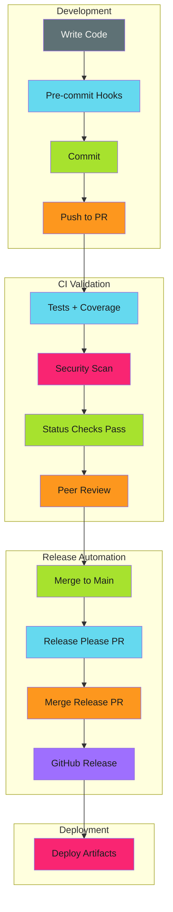

### Related Content

- [Secure](../secure/index.md): Security scanning and SBOM generation
- [Enforce](../enforce/index.md): Testing enforcement and compliance
- [Patterns](../patterns/index.md): CI/CD patterns and architecture

### Tags

Browse all content tagged with ci-cd, automation, testing, and go on the [Tags](../tags.md) page.

## Documentation as Skills

Compile MkDocs documentation into Claude Code skills so…

Compile a documentation site into Claude Code skills, so the same markdown that renders a page also ships as a capability the agent loads at authoring time.

> **One Source, Two Delivery Mechanisms**
>
>
> Documentation is **pull**. It waits to be searched for. Skills are **push**. They arrive when the agent needs them. Generating the second from the first means the two cannot drift, because they are the same artifact.
>

#### Why It Matters

Engineering knowledge that lives only on a documentation site competes with whatever an AI agent produces from general training data.

The agent answers in seconds without leaving the editor. The docs require someone to feel uncertain, go looking, and read. In that race, correct-but-unread documentation loses.

Compiling docs into skills removes the race. The patterns are present in the agent's context when code is written, carrying the specific decisions a team has already made rather than a plausible generic default.

The trade-off is that generated skills are only as good as their source. A vague page compiles into a vague skill, delivered with more authority and less friction than the page had. This pipeline is a multiplier on documentation quality, not a substitute for it.

#### Prerequisites

- A documentation tree with consistent structure, since this pipeline keys on `index.md` files and YAML frontmatter
- YAML frontmatter carrying at minimum `title` and `description` on every page intended to become a skill
- Go 1.26 or later to build the generator
- A GitHub App (or equivalent machine identity) if regeneration runs in CI and must open pull requests

#### Key Principles

**One document, one skill.** Each `index.md` under a mapped category directory becomes exactly one skill. Sibling pages are supporting material, not separate skills. This keeps the skill count proportional to concepts rather than files.

**Frontmatter is the routing contract.** The `description` field is the only text the agent sees when deciding whether a skill applies. It is copied verbatim into the generated skill, which makes it the highest-leverage field in the entire source document.

**Structure carries meaning.** Section headings are matched against known component buckets: prerequisites, implementation, anti-patterns, troubleshooting. Documents written with conventional headings extract cleanly; documents with idiosyncratic ones produce thin skills.

**Generation is idempotent.** Running the generator twice against unchanged docs produces byte-identical output. This makes work avoidance in CI trivial: if `git status` is clean, there is nothing to publish.

**Validation is advisory, not blocking.** A skill that fails validation is still written, and the finding is surfaced. Generation of 116 good skills should not be blocked by one document with a short description.

#### Implementation

The pipeline has four stages. Each is documented in detail on its own page.

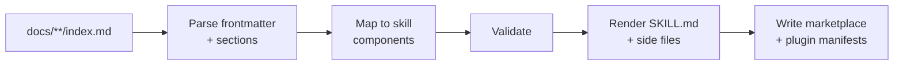

**[Extraction Pipeline](extraction-pipeline.md)**: How documents are discovered, which are skipped, and how a path becomes a plugin and skill name.

**[Skill Anatomy](skill-anatomy.md)**: What a generated skill directory contains, how section mapping works, and the thresholds that decide which optional files appear.

**[Marketplace and Versioning](marketplace-versioning.md)**: How plugin manifests and the marketplace catalog are generated, and how release-please drives version numbers.

**[CI Automation](ci-automation.md)**: Triggering regeneration from a documentation change, authenticating with a GitHub App, and the commit-versus-PR decision.

#### When to Apply

| Situation | Use this pattern? |
| --- | --- |
| Documentation already structured with consistent frontmatter | **Yes**, extraction is nearly free |
| Patterns are team-specific and differ from general practice | **Yes**, this is the highest-value case |
| Documentation is prose-heavy with few conventional headings | **Restructure first**, or extraction will produce thin skills |
| Content changes several times per day | **Reconsider**, since regeneration churn may outweigh benefit |
| Fewer than roughly ten documents | **No**, hand-author the skills instead |

#### Anti-Patterns

**Hand-editing generated skills.** Any change to a file under the generated plugin tree is destroyed on the next run. Fix the source document instead. Marking the output directory as generated in code review tooling prevents well-meaning edits.

**Skipping the description field.** A missing or vague `description` produces a skill the agent cannot route to. It will exist, consume space in the catalog, and never load.

**Blocking generation on validation failure.** One malformed document should never prevent the other hundred-plus skills from publishing. Report findings, write the output, fix the source.

**Treating skill count as a quality metric.** More skills is not better. Skills that never load are noise; the number worth tracking is how often each one is actually used.

---

**Related:** [Release Pipelines](../release-pipelines/index.md) · [Versioned Documentation](../versioned-docs/index.md) · [Go CLI Architecture](../go-cli-architecture/index.md)

## Go CLI Architecture

Build Kubernetes-native CLIs in Go with type safety…

Build orchestration CLIs in Go for Kubernetes-native automation.

This guide covers the meta-architecture for building custom CLIs that integrate with Kubernetes and workflow engines. These patterns apply whether you're building deployment tools, cache managers, or any automation that needs to interact with cluster resources.

---

#### When to Use Go CLIs

> **Go vs Shell Scripts**
>
>
> Start with shell scripts for prototyping. Graduate to Go when you need type safety, testability, or complex orchestration logic.
>

**Use Go when you need:**

- Direct Kubernetes API access with type-safe clients
- Complex orchestration logic across multiple resources
- Reusable tooling packaged as container images
- Performance-critical operations (milliseconds matter)
- Long-running controllers or operators

**Use shell scripts when you need:**

- Simple glue logic between existing tools
- Quick prototypes or one-off operations
- kubectl-based workflows without custom logic
- CI/CD steps that primarily call other CLIs

---

#### Architecture Overview

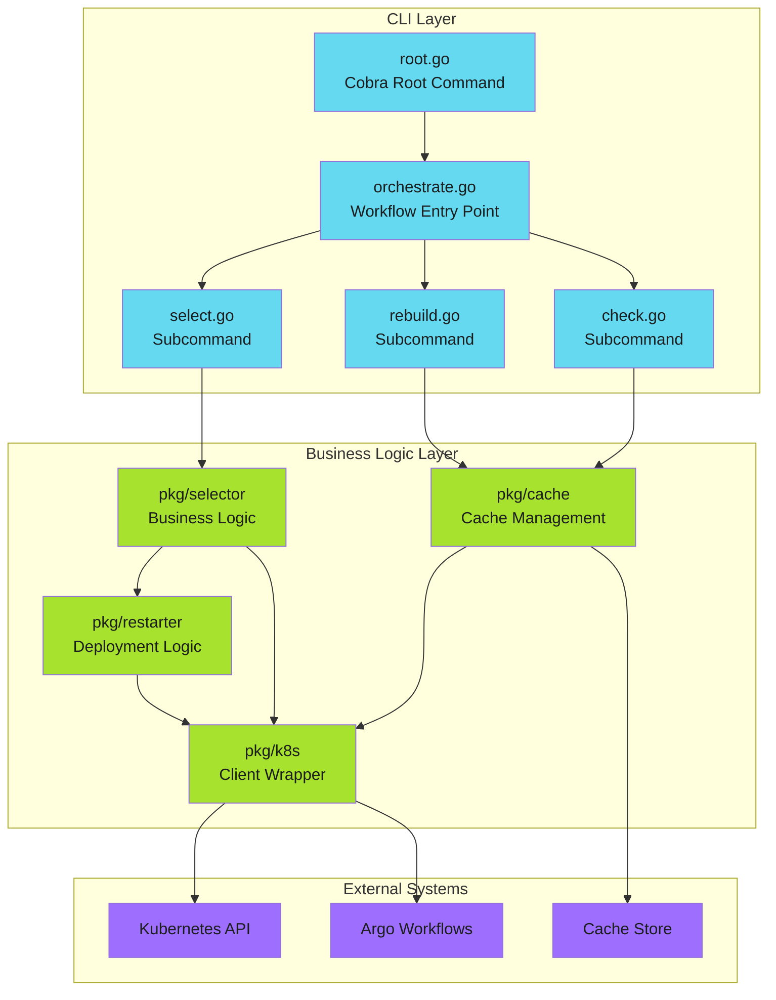

---

#### Guide Contents

<div class="grid cards" markdown>

-   :material-hammer-wrench:{ .lg .middle } **Framework Selection**

    ---

    Choose between Cobra, urfave/cli, and Kong. Configuration with Viper.

    [:octicons-arrow-right-24: Framework Selection](framework-selection/index.md)

-   :material-kubernetes:{ .lg .middle } **Kubernetes Integration**

    ---

    client-go patterns, in-cluster config, RBAC, and context handling.

    [:octicons-arrow-right-24: Kubernetes Integration](kubernetes-integration/index.md)

-   :material-source-branch:{ .lg .middle } **Command Architecture**

    ---

    Orchestrator pattern, subcommand design, and error handling.

    [:octicons-arrow-right-24: Command Architecture](command-architecture/index.md)

-   :material-package-variant:{ .lg .middle } **Packaging**

    ---

    Multi-stage builds, minimal images, Helm integration.

    [:octicons-arrow-right-24: Packaging](packaging/index.md)

-   :material-test-tube:{ .lg .middle } **Testing Strategies**

    ---

    Fake clients, integration testing, E2E in CI/CD.

    [:octicons-arrow-right-24: Testing](testing/index.md)

</div>

---

#### Example Project Structure

```text
myctl/
├── cmd/
│   ├── root.go           # Cobra root command, global flags
│   ├── orchestrate.go    # Main workflow orchestrator
│   ├── check.go          # Cache check command
│   ├── rebuild.go        # Cache rebuild command
│   └── select.go         # Deployment selector
├── pkg/
│   ├── cache/            # Cache management logic
│   │   ├── cache.go
│   │   └── cache_test.go
│   ├── k8s/              # Kubernetes client wrapper
│   │   ├── client.go
│   │   └── client_test.go
│   ├── selector/         # Business logic
│   │   ├── selector.go
│   │   └── selector_test.go
│   └── restarter/        # Deployment restart logic
│       ├── restarter.go
│       └── restarter_test.go
├── Dockerfile
├── go.mod
├── go.sum
└── main.go               # Entry point
```

---

#### Key Design Principles

| Principle | Description |
| ----------- | ------------- |
| **[Separation of concerns](../../patterns/architecture/separation-of-concerns/index.md)** | Commands handle CLI logic; `pkg/` handles business logic |
| **[Testable by default](testing/index.md)** | Interfaces for external dependencies enable fake clients |
| **[Fail fast](../../patterns/error-handling/fail-fast/index.md)** | Validate configuration and connectivity before operations |
| **[Structured output](command-architecture/io-contracts.md)** | JSON output for machine consumption, human-friendly by default |
| **[Graceful degradation](../../patterns/error-handling/graceful-degradation/index.md)** | Clear error messages with actionable context |

---

*Building CLIs that operators trust.*

### Command Architecture

Design command structures that are intuitive, composable, and maintainable.

> **Design Philosophy**
>
> Commands should work both independently and as part of larger workflows. The orchestrator coordinates; individual commands do the work.
>

---

#### Overview

A well-designed CLI has commands that work both independently and as part of larger workflows. This section covers:

- **[Orchestrator Pattern](orchestrator-pattern.md)** - Coordinate multi-step workflows
- **[Subcommand Design](subcommand-design.md)** - Build independently useful commands
- **[Input/Output Contracts](io-contracts.md)** - Design for pipelines and automation

---

#### The Orchestrator Pattern

For complex workflows, use a single entry point that coordinates subcommands:

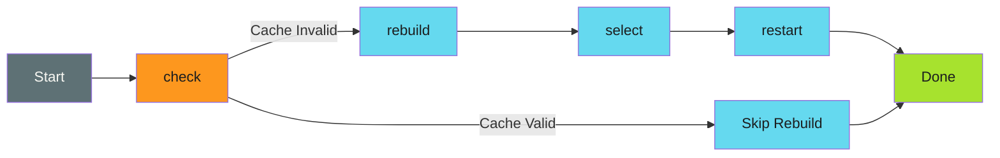

---

#### Command Hierarchy

```text
myctl
├── orchestrate          # Main workflow
├── check                # Cache status
├── rebuild              # Force cache rebuild
├── select               # List deployments
├── restart              # Restart deployments
├── version              # Show version info
└── completion           # Shell completion scripts
    ├── bash
    ├── zsh
    └── fish
```

---

#### Best Practices

| Practice | Description |
| ---------- | ------------- |
| **Flat hierarchy** | Avoid deeply nested subcommands (max 2 levels) |
| **Verb-noun ordering** | `myctl restart deployment` not `myctl deployment restart` |
| **Consistent flags** | Use same flag names across commands |
| **Hidden internal commands** | Mark debugging commands as hidden |
| **Exit codes** | Use consistent exit codes (0=success, 1=failure, 2=usage error) |

---

*Design commands for both humans and scripts.*

### Common Operations

Implement common Kubernetes operations in your CLI.

> **Idiomatic Kubernetes**
>
> Use label selectors for filtering, strategic merge patches for updates, and proper error handling with `apierrors.IsNotFound()`.
>

---

#### Overview

A well-designed Kubernetes CLI provides idiomatic operations that work consistently across resource types. This section covers:

- **[List Resources](list-resources.md)** - Query resources with label selectors
- **[Rollout Restart](rollout-restart.md)** - Trigger rolling restarts without downtime
- **[ConfigMap Operations](configmap-operations.md)** - Store and retrieve configuration data
- **[Watch Resources](watch-resources.md)** - React to real-time resource changes

---

#### Operation Patterns

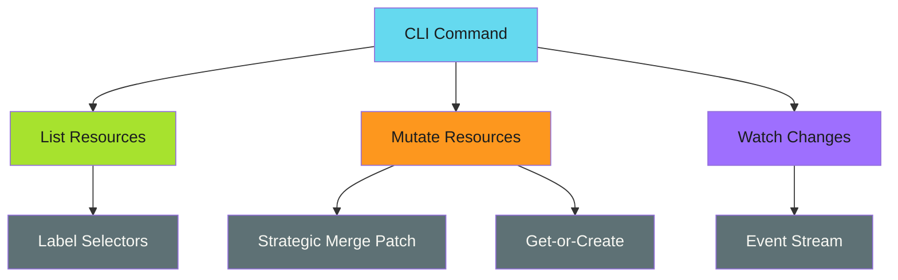

---

#### Best Practices

| Practice | Description |
| ---------- | ------------- |
| **Use label selectors** | Filter resources server-side, not client-side |
| **Prefer patches over updates** | Patches are safer for concurrent modifications |
| **Use strategic merge patches** | Kubernetes-native patch format for resources |
| **Handle not found errors** | Check `apierrors.IsNotFound(err)` before creating |
| **Respect resource versions** | Use optimistic concurrency for updates |

---

*Use the Kubernetes API idiomatically: label selectors, patches, and proper error handling.*

### Framework Selection

Choose the right CLI framework and configuration approach for your Go CLI.

---

#### Overview

Building a Kubernetes-native CLI requires thoughtful framework selection. The right choice depends on your complexity needs, ecosystem alignment, and team preferences.

This section covers:

- **[CLI Frameworks](cli-frameworks.md)** - Cobra, urfave/cli, and Kong compared
- **[Configuration with Viper](viper-configuration.md)** - Layered configuration management

---

#### Quick Recommendation

> **Default Choice**
>
>
> For Kubernetes-native CLIs, use **Cobra + Viper**. It powers kubectl, docker, gh, and most ecosystem tools. Your users already know the patterns.
>

| Need | Recommendation |
| ------ | ---------------- |
| Kubernetes ecosystem CLI | **Cobra** + Viper |
| Simple utility | **urfave/cli** |
| Type-safe struct definitions | **Kong** |

---

#### Decision Matrix

| Criteria | Cobra | urfave/cli | Kong |
| ---------- | ------- | ------------ | ------ |
| Ecosystem maturity | High | Medium | Growing |
| Learning curve | Medium | Low | Low |
| Type safety | Low | Low | High |
| Kubernetes alignment | High | Medium | Medium |
| Configuration integration | Excellent (Viper) | Good | Good |
| Shell completion | Built-in | Plugin | Built-in |
| Nested subcommands | Excellent | Good | Good |

---

*Choose tools that match kubectl conventions. Your users already know them.*

### Kubernetes Integration

Integrate your Go CLI with Kubernetes using client-go.

> **Universal Client**
>
> Build clients that work everywhere: developer laptops, CI runners, and cluster pods. Automatic config detection handles the differences.
>

---

#### Overview

A well-designed Kubernetes CLI works seamlessly both on developer laptops and inside cluster pods. This section covers:

- **[Client Configuration](client-configuration.md)** - Automatic config detection for all environments
- **[RBAC Setup](rbac-setup.md)** - Service accounts and permissions
- **[Common Operations](common-operations/index.md)** - List, patch, and restart resources

---

#### Configuration Flow

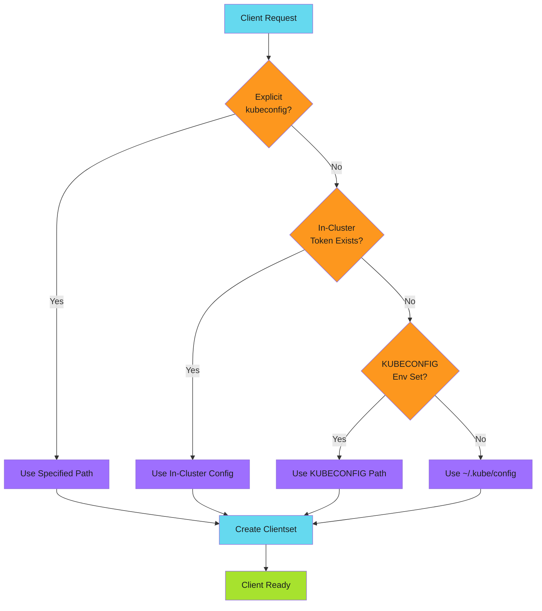

---

#### Quick Start

```go
import "k8s.io/client-go/kubernetes"

// Create a client that works everywhere
client, err := k8s.NewClient(kubeconfig, namespace)
if err != nil {
    return fmt.Errorf("failed to create client: %w", err)
}

// Use the client
deployments, err := client.ListDeployments(ctx)
```

---

#### Best Practices

| Practice | Description |
| ---------- | ------------- |
| **Use contexts everywhere** | Pass `context.Context` to all Kubernetes operations |
| **Handle cancellation** | Respect context cancellation for clean shutdowns |
| **Wrap errors with context** | Include resource type and name in error messages |
| **Default to current namespace** | Match kubectl behavior for namespace resolution |
| **Support both configs** | Always handle in-cluster and out-of-cluster scenarios |
| **Minimal RBAC** | Request only the permissions your CLI needs |

---

*Build clients that work everywhere: laptop, CI runner, or pod.*

### Packaging

Build minimal, secure container images for your Go CLI.

> **Minimal Images**
>
> Static Go binaries on distroless base images give you ~5MB images with no shell attack surface. Small image + non-root + read-only = secure container.
>

---

#### Overview

Packaging a Go CLI involves creating distributable artifacts that run anywhere. This section covers:

- **[Container Builds](container-builds.md)** - Multi-stage Dockerfiles with distroless
- **[Helm Charts](helm-charts.md)** - Deploy your CLI with Helm
- **[Release Automation](release-automation.md)** - Multi-arch builds and GoReleaser
- **[GitHub Actions](github-actions.md)** - Distribute as a reusable GitHub Action
- **[Pre-commit Hooks](pre-commit-hooks.md)** - Distribute as pre-commit hooks

---

#### Build Flow

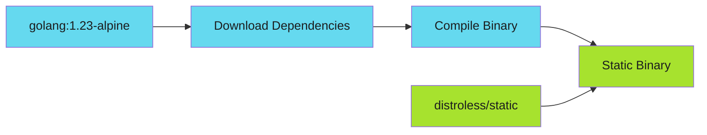

---

#### Base Image Selection

| Image | Size | Use Case |
| ------- | ------ | ---------- |
| `gcr.io/distroless/static` | ~2MB | Pure Go, no CGO |
| `gcr.io/distroless/base` | ~20MB | Needs libc |
| `alpine:3.19` | ~7MB | Need shell/debugging |
| `scratch` | 0MB | Maximum minimal (no TLS certs) |

---

#### Best Practices

| Practice | Description |
| ---------- | ------------- |
| **Static binaries** | Use `CGO_ENABLED=0` for portable builds |
| **Non-root user** | Always run as non-root in containers |
| **Read-only filesystem** | Set `readOnlyRootFilesystem: true` |
| **Drop capabilities** | Remove all capabilities with `drop: ALL` |
| **Version in binary** | Inject version at build time |
| **Multi-arch support** | Build for both amd64 and arm64 |

---

*Ship binaries that run anywhere Kubernetes runs.*

### Testing Strategies

Build confidence in your CLI with comprehensive testing at every level.

> **Test at the Right Level**
>
> Unit tests catch logic bugs with fakes. Integration tests catch API contract issues. E2E tests catch workflow bugs in real clusters.
>

---

#### Overview

A well-tested CLI uses different testing strategies at different levels. This section covers:

- **[Unit Testing](unit-testing.md)** - Fake clients and interface-based design
- **[Integration Testing](integration-testing.md)** - envtest and real API servers
- **[E2E Testing](e2e-testing.md)** - Full workflow tests in CI/CD

---

#### Testing Pyramid

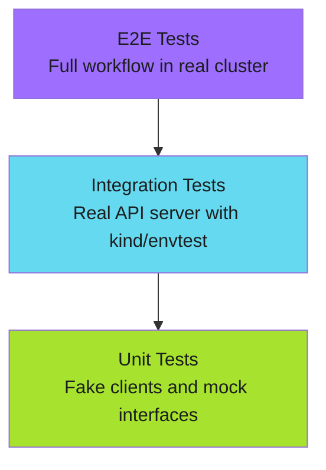

---

#### Test Organization

```text
myctl/
├── cmd/
│   ├── check.go
│   └── check_test.go        # Command tests
├── pkg/
│   ├── k8s/
│   │   ├── client.go
│   │   ├── client_test.go   # Unit tests with fakes
│   │   └── fake_client.go   # Test doubles
│   └── selector/
│       ├── selector.go
│       └── selector_test.go
└── test/
    ├── e2e/                  # E2E tests
    └── fixtures/             # Test resources
```

---

#### Makefile Targets

```makefile
.PHONY: test test-unit test-integration test-e2e

test: test-unit

test-unit:
    go test -v -race ./...

test-integration:
    go test -v -tags=integration ./pkg/...

test-e2e:
    ./test/e2e/run.sh
```

---

#### Best Practices

| Practice | Description |
| ---------- | ------------- |
| **Interface first** | Design for testability with interfaces |
| **Table-driven tests** | Cover edge cases systematically |
| **Parallel tests** | Use `t.Parallel()` where safe |
| **Build tags** | Separate integration tests with `//go:build integration` |
| **Clean up** | Always clean up test resources |

---

*Test at the right level. Unit tests catch logic bugs. Integration tests catch API issues. E2E tests catch workflow bugs.*

## Modular Release Pipelines

Automate version management and changelog generation with smart…

Automated version management, changelog generation, and optimized builds for monorepos.

> **Smart Builds**
>
> Only build what changed. GitHub App tokens trigger builds correctly. Release-please handles versions automatically.
>

---

#### Overview

This guide covers implementing release automation with:

- **Release-please** for version bumping and changelog generation
- **GitHub App authentication** for proper workflow triggering
- **Change detection** to skip unnecessary builds
- **Cascade rebuilds** when shared dependencies change

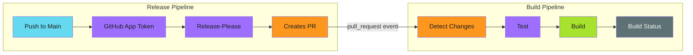

---

#### The Problem

Traditional CI/CD pipelines rebuild everything on every commit. In a monorepo with multiple components, this means:

- Unnecessary compute time for unchanged components
- Longer feedback loops for developers
- Wasted resources on duplicate work

Additionally, release-please using the default `GITHUB_TOKEN` won't trigger build pipelines on its PRs -- a [GitHub security measure](https://docs.github.com/en/actions/security-guides/automatic-token-authentication#using-the-github_token-in-a-workflow) to prevent infinite loops.

---

#### The Solution

A modular pipeline architecture that:

1. Uses a **GitHub App token** for release-please (triggers `pull_request` events correctly)
2. Detects which components changed
3. Only builds affected components
4. Automatically versions and releases based on commits

---

#### Guides

| Guide | Description |
| ----- | ----------- |
| [Release-Please Configuration](release-please/index.md) | Setting up automated versioning with GitHub App |
| [Change Detection](change-detection.md) | Detecting and cascading changes |
| [Workflow Triggers](workflow-triggers.md) | GitHub App token vs GITHUB_TOKEN |
| [Protected Branches](protected-branches.md) | Working with branch protection rules |

---

#### Prerequisites

Before implementing release pipelines, set up a GitHub App for your organization:

- [GitHub App Setup](../../secure/github-apps/index.md) - Create and configure the App
- [Token Generation](../../patterns/github-actions/actions-integration/token-generation/index.md) - Generate tokens in workflows

---

#### Architecture

##### Build Pipeline

Runs on pull requests (including release-please PRs with GitHub App token):

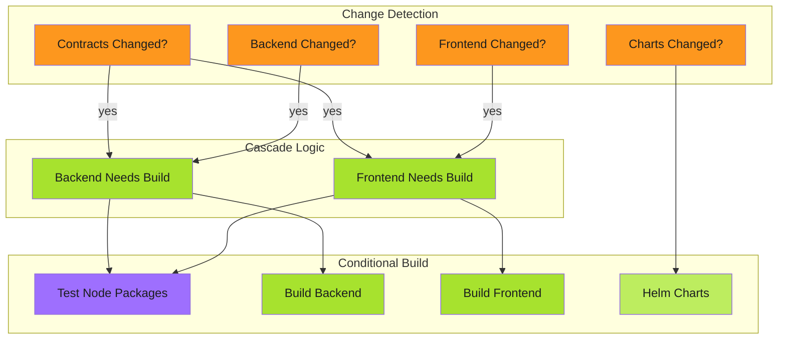

##### Release Pipeline

Runs on main branch pushes:

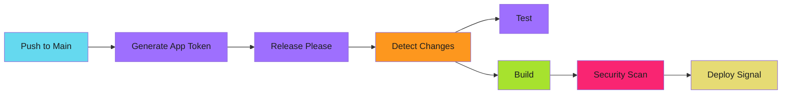

---

#### Quick Start

1. [Set up GitHub App](../../secure/github-apps/index.md) for your organization
2. [Configure release-please](release-please/index.md) with App token
3. [Set up change detection](change-detection.md) for your components
4. [Handle protected branches](protected-branches.md) if applicable

---

#### Related

- [GitHub App Setup](../../secure/github-apps/index.md) - Machine identity for automation
- [Idempotency Patterns](../../patterns/efficiency/idempotency/index.md) - Making reruns safe
- [Three-Stage Design](../../patterns/architecture/three-stage-design.md) - Complex workflows

### Release-Please Configuration

[Release-please](https://github.com/marketplace/actions/release-please-action) automates version management based on conventional commits. It creates release PRs with updated changelogs, version bumps, and Git tags.

> **Schema Validation**
>
> Always include the `$schema` property in your config file. It catches invalid options immediately and saves debugging time.
>

---

#### Overview

Release-please reads your commit history and:

1. Groups changes by type (feat, fix, chore, etc.)
2. Generates changelogs
3. Bumps versions according to semantic versioning
4. Creates pull requests for releases
5. Tags releases when PRs merge

---

#### Configuration Files

##### release-please-config.json

The main configuration file defines packages and their versioning behavior:

```json
{
  "$schema": "https://raw.githubusercontent.com/googleapis/release-please/main/schemas/config.json",
  "include-v-in-tag": false,
  "tag-separator": "-",
  "changelog-sections": [
    { "type": "feat", "section": "Features" },
    { "type": "fix", "section": "Bug Fixes" },
    { "type": "perf", "section": "Performance" },
    { "type": "refactor", "section": "Code Refactoring" },
    { "type": "docs", "section": "Documentation", "hidden": true },
    { "type": "chore", "section": "Maintenance" },
    { "type": "test", "section": "Tests", "hidden": true },
    { "type": "ci", "section": "CI/CD", "hidden": true }
  ],
  "packages": {
    "charts/my-app": {
      "release-type": "helm",
      "component": "my-app",
      "include-component-in-tag": false
    },
    "packages/backend": {
      "release-type": "node",
      "component": "backend",
      "package-name": "my-backend",
      "include-component-in-tag": true
    },
    "packages/frontend": {
      "release-type": "node",
      "component": "frontend",
      "package-name": "my-frontend",
      "include-component-in-tag": true
    }
  },
  "separate-pull-requests": true
}
```

##### .release-please-manifest.json

Tracks current versions for each package:

```json
{
  "charts/my-app": "1.0.0",
  "packages/backend": "1.0.0",
  "packages/frontend": "1.0.0"
}
```

---

#### Configuration Options

##### Global Options

| Option | Description | Example |
| -------- | ------------- | --------- |
| `include-v-in-tag` | Prefix tags with `v` | `true` = `v1.0.0`, `false` = `1.0.0` |
| `tag-separator` | Separator between component and version | `-` = `backend-1.0.0` |
| `separate-pull-requests` | Create one PR per component | Recommended for monorepos |
| `changelog-sections` | How to group commits in changelogs | See example above |

##### Package Options

| Option | Description | Values |
| -------- | ------------- | -------- |
| `release-type` | Package ecosystem | `node`, `helm`, `simple`, `python`, `go`, etc. |
| `component` | Component name for tagging | Any string |
| `include-component-in-tag` | Include component in tag | `true` = `backend-1.0.0` |
| `package-name` | Package name (for node, etc.) | Matches package.json name |

---

#### Schema Validation

Always validate configuration against the official schema:

```json
{
  "$schema": "https://raw.githubusercontent.com/googleapis/release-please/main/schemas/config.json"
}
```

This catches invalid options immediately. Options like `release-name` don't exist. The schema prevents wasted debugging time.

---

#### In This Section

- [Release Types](release-types.md) - Node, Helm, Simple, and changelog customization
- [Extra-Files](extra-files.md) - Version tracking in arbitrary files
- [Workflow Integration](workflow-integration.md) - GitHub Actions setup and outputs
- [Troubleshooting](troubleshooting.md) - Common issues and solutions

---

#### Related

- [Change Detection](../change-detection.md) - Skip unnecessary builds
- [Workflow Triggers](../workflow-triggers.md) - GITHUB_TOKEN compatibility
- [Content Comparison](../../../patterns/github-actions/use-cases/work-avoidance/content-comparison.md) - Skip version-only changes

---

#### References

- [Release-please Action](https://github.com/marketplace/actions/release-please-action) - GitHub Marketplace
- [Release-please Repository](https://github.com/googleapis/release-please) - googleapis
- [Manifest Releaser Documentation](https://github.com/googleapis/release-please/blob/main/docs/manifest-releaser.md) - Monorepo configuration
- [Configuration Schema](https://raw.githubusercontent.com/googleapis/release-please/main/schemas/config.json) - JSON schema for validation

## Open Source Project Templates

Production-ready templates for CONTRIBUTING.

Copy-paste templates for open source project documentation based on real OpenSSF Best Practices Badge certification work. CONTRIBUTING.md, SECURITY.md, and GitHub issue forms with realistic SLAs and proven compliance.

> **Source Material**
>
> These templates come from the [readability project's OpenSSF certification](https://github.com/adaptive-enforcement-lab/readability) (PRs [#93](https://github.com/adaptive-enforcement-lab/readability/pull/93), [#94](https://github.com/adaptive-enforcement-lab/readability/pull/94), [#95](https://github.com/adaptive-enforcement-lab/readability/pull/95)).
>

---

#### Why These Templates Matter

OpenSSF Best Practices Badge certification revealed the pattern: most projects have solid technical infrastructure but lack **documentation**.

The badge criteria require:

- ✅ CONTRIBUTING.md with development setup and testing requirements
- ✅ SECURITY.md with disclosure process and response timelines
- ✅ Issue templates for bug reports and feature requests
- ✅ Clear communication of contribution guidelines

These are the main gap for well-maintained projects. Templates fill the gap.

---

#### Template Library

##### CONTRIBUTING.md Template

The [CONTRIBUTING.md template](contributing-template.md) provides:

- Annotated template with placeholders for project-specific details
- Real example from production (readability project)
- Development setup, code style, testing requirements
- Pull request process and commit message conventions
- Code review requirements

[View CONTRIBUTING Template →](contributing-template.md)

---

##### SECURITY.md Template

The [SECURITY.md template](security-template.md) provides:

- Template with realistic SLAs and private disclosure mechanisms
- Real example from production (readability project)
- Supported versions table
- Reporting process (GitHub Security Advisories + email)
- Response timelines by severity level
- Security measures documentation

[View SECURITY Template →](security-template.md)

---

##### GitHub Issue Templates

The [GitHub issue templates](issue-templates.md) provide:

- Bug report YAML form template
- Feature request YAML form template
- Template configuration (config.yml)
- Structured fields with validation

[View Issue Templates →](issue-templates.md)

---

#### OpenSSF Best Practices Alignment

How these templates satisfy OpenSSF Badge criteria:

| Criterion | Template | Compliance |
|-----------|----------|------------|
| **Documentation** | CONTRIBUTING.md | ✅ Explains how to contribute |
| **Bug Reporting** | Bug Report template | ✅ Structured process |
| **Enhancement Proposals** | Feature Request template | ✅ Clear submission path |
| **Security Process** | SECURITY.md | ✅ Disclosure mechanism |
| **Response Timelines** | SECURITY.md SLAs | ✅ Realistic commitments |
| **Testing Requirements** | CONTRIBUTING.md | ✅ Coverage thresholds |
| **Code Review** | CONTRIBUTING.md PR process | ✅ Approval requirements |

##### Badge Checklist Mapping

✅ **Contributing file**: CONTRIBUTING.md with setup, testing, PR process

✅ **Bug reporting**: Issue templates with structured fields

✅ **Enhancement proposals**: Feature request template

✅ **Security disclosure**: SECURITY.md with private channel (Security Advisories)

✅ **Security response**: Documented SLAs (48hr initial, 7 day update, 90 day resolution)

---

#### Common Gaps These Templates Fill

##### 1. Missing Security Disclosure Process

**Problem**: No SECURITY.md, reporters open public issues with vulnerability details.

**Fix**: SECURITY.md with GitHub Security Advisories link + email fallback.

##### 2. Unrealistic SLAs

**Problem**: SECURITY.md promises "immediate response" that never happens.

**Fix**: Realistic timelines (48 hours, not "immediately"). Better to under-promise and over-deliver.

##### 3. Unstructured Bug Reports

**Problem**: Issues say "it doesn't work" with zero details.

**Fix**: YAML issue templates with required fields for reproduction steps, environment, logs.

##### 4. No Testing Requirements

**Problem**: PRs without tests get merged, coverage drops.

**Fix**: CONTRIBUTING.md explicitly states coverage threshold and test commands.

##### 5. No Development Setup

**Problem**: Contributors can't set up project locally.

**Fix**: CONTRIBUTING.md with prerequisite list and installation commands.

---

#### Customization Checklist

When adapting these templates:

- [ ] Replace `[PROJECT_NAME]` with actual project name
- [ ] Replace `[ORG]` with GitHub organization
- [ ] Replace `[LANGUAGE]`, `[VERSION]` with tech stack
- [ ] Update install commands (`npm install`, `pip install`, `go mod download`)
- [ ] Update test commands (`npm test`, `pytest`, `go test`)
- [ ] Update linter/formatter names (`eslint`, `black`, `golangci-lint`)
- [ ] Set realistic SLA timelines based on team capacity
- [ ] Update supported versions table in SECURITY.md
- [ ] Configure issue template labels to match your project
- [ ] Update security measures list (SBOM, scanning tools, etc.)

---

#### Related Patterns

- Blog: [OpenSSF Best Practices Badge in 2 Hours](../../blog/posts/2025-12-17-openssf-badge-two-hours.md) - How these templates enable fast certification
- [SLSA Provenance Implementation](../../enforce/slsa-provenance/slsa-provenance.md) - Security measures referenced in SECURITY.md
- [SBOM Generation](../../secure/sbom/sbom-generation.md) - Supply chain transparency

---

*The gap is never the code. It's the documentation. These templates close that gap. Copy, paste, customize, commit. OpenSSF Badge unlocked.*

## Versioned Documentation

Deploy version-tagged documentation alongside releases using MkDocs Material…

Deploy documentation versions that align with software releases using MkDocs Material and mike.

> **Version Alignment**
>
> Users need docs that match the version they're running. Integrate release-please with mike to deploy version-tagged documentation alongside software releases.
>

---

#### Overview

Versioned documentation solves a critical problem: users need docs that match the version they're running, not the latest development state.

This pattern integrates with [release-please](../release-pipelines/release-please/index.md) to deploy version-tagged documentation alongside software releases.

---

#### Architecture

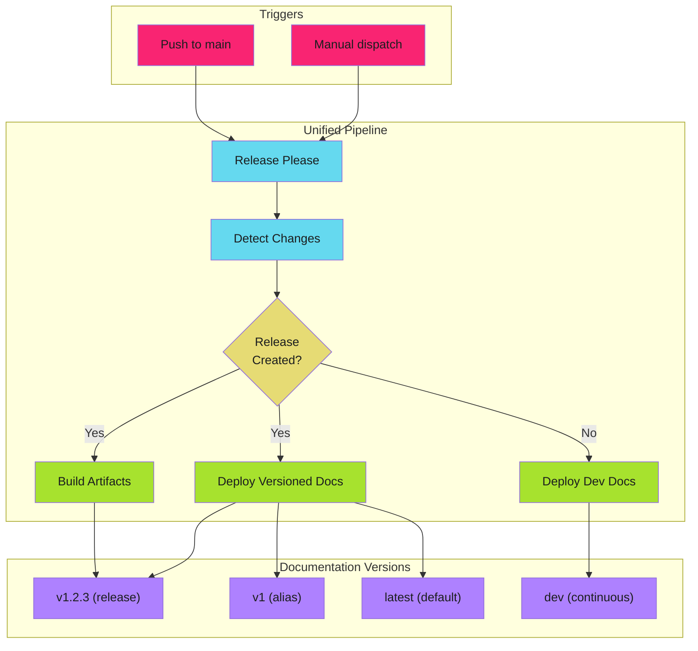

---

#### Key Concepts

##### Version Aliasing

Mike manages documentation versions with aliases:

| Version | Alias | Purpose |
| --------- | ------- | --------- |
| `1.2.3` | `v1`, `latest` | Current stable release |
| `1.1.0` | | Previous releases |
| `dev` | | Continuous from main branch |

Users selecting "v1" always get the latest 1.x release. The `latest` alias points to the most recent stable version.

##### Deployment Strategy

| Trigger | Action |
| --------- | -------- |
| Release created | Deploy versioned docs with aliases |
| Docs changed (no release) | Deploy to `dev` only |
| No docs changes | Skip documentation build entirely |

---

#### In This Section

- [Mike Configuration](mike-configuration.md) - MkDocs + mike setup
- [Pipeline Integration](pipeline-integration.md) - Unified release workflow
- [Version Strategies](version-strategies.md) - Aliasing and navigation patterns

---

#### Related

- [Release-Please Configuration](../release-pipelines/release-please/index.md) - Version management
- [Change Detection](../release-pipelines/change-detection.md) - Skip unnecessary builds
- [Work Avoidance](../../patterns/efficiency/work-avoidance/index.md) - Conditional job execution

#### Live Example

See this pattern in action at [readability.adaptive-enforcement-lab.com](https://readability.adaptive-enforcement-lab.com): a docs site with version selector powered by mike and release-please.
