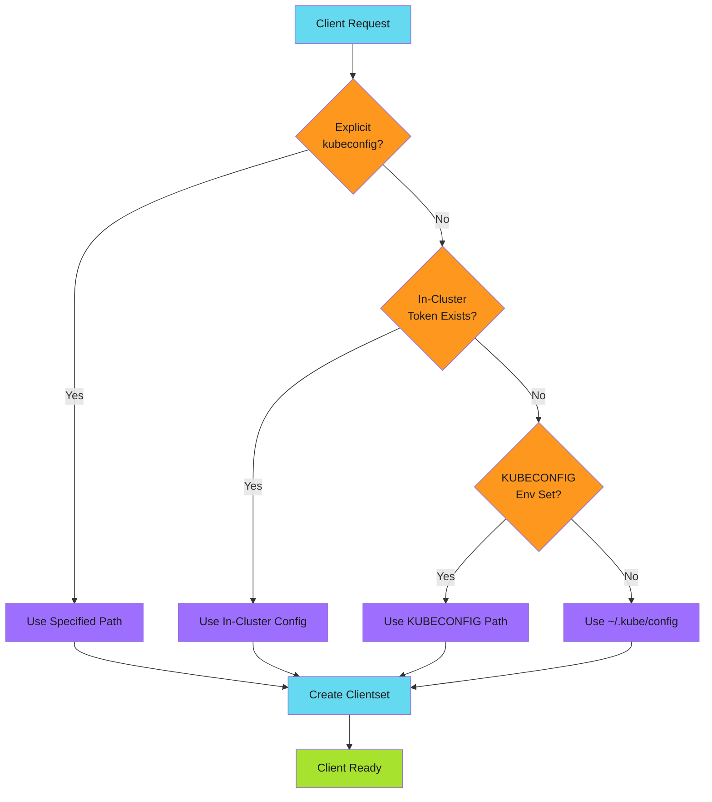

# Kubernetes Integration - Examples


## Example 1: example-1.mermaid





## Example 2: example-2.go


```go
import "k8s.io/client-go/kubernetes"

// Create a client that works everywhere
client, err := k8s.NewClient(kubeconfig, namespace)
if err != nil {
    return fmt.Errorf("failed to create client: %w", err)
}

// Use the client
deployments, err := client.ListDeployments(ctx)
```


