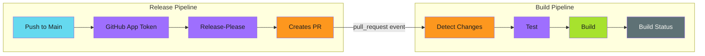
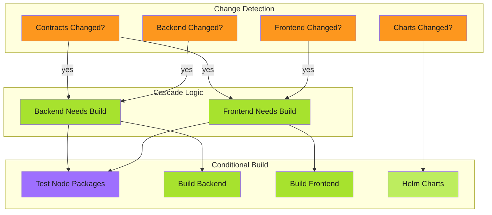
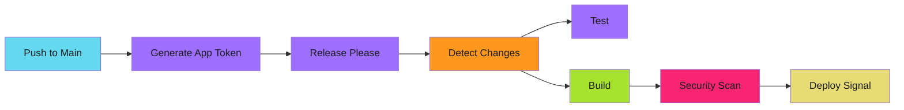

# Modular Release Pipelines - Examples

## Example 1: example-1.mermaid

```mermaid
flowchart LR
    subgraph release[Release Pipeline]
        Main[Push to Main] --> AppToken[GitHub App Token]
        AppToken --> RP[Release-Please]
        RP --> PR[Creates PR]
    end

    subgraph build[Build Pipeline]
        PR -->|pull_request event| DC[Detect Changes]
        DC --> Test[Test]
        Test --> Build[Build]
        Build --> Status[Build Status]
    end

    %% Ghostty Hardcore Theme
    style Main fill:#65d9ef,color:#1b1d1e
    style AppToken fill:#9e6ffe,color:#1b1d1e
    style RP fill:#9e6ffe,color:#1b1d1e
    style PR fill:#fd971e,color:#1b1d1e
    style DC fill:#fd971e,color:#1b1d1e
    style Test fill:#9e6ffe,color:#1b1d1e
    style Build fill:#a7e22e,color:#1b1d1e
    style Status fill:#5e7175,color:#f8f8f3
```

## Example 2: example-2.mermaid

```mermaid
flowchart TD
    subgraph detect[Change Detection]
        Contracts[Contracts Changed?]
        Backend[Backend Changed?]
        Frontend[Frontend Changed?]
        Charts[Charts Changed?]
    end

    subgraph cascade[Cascade Logic]
        BNB[Backend Needs Build]
        FNB[Frontend Needs Build]
    end

    subgraph build[Conditional Build]
        Test[Test Node Packages]
        BB[Build Backend]
        BF[Build Frontend]
        HC[Helm Charts]
    end

    Contracts -->|yes| BNB
    Contracts -->|yes| FNB
    Backend -->|yes| BNB
    Frontend -->|yes| FNB

    BNB --> Test
    FNB --> Test
    BNB --> BB
    FNB --> BF
    Charts --> HC

    %% Ghostty Hardcore Theme
    style Contracts fill:#fd971e,color:#1b1d1e
    style Backend fill:#fd971e,color:#1b1d1e
    style Frontend fill:#fd971e,color:#1b1d1e
    style Charts fill:#fd971e,color:#1b1d1e
    style BNB fill:#a7e22e,color:#1b1d1e
    style FNB fill:#a7e22e,color:#1b1d1e
    style Test fill:#9e6ffe,color:#1b1d1e
    style BB fill:#a7e22e,color:#1b1d1e
    style BF fill:#a7e22e,color:#1b1d1e
    style HC fill:#bded5f,color:#1b1d1e
```

## Example 3: example-3.mermaid

```mermaid
flowchart LR
    Main[Push to Main] --> Token[Generate App Token]
    Token --> RP[Release Please]
    RP --> DC[Detect Changes]
    DC --> Test[Test]
    DC --> Build[Build]
    Build --> Scan[Security Scan]
    Scan --> Deploy[Deploy Signal]

    %% Ghostty Hardcore Theme
    style Main fill:#65d9ef,color:#1b1d1e
    style Token fill:#9e6ffe,color:#1b1d1e
    style RP fill:#9e6ffe,color:#1b1d1e
    style DC fill:#fd971e,color:#1b1d1e
    style Test fill:#9e6ffe,color:#1b1d1e
    style Build fill:#a7e22e,color:#1b1d1e
    style Scan fill:#f92572,color:#1b1d1e
    style Deploy fill:#e6db74,color:#1b1d1e
```

