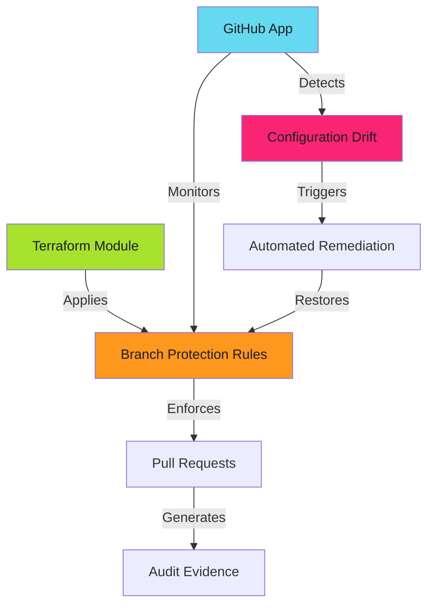

# Branch Protection Enforcement Patterns - Reference

This is the complete reference documentation extracted from the source.


# Branch Protection Enforcement Patterns

Branch protection rules transform security policies into automated enforcement. No manual oversight. No trust required.

> **Core Security Control**
>
> Branch protection is foundational. Without it, code reviews are optional, status checks are suggestions, and audit trails are worthless.
>

GitHub enforces the rules. Terraform maintains consistency at scale. GitHub Apps detect and remediate drift.

## The Enforcement Gap

Most organizations have branch protection policies. Few enforce them consistently.

**The Problem**:

- New repositories inherit no protection
- Developers disable protection during incidents, forget to re-enable
- Configuration drift across 100+ repositories
- No automated detection when protection is weakened
- Exceptions bypass controls without audit trails

**The Solution**:

Automated enforcement with multiple defense layers:

1. **Security tier templates** - Standardized configurations for different risk levels
2. **Infrastructure as Code** - Terraform/OpenTofu modules for consistent deployment
3. **GitHub App enforcement** - Automated drift detection and remediation
4. **Audit reporting** - Compliance evidence collection
5. **Formalized bypass controls** - Time-boxed exceptions with approval workflows

---

## Security Tiers

Different repositories require different protection levels.

| Tier | Use Case | Enforcement Level |
|------|----------|-------------------|
| **Standard** | Internal tools, documentation | Required reviews, basic status checks |
| **Enhanced** | Production services, customer-facing apps | Multi-reviewer, comprehensive checks, code owners |
| **Maximum** | Security-critical, compliance-regulated | Full enforcement, no admin bypass, mandatory signing |

> **Right-Sized Security**
>
> Not all repositories need maximum protection. Documentation repos can use Standard tier. Production infrastructure requires Maximum tier. Choose based on blast radius.
>

See **[Security Tiers](security-tiers.md)** for detailed configuration templates.

---

## Architecture Overview



**Key Components**:

- **Terraform modules** - Declare protection rules as code
- **GitHub Apps** - Monitor and enforce compliance organization-wide
- **Drift detection** - Identify unauthorized changes
- **Automated remediation** - Restore protection without manual intervention
- **Audit collection** - Capture evidence for compliance reporting

---

## What You'll Learn

This section covers comprehensive branch protection enforcement:

### Configuration & Standards

- **[Security Tiers](security-tiers.md)** - Tiered protection templates for different risk levels
- **[Branch Protection Rules](branch-protection.md)** - Detailed configuration reference

### Infrastructure as Code

- **[OpenTofu Modules](opentofu-modules.md)** - OpenTofu-specific patterns and considerations
- **[Multi-Repo Management](multi-repo-management.md)** - Patterns for 100+ repository enforcement

### GitHub App Enforcement

- **[GitHub App Enforcement](github-app-enforcement.md)** - Centralized enforcement with GitHub Apps
- **[Enforcement Workflows](enforcement-workflows.md)** - Automated workflows for organization-wide compliance
- **[Drift Detection](drift-detection.md)** - Detecting and remediating configuration drift

### Audit & Compliance

- **[Audit Evidence](audit-evidence.md)** - Collecting and storing compliance evidence
- **[Compliance Reporting](compliance-reporting.md)** - Automated reporting for SOC 2, ISO 27001, PCI-DSS
- **[Verification Scripts](verification-scripts.md)** - Audit preparation and continuous monitoring

### Bypass Controls

- **[Bypass Controls](bypass-controls.md)** - Formalized bypass procedures with approval workflows
- **[Emergency Access](emergency-access.md)** - Break-glass procedures for production incidents
- **[Exception Management](exception-management.md)** - Managing permanent and temporary exceptions

### Operations

- **[Troubleshooting](troubleshooting.md)** - Common issues and solutions

---

## Quick Start

### Step 1: Choose Your Security Tier

Start with **[Security Tiers](security-tiers.md)** to select the appropriate protection level for your repositories.

### Step 2: Apply Protection

**Manual (single repository)**:

```bash
gh api --method PUT \
  repos/org/repo/branches/main/protection \
  --input protection-config.json
```

**Automated (organization-wide)**:

### Step 3: Monitor Compliance

Deploy **[GitHub App Enforcement](github-app-enforcement.md)** to detect drift and maintain compliance.

### Step 4: Collect Evidence

Implement **[Audit Evidence](audit-evidence.md)** patterns for compliance reporting.

---

## Real-World Impact

**Before comprehensive enforcement**:

- 40% of repositories had no branch protection
- Admin bypass enabled on 80% of protected repositories
- Zero visibility into protection changes
- Manual verification before each audit (2 weeks of effort)

**After comprehensive enforcement**:

- 100% of repositories protected with tier-appropriate rules
- Automated drift detection and remediation within 5 minutes
- Complete audit trail of all protection changes
- Continuous compliance verification (zero manual effort)

**Key Metrics**:

- Configuration drift detected: **< 5 minutes**
- Automated remediation: **< 1 minute**
- Audit preparation time: **2 weeks → 15 minutes**

---

## Prerequisites

- GitHub organization with admin access
- Terraform or OpenTofu (for IaC deployment)
- GitHub App with appropriate permissions (for automated enforcement)
- Basic understanding of Git workflow and branch protection concepts

---

## Architecture Principles

### 1. Defense in Depth

Multiple enforcement layers: local configuration, drift detection, audit verification.

### 2. Automation Over Documentation

Don't document the policy. Enforce it automatically.

### 3. Tier-Based Configuration

Standard, Enhanced, Maximum tiers prevent both under-protection and over-restriction.

### 4. Immutable Audit Trail

GitHub API provides tamper-proof evidence of all enforcement actions.

### 5. Formalized Exceptions

Bypass controls with approval workflows, time-boxing, and automatic re-enablement.

---

## Related Patterns

- **[Required Status Checks](../status-checks/index.md)** - CI/CD as merge gates
- **[Commit Signing](../commit-signing/commit-signing.md)** - Cryptographic proof of authorship
- **[Audit & Compliance](../audit-compliance/audit-evidence.md)** - Evidence collection strategies
- **[GitHub Apps](../../secure/github-apps/index.md)** - Centralized authentication patterns

---

## Next Steps

Start with **[Security Tiers](security-tiers.md)** to understand the tiered protection model, then review **[Branch Protection Rules](branch-protection.md)** for detailed configuration options.

---

*Protection became immutable. Drift was detected. Remediation was automatic. Auditors found zero gaps. The controls were real.*

