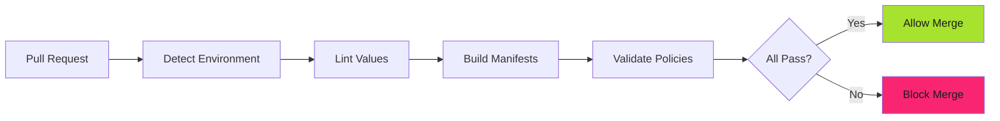

# CI Integration: Automated Policy Enforcement - Examples


## Example 1: example-1.mermaid





## Example 2: example-2.yaml


```yaml
- step:
    name: Detect Environment
    script:
      - |
        if [ -n "$BITBUCKET_PR_ID" ]; then
          # Pull Request - check destination branch
          case $BITBUCKET_PR_DESTINATION_BRANCH in
            "development") ENVIRONMENT="dev" ;;
            "qac")         ENVIRONMENT="qac" ;;
            "staging")     ENVIRONMENT="stg" ;;
            "production")  ENVIRONMENT="prd" ;;
            *)
              echo "Unknown destination branch"
              exit 0
              ;;
          esac
        else
          # Direct push - check current branch
          case $BITBUCKET_BRANCH in
            "development") ENVIRONMENT="dev" ;;
            "qac")         ENVIRONMENT="qac" ;;
            "staging")     ENVIRONMENT="stg" ;;
            "production")  ENVIRONMENT="prd" ;;
          esac
        fi
        echo "export ENVIRONMENT=${ENVIRONMENT}" > environment.sh
    artifacts:
      - environment.sh
```


## Example 3: example-3.yaml


```yaml
- step:
    name: Lint Values Against Schema
    image: policy-platform:latest
    script:
      - source environment.sh
      - |
        # Merge base values + environment values
        yq eval-all 'select(fileIndex == 0) * select(fileIndex == 1)' \
          /repos/backend-applications/charts/backend-app/values.yaml \
          ./cd/values.${ENVIRONMENT}.yaml \
        > combined_values.yaml

      - |
        # Validate merged values against schema
        spectral lint \
          -r /repos/backend-applications/.spectral.yaml \
          combined_values.yaml
```


## Example 4: example-4.yaml


```yaml
- step:
    name: Build Environment Manifests
    image: policy-platform:latest
    script:
      - source environment.sh
      - |
        # Define chart paths
        sec_pol_chart=/repos/security-policy/charts/security-policy
        dev_pol_chart=/repos/devops-policy/charts/devops-policy
        be_apps_chart=/repos/backend-applications/charts/backend-applications

      - |
        # Render DevOps policies
        helm template devops-policy ${dev_pol_chart} \
          -f ${dev_pol_chart}/values.yaml \
          -f /repos/devops-policy/cd/values.yaml \
          -f /repos/devops-policy/cd/${ENVIRONMENT}/values.yaml \
        > devops-policy.yaml

      - |
        # Render Security policies
        helm template security-policy ${sec_pol_chart} \
          -f ${sec_pol_chart}/values.yaml \
          -f /repos/security-policy/cd/values.yaml \
          -f /repos/security-policy/cd/${ENVIRONMENT}/values.yaml \
        > security-policy.yaml

      - |
        # Render application manifests
        helm template backend-app ${be_apps_chart} \
          -f ${be_apps_chart}/values.yaml \
          -f ./cd/values.${ENVIRONMENT}.yaml \
        > backend-app.yaml

    artifacts:
      - devops-policy.yaml
      - security-policy.yaml
      - backend-app.yaml
```


## Example 5: example-5.yaml


```yaml
- parallel:
    steps:
      - step:
          name: Validate DevOps Policy
          image: policy-platform:latest
          script:
            - |
              # Generate policy report
              kyverno apply devops-policy.yaml \
                --resource backend-app.yaml \
                --output mutated-resources \
                --policy-report \
                --audit-warn \
              > tmp-policy-report.yaml

            - |
              # Extract YAML report for download
              sed -n '/^POLICY REPORT:/,$p' tmp-policy-report.yaml \
                | tail -n +3 \
                | { echo '---'; cat; } \
              > policy-report.yaml

            - |
              # Display summary
              kyverno apply devops-policy.yaml \
                --resource backend-app.yaml \
                --output mutated-resources \
                --remove-color

            - |
              # Display detailed results table
              kyverno apply devops-policy.yaml \
                --resource backend-app.yaml \
                --output mutated-resources \
                -t --detailed-results \
                --remove-color
          artifacts:
            - policy-report.yaml

      - step:
          name: Validate Security Policy
          image: policy-platform:latest
          script:
            - |
              kyverno apply security-policy.yaml \
                --resource backend-app.yaml \
                --output mutated-resources \
                --policy-report \
                --audit-warn \
              > tmp-policy-report.yaml

            - sed -n '/^POLICY REPORT:/,$p' tmp-policy-report.yaml \
                | tail -n +3 \
                | { echo '---'; cat; } \
              > policy-report.yaml

            - kyverno apply security-policy.yaml \
                --resource backend-app.yaml \
                --output mutated-resources \
                --remove-color

            - kyverno apply security-policy.yaml \
                --resource backend-app.yaml \
                --output mutated-resources \
                -t --detailed-results \
                --remove-color
          artifacts:
            - policy-report.yaml
```


## Example 6: example-6.yaml


```yaml
image:
  name: policy-platform:main
  username: _json_key
  password: "$GCLOUD_API_KEYFILE"

pipelines:
  pull-requests:
    '**':
      # Stage 1: Detect environment from PR destination
      - step:
          name: Detect Environment
          script:
            - |
              case $BITBUCKET_PR_DESTINATION_BRANCH in
                "development") ENVIRONMENT="dev" ;;
                "qac")         ENVIRONMENT="qac" ;;
                "staging")     ENVIRONMENT="stg" ;;
                "production")  ENVIRONMENT="prd" ;;
                *)
                  echo "Unknown branch. Skipping."
                  exit 0
                  ;;
              esac
              echo "export ENVIRONMENT=${ENVIRONMENT}" > environment.sh
          artifacts:
            - environment.sh

      # Stage 2: Validate Helm values schema
      - step:
          name: Lint Values Schema
          script:
            - source environment.sh
            - yq eval-all 'select(fileIndex == 0) * select(fileIndex == 1)' \
                /repos/backend-applications/charts/backend-app/values.yaml \
                ./cd/values.${ENVIRONMENT}.yaml \
              > combined_values.yaml
            - spectral lint -r /repos/backend-applications/.spectral.yaml \
                combined_values.yaml

      # Stage 3: Render manifests
      - step:
          name: Build Manifests
          script:
            - source environment.sh
            - helm template devops-policy \
                /repos/devops-policy/charts/devops-policy \
                -f /repos/devops-policy/charts/devops-policy/values.yaml \
                -f /repos/devops-policy/cd/${ENVIRONMENT}/values.yaml \
              > devops-policy.yaml
            - helm template security-policy \
                /repos/security-policy/charts/security-policy \
                -f /repos/security-policy/charts/security-policy/values.yaml \
                -f /repos/security-policy/cd/${ENVIRONMENT}/values.yaml \
              > security-policy.yaml
            - helm template backend-app \
                /repos/backend-applications/charts/backend-app \
                -f /repos/backend-applications/charts/backend-app/values.yaml \
                -f ./cd/values.${ENVIRONMENT}.yaml \
              > backend-app.yaml
          artifacts:
            - devops-policy.yaml
            - security-policy.yaml
            - backend-app.yaml

      # Stage 4: Validate policies (parallel)
      - parallel:
          steps:
            - step:
                name: DevOps Policy
                script:
                  - kyverno apply devops-policy.yaml \
                      --resource backend-app.yaml \
                      --policy-report --audit-warn \
                    > tmp-report.yaml
                  - kyverno apply devops-policy.yaml \
                      --resource backend-app.yaml \
                      --remove-color
                  - kyverno apply devops-policy.yaml \
                      --resource backend-app.yaml \
                      -t --detailed-results --remove-color
                artifacts:
                  - tmp-report.yaml

            - step:
                name: Security Policy
                script:
                  - kyverno apply security-policy.yaml \
                      --resource backend-app.yaml \
                      --policy-report --audit-warn \
                    > tmp-report.yaml
                  - kyverno apply security-policy.yaml \
                      --resource backend-app.yaml \
                      --remove-color
                  - kyverno apply security-policy.yaml \
                      --resource backend-app.yaml \
                      -t --detailed-results --remove-color
                artifacts:
                  - tmp-report.yaml
```


