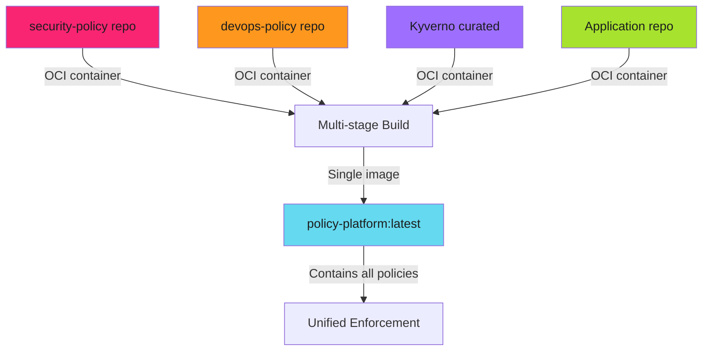

# Multi-Source Policy Aggregation - Reference

This is the complete reference documentation extracted from the source.

# Multi-Source Policy Aggregation

Combine policies from multiple repositories into a single enforcement container.

## Overview

Real-world policy management requires aggregating policies from different teams and sources:



> **Policy Repos as OCI Containers**
>
> Each policy repository is **also** an OCI container. Multi-stage Docker builds pull them all automatically. No manual copying or Git submodules.
>

---

## Policy Repository Structure

### Repository as OCI Container

Each policy repository builds its own container:

**security-policy repo Dockerfile**:

```dockerfile
FROM scratch
COPY . /repos/security-policy/
```

**Build and push**:

```bash
docker build -t security-policy-repo:main .
docker push europe-west6-docker.pkg.dev/ops/charts/security-policy-repo:main
```

**Result**: Policies packaged as artifact, versioned, and distributed via registry.

---

## Multi-Stage Build Pattern

### Aggregating Policy Sources

The policy-platform Dockerfile uses multi-stage builds to pull all policy sources:

```dockerfile
# Stage 1: Pull DevOps policies
FROM europe-west6-docker.pkg.dev/ops/charts/devops-policy-repo:main AS devops_policy_repo

# Stage 2: Pull Security policies
FROM europe-west6-docker.pkg.dev/ops/charts/security-policy-repo:main AS security_policy_repo

# Stage 3: Pull Application-specific policies
FROM europe-west6-docker.pkg.dev/ops/charts/backend-applications-repo:main AS backend_applications_repo

# Final stage: Combine everything
FROM alpine:3.22.1

# Install policy tools
RUN apk add --no-cache \
    curl bash ca-certificates git tar gzip \
    libc6-compat helm yq

# Install Kyverno CLI
RUN mkdir -p ./bin/kyverno && \
    curl -sSL https://github.com/kyverno/kyverno/releases/download/v1.13.2/kyverno-cli_v1.13.2_linux_x86_64.tar.gz \
      | tar -xz -C ./bin/kyverno && \
    chmod +x ./bin/kyverno/kyverno && \
    cp ./bin/kyverno/kyverno /usr/local/bin/

# Install Pluto
RUN mkdir -p ./bin/pluto && \
    curl -sSL https://github.com/FairwindsOps/pluto/releases/download/v5.21.1/pluto_5.21.1_linux_amd64.tar.gz \
      | tar xz -C ./bin/pluto && \
    chmod +x ./bin/pluto && \
    cp ./bin/pluto/pluto /usr/local/bin/

# Install Spectral
RUN mkdir -p ./bin/spectral && \
    latest_spectral=$(curl -sSL https://api.github.com/repos/stoplightio/spectral/releases/latest | grep 'tag_name' | cut -d\" -f4) && \
    curl -sSL https://github.com/stoplightio/spectral/releases/download/${latest_spectral}/spectral-alpine-x64 \
      -o ./bin/spectral/spectral && \
    chmod +x ./bin/spectral/spectral && \
    cp ./bin/spectral/spectral /usr/local/bin/

# Copy all policy repositories
COPY --from=devops_policy_repo /repos/devops-policy/ /repos/devops-policy/
COPY --from=security_policy_repo /repos/security-policy/ /repos/security-policy/
COPY --from=backend_applications_repo /repos/backend-applications/ /repos/backend-applications/

WORKDIR /repos
```

**Architecture**: Each `COPY --from=` pulls a policy repo. Final image contains all.

---

## Policy Repository Organization

### Security Policy Repository

**Directory structure**:

```text
security-policy/
├── charts/
│   └── security-policy/
│       ├── Chart.yaml
│       ├── values.yaml
│       └── templates/
│           ├── require-resource-limits.yaml
│           ├── disallow-latest-tag.yaml
│           ├── require-probes.yaml
│           ├── disallow-privileged.yaml
│           └── ...
├── cd/
│   ├── values.yaml          # Common values
│   ├── dev/values.yaml      # Dev overrides
│   ├── qac/values.yaml
│   ├── stg/values.yaml
│   └── prd/values.yaml
└── Dockerfile               # Build repo as OCI container
```

**Example policy** (`require-resource-limits.yaml`):

```yaml
apiVersion: kyverno.io/v1
kind: ClusterPolicy
metadata:
  name: require-resource-limits
  annotations:
    policies.kyverno.io/title: Require Resource Limits
    policies.kyverno.io/category: Best Practices
    policies.kyverno.io/severity: medium
spec:
  validationFailureAction: {{ .Values.policies.resourceLimits.validationFailureAction }}
  background: true
  rules:
    - name: check-cpu-memory
      match:
        resources:
          kinds:
            - Deployment
            - StatefulSet
            - DaemonSet
      validate:
        message: "CPU and memory limits required"
        pattern:
          spec:
            template:
              spec:
                containers:
                  - resources:
                      limits:
                        memory: "?*"
                        cpu: "?*"
```

### DevOps Policy Repository

**Focus**: Operational best practices

```text
devops-policy/
├── charts/
│   └── devops-policy/
│       └── templates/
│           ├── require-labels.yaml         # Standard labels
│           ├── require-annotations.yaml    # Ownership metadata
│           ├── naming-conventions.yaml     # Resource naming
│           └── ...
├── cd/
│   ├── dev/values.yaml
│   └── prd/values.yaml
└── Dockerfile
```

**Example policy** (`require-labels.yaml`):

```yaml
apiVersion: kyverno.io/v1
kind: ClusterPolicy
metadata:
  name: require-standard-labels
spec:
  validationFailureAction: {{ .Values.policies.labels.validationFailureAction }}
  background: true
  rules:
    - name: check-labels
      match:
        resources:
          kinds:
            - Deployment
            - StatefulSet
      validate:
        message: "Standard labels required: app, environment, team"
        pattern:
          metadata:
            labels:
              app: "?*"
              environment: "?*"
              team: "?*"
```

> **Separation of Concerns**
>
> Security team owns security-policy repo. DevOps team owns devops-policy repo. Each team maintains their domain independently.
>

### Application-Specific Policies

**Focus**: Application Helm chart schemas and configurations

```text
backend-applications/
├── charts/
│   └── backend-applications/
│       ├── values.yaml
│       └── ...
├── .spectral.yaml           # Values schema validation
└── Dockerfile
```

**.spectral.yaml** (schema validation):

```yaml
extends: spectral:oas
rules:
  required-fields:
    given: $
    severity: error
    then:
      - field: name
        function: truthy
      - field: namespace
        function: truthy
      - field: replicas
        function: truthy
  replica-count:
    given: $.replicas
    severity: warning
    then:
      function: schema
      functionOptions:
        schema:
          type: integer
          minimum: 1
          maximum: 10
```

---

## Next Steps

- **[Policy Management](policy-management.md)** - Rendering, versioning, and discovery
- **[Testing and Operations](testing-and-operations.md)** - Testing multi-source policies
- **[Policy Packaging](../policy-packaging/index.md)** - Build the policy-platform container

