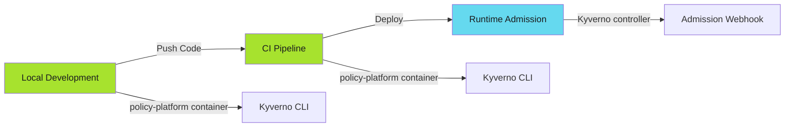
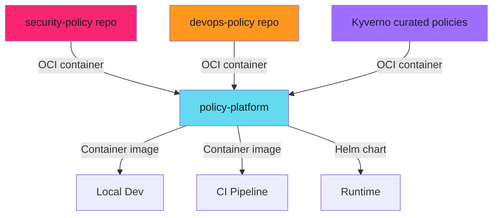

# Policy-as-Code: End-to-End Enforcement - Examples


## Example 1: example-1.mermaid





## Example 2: example-2.mermaid





## Example 3: example-3.dockerfile


```dockerfile
FROM security-policy-repo:main AS security_policy_repo
FROM devops-policy-repo:main AS devops_policy_repo

FROM alpine:3.22
RUN apk add helm kyverno pluto spectral

COPY --from=security_policy_repo /repos/security-policy/ /repos/security-policy/
COPY --from=devops_policy_repo /repos/devops-policy/ /repos/devops-policy/
```


## Example 4: example-4.sh


```bash
docker run policy-platform:latest \
  kyverno apply /repos/security-policy/policies.yaml \
  --resource my-deployment.yaml
```


## Example 5: example-5.yaml


```yaml
steps:
  - name: Validate Security Policy
    image: policy-platform:latest
    script:
      - kyverno apply security-policy.yaml --resource app.yaml
      - kyverno apply devops-policy.yaml --resource app.yaml
```


## Example 6: example-6.yaml


```yaml
apiVersion: kyverno.io/v1
kind: ClusterPolicy
metadata:
  name: require-resource-limits
spec:
  validationFailureAction: Enforce
```


## Example 7: example-7.sh


```bash
docker run policy-platform:latest \
  kyverno apply /repos/security-policy/ \
  --resource deployment.yaml
```


## Example 8: example-8.yaml


```yaml
- name: Policy Check
  image: policy-platform:latest
  script:
    - kyverno apply /repos/security-policy/ --resource app.yaml
```


## Example 9: example-9.sh


```bash
helm install kyverno kyverno/kyverno -f kyverno-values.yaml
helm install policy-reporter policy-reporter/policy-reporter
```


