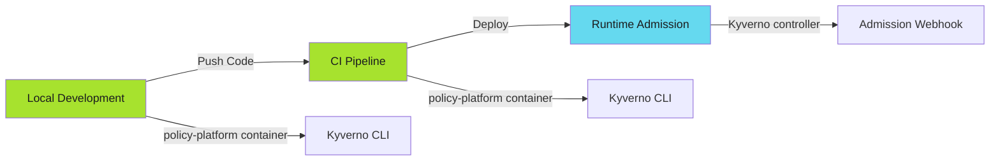
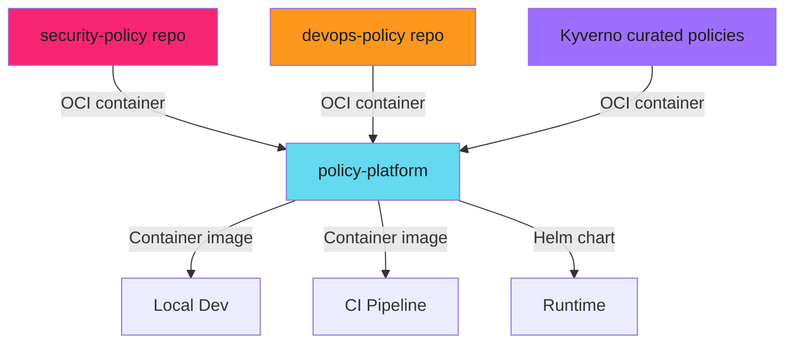

# Policy-as-Code: End-to-End Enforcement - Reference

This is the complete reference documentation extracted from the source.

# Policy-as-Code: End-to-End Enforcement

Enforce security and operational policies across the entire SDLC: local development, CI pipelines, and runtime admission control.

## Overview

Policy-as-Code ensures compliance through automated enforcement at three critical checkpoints:



**The Core Principle**: Same policies, three enforcement points. Zero gaps.

---

## The Problem with Scattered Enforcement

Traditional approaches fail in predictable ways:

| Approach                      | Problem                   | Result                  |
| -------------------------------- | ---------------------------- | -------------------------- |
| Documentation only            | Nobody reads it           | Violations in production |
| CI-only checks | Local testing incomplete | Broken pipelines |
| Runtime-only admission control | Issues caught too late | Failed deployments |

> **The Gap Problem**
>
> CI checks resource limits, but Kyverno policy doesn't match. Developer tests locally, CI passes, runtime rejects deployment. This gap causes production failures.
>

**Solution**: One policy source, distributed everywhere.

---

## Architecture

### Policy Sources

Policies originate from version-controlled repositories:



### Policy Aggregation

The policy-platform container aggregates policies from multiple sources:

**Dockerfile (multi-stage build)**:

```dockerfile
FROM security-policy-repo:main AS security_policy_repo
FROM devops-policy-repo:main AS devops_policy_repo

FROM alpine:3.22
RUN apk add helm kyverno pluto spectral

COPY --from=security_policy_repo /repos/security-policy/ /repos/security-policy/
COPY --from=devops_policy_repo /repos/devops-policy/ /repos/devops-policy/
```

**Result**: Single container with all policies, ready to run anywhere.

---

## Three-Layer Enforcement

### Layer 1: Local Development

Developer runs policy checks before commit:

```bash
docker run policy-platform:latest \
  kyverno apply /repos/security-policy/policies.yaml \
  --resource my-deployment.yaml
```

**Benefits**:

- Instant feedback
- No CI wait time
- Same validation as CI

### Layer 2: CI Pipeline

Automated validation in every pull request:

```yaml
steps:
  - name: Validate Security Policy
    image: policy-platform:latest
    script:
      - kyverno apply security-policy.yaml --resource app.yaml
      - kyverno apply devops-policy.yaml --resource app.yaml
```

**Benefits**:

- Blocks non-compliant merges
- Generates policy reports
- Environment-specific validation

### Layer 3: Runtime Admission

Kyverno admission controller in Kubernetes:

```yaml
apiVersion: kyverno.io/v1
kind: ClusterPolicy
metadata:
  name: require-resource-limits
spec:
  validationFailureAction: Enforce
```

**Benefits**:

- Final safety net
- Prevents misconfigured deployments
- Continuous compliance monitoring

---

## Enforcement Guarantees

| Stage  | Enforcement         | Bypassable?           | Purpose                       |
| --------- | ---------------------- | ------------------------ | -------------------------------- |
| Local | Developer-initiated | Yes (developer choice) | Fast feedback, early detection |
| CI     | Automated on PR     | No (blocks merge)     | Gate for code review          |
| Runtime | Admission webhook   | No (rejects pod)      | Production safety             |

**Key Insight**: Local and CI use **same container**, runtime uses **same policies**.

---

## What You'll Learn

This section covers complete policy-as-code implementation:

1. **[Local Development](local-development/index.md)** - Running policies in containers locally
2. **[CI Integration](ci-integration/index.md)** - Automated validation in pipelines
3. **[Runtime Deployment](runtime-deployment/index.md)** - Kyverno admission control
4. **[Multi-Source Policies](multi-source-policies/index.md)** - Aggregating policy repositories
5. **[Policy Packaging](policy-packaging/index.md)** - Building the policy-platform container
6. **[Operations](operations/index.md)** - Day-to-day policy management

---

## Prerequisites

- Kubernetes cluster (for runtime deployment)
- Container runtime (Docker/Podman for local dev)
- CI platform (GitHub Actions, Bitbucket Pipelines, GitLab CI)
- Basic Kyverno knowledge (see [Kyverno guide](kyverno/index.md))

---

## Quick Start

> **Start Local, Scale Up**
>
> Test policies locally first. Fix violations in seconds, not hours. Only after local validation works should you move to CI integration and runtime deployment.
>

**Step 1**: Run policies locally

```bash
docker run policy-platform:latest \
  kyverno apply /repos/security-policy/ \
  --resource deployment.yaml
```

**Step 2**: Add to CI pipeline

```yaml
- name: Policy Check
  image: policy-platform:latest
  script:
    - kyverno apply /repos/security-policy/ --resource app.yaml
```

**Step 3**: Deploy Kyverno to cluster

```bash
helm install kyverno kyverno/kyverno -f kyverno-values.yaml
helm install policy-reporter policy-reporter/policy-reporter
```

---

## Real-World Impact

**Before Policy-as-Code**:

- Pods deployed without resource limits → OOMKilled nodes
- Secrets in ConfigMaps → Security incidents
- Deprecated APIs → Failed upgrades

**After Policy-as-Code**:

- 100% of deployments have resource limits
- Zero secrets in clear text
- Deprecated API usage blocked before merge

**Key Metric**: Issues caught in **local dev** (5 min fix) vs **production** (incident response).

---

## Architecture Principles

### 1. Single Source of Truth

Policies live in Git repositories. Everything derives from there.

### 2. Container-Based Distribution

One container runs everywhere. No "works on my machine."

### 3. Progressive Enforcement

Local (warn) → CI (fail) → Runtime (block).

### 4. Separation of Concerns

- **Policy repos**: Define rules
- **Policy-platform**: Package and distribute
- **Kyverno**: Enforce at runtime

---

## Related Patterns

- **[SDLC Hardening](../index.md)** - Broader enforcement strategies
- **[Kyverno Implementation](kyverno/index.md)** - Runtime policy details
- **[Pre-commit Hooks](../pre-commit-hooks/pre-commit-hooks.md)** - Complementary local checks
- **[CI/CD Patterns](../../patterns/architecture/index.md)** - Pipeline architecture

---

## Next Steps

Start with **[Local Development](local-development/index.md)** to run policies on your machine, then progress to CI and runtime deployment.

