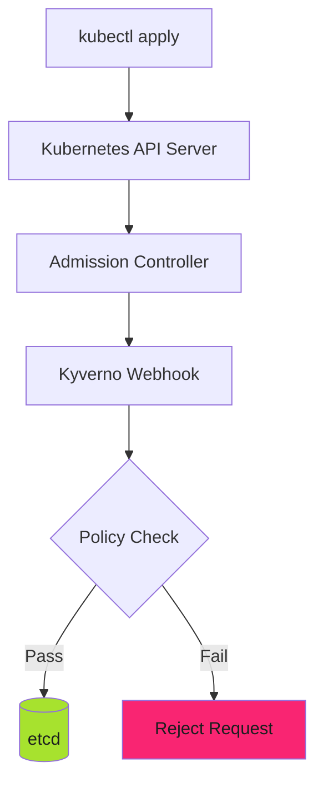

# Runtime Deployment: Admission Control with Kyverno

## When to Use This Skill

Runtime admission control enforces policies at the cluster level using Kyverno admission webhooks:



> **Runtime is the Final Safety Net**
>
> Local dev and CI checks can be bypassed. Runtime admission control is the last line of defense. If it fails, non-compliant resources never reach production.
>

---


## Implementation

### Kyverno Deployment

Deploy Kyverno using Helm:

```bash
helm repo add kyverno https://kyverno.github.io/kyverno/
helm repo update

helm install kyverno kyverno/kyverno \
  --namespace kyverno \
  --create-namespace \
  --values kyverno-values.yaml
```

**kyverno-values.yaml**:


*See [examples.md](examples.md) for detailed code examples.*

> **Background Scan Interval**
>
> Set `backgroundScanInterval` to 6h for most clusters. Reduce to 1h for high-compliance environments. Increase to 12h for large clusters (1000+ nodes).
>

### Policy Reporter Deployment

```bash
helm repo add policy-reporter https://kyverno.github.io/policy-reporter
helm repo update

helm install policy-reporter policy-reporter/policy-reporter \
  --namespace policy-reporter \
  --create-namespace \
  --values policy-reporter-values.yaml
```

**policy-reporter-values.yaml**:


*See [examples.md](examples.md) for detailed code examples.*

> **Policy Reporter UI**
>
> Access the dashboard with `kubectl port-forward -n policy-reporter svc/policy-reporter-ui 8080:8080`. Navigate to [http://localhost:8080](http://localhost:8080).
>

---


## Examples

See [examples.md](examples.md) for code examples.


## Full Reference

See [reference.md](reference.md) for complete documentation.
## References

- [Source Documentation](https://adaptive-enforcement-lab.com/enforce/policy-as-code/)
- [AEL Enforce](https://adaptive-enforcement-lab.com/enforce/)
