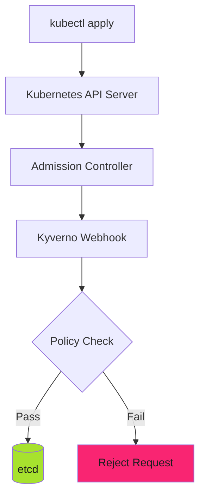

# Runtime Deployment: Admission Control with Kyverno - Reference

This is the complete reference documentation extracted from the source.

# Runtime Deployment: Admission Control with Kyverno

Deploy policy enforcement directly in Kubernetes clusters. Final safety net before production.

## Overview

Runtime admission control enforces policies at the cluster level using Kyverno admission webhooks:



> **Runtime is the Final Safety Net**
>
> Local dev and CI checks can be bypassed. Runtime admission control is the last line of defense. If it fails, non-compliant resources never reach production.
>

---

## Architecture Components

### 1. Kyverno Admission Controller

Intercepts API requests before they reach etcd:

- **Admission Webhooks**: Validate, mutate, or generate resources
- **Background Scans**: Continuous compliance checking
- **Policy Reports**: Violation tracking

### 2. Policy Reporter

Visualization and notification layer:

- **Dashboard**: Policy compliance overview
- **Metrics**: Prometheus integration
- **Alerts**: Slack, Teams, email notifications

### 3. Policy Sources

Policies deployed as Kubernetes resources:

```yaml
apiVersion: kyverno.io/v1
kind: ClusterPolicy
metadata:
  name: require-resource-limits
spec:
  validationFailureAction: Enforce
  background: true
  rules:
    - name: check-cpu-memory
      match:
        resources:
          kinds:
            - Deployment
      validate:
        message: "CPU and memory limits required"
        pattern:
          spec:
            template:
              spec:
                containers:
                  - resources:
                      limits:
                        memory: "?*"
                        cpu: "?*"
```

---

## Installation

### Kyverno Deployment

Deploy Kyverno using Helm:

```bash
helm repo add kyverno https://kyverno.github.io/kyverno/
helm repo update

helm install kyverno kyverno/kyverno \
  --namespace kyverno \
  --create-namespace \
  --values kyverno-values.yaml
```

**kyverno-values.yaml**:

```yaml
features:
  logging:
    logLevel: -2  # Info level

  backgroundScan:
    backgroundScanInterval: 6h

# Clean up old reports
policyReportsCleanup:
  enabled: true

cleanupJobs:
  admissionReports:
    enabled: true
    schedule: "0 0 * * *"  # Daily

  clusterAdmissionReports:
    enabled: true
    schedule: "0 0 * * SUN"  # Weekly

  policyReports:
    enabled: true
    schedule: "0 0 * * *"  # Daily

  clusterPolicyReports:
    enabled: true
    schedule: "0 0 1 * *"  # Monthly

  resources:
    limits:
      memory: 128Mi
    requests:
      cpu: 50m
      memory: 64Mi

# Exclude system namespaces
resourceFilters:
  resourceFiltersExcludeNamespaces:
    - kube-system
    - gmp-system
    - cnrm-system

# Logging configuration
admissionController:
  container:
    extraArgs:
      "loggingFormat": "json"
      "v": "1"

backgroundController:
  enabled: true
  rbac:
    clusterRole:
      extraResources:
        - apiGroups: ["apps"]
          resources: ["deployments", "statefulsets", "daemonsets"]
          verbs: ["get", "list", "watch"]
```

> **Background Scan Interval**
>
> Set `backgroundScanInterval` to 6h for most clusters. Reduce to 1h for high-compliance environments. Increase to 12h for large clusters (1000+ nodes).
>

### Policy Reporter Deployment

```bash
helm repo add policy-reporter https://kyverno.github.io/policy-reporter
helm repo update

helm install policy-reporter policy-reporter/policy-reporter \
  --namespace policy-reporter \
  --create-namespace \
  --values policy-reporter-values.yaml
```

**policy-reporter-values.yaml**:

```yaml
metrics:
  enabled: true

logging:
  encoding: json
  logLevel: -2
  development: false

api:
  logging: false

ui:
  enabled: true
  displayMode: dark

kyvernoPlugin:
  enabled: true
  metrics:
    enabled: true
```

> **Policy Reporter UI**
>
> Access the dashboard with `kubectl port-forward -n policy-reporter svc/policy-reporter-ui 8080:8080`. Navigate to [http://localhost:8080](http://localhost:8080).
>

---

## Verification

### Verify Kyverno Installation

```bash
# Check Kyverno pods
kubectl get pods -n kyverno

# Expected output:
# kyverno-admission-controller-xxx   Running
# kyverno-background-controller-xxx  Running
# kyverno-cleanup-controller-xxx     Running
# kyverno-reports-controller-xxx     Running
```

### Verify Webhook Registration

```bash
# Check ValidatingWebhookConfiguration
kubectl get validatingwebhookconfiguration | grep kyverno

# Check MutatingWebhookConfiguration
kubectl get mutatingwebhookconfiguration | grep kyverno
```

### Test Policy Enforcement

```bash
# Try deploying without resource limits
kubectl run test --image=nginx

# Expected: Denied by admission webhook
```

---

## Next Steps

- **[Policy Enforcement](policy-enforcement.md)** - Deploy policies, configure modes, enable scanning
- **[Monitoring](monitoring.md)** - Dashboards, alerts, troubleshooting
- **[Operations](../operations/index.md)** - Day-to-day policy management

