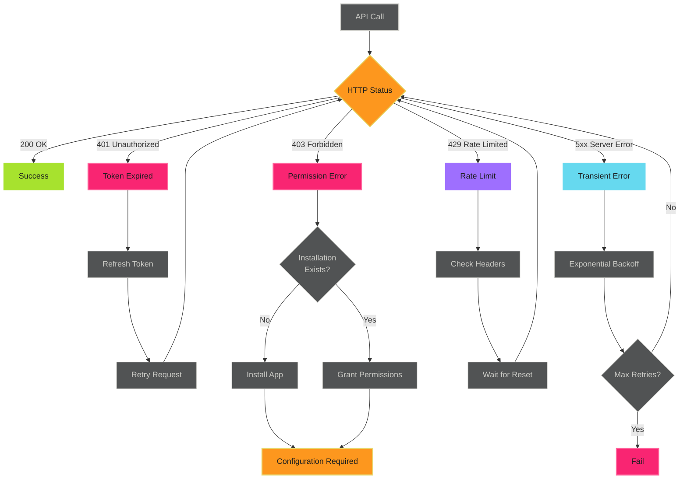

# Error Handling - Reference

This is the complete reference documentation extracted from the source.


# Error Handling

Robust error handling prevents workflow failures, reduces debugging time, and improves automation reliability. Handle token expiration, permission errors, and rate limits with retry strategies and actionable error messages.

> **Don't Fail Silently**
>
> Always check for failures and provide actionable error messages. Silent failures waste hours of debugging.
>

## Overview

Error handling for GitHub App tokens addresses:

- **Token expiration (401)** - Expired tokens after 1 hour
- **Permission errors (403)** - Missing app permissions or installation scopes
- **Rate limits (429)** - API usage limits and retry strategies
- **Network failures** - Transient connectivity issues
- **Validation errors (422)** - Invalid request payloads

> **Error Handling Strategy**
>
>
> 1. **Detect** - Identify error type from HTTP status codes
> 2. **Classify** - Determine if error is retryable
> 3. **Retry** - Use exponential backoff for transient errors
> 4. **Escalate** - Provide actionable messages for permanent failures
>

## Token Authentication Error Flow



## Token Expiration (401 Errors)

### Handle Token Generation Failures

```yaml
- name: Generate token
  id: app_token
  uses: actions/create-github-app-token@v2
  with:
    app-id: ${{ secrets.CORE_APP_ID }}
    private-key: ${{ secrets.CORE_APP_PRIVATE_KEY }}
    owner: adaptive-enforcement-lab
  continue-on-error: true

- name: Check token generation
  if: steps.app_token.outcome == 'failure'
  run: |
    echo "::error::Token generation failed"
    echo "::error::Check:"
    echo "  - App ID is correct: ${{ secrets.CORE_APP_ID != '' }}"
    echo "  - Private key is configured"
    echo "  - App is installed on: adaptive-enforcement-lab"
    echo "  - Installation is not suspended"
    exit 1
```

**Common causes**:

- Invalid or missing App ID
- Malformed private key (check newlines, PEM format)
- App not installed on target organization
- Installation suspended or disabled

### Detect Expired Tokens

```yaml
- name: API call with expiration handling
  env:
    GH_TOKEN: ${{ steps.app_token.outputs.token }}
  run: |
    # Capture both stdout and stderr
    if ! response=$(gh api user --jq .login 2>&1); then
      if echo "$response" | grep -q "401\|Bad credentials"; then
        echo "::error::Token expired or invalid"
        echo "::error::Token age may exceed 1 hour"
        exit 1
      else
        echo "::error::API call failed: $response"
        exit 1
      fi
    fi

    echo "Authenticated as: $response"
```

### Auto-Refresh with Retry

```yaml
- name: API call with auto-refresh on expiration
  env:
    APP_ID: ${{ secrets.CORE_APP_ID }}
    PRIVATE_KEY: ${{ secrets.CORE_APP_PRIVATE_KEY }}
  run: |
    # Function to generate fresh token
    generate_token() {
      gh api /app/installations \
        --jq '.[0].id' | xargs -I {} \
        gh api /app/installations/{}/access_tokens \
        -X POST --jq .token
    }

    # Function to call API with auto-refresh on 401
    api_call_with_refresh() {
      local endpoint="$1"
      local max_attempts=2
      local attempt=1

      while [ $attempt -le $max_attempts ]; do
        # Attempt API call
        if response=$(gh api "$endpoint" 2>&1); then
          echo "$response"
          return 0
        fi

        # Check if error is 401 (expired token)
        if echo "$response" | grep -q "401\|Bad credentials"; then
          if [ $attempt -lt $max_attempts ]; then
            echo "::warning::Token expired, refreshing (attempt $attempt/$max_attempts)"

            # Refresh token
            export GH_TOKEN=$(generate_token)
            echo "::notice::Token refreshed successfully"

            ((attempt++))
            sleep 2
          else
            echo "::error::Failed to refresh token after $max_attempts attempts"
            return 1
          fi
        else
          # Non-401 error - fail immediately
          echo "::error::API call failed: $response"
          return 1
        fi
      done
    }

    # Initial token
    export GH_TOKEN=$(generate_token)

    # Make API calls with auto-refresh
    api_call_with_refresh "user"
    api_call_with_refresh "orgs/adaptive-enforcement-lab/repos"
```

> **Use actions/create-github-app-token Auto-Refresh**
>
>
> The `actions/create-github-app-token@v2` action automatically refreshes tokens in long-running jobs. Manual refresh is only needed for custom token generation. See [Token Lifecycle Management](../token-lifecycle/index.md).
>

## Permission Errors (403 Forbidden)

### Detect Permission Issues

```yaml
- name: Operation with permission validation
  env:
    GH_TOKEN: ${{ steps.app_token.outputs.token }}
  run: |
    endpoint="/repos/adaptive-enforcement-lab/example-repo/collaborators"

    # Attempt operation and capture error
    if ! response=$(gh api "$endpoint" 2>&1); then
      if echo "$response" | grep -q "403\|Forbidden"; then
        echo "::error::Permission denied for: $endpoint"
        echo "::error::Required permissions:"
        echo "  - App permission: 'members' (read)"
        echo "  - Installation scope: 'adaptive-enforcement-lab/example-repo'"
        echo ""
        echo "::error::Verify app configuration at:"
        echo "  https://github.com/organizations/adaptive-enforcement-lab/settings/apps"
        exit 1
      else
        echo "::error::API call failed: $response"
        exit 1
      fi
    fi

    echo "$response"
```

### Permission Error Diagnostic

```yaml
- name: Diagnose permission error
  if: failure()
  env:
    GH_TOKEN: ${{ steps.app_token.outputs.token }}
  run: |
    echo "::group::Diagnostic Information"

    # Check token validity
    echo "Token status:"
    if gh api user --jq '.login' 2>/dev/null; then
      echo "  ✅ Token is valid"
    else
      echo "  ❌ Token is invalid or expired"
    fi

    # Check installation access
    echo ""
    echo "Installation scope:"
    gh api /app/installations \
      --jq '.[] | "  - \(.account.login) (ID: \(.id))"'

    # Attempt to identify missing permission
    echo ""
    echo "::error::Common 403 causes:"
    echo "  1. App lacks required repository/organization permissions"
    echo "  2. Installation doesn't include target repository"
    echo "  3. Repository is private but app has 'public_only' access"
    echo "  4. Organization requires approval for app installation"

    echo "::endgroup::"
```

### Common Permission Patterns

| Operation | Required Permission | Scope |
|----------|-------------------|-------|
| Read repository contents | `contents: read` | Repository |
| Create issues | `issues: write` | Repository |
| Create pull requests | `pull_requests: write` | Repository |
| Manage deployments | `deployments: write` | Repository |
| Read organization members | `members: read` | Organization |
| Manage repository settings | `administration: write` | Repository |

> **Organization vs Repository Permissions**
>
>
> Some permissions require **organization-level** access. Installing the app on individual repositories won't grant these permissions.
>

## Rate Limiting (429 Errors)

