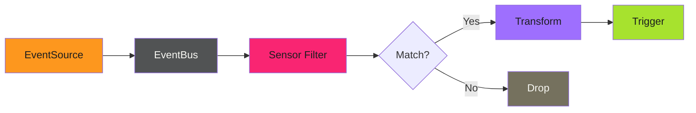

# Event Routing - Examples


## Example 1: example-1.mermaid





## Example 2: example-2.yaml


```yaml
apiVersion: argoproj.io/v1alpha1
kind: Sensor
metadata:
  name: prod-image-filter
spec:
  dependencies:
    - name: image-push
      eventSourceName: container-registry
      eventName: push
      filters:
        data:
          - path: body.tag
            type: string
            value:
              - "v*"
              - "release-*"
```


