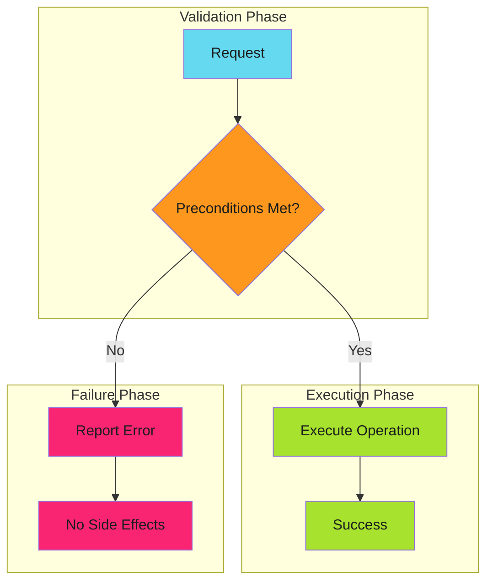
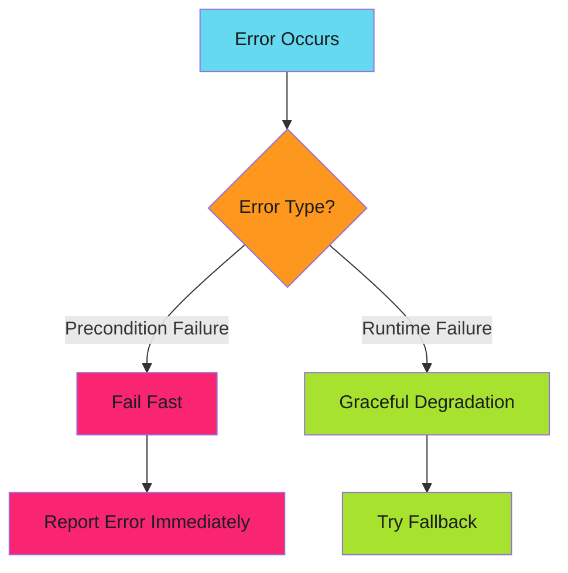

# Fail Fast - Reference

This is the complete reference documentation extracted from the source.

# Fail Fast

Detect and report problems as early as possible, before they cascade into larger failures.

> **Key Insight**
>
> Fail before you start, not in the middle. Validate preconditions before executing expensive or irreversible operations.
>

---

## Overview

Fail fast is a design pattern that validates preconditions before executing expensive or irreversible operations. When validation fails, the system immediately reports the error rather than proceeding and failing later in an unpredictable state.



The key insight: **fail before you start, not in the middle**.

---

## When to Apply

| Scenario | Apply Fail Fast? | Reasoning |
| ---------- | ------------------ | ----------- |
| Invalid user input | Yes | User error, report immediately |
| Missing required config | Yes | Can't continue safely |
| Insufficient permissions | Yes | Operation will fail anyway |
| Resource allocation failure | Yes | Partial allocation is worse |
| Network timeout | No | Use [graceful degradation](../graceful-degradation/index.md) |
| Cache miss | No | Expensive path still works |

**Decision rule**: Fail fast on **precondition failures**. Degrade gracefully on **runtime failures**.

---

## Real-World Examples

### GitHub Actions Workflow Validation

```yaml
jobs:
  validate:
    runs-on: ubuntu-latest
    steps:
      # Fail fast: Check all preconditions before expensive operations
      - name: Validate environment
        run: |
          # Required secrets
          [ -n "${{ secrets.DEPLOY_TOKEN }}" ] || { echo "::error::DEPLOY_TOKEN not set"; exit 1; }

          # Required tools
          command -v kubectl >/dev/null || { echo "::error::kubectl not found"; exit 1; }

          # Required access
          kubectl auth can-i create deployments || { echo "::error::No deploy permission"; exit 1; }

      # Now safe to proceed with expensive operations
      - name: Deploy
        run: kubectl apply -f manifests/
```

### Go Function with Precondition Validation

```go
func ProcessOrder(order *Order) error {
    // Fail fast: validate all preconditions upfront
    if order == nil {
        return errors.New("order is nil")
    }
    if order.CustomerID == "" {
        return errors.New("customer ID required")
    }
    if len(order.Items) == 0 {
        return errors.New("order has no items")
    }
    if order.Total <= 0 {
        return errors.New("invalid order total")
    }

    // All preconditions met, safe to proceed
    return processValidOrder(order)
}
```

---

## Fail Fast vs Graceful Degradation

These patterns are **complementary**, not contradictory:



| Error Type | Pattern | Example |
| ------------ | --------- | --------- |
| Missing config | Fail Fast | Can't start without database URL |
| Database timeout | Graceful Degradation | Retry, then use cache |
| Invalid input | Fail Fast | Reject malformed request |
| API unavailable | Graceful Degradation | Use backup endpoint |
| Insufficient permissions | Fail Fast | Don't attempt forbidden operation |
| Rate limited | Graceful Degradation | Exponential backoff |

---

## Fail Fast Techniques

Comprehensive techniques for implementing fail fast patterns:

### [Early Termination](techniques/early-termination.md)

Stop execution immediately when errors occur:

- Shell strict mode (`set -euo pipefail`)
- GitHub Actions matrix fail-fast
- Go error propagation
- Circuit breakers

### [Strict Mode Execution](techniques/strict-mode.md)

Enable strictest validation and error detection:

- Shell/TypeScript/Go strict modes
- Linter enforcement
- Schema validation

### [Assertion Patterns](techniques/assertions.md)

Validate assumptions and fail if they're wrong:

- Runtime assertions
- Contract validation (pre/post conditions)
- Invariant checks
- Type guards

### [Error Escalation](techniques/error-escalation.md)

Determine when to throw vs return, panic vs recover:

- Throw vs return error
- Error aggregation vs first-error-wins
- Panic vs recoverable errors
- Exit codes

### [Timeout Enforcement](techniques/timeouts.md)

Prevent operations from running indefinitely:

- Operation timeouts
- Job timeouts
- Circuit breaker timeouts
- Deadlock detection

---

## Anti-Patterns

### 1. Late Validation

Validating after side effects have occurred.

```go
// Bad: creates file before validating
func ProcessFile(path string, data []byte) error {
    f, err := os.Create(path)
    if err != nil {
        return err
    }
    defer f.Close()

    if len(data) == 0 {
        return errors.New("empty data")  // File already created!
    }
    return f.Write(data)
}

// Good: validate before side effects
func ProcessFile(path string, data []byte) error {
    if len(data) == 0 {
        return errors.New("empty data")
    }

    f, err := os.Create(path)
    if err != nil {
        return err
    }
    defer f.Close()

    return f.Write(data)
}
```

### 2. Swallowing Errors

Continuing despite failures.

```yaml
# Bad: ignores validation failure
- name: Validate and deploy
  run: |
    ./validate.sh || true  # Swallowed!
    ./deploy.sh

# Good: fail on validation error
- name: Validate
  run: ./validate.sh

- name: Deploy
  run: ./deploy.sh
```

### 3. Partial Execution

Executing some operations before checking all preconditions.

```go
// Bad: partial execution on failure
func TransferFunds(from, to string, amount int) error {
    if err := debit(from, amount); err != nil {
        return err
    }
    // What if 'to' account doesn't exist?
    if err := credit(to, amount); err != nil {
        return err  // Money debited but not credited!
    }
    return nil
}

// Good: validate everything first
func TransferFunds(from, to string, amount int) error {
    // Validate all preconditions
    if !accountExists(from) {
        return errors.New("source account not found")
    }
    if !accountExists(to) {
        return errors.New("destination account not found")
    }
    if balance(from) < amount {
        return errors.New("insufficient funds")
    }

    // Now safe to execute
    return executeTransfer(from, to, amount)
}
```

### 4. Vague Error Messages

Failing fast but not explaining why.

```bash
# Bad: unhelpful error
[ -f "$CONFIG" ] || exit 1

# Good: actionable error message
[ -f "$CONFIG" ] || { echo "Config file not found: $CONFIG. Create it from config.example.yml"; exit 1; }
```

---

## Implementation Checklist

Before implementing fail fast:

- [ ] **Identify all preconditions** for the operation
- [ ] **Order validations** by cost (cheapest first)
- [ ] **Validate before side effects** (file creation, API calls, etc.)
- [ ] **Provide actionable error messages** that help users fix the problem
- [ ] **Return appropriate error codes** (HTTP 400 vs 500, exit 1 vs 2)
- [ ] **Log validation failures** for debugging
- [ ] **Test invalid inputs** explicitly in your test suite

---

## Relationship to Other Patterns

| Pattern | How Fail Fast Applies |
| --------- | ---------------------- |
| [Graceful Degradation](../graceful-degradation/index.md) | Complementary: fail fast on preconditions, degrade on runtime |
| [Prerequisite Checks](../prerequisite-checks/index.md) | Specialized form of fail fast for complex preconditions |
| [Idempotency](../../efficiency/idempotency/index.md) | Fail fast prevents partial state that breaks idempotency |

---

## Further Reading

- [Techniques Overview](techniques/early-termination.md) - Comprehensive fail fast techniques
- [Graceful Degradation](../graceful-degradation/index.md) - The complementary pattern for runtime failures
- [Prerequisite Checks](../prerequisite-checks/index.md) - Structured approach to precondition validation

