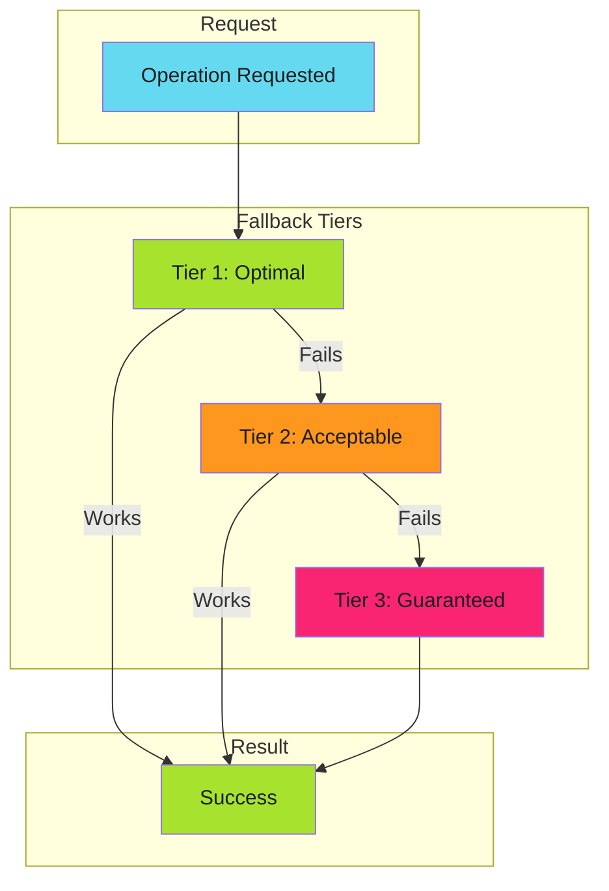

# Graceful Degradation

## When to Use This Skill

Graceful degradation is a design principle that ensures systems continue operating when components fail. Rather than crashing or returning errors, the system automatically falls back to slower but working alternatives.



The key insight: **degrade performance, not availability**.

---


## Implementation

### Cache Access Pattern

From [From 5 Seconds to 5 Milliseconds](../../../blog/posts/2025-11-29-from-5-seconds-to-5-milliseconds.md):

```text
Volume Mount → API Call → Rebuild Cache
    1-5ms        50ms        5000ms
```

```yaml
# Kubernetes volume mount with optional flag
volumes:
  - name: cache-volume
    configMap:
      name: deployment-cache
      optional: true  # Tier 1 can fail gracefully
```


*See [examples.md](examples.md) for detailed code examples.*

### CI/CD Dependency Resolution

```text
Artifact Cache → Dependency Cache → Fresh Install
    seconds          minutes          minutes+
```


*See [examples.md](examples.md) for detailed code examples.*

### API Resilience

```text
Primary Endpoint → Secondary Endpoint → Cached Response → Static Fallback
```

### Authentication

```text
SSO → API Token → Service Account → Anonymous (read-only)
```

---


## Techniques


### Anti-Patterns

### 1. Silent Degradation

Degrading without logging or alerting means you won't know when Tier 1 is broken.

```go
// Bad: silent fallback
func getData() []byte {
    if data, _ := cache.Get(); data != nil {
        return data
    }
    return fetchFromAPI()  // No indication we're in degraded mode
}

// Good: observable fallback
func getData() []byte {
    if data, err := cache.Get(); err == nil {
        metrics.CacheHit()
        return data
    }
    metrics.CacheMiss()
    log.Warn("cache miss, falling back to API")
    return fetchFromAPI()
}
```

### 2. No Guaranteed Tier

Every chain needs a final tier that **always succeeds**.

```go
// Bad: can fail completely
func getConfig() (*Config, error) {
    if cfg := cache.Get(); cfg != nil {
        return cfg, nil
    }
    return api.FetchConfig()  // What if API is also down?
}

// Good: guaranteed fallback
func getConfig() *Config {
    if cfg := cache.Get(); cfg != nil {
        return cfg
    }
    if cfg, err := api.FetchConfig(); err == nil {
        return cfg
    }
    return DefaultConfig()  // Always works
}
```

### 3. Expensive Default Path

Using Tier 3 as the happy path defeats the purpose.

```yaml
# Bad: always does full install
- run: npm ci
- uses: actions/cache/save@v4
  with:
    path: node_modules/

# Good: cache-first approach
- uses: actions/cache@v4
  id: cache
  with:
    path: node_modules/
    key: deps-${{ hashFiles('package-lock.json') }}

- if: steps.cache.outputs.cache-hit != 'true'
  run: npm ci
```

### 4. No Observability

You need to know:

- Which tier is serving traffic
- How often fallbacks occur
- Latency per tier

```yaml
- name: Report cache tier
  run: |
    if [ "${{ steps.mount-cache.outcome }}" = "success" ]; then
      echo "cache_tier=mount" >> metrics.txt
    elif [ "${{ steps.api-cache.outcome }}" = "success" ]; then
      echo "cache_tier=api" >> metrics.txt
    else
      echo "cache_tier=rebuild" >> metrics.txt
    fi
```

---

*See [reference.md](reference.md) for additional techniques and detailed examples.*


## Comparison

These patterns are **complementary**, not contradictory:

| Scenario | Pattern | Reasoning |
| ---------- | --------- | ----------- |
| **Precondition not met** | Fail Fast | Don't waste resources on doomed operations |
| **Runtime component fails** | Graceful Degradation | Continue with fallback |
| **Invalid input** | Fail Fast | User error, report immediately |
| **Network timeout** | Graceful Degradation | Infrastructure issue, retry/fallback |
| **Missing required config** | Fail Fast | Can't continue safely |
| **Cache miss** | Graceful Degradation | Expensive path still works |

**Decision rule**: Fail fast on **precondition failures**. Degrade gracefully on **runtime failures**.

---


## Anti-Patterns to Avoid

### 1. Silent Degradation

Degrading without logging or alerting means you won't know when Tier 1 is broken.


*See [examples.md](examples.md) for detailed code examples.*

### 2. No Guaranteed Tier

Every chain needs a final tier that **always succeeds**.


*See [examples.md](examples.md) for detailed code examples.*

### 3. Expensive Default Path

Using Tier 3 as the happy path defeats the purpose.


*See [examples.md](examples.md) for detailed code examples.*

### 4. No Observability

You need to know:

- Which tier is serving traffic
- How often fallbacks occur
- Latency per tier

```yaml
- name: Report cache tier
  run: |
    if [ "${{ steps.mount-cache.outcome }}" = "success" ]; then
      echo "cache_tier=mount" >> metrics.txt
    elif [ "${{ steps.api-cache.outcome }}" = "success" ]; then
      echo "cache_tier=api" >> metrics.txt
    else
      echo "cache_tier=rebuild" >> metrics.txt
    fi
```

---


## Examples

See [examples.md](examples.md) for code examples.


## Full Reference

See [reference.md](reference.md) for complete documentation.
## References

- [Source Documentation](https://adaptive-enforcement-lab.com/patterns/error-handling/)
- [AEL Patterns](https://adaptive-enforcement-lab.com/patterns/)
