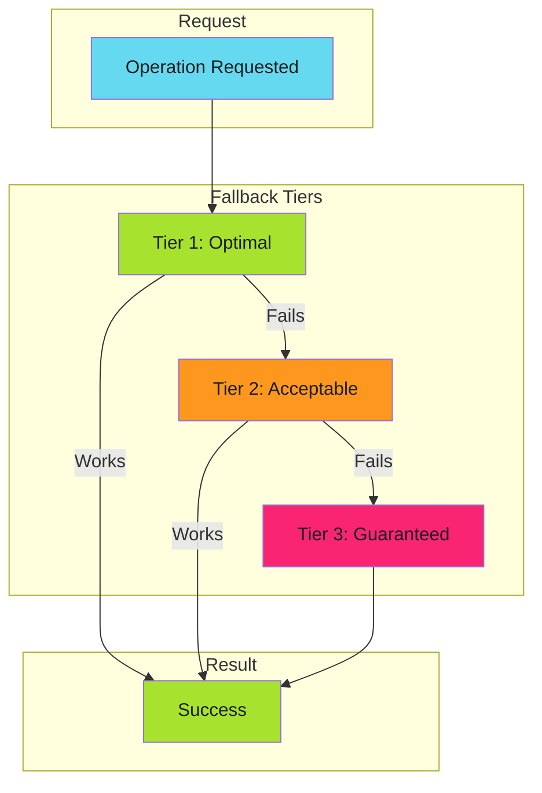

# Graceful Degradation - Reference

This is the complete reference documentation extracted from the source.

# Graceful Degradation

When the optimal path fails, fall back to progressively more expensive but reliable alternatives.

> **Key Insight**
>
> Degrade performance, not availability. Every operation should have a guaranteed fallback that always succeeds.
>

---

## Overview

Graceful degradation is a design principle that ensures systems continue operating when components fail. Rather than crashing or returning errors, the system automatically falls back to slower but working alternatives.



The key insight: **degrade performance, not availability**.

---

## The Tiered Fallback Pattern

Every graceful degradation implementation follows this structure:

| Tier | Characteristics | Example |
| ------ | ----------------- | --------- |
| **Tier 1: Optimal** | Fast, cheap, preferred | Volume mount read |
| **Tier 2: Acceptable** | Slower, costlier, reliable | API call |
| **Tier 3: Guaranteed** | Expensive but always works | Full rebuild |

Each tier must:

1. **Detect failure** of the previous tier
2. **Attempt its operation** independently
3. **Report which tier succeeded** (observability)

---

## Real-World Examples

### Cache Access Pattern

From [From 5 Seconds to 5 Milliseconds](../../../blog/posts/2025-11-29-from-5-seconds-to-5-milliseconds.md):

```text
Volume Mount → API Call → Rebuild Cache
    1-5ms        50ms        5000ms
```

```yaml
# Kubernetes volume mount with optional flag
volumes:
  - name: cache-volume
    configMap:
      name: deployment-cache
      optional: true  # Tier 1 can fail gracefully
```

```go
func GetDeployments(image string) ([]Deployment, error) {
    // Tier 1: Try volume mount
    if data, err := os.ReadFile("/etc/cache/deployments.json"); err == nil {
        return parseDeployments(data, image)
    }

    // Tier 2: Try API call
    if data, err := k8s.GetConfigMap("deployment-cache"); err == nil {
        return parseDeployments(data, image)
    }

    // Tier 3: Rebuild from cluster scan
    return scanClusterForImage(image)
}
```

### CI/CD Dependency Resolution

```text
Artifact Cache → Dependency Cache → Fresh Install
    seconds          minutes          minutes+
```

```yaml
- uses: actions/cache@v4
  id: artifact-cache
  with:
    path: dist/
    key: build-${{ hashFiles('src/**') }}

- uses: actions/cache@v4
  if: steps.artifact-cache.outputs.cache-hit != 'true'
  id: dep-cache
  with:
    path: node_modules/
    key: deps-${{ hashFiles('package-lock.json') }}

- name: Install dependencies
  if: steps.dep-cache.outputs.cache-hit != 'true'
  run: npm ci

- name: Build
  if: steps.artifact-cache.outputs.cache-hit != 'true'
  run: npm run build
```

### API Resilience

```text
Primary Endpoint → Secondary Endpoint → Cached Response → Static Fallback
```

### Authentication

```text
SSO → API Token → Service Account → Anonymous (read-only)
```

---

## Graceful Degradation vs Fail Fast

These patterns are **complementary**, not contradictory:

| Scenario | Pattern | Reasoning |
| ---------- | --------- | ----------- |
| **Precondition not met** | Fail Fast | Don't waste resources on doomed operations |
| **Runtime component fails** | Graceful Degradation | Continue with fallback |
| **Invalid input** | Fail Fast | User error, report immediately |
| **Network timeout** | Graceful Degradation | Infrastructure issue, retry/fallback |
| **Missing required config** | Fail Fast | Can't continue safely |
| **Cache miss** | Graceful Degradation | Expensive path still works |

**Decision rule**: Fail fast on **precondition failures**. Degrade gracefully on **runtime failures**.

---

## Anti-Patterns

### 1. Silent Degradation

Degrading without logging or alerting means you won't know when Tier 1 is broken.

```go
// Bad: silent fallback
func getData() []byte {
    if data, _ := cache.Get(); data != nil {
        return data
    }
    return fetchFromAPI()  // No indication we're in degraded mode
}

// Good: observable fallback
func getData() []byte {
    if data, err := cache.Get(); err == nil {
        metrics.CacheHit()
        return data
    }
    metrics.CacheMiss()
    log.Warn("cache miss, falling back to API")
    return fetchFromAPI()
}
```

### 2. No Guaranteed Tier

Every chain needs a final tier that **always succeeds**.

```go
// Bad: can fail completely
func getConfig() (*Config, error) {
    if cfg := cache.Get(); cfg != nil {
        return cfg, nil
    }
    return api.FetchConfig()  // What if API is also down?
}

// Good: guaranteed fallback
func getConfig() *Config {
    if cfg := cache.Get(); cfg != nil {
        return cfg
    }
    if cfg, err := api.FetchConfig(); err == nil {
        return cfg
    }
    return DefaultConfig()  // Always works
}
```

### 3. Expensive Default Path

Using Tier 3 as the happy path defeats the purpose.

```yaml
# Bad: always does full install
- run: npm ci
- uses: actions/cache/save@v4
  with:
    path: node_modules/

# Good: cache-first approach
- uses: actions/cache@v4
  id: cache
  with:
    path: node_modules/
    key: deps-${{ hashFiles('package-lock.json') }}

- if: steps.cache.outputs.cache-hit != 'true'
  run: npm ci
```

### 4. No Observability

You need to know:

- Which tier is serving traffic
- How often fallbacks occur
- Latency per tier

```yaml
- name: Report cache tier
  run: |
    if [ "${{ steps.mount-cache.outcome }}" = "success" ]; then
      echo "cache_tier=mount" >> metrics.txt
    elif [ "${{ steps.api-cache.outcome }}" = "success" ]; then
      echo "cache_tier=api" >> metrics.txt
    else
      echo "cache_tier=rebuild" >> metrics.txt
    fi
```

---

## Implementation Checklist

Before implementing graceful degradation:

- [ ] **Define all tiers** before writing code
- [ ] **Identify the guaranteed tier** that always succeeds
- [ ] **Instrument each tier** with metrics/logs
- [ ] **Alert on tier shifts** (e.g., Tier 1 failure rate > 5%)
- [ ] **Test fallback paths** in CI, not just production
- [ ] **Document expected latencies** for each tier
- [ ] **Set SLOs per tier** (Tier 1: p99 < 10ms, Tier 2: p99 < 500ms)

---

## Relationship to Other Patterns

| Pattern | How Graceful Degradation Applies |
| --------- | ---------------------------------- |
| [Caching](../../efficiency/idempotency/caches.md) | Fallback tiers when cache misses |
| [Work Avoidance](../../efficiency/work-avoidance/index.md) | When detection fails, do the work anyway |
| [Idempotency](../../efficiency/idempotency/index.md) | Safe retries as fallback mechanism |
| [Fail Fast](../fail-fast/index.md) | Complementary: fail fast on preconditions, degrade on runtime |
| [Error Handling](../../../patterns/github-actions/actions-integration/error-handling/index.md) | Recovery strategy selection |

---

## Further Reading

- [From 5 Seconds to 5 Milliseconds](../../../blog/posts/2025-11-29-from-5-seconds-to-5-milliseconds.md) - The cache optimization story that demonstrates this pattern
- [Cache Considerations](../../efficiency/idempotency/caches.md) - Cache-resilient idempotency strategies

