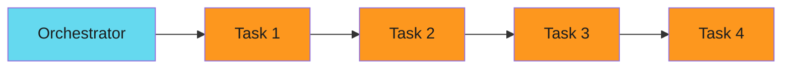
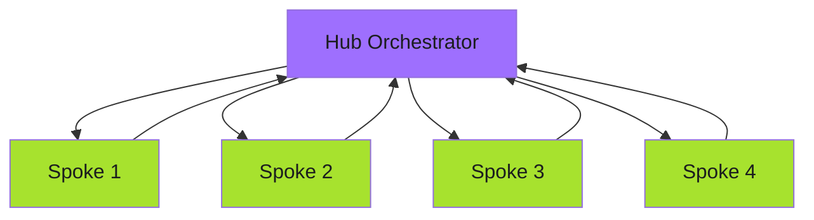

# Hub and Spoke - Examples


## Example 1: example-1.mermaid





## Example 2: example-2.mermaid





## Example 3: example-3.yaml


```yaml
apiVersion: argoproj.io/v1alpha1
kind: WorkflowTemplate
metadata:
  name: hub-orchestrator
spec:
  entrypoint: hub
  templates:
    - name: hub
      inputs:
        parameters:
          - name: repositories
      steps:
        # Discover work
        - - name: discover
            template: get-repositories

        # Fan out to spokes
        - - name: process-repo
            template: spawn-spoke
            arguments:
              parameters:
                - name: repo
                  value: "{{item}}"
            withParam: "{{steps.discover.outputs.result}}"

        # Collect results
        - - name: summarize
            template: collect-results

    - name: spawn-spoke
      inputs:
        parameters:
          - name: repo
      resource:
        action: create
        manifest: |
          apiVersion: argoproj.io/v1alpha1
          kind: Workflow
          metadata:
            generateName: spoke-{{inputs.parameters.repo}}-
          spec:
            workflowTemplateRef:
              name: spoke-worker
            arguments:
              parameters:
                - name: repository
                  value: "{{inputs.parameters.repo}}"
```


## Example 4: example-4.yaml


```yaml
apiVersion: argoproj.io/v1alpha1
kind: WorkflowTemplate
metadata:
  name: spoke-worker
spec:
  entrypoint: process
  arguments:
    parameters:
      - name: repository
  templates:
    - name: process
      inputs:
        parameters:
          - name: repository
      container:
        image: gcr.io/project/worker:v1
        command: ["/app/worker"]
        args:
          - "--repo={{inputs.parameters.repository}}"
          - "--action=process"
```


