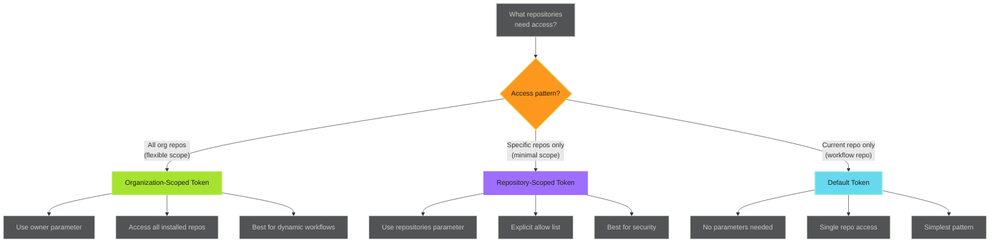

# Installation Token Generation - Examples


## Example 1: example-1.mermaid





## Example 2: example-2.yaml


```yaml
name: Single Repo Operation

on:
  workflow_dispatch:

jobs:
  example:
    runs-on: ubuntu-latest
    steps:
      - name: Generate repository token
        id: app_token
        uses: actions/create-github-app-token@v2
        with:
          app-id: ${{ secrets.CORE_APP_ID }}
          private-key: ${{ secrets.CORE_APP_PRIVATE_KEY }}

      - name: Use token
        env:
          GH_TOKEN: ${{ steps.app_token.outputs.token }}
        run: |
          # Token scoped to current repository only
          gh api repos/${{ github.repository }} --jq .full_name
```


## Example 3: example-3.yaml


```yaml
name: Organization-Wide Operation

on:
  workflow_dispatch:

jobs:
  org-scope:
    runs-on: ubuntu-latest
    steps:
      - name: Generate org-scoped token
        id: app_token
        uses: actions/create-github-app-token@v2
        with:
          app-id: ${{ secrets.CORE_APP_ID }}
          private-key: ${{ secrets.CORE_APP_PRIVATE_KEY }}
          owner: adaptive-enforcement-lab  # Organization name

      - name: List all org repositories
        env:
          GH_TOKEN: ${{ steps.app_token.outputs.token }}
        run: |
          echo "## Organization Repositories" >> $GITHUB_STEP_SUMMARY
          gh repo list adaptive-enforcement-lab \
            --limit 100 \
            --json name,description,visibility \
            --jq '.[] | "- **\(.name)** (\(.visibility)): \(.description)"' \
            >> $GITHUB_STEP_SUMMARY
```


## Example 4: example-4.yaml


```yaml
name: Multi-Repository Operation

on:
  workflow_dispatch:

jobs:
  repo-scope:
    runs-on: ubuntu-latest
    steps:
      - name: Generate repo-scoped token
        id: app_token
        uses: actions/create-github-app-token@v2
        with:
          app-id: ${{ secrets.CORE_APP_ID }}
          private-key: ${{ secrets.CORE_APP_PRIVATE_KEY }}
          repositories: |
            frontend-app
            backend-api
            infrastructure

      - name: Check repository status
        env:
          GH_TOKEN: ${{ steps.app_token.outputs.token }}
        run: |
          for repo in frontend-app backend-api infrastructure; do
            echo "Checking $repo..."
            gh api repos/adaptive-enforcement-lab/$repo \
              --jq '{name: .name, default_branch: .default_branch, private: .private}'
          done
```


