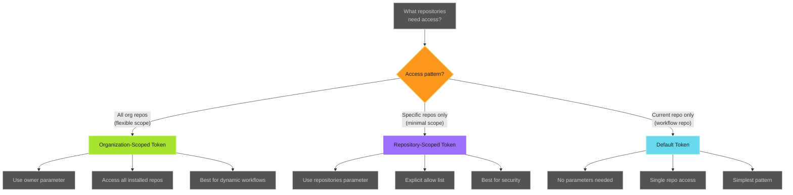

# Installation Token Generation - Reference

This is the complete reference documentation extracted from the source.


# Installation Token Generation

Installation tokens provide automated, secure access to repositories where your GitHub App is installed. Use installation tokens for GitHub Actions workflows, CI/CD automation, and cross-repository operations.

> **When to Use Installation Tokens**
>
>
> Installation tokens are for **automated repository operations**. Use JWT for app-level operations and OAuth for user-attributed actions.
>

## Overview

Installation tokens authenticate your GitHub App for specific repository operations. They enable:

- **Cross-repository automation** - Operate across multiple repositories
- **Organization-wide workflows** - Access all repositories in your organization
- **Automated processes** - No user interaction required
- **Scoped permissions** - Limit access to specific repositories
- **Short-lived credentials** - 1-hour expiration for security

> **Token Limitations**
>
>
> - 1-hour expiration (automatic refresh available)
> - Requires GitHub App installation on target repositories
> - Permissions limited to app's configured scope
> - Cannot perform user-attributed actions
>

## Token Scoping Decision



## Basic Usage

### Single Repository Token

Generate a token scoped to the current repository.

```yaml
name: Single Repo Operation

on:
  workflow_dispatch:

jobs:
  example:
    runs-on: ubuntu-latest
    steps:
      - name: Generate repository token
        id: app_token
        uses: actions/create-github-app-token@v2
        with:
          app-id: ${{ secrets.CORE_APP_ID }}
          private-key: ${{ secrets.CORE_APP_PRIVATE_KEY }}

      - name: Use token
        env:
          GH_TOKEN: ${{ steps.app_token.outputs.token }}
        run: |
          # Token scoped to current repository only
          gh api repos/${{ github.repository }} --jq .full_name
```

**Output**: Token accessible via `${{ steps.app_token.outputs.token }}`

**Scope**: Current repository only (where workflow runs)

## Organization-Scoped Tokens

Generate tokens with access to all repositories where the app is installed.

```yaml
name: Organization-Wide Operation

on:
  workflow_dispatch:

jobs:
  org-scope:
    runs-on: ubuntu-latest
    steps:
      - name: Generate org-scoped token
        id: app_token
        uses: actions/create-github-app-token@v2
        with:
          app-id: ${{ secrets.CORE_APP_ID }}
          private-key: ${{ secrets.CORE_APP_PRIVATE_KEY }}
          owner: adaptive-enforcement-lab  # Organization name

      - name: List all org repositories
        env:
          GH_TOKEN: ${{ steps.app_token.outputs.token }}
        run: |
          echo "## Organization Repositories" >> $GITHUB_STEP_SUMMARY
          gh repo list adaptive-enforcement-lab \
            --limit 100 \
            --json name,description,visibility \
            --jq '.[] | "- **\(.name)** (\(.visibility)): \(.description)"' \
            >> $GITHUB_STEP_SUMMARY
```

> **Owner Parameter is Critical**
>
>
> - **With `owner`**: Access all repositories in the organization
> - **Without `owner`**: Access only the current repository
> - Must match your GitHub organization name exactly
>

**Use cases**:

- Discovery workflows (list all repositories)
- Cross-repository automation
- Organization-wide policy enforcement
- Dynamic repository targeting

## Repository-Scoped Tokens

Limit token access to specific repositories for enhanced security.

```yaml
name: Multi-Repository Operation

on:
  workflow_dispatch:

jobs:
  repo-scope:
    runs-on: ubuntu-latest
    steps:
      - name: Generate repo-scoped token
        id: app_token
        uses: actions/create-github-app-token@v2
        with:
          app-id: ${{ secrets.CORE_APP_ID }}
          private-key: ${{ secrets.CORE_APP_PRIVATE_KEY }}
          repositories: |
            frontend-app
            backend-api
            infrastructure

      - name: Check repository status
        env:
          GH_TOKEN: ${{ steps.app_token.outputs.token }}
        run: |
          for repo in frontend-app backend-api infrastructure; do
            echo "Checking $repo..."
            gh api repos/adaptive-enforcement-lab/$repo \
              --jq '{name: .name, default_branch: .default_branch, private: .private}'
          done
```

> **Security Best Practice**
>
>
> Use repository-scoped tokens when you know exactly which repositories need access. This follows the principle of least privilege.
>

**Benefits**:

- Explicit allow list of repositories
- Reduces blast radius if token is compromised
- Clear audit trail of intended access
- Enforces access boundaries

## When NOT to Use Installation Tokens

> **Don't Use Installation Tokens For**
>
>
> - **User-attributed actions** - Use OAuth instead
> - **App-level operations** - Use JWT (list installations, get app manifest)
> - **Public repository read-only access** - Use `GITHUB_TOKEN` if simpler
> - **Personal repository access** - Use OAuth for user's private repos
> - **Operations requiring user identity** - Actions appear as "bot" with installation tokens
>

## Next Steps

- [Workflow Patterns](workflow-patterns.md) - Cross-repository automation patterns
- [Use Cases](use-cases.md) - Real-world implementation examples
- [Lifecycle and Security](lifecycle-security.md) - Token management and security best practices

