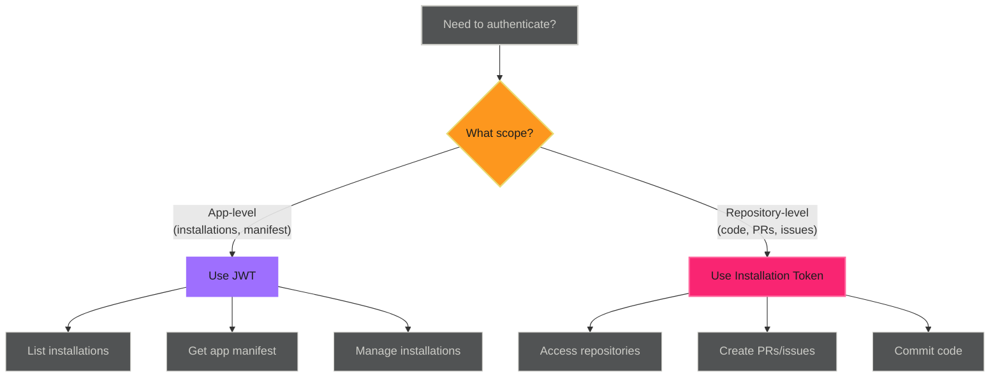

# JWT Authentication - Reference

This is the complete reference documentation extracted from the source.


# JWT Authentication

JSON Web Tokens (JWTs) provide app-level authentication for GitHub Apps. Use JWTs to manage app metadata, discover installations, and bootstrap token generation workflows.

> **When to Use JWT**
>
>
> JWT authentication is for **app-level operations only**. Use installation tokens for repository operations and OAuth for user operations.
>

## Overview

JWTs authenticate your GitHub App itself, not a specific installation. They enable:

- **Installation discovery** - List where your app is installed
- **App metadata retrieval** - Get app configuration and manifest
- **Installation management** - Suspend or configure installations
- **Bootstrap workflows** - Generate installation tokens dynamically

> **JWT Limitations**
>
>
> - Cannot access repository contents
> - Cannot create issues, pull requests, or commits
> - 10-minute expiration (maximum allowed)
> - App-level permissions only
>

## JWT vs Installation Token Decision



## JWT Generation Methods

### Method 1: GitHub CLI (Recommended for Workflows)

The GitHub CLI handles JWT generation automatically when using GitHub App credentials.

```yaml
jobs:
  list-installations:
    runs-on: ubuntu-latest
    steps:
      - name: List app installations
        env:
          GH_APP_ID: ${{ secrets.CORE_APP_ID }}
          GH_APP_PRIVATE_KEY: ${{ secrets.CORE_APP_PRIVATE_KEY }}
        run: |
          # gh CLI generates JWT automatically
          gh api /app/installations \
            --jq '.[] | {id: .id, account: .account.login}'
```

**How it works**:

- `GH_APP_ID` + `GH_APP_PRIVATE_KEY` triggers automatic JWT generation
- JWT is generated on-demand for each API call
- No manual token handling required

### Method 2: Manual JWT Generation (Advanced)

For custom implementations or languages without GitHub CLI support.

```yaml
jobs:
  manual-jwt:
    runs-on: ubuntu-latest
    steps:
      - name: Generate JWT manually
        id: jwt
        env:
          APP_ID: ${{ secrets.CORE_APP_ID }}
          PRIVATE_KEY: ${{ secrets.CORE_APP_PRIVATE_KEY }}
        run: |
          # Install JWT tool
          npm install -g jsonwebtoken

          # Create JWT generation script
          cat > generate-jwt.js << 'EOF'
          const jwt = require('jsonwebtoken');
          const fs = require('fs');

          const appId = process.env.APP_ID;
          const privateKey = process.env.PRIVATE_KEY;

          const now = Math.floor(Date.now() / 1000);
          const payload = {
            iat: now - 60,        // Issued 60 seconds in past
            exp: now + (10 * 60), // Expires in 10 minutes
            iss: appId
          };

          const token = jwt.sign(payload, privateKey, { algorithm: 'RS256' });
          console.log(token);
          EOF

          # Generate JWT
          JWT_TOKEN=$(node generate-jwt.js)
          echo "::add-mask::$JWT_TOKEN"
          echo "token=$JWT_TOKEN" >> $GITHUB_OUTPUT

      - name: Use JWT
        env:
          GITHUB_TOKEN: ${{ steps.jwt.outputs.token }}
        run: |
          curl -H "Authorization: Bearer $GITHUB_TOKEN" \
               -H "Accept: application/vnd.github+json" \
               https://api.github.com/app
```

> **Security: Mask JWT Token**
>
>
> Always use `echo "::add-mask::$JWT_TOKEN"` to prevent token exposure in logs.
>

### Method 3: Python Implementation

For Python-based workflows and automation.

```yaml
jobs:
  python-jwt:
    runs-on: ubuntu-latest
    steps:
      - name: Generate JWT with Python
        id: jwt
        env:
          APP_ID: ${{ secrets.CORE_APP_ID }}
          PRIVATE_KEY: ${{ secrets.CORE_APP_PRIVATE_KEY }}
        run: |
          pip install PyJWT cryptography

          python << 'EOF'
          import jwt
          import time
          import os

          app_id = os.environ['APP_ID']
          private_key = os.environ['PRIVATE_KEY']

          now = int(time.time())
          payload = {
              'iat': now - 60,
              'exp': now + (10 * 60),
              'iss': app_id
          }

          token = jwt.encode(payload, private_key, algorithm='RS256')

          # Mask token in logs
          print(f"::add-mask::{token}")

          # Output token
          with open(os.environ['GITHUB_OUTPUT'], 'a') as f:
              f.write(f"token={token}\n")
          EOF

      - name: Use JWT
        env:
          GITHUB_TOKEN: ${{ steps.jwt.outputs.token }}
        run: |
          curl -H "Authorization: Bearer $GITHUB_TOKEN" \
               https://api.github.com/app/installations
```

## Common Use Cases

### Use Case 1: List All Installations

Discover all organizations and repositories where your app is installed.

```yaml
name: Audit App Installations

on:
  workflow_dispatch:
  schedule:
    - cron: '0 0 * * 0'  # Weekly on Sunday

jobs:
  list-installations:
    runs-on: ubuntu-latest
    steps:
      - name: List installations
        id: installations
        env:
          GH_APP_ID: ${{ secrets.CORE_APP_ID }}
          GH_APP_PRIVATE_KEY: ${{ secrets.CORE_APP_PRIVATE_KEY }}
        run: |
          echo "## App Installations" >> $GITHUB_STEP_SUMMARY
          echo "" >> $GITHUB_STEP_SUMMARY

          gh api /app/installations --jq '.[] | {
            id: .id,
            account: .account.login,
            type: .account.type,
            repos: .repository_selection,
            created: .created_at
          }' | while read -r line; do
            echo "- $line" >> $GITHUB_STEP_SUMMARY
          done

      - name: Export installation IDs
        id: export
        env:
          GH_APP_ID: ${{ secrets.CORE_APP_ID }}
          GH_APP_PRIVATE_KEY: ${{ secrets.CORE_APP_PRIVATE_KEY }}
        run: |
          INSTALLATION_IDS=$(gh api /app/installations --jq '[.[] | .id] | join(",")')
          echo "ids=$INSTALLATION_IDS" >> $GITHUB_OUTPUT

    outputs:
      installation_ids: ${{ steps.export.outputs.ids }}
```

### Use Case 2: Retrieve App Manifest

Get your app's configuration and permissions.

```yaml
jobs:
  check-app-config:
    runs-on: ubuntu-latest
    steps:
      - name: Get app details
        env:
          GH_APP_ID: ${{ secrets.CORE_APP_ID }}
          GH_APP_PRIVATE_KEY: ${{ secrets.CORE_APP_PRIVATE_KEY }}
        run: |
          echo "## App Configuration" >> $GITHUB_STEP_SUMMARY
          echo "" >> $GITHUB_STEP_SUMMARY

          # Get app metadata
          gh api /app --jq '{
            name: .name,
            slug: .slug,
            owner: .owner.login,
            html_url: .html_url,
            created_at: .created_at,
            updated_at: .updated_at
          }' >> $GITHUB_STEP_SUMMARY

          echo "" >> $GITHUB_STEP_SUMMARY
          echo "## Permissions" >> $GITHUB_STEP_SUMMARY
          echo "" >> $GITHUB_STEP_SUMMARY

          # Get permissions
          gh api /app --jq '.permissions | to_entries[] |
            "- **\(.key)**: \(.value)"' >> $GITHUB_STEP_SUMMARY
```

### Use Case 3: Bootstrap Installation Tokens

Use JWT to discover installations, then generate installation tokens for each.

```yaml
name: Cross-Installation Operation

on:
  workflow_dispatch:

jobs:
  discover:
    runs-on: ubuntu-latest
    outputs:
      installations: ${{ steps.list.outputs.installations }}
    steps:
      - name: List installations (JWT)
        id: list
        env:
          GH_APP_ID: ${{ secrets.CORE_APP_ID }}
          GH_APP_PRIVATE_KEY: ${{ secrets.CORE_APP_PRIVATE_KEY }}
        run: |
          # Use JWT to discover installations
          INSTALLATIONS=$(gh api /app/installations --jq '[.[] | {
            id: .id,
            account: .account.login
          }]')

          echo "installations=$INSTALLATIONS" >> $GITHUB_OUTPUT

  process:
    needs: discover
    runs-on: ubuntu-latest
    strategy:
      matrix:
        installation: ${{ fromJson(needs.discover.outputs.installations) }}
    steps:
      - name: Generate installation token
        id: token
        uses: actions/create-github-app-token@v2
        with:
          app-id: ${{ secrets.CORE_APP_ID }}
          private-key: ${{ secrets.CORE_APP_PRIVATE_KEY }}
          owner: ${{ matrix.installation.account }}

      - name: Operate on installation
        env:
          GH_TOKEN: ${{ steps.token.outputs.token }}
        run: |
          echo "Processing: ${{ matrix.installation.account }}"
          gh repo list ${{ matrix.installation.account }} --limit 5
```

> **Two-Stage Authentication**
>
>
> This pattern is the primary use case for JWTs: use JWT for discovery, then switch to installation tokens for actual operations.
>

### Use Case 4: Installation Health Check

Monitor installation status and permissions.

```yaml
jobs:
  health-check:
    runs-on: ubuntu-latest
    steps:
      - name: Check installation health
        env:
          GH_APP_ID: ${{ secrets.CORE_APP_ID }}
          GH_APP_PRIVATE_KEY: ${{ secrets.CORE_APP_PRIVATE_KEY }}
        run: |
          echo "## Installation Health Report" >> $GITHUB_STEP_SUMMARY
          echo "" >> $GITHUB_STEP_SUMMARY

          gh api /app/installations | jq -r '.[] |
            "### \(.account.login)\n" +
            "- **ID**: \(.id)\n" +
            "- **Type**: \(.account.type)\n" +
            "- **Status**: \(.suspended_at // "Active")\n" +
            "- **Repository Access**: \(.repository_selection)\n" +
            "- **Created**: \(.created_at)\n"
          ' >> $GITHUB_STEP_SUMMARY

      - name: Alert on suspended installations
        env:
          GH_APP_ID: ${{ secrets.CORE_APP_ID }}
          GH_APP_PRIVATE_KEY: ${{ secrets.CORE_APP_PRIVATE_KEY }}
        run: |
          SUSPENDED=$(gh api /app/installations --jq '
            [.[] | select(.suspended_at != null) | .account.login] |
            join(", ")

          if [ -n "$SUSPENDED" ]; then
            echo "::warning::Suspended installations: $SUSPENDED"
          fi
```

