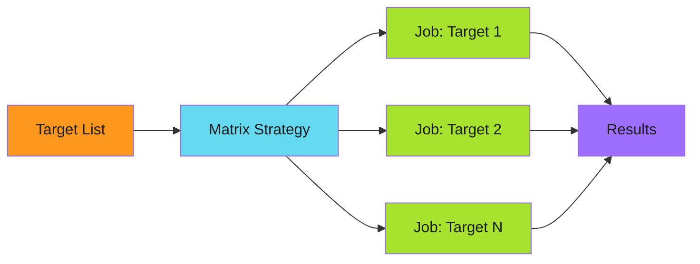

# Matrix Distribution - Examples


## Example 1: example-1.yaml


```yaml
strategy:
  matrix:
    target: ${{ fromJson(needs.discover.outputs.targets) }}
  fail-fast: false
  max-parallel: 10
```


## Example 2: example-2.mermaid





## Example 3: example-3.yaml


```yaml
discover:
  outputs:
    targets: ${{ steps.query.outputs.targets }}
  steps:
    - name: Build target list
      id: query
      run: |
        TARGETS='[{"name": "repo-1"}, {"name": "repo-2"}]'
        echo "targets=$TARGETS" >> $GITHUB_OUTPUT

distribute:
  needs: discover
  strategy:
    matrix:
      target: ${{ fromJson(needs.discover.outputs.targets) }}
  steps:
    - run: echo "Processing ${{ matrix.target.name }}"
```


## Example 4: example-4.yaml


```yaml
strategy:
  matrix:
    target: ${{ fromJson(needs.discover.outputs.targets) }}
  fail-fast: false  # Critical: continue processing other targets
```


## Example 5: example-5.yaml


```yaml
strategy:
  matrix:
    target: ${{ fromJson(needs.discover.outputs.targets) }}
  max-parallel: 10  # Limit concurrent jobs
```


