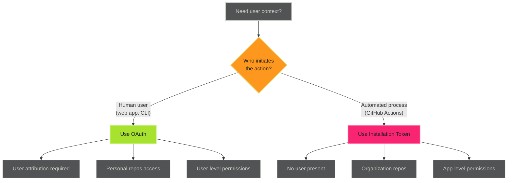

# OAuth User Authentication

## When to Use This Skill

OAuth authentication provides user-context access for GitHub Apps. It enables:

- **User attribution** - Actions appear as the user in audit logs
- **User permissions** - Respect individual user access levels
- **Personal repository access** - Access to user's private repositories
- **Interactive applications** - Web apps and CLI tools requiring user authorization
- **Long-lived sessions** - Tokens valid until revoked

> **OAuth Limitations**
>
>
> - Not suitable for automated workflows (no user present)
> - Requires user consent for each installation
> - Rate limits apply per user (5,000/hour)
> - More complex setup than installation tokens

## Implementation

See the full implementation guide in the [source documentation](https://adaptive-enforcement-lab.com/patterns/github-actions/).

## Techniques

### OAuth vs Other Methods

*See [reference.md](reference.md) for additional techniques and detailed examples.*

## Comparison

*See [examples.md](examples.md) for detailed code examples.*

## Examples

See [examples.md](examples.md) for code examples.

## Full Reference

See [reference.md](reference.md) for complete documentation.
## References

- [Source Documentation](https://adaptive-enforcement-lab.com/patterns/github-actions/)
- [AEL Patterns](https://adaptive-enforcement-lab.com/patterns/)
