# Patterns — Full Reference

Generated from adaptive-enforcement-lab.com. For a scannable index with links to the live docs, see SKILL.md in this skill.

## Overview

Reusable design patterns for resilient automation.

> **Solve Once, Apply Everywhere**
>
>
> Good patterns solve problems once. Great patterns solve problems across technologies, languages, and platforms.
>

### Overview

This section documents **architecture patterns**, **efficiency patterns**, **error handling patterns**, and **technology-specific patterns** that apply from GitHub Actions to Argo Workflows to Kubernetes operators.

These patterns are battle-tested in production environments, proven to reduce operational toil, and designed to prevent the failure modes that break automation at scale.

### Pattern Categories

#### Architecture Patterns

System design patterns for building maintainable, scalable automation.

##### Separation of Concerns

Build scalable automation through distinct, composable modules. Reduces coupling and improves testability.

- Split functionality into distinct, composable modules
- Each component does one thing well
- Reduces coupling, improves testability
- Examples: Script-based workflow stages, modular Helm charts

##### Hub-and-Spoke

Distribute configuration from a central hub to many spokes. Enforce consistency and enable organization-wide policy updates.

- Central hub distributes configuration to many spokes
- Enforces consistency across repositories or clusters
- Enables organization-wide policy updates
- Examples: GitHub Apps distributing files, ArgoCD ApplicationSets

##### Strangler Fig

Incrementally replace legacy systems. Route traffic to new implementations, reducing risk with gradual cutovers.

- Incrementally replace legacy systems without Big Bang rewrites
- Route traffic to new implementation while old runs
- Gradual cutover reduces risk
- Examples: Feature flags, API gateway routing, Kubernetes Ingress

##### Three-Stage Design

Implement workflows using a Discovery → Execution → Summary pattern. Find, process, and aggregate results efficiently.

- Discovery → Execution → Summary pattern for workflows
- Discovery: Find what needs processing
- Execution: Process items in parallel
- Summary: Aggregate results and report
- Examples: Multi-repo file distribution, vulnerability remediation

##### Matrix Distribution

Execute operations in parallel across multiple dimensions. Leverage conditional execution and template rendering for diverse scenarios.

- Parallel execution across multiple dimensions
- Conditional execution based on matrix values
- Template rendering for each matrix combination
- Examples: Multi-environment deployments, multi-arch builds

##### Environment Progression

Manage sequential deployments across environments (dev → staging → prod). Automate promotion on success and rollback on failure.

- Sequential deployment through environments (dev → staging → prod)
- Automated promotion on success
- Rollback on failure
- Examples: GitOps progressive delivery, Argo Rollouts

#### Efficiency Patterns

Patterns that reduce runtime, cost, and toil.

##### Idempotency

Ensure operations are safe to run multiple times without side effects. Critical for reliable automation and retry mechanisms.

- Safe to run multiple times without side effects
- Enables retries without duplication
- Critical for automation reliability
- Techniques: Check-before-act, upsert, tombstone markers, unique identifiers

##### Work Avoidance

Optimize automation by skipping unnecessary work when outcomes are unchanged. Use content hashes and existence checks.

- Skip unnecessary work when outcomes are unchanged
- Compare content hashes, not timestamps
- Use existence checks before creation
- Examples: Content-based PR creation, cache-based skips, path filtering

#### Error Handling Patterns

Patterns that make automation resilient to failure.

##### Fail Fast

Detect errors early and exit immediately on unrecoverable issues. Provides clear error messages and prevents expensive operations.

- Detect errors early, before expensive operations
- Exit immediately on unrecoverable errors
- Provide clear error messages
- Examples: Prerequisite checks, input validation

##### Prerequisite Checks

Verify all requirements before starting work. Ensure optimal order of checks to prevent partial execution states.

- Verify all requirements before starting work
- Check in optimal order (cheap first, expensive last)
- Avoid partial execution states
- Examples: Dependency checks, permission validation

##### Graceful Degradation

Maintain functionality with reduced capabilities when components fail. Use fallback mechanisms to preserve critical operations.

- Continue with reduced functionality when components fail
- Fallback to alternative implementations
- Preserve critical path operations
- Examples: Secondary data sources, default values

#### Technology-Specific Patterns

##### GitHub Actions Patterns

- **Actions Integration**: Token generation, permission patterns, error handling
- **File Distribution**: Three-stage design for cross-repo operations
- **Release Pipelines**: Release Please integration, change detection
- **Work Avoidance**: Matrix filtering, content comparison, cache strategies
- **Versioned Docs**: Mike integration, version strategies

**Content**: 60+ pages of GitHub Actions patterns

##### Argo Events Patterns

- **Event Routing**: Simple filtering, multi-trigger actions, transformation
- **Conditional Routing**: Route events based on payload content
- **Reliability**: Retry strategies, dead letter queues, backpressure handling
- **Setup and Operations**: EventSource, EventBus, Sensor configuration

**Content**: 12+ pages covering event-driven workflow patterns

##### Argo Workflows Patterns

- **WorkflowTemplate Patterns**: Basic structure, retry strategies, init containers, volumes
- **Concurrency Control**: Mutexes, semaphores, TTL strategies
- **Workflow Composition**: Spawning children, parallel execution, DAG orchestration
- **Scheduled Workflows**: CronWorkflow patterns, concurrency policies, GitHub integration

**Content**: 20+ pages covering orchestration patterns

### Cross-Cutting Concerns

Many patterns apply across multiple technologies:

#### Idempotency Across Technologies

- **GitHub Actions**: Content hashing before PR creation
- **Argo Workflows**: Check-before-act in workflow steps
- **Kubernetes**: Declarative desired state (built-in idempotency)
- **Helm**: `--atomic` flag for all-or-nothing deployments

#### Three-Stage Design Across Technologies

- **GitHub Actions**: Discovery → Distribution → Summary for file distribution
- **Argo Events**: EventSource → Sensor → Workflow trigger
- **Argo Workflows**: DAG with discovery, parallel execution, aggregation
- **Kubernetes Operators**: List resources → Reconcile → Update status

#### Retry Strategies Across Technologies

- **GitHub Actions**: `retry` action with exponential backoff
- **Argo Events**: Sensor retry configuration
- **Argo Workflows**: WorkflowTemplate retry strategy
- **Kubernetes**: Deployment rollout with health checks

### Pattern Selection Guide

**Quick selection**:

- Need cross-repo distribution? → **Three-Stage Design** + **Hub-and-Spoke**
- Need to avoid duplicate work? → **Idempotency** + **Work Avoidance**
- Replacing legacy system? → **Strangler Fig**
- Need error resilience? → **Fail Fast** + **Prerequisite Checks**
- Building event-driven system? → **Argo Events** routing patterns
- Orchestrating complex workflows? → **Argo Workflows** composition patterns

### Common Anti-Patterns

#### ❌ Non-Idempotent Operations

```yaml
## BAD: Creates duplicate issues on retry
- name: Create issue
  run: gh issue create --title "Alert" --body "Problem detected"
```

```yaml
## GOOD: Check before creating
- name: Create issue if not exists
  run: |
    existing=$(gh issue list --search "Alert" --state all --json number -q '.[0].number')
    if [ -z "$existing" ]; then
      gh issue create --title "Alert" --body "Problem detected"
    fi
```

#### ❌ Unnecessary Work

```yaml
## BAD: Always creates PR even if no changes
- name: Create PR
  run: gh pr create --fill
```

```yaml
## GOOD: Check if changes exist first
- name: Create PR if changes exist
  run: |
    if git diff --quiet HEAD origin/main; then
      echo "No changes, skipping PR"
    else
      gh pr create --fill
    fi
```

#### ❌ Late Error Detection

```yaml
## BAD: Deploy first, check permissions later
- name: Deploy
  run: kubectl apply -f manifests/
- name: Check RBAC
  run: kubectl auth can-i create deployments
```

```yaml
## GOOD: Validate before deploying
- name: Prerequisite checks
  run: |
    kubectl auth can-i create deployments || exit 1
    kubectl get namespace production || exit 1
- name: Deploy
  run: kubectl apply -f manifests/
```

### Pattern Layering

Patterns work best when layered:

1. **Architecture pattern** (what to build)
    - Example: Hub-and-Spoke for config distribution

2. **Efficiency pattern** (how to build efficiently)
    - Add: Idempotency for safe retries
    - Add: Work Avoidance to skip unchanged configs

3. **Error handling pattern** (how to fail gracefully)
    - Add: Fail Fast for invalid configs
    - Add: Prerequisite Checks for GitHub API access

**Result**: Hub-and-spoke config distribution that is idempotent, skips unchanged configs, validates early, and handles errors gracefully.

### Getting Started

1. **Read the pattern selection guide**: Understand when to use each pattern
2. **Start with architecture patterns**: Choose the right structure
3. **Add efficiency patterns**: Optimize for scale
4. **Layer error handling**: Make it resilient
5. **Browse technology-specific patterns**: See implementations

### Integration with Other Sections

Patterns are applied throughout the other sections:

- [Secure](../secure/index.md): Security scanning patterns, SBOM generation patterns
- [Enforce](../enforce/index.md): Policy enforcement patterns, admission control patterns
- [Build](../build/index.md): Release automation patterns, testing patterns

### Pattern Documentation Format

Each pattern is documented with:

1. **Intent**: What problem does this solve?
2. **Motivation**: When should you use this?
3. **Structure**: How is it organized?
4. **Implementation**: Code examples
5. **Consequences**: Trade-offs and limitations
6. **Related patterns**: What patterns complement this?

### Contributing Patterns

See CONTRIBUTING.md in the project root for guidelines on documenting new patterns.

**Pattern quality criteria**:

- Solves a recurring problem (not one-off solution)
- Technology-agnostic (or clearly scoped to specific tech)
- Production-tested (not theoretical)
- Documented with real examples (not pseudocode)
- Includes anti-patterns (what not to do)

### Related Content

- [Secure](../secure/index.md): Security patterns
- [Enforce](../enforce/index.md): Enforcement patterns
- [Build](../build/index.md): Build and release patterns

### Tags

Browse all content tagged with patterns, automation, idempotency, three-stage, and hub-and-spoke on the [Tags](../tags.md) page.

## Architecture Patterns

Fundamental patterns for building maintainable, scalable…

These patterns govern how systems are structured and how components interact.

> **Implementation Guide**
>
> This guide is part of a modular documentation set. Refer to related guides for complete context.
>

---

#### Patterns in This Section

##### [Separation of Concerns](separation-of-concerns/index.md)

Single-responsibility components with clear boundaries. Orchestration separate from execution. Testability through isolation.

**Use when:** Building CLIs, microservices, or any system with distinct responsibilities

**Key benefit:** Maintainability – change one thing without breaking everything

---

##### [Hub and Spoke](hub-and-spoke/index.md)

Centralized orchestration with distributed execution. One coordinator, many workers. Event-driven task distribution.

**Use when:** Scaling workflows, managing distributed systems, event-driven architectures

**Key benefit:** Scalability – add workers without changing orchestration

---

##### [Strangler Fig](strangler-fig/index.md)

Incremental migration from legacy systems. Run old and new in parallel. Gradually shift traffic. Zero downtime transitions.

**Use when:** Replacing monoliths, migrating to new tech, risky system rewrites

**Key benefit:** Risk reduction – rollback at any point, validate in production

---

##### [Three-Stage Design](three-stage-design.md)

Separate discovery, execution, and reporting phases. Workflows that fail gracefully and report completely.

**Use when:** Building complex CI/CD workflows, multi-step automation

**Key benefit:** Observability – always know what happened, even on failure

---

##### [Matrix Distribution](matrix-distribution/index.md)

Parallel processing of multiple targets. Dynamic matrices for scalability.

**Use when:** Processing many targets, scaling workflows, reducing execution time

**Key benefit:** Performance – parallel execution instead of sequential

---

#### How These Patterns Relate

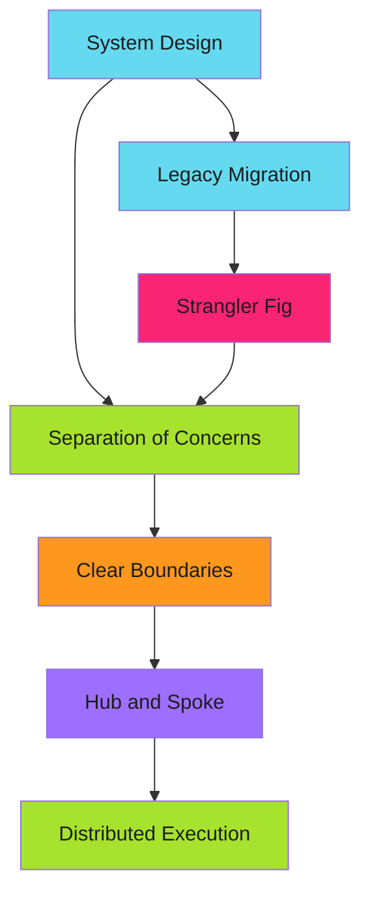

Separation of Concerns provides the foundation. Hub and Spoke scales it. Strangler Fig migrates to it.

---

#### Related Patterns

These architectural patterns complement:

- **[Efficiency Patterns](../efficiency/index.md):** Idempotency, work avoidance
- **[Error Handling](../error-handling/index.md):** Fail fast, graceful degradation
- **[Argo Workflows](../argo-workflows/index.md):** Production workflow orchestration
- **[Argo Events](../argo-events/index.md):** Event-driven automation

---

*Build systems that scale, change, and survive.*

### Hub and Spoke

One hub coordinates. Many spokes execute. The hub doesn't do the work. It distributes, tracks, and summarizes.

This pattern scales horizontally. Add workers without touching the orchestrator.

#### The Problem

Sequential processing doesn't scale:

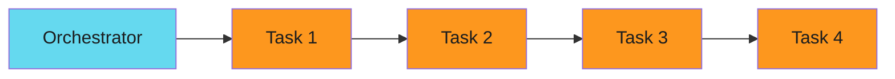

Total time: sum of all tasks. Can't parallelize. Bottleneck at the orchestrator.

#### The Pattern

> **Quick Start**
>
> This guide is part of a modular documentation set. Refer to related guides in the navigation for complete context.
>

Hub coordinates, spokes execute in parallel:

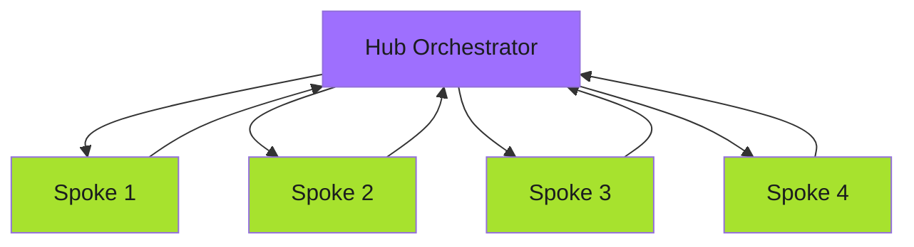

Total time: longest single task. Linear scaling. Hub unchanged as spokes grow.

#### Argo Workflows Implementation

Hub workflow spawns children:

```yaml
apiVersion: argoproj.io/v1alpha1
kind: WorkflowTemplate
metadata:
  name: hub-orchestrator
spec:
  entrypoint: hub
  templates:
    - name: hub
      inputs:
        parameters:
          - name: repositories
      steps:
##        # Discover work
        - - name: discover
            template: get-repositories

##        # Fan out to spokes
        - - name: process-repo
            template: spawn-spoke
            arguments:
              parameters:
                - name: repo
                  value: "{{item}}"
            withParam: "{{steps.discover.outputs.result}}"

##        # Collect results
        - - name: summarize
            template: collect-results

    - name: spawn-spoke
      inputs:
        parameters:
          - name: repo
      resource:
        action: create
        manifest: |
          apiVersion: argoproj.io/v1alpha1
          kind: Workflow
          metadata:
            generateName: spoke-{{inputs.parameters.repo}}-
          spec:
            workflowTemplateRef:
              name: spoke-worker
            arguments:
              parameters:
                - name: repository
                  value: "{{inputs.parameters.repo}}"
```

Hub discovers repositories, spawns a spoke workflow for each, then summarizes results.

#### Spoke Worker Template

Each spoke is independent:

```yaml
apiVersion: argoproj.io/v1alpha1
kind: WorkflowTemplate
metadata:
  name: spoke-worker
spec:
  entrypoint: process
  arguments:
    parameters:
      - name: repository
  templates:
    - name: process
      inputs:
        parameters:
          - name: repository
      container:
        image: gcr.io/project/worker:v1
        command: ["/app/worker"]
        args:
          - "--repo={{inputs.parameters.repository}}"
          - "--action=process"
```

Spoke doesn't know about the hub. Just does its work and exits.

### Matrix Distribution

Parallelize operations across dynamic target lists.

---

#### The Pattern

```yaml
strategy:
  matrix:
    target: ${{ fromJson(needs.discover.outputs.targets) }}
  fail-fast: false
  max-parallel: 10
```

Matrix distribution spawns parallel jobs for each target in a dynamically-generated list. Combined with [three-stage design](../three-stage-design.md), it enables scalable workflows that process many targets efficiently.

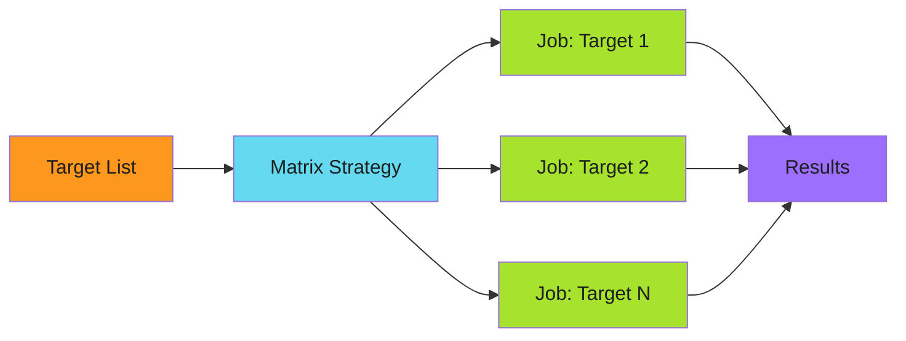

---

#### When to Use

> **Poor Fit**
>
>
> - Sequential operations where order matters
> - Operations with shared state between targets
> - When total job count would exceed GitHub Actions limits (256)
>

---

#### Core Configuration

##### Dynamic Matrix

Generate the target list in a discovery stage:

```yaml
discover:
  outputs:
    targets: ${{ steps.query.outputs.targets }}
  steps:
    - name: Build target list
      id: query
      run: |
        TARGETS='[{"name": "repo-1"}, {"name": "repo-2"}]'
        echo "targets=$TARGETS" >> $GITHUB_OUTPUT

distribute:
  needs: discover
  strategy:
    matrix:
      target: ${{ fromJson(needs.discover.outputs.targets) }}
  steps:
    - run: echo "Processing ${{ matrix.target.name }}"
```

##### Failure Isolation

Prevent one failure from canceling other jobs:

```yaml
strategy:
  matrix:
    target: ${{ fromJson(needs.discover.outputs.targets) }}
  fail-fast: false  # Critical: continue processing other targets
```

##### Rate Limiting

Control concurrency to avoid API rate limits:

```yaml
strategy:
  matrix:
    target: ${{ fromJson(needs.discover.outputs.targets) }}
  max-parallel: 10  # Limit concurrent jobs
```

---

#### In This Section

- [Conditional Distribution](conditional-distribution.md) - Type detection and filtering
- [Template Rendering](template-rendering.md) - Substitution and transformations
- [Anti-Patterns](anti-patterns.md) - Common mistakes to avoid

---

#### Summary

> **Key Takeaways**
>
>
> 1. **Dynamic matrices** - Generate target lists in discovery stage
> 2. **Isolate failures** - Always use `fail-fast: false`
> 3. **Control concurrency** - Set `max-parallel` for rate limits
> 4. **Conditional logic** - Detect target types, filter as needed
> 5. **Template rendering** - Use `envsubst`, `jq`, `yq` for transformations
>

### Separation of Concerns Pattern Overview

> **One Responsibility Per Component**
>
>
> Every component should do one thing well. Orchestration logic separated from business logic. Testability through clear boundaries. This pattern is the foundation of maintainable systems.
>

#### Intent

**Separate distinct responsibilities into isolated components with clear boundaries.**

Each component handles one concern. CLI presentation lives in `cmd/`. Business logic lives in `pkg/`. Tests run without external dependencies. Changes are localized. Systems remain maintainable at scale.

---

#### Motivation

##### When to Use This Pattern

You need separation when:

- **Testing requires external systems** - Database, Kubernetes cluster, container registry
- **Changes ripple across unrelated code** - Fixing a bug breaks unrelated features
- **New team members struggle to understand flow** - Control flow crosses multiple abstraction layers
- **Multiple concerns mix in one function** - Validation, transformation, persistence in single handler

##### The Cost of Mixed Concerns

```go
// Bad: CLI, business logic, and I/O mixed together
func DeployCommand(cmd *cobra.Command, args []string) error {
    // Parsing flags (CLI concern)
    namespace, _ := cmd.Flags().GetString("namespace")
    image, _ := cmd.Flags().GetString("image")

    // Validation (business logic)
    if namespace == "" {
        return fmt.Errorf("namespace required")
    }

    // Kubernetes client creation (infrastructure)
    config, _ := clientcmd.BuildConfigFromFlags("", kubeconfig)
    clientset, _ := kubernetes.NewForConfig(config)

    // Deployment logic (business logic)
    deployment := &appsv1.Deployment{
        ObjectMeta: metav1.ObjectMeta{Name: "app"},
        Spec: appsv1.DeploymentSpec{
            Template: corev1.PodTemplateSpec{
                Spec: corev1.PodSpec{
                    Containers: []corev1.Container{{
                        Name:  "app",
                        Image: image,
                    }},
                },
            },
        },
    }

    // API call (infrastructure)
    _, err := clientset.AppsV1().Deployments(namespace).Create(ctx, deployment, metav1.CreateOptions{})
    return err
}
```

**Problems**:

- Cannot test without Kubernetes cluster
- Business logic trapped in CLI layer
- Impossible to reuse from CronJob or API
- Flag parsing mixed with deployment logic
- Error handling crosses all concerns

---

#### Structure

##### Directory Layout

```text
project/
├── cmd/                    # CLI layer (presentation)
│   └── deploy/
│       └── deploy.go       # Cobra command setup, flag parsing, output
├── pkg/                    # Business logic layer (portable)
│   ├── deployer/
│   │   └── deployer.go     # Deployment orchestration
│   ├── validator/
│   │   └── validator.go    # Configuration validation
│   └── k8s/
│       └── client.go       # Kubernetes client wrapper
└── internal/               # Private implementation details
    └── config/
        └── loader.go       # Config file parsing
```

##### Component Responsibilities

| Layer | Responsibility | Framework Dependent? | Testable Without External Systems? |
|-------|----------------|---------------------|-----------------------------------|
| `cmd/` | Flag parsing, output formatting, exit codes | Yes (Cobra) | No |
| `pkg/` | Business logic, validation, orchestration | No | Yes |
| `internal/` | Implementation details, unexported helpers | No | Yes |

---

#### Implementation

##### The Orchestrator Pattern

**Separate CLI handling from business logic with an orchestrator:**

```go
// cmd/deploy/deploy.go - CLI layer
package main

import (
    "fmt"
    "os"

    "github.com/spf13/cobra"
    "example.com/pkg/deployer"
)

func NewDeployCommand() *cobra.Command {
    var opts deployer.Options

    cmd := &cobra.Command{
        Use:   "deploy",
        Short: "Deploy application to Kubernetes",
        RunE: func(cmd *cobra.Command, args []string) error {
            // Only CLI concerns here: flag parsing, output, exit codes
            d, err := deployer.New(opts)
            if err != nil {
                return fmt.Errorf("initializing deployer: %w", err)
            }

            // Business logic delegated to pkg/
            result, err := d.Deploy(cmd.Context())
            if err != nil {
                return err
            }

            // Output formatting (CLI concern)
            fmt.Printf("Deployed %s to namespace %s\n", result.Name, result.Namespace)
            return nil
        },
    }

    // Flag binding (CLI concern)
    cmd.Flags().StringVar(&opts.Namespace, "namespace", "default", "Kubernetes namespace")
    cmd.Flags().StringVar(&opts.Image, "image", "", "Container image")
    cmd.MarkFlagRequired("image")

    return cmd
}
```

```go
// pkg/deployer/deployer.go - Business logic layer
package deployer

import (
    "context"
    "fmt"

    appsv1 "k8s.io/api/apps/v1"
    corev1 "k8s.io/api/core/v1"
    metav1 "k8s.io/apimachinery/pkg/apis/meta/v1"
    "k8s.io/client-go/kubernetes"
)

// Options holds deployment configuration (no CLI framework types)
type Options struct {
    Namespace string
    Image     string
}

// Deployer orchestrates deployment operations
type Deployer struct {
    client    kubernetes.Interface  // Interface for testability
    validator Validator
    opts      Options
}

// New creates a deployer with dependency injection
func New(opts Options) (*Deployer, error) {
    client, err := getK8sClient()
    if err != nil {
        return nil, fmt.Errorf("creating client: %w", err)
    }

    return &Deployer{
        client:    client,
        validator: &DefaultValidator{},
        opts:      opts,
    }, nil
}

// Deploy executes the deployment (pure business logic)
func (d *Deployer) Deploy(ctx context.Context) (*DeploymentResult, error) {
    // Validation (business logic)
    if err := d.validator.Validate(d.opts); err != nil {
        return nil, fmt.Errorf("validation failed: %w", err)
    }

    // Deployment creation (business logic)
    deployment := d.buildDeployment()

    // Infrastructure call (delegated to client)
    created, err := d.client.AppsV1().Deployments(d.opts.Namespace).Create(
        ctx, deployment, metav1.CreateOptions{},
    )
    if err != nil {
        return nil, fmt.Errorf("creating deployment: %w", err)
    }

    return &DeploymentResult{
        Name:      created.Name,
        Namespace: created.Namespace,
    }, nil
}

// buildDeployment creates Deployment spec (business logic)
func (d *Deployer) buildDeployment() *appsv1.Deployment {
    return &appsv1.Deployment{
        ObjectMeta: metav1.ObjectMeta{
            Name: "app",
        },
        Spec: appsv1.DeploymentSpec{
            Selector: &metav1.LabelSelector{
                MatchLabels: map[string]string{"app": "app"},
            },
            Template: corev1.PodTemplateSpec{
                ObjectMeta: metav1.ObjectMeta{
                    Labels: map[string]string{"app": "app"},
                },
                Spec: corev1.PodSpec{
                    Containers: []corev1.Container{{
                        Name:  "app",
                        Image: d.opts.Image,
                    }},
                },
            },
        },
    }
}

type DeploymentResult struct {
    Name      string
    Namespace string
}
```

##### Testing Benefits

```go
// pkg/deployer/deployer_test.go
package deployer

import (
    "context"
    "testing"

    "k8s.io/client-go/kubernetes/fake"
)

func TestDeploy(t *testing.T) {
    // Fake Kubernetes client - no cluster required
    fakeClient := fake.NewSimpleClientset()

    d := &Deployer{
        client:    fakeClient,
        validator: &MockValidator{},
        opts: Options{
            Namespace: "test",
            Image:     "gcr.io/project/app:v1",
        },
    }

    // Test business logic in isolation
    result, err := d.Deploy(context.Background())
    if err != nil {
        t.Fatalf("Deploy() failed: %v", err)
    }

    if result.Namespace != "test" {
        t.Errorf("got namespace %s, want test", result.Namespace)
    }

    // No Kubernetes cluster, registry, or network required
}
```

---

#### Consequences

##### Benefits

| Benefit | Impact |
|---------|--------|
| **Testability** | Business logic tests run in milliseconds without external dependencies |
| **Reusability** | Same logic callable from CLI, API, CronJob, or Argo Workflow |
| **Maintainability** | Changes localized to single concern (CLI changes don't affect business logic) |
| **Team velocity** | New developers understand boundaries, know where code belongs |

##### Trade-offs

| Trade-off | Mitigation |
|-----------|-----------|
| More files/packages | Use clear naming conventions, documented structure |
| Interface overhead | Only create interfaces at real boundaries, not everywhere |
| Initial complexity | Complexity pays off after second feature addition |

---

#### Related Patterns

- **[Usage Guide](guide.md)**: When to apply, common mistakes, anti-patterns
- **[Implementation Techniques](implementation.md)**: Interfaces, dependency injection, testing
- **[Go CLI Architecture](../../../build/go-cli-architecture/index.md)**: Complete CLI implementation example
- **[Orchestrator Pattern](../../../build/go-cli-architecture/command-architecture/orchestrator-pattern.md)**: Detailed orchestration example
- **[Fail Fast](../../error-handling/fail-fast/index.md)**: Error handling at boundaries
- **[Prerequisite Checks](../../error-handling/prerequisite-checks/index.md)**: Validation separation

---

*CLI in `cmd/`. Business logic in `pkg/`. Tests run in milliseconds. Changes stay localized. The system is maintainable.*

### Strangler Fig

The strangler fig vine grows around a host tree. Eventually the vine takes over completely, and the original tree dies.

> **Migration Pattern**
>
> This guide covers the Strangler Fig pattern for incremental system migration. Review all sections for complete implementation strategy.
>

Your new system gradually replaces the old one. Both run in parallel. Traffic shifts incrementally. When the old system has zero traffic, you remove it.

Zero downtime. Rollback at any point. Migration validated in production.

---

#### The Problem with Big Bang Rewrites

Rewriting a monolith all at once:

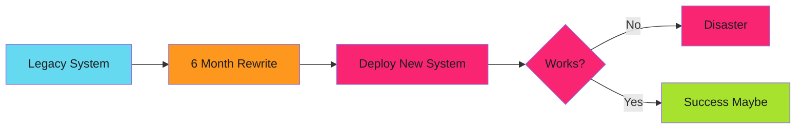

Six months of development. One deploy. Production traffic hits unknown code. Bugs discovered under real load. No rollback path.

---

#### The Strangler Fig Pattern

Incremental replacement:

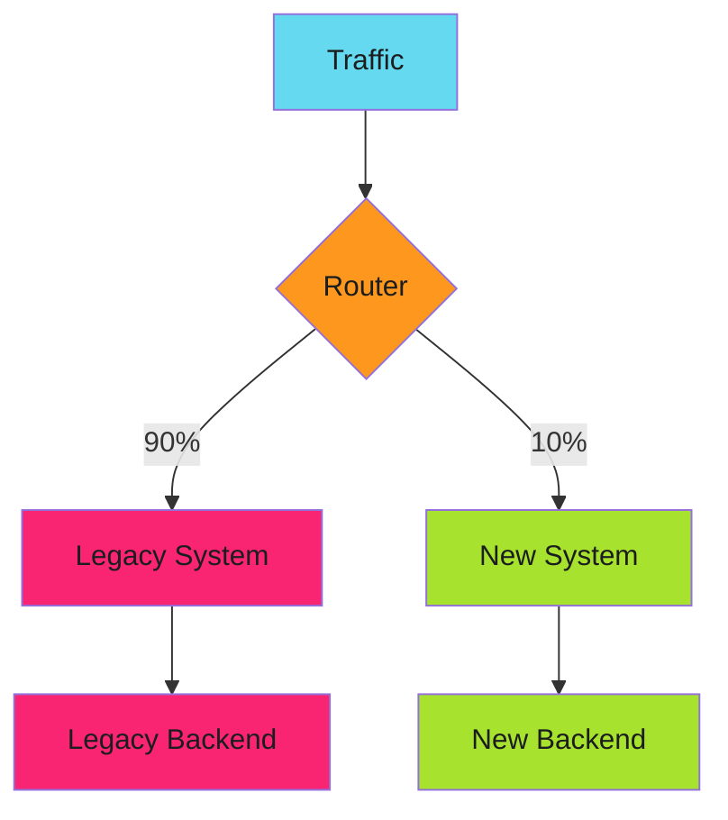

Router directs traffic. Start with 1% to new system. Monitor. Increase gradually. Eventually 100% on new system. Remove legacy.

---

#### Two Approaches to Strangler Fig

The strangler fig pattern has two distinct implementation approaches depending on what you're replacing:

##### Approach 1: Traffic Routing (User-Facing Systems)

Gradually shift user traffic from old to new system using percentage-based routing.

**Use for**:

- API migrations (REST v1 → v2)
- Feature rollouts (old checkout → new checkout)
- UI rewrites (legacy frontend → modern frontend)
- Application logic changes

**How it works**: Router/proxy directs percentage of traffic to new system. Start at 1%, increase gradually to 100%.

##### Approach 2: Component Replacement (Infrastructure)

Replace entire components without routing traffic, including databases, service meshes, operators, and storage.

**Use for**:

- Database migrations (single instance → HA cluster)
- Service mesh replacement (Linkerd → Istio)
- Operator upgrades (CRD v1alpha1 → v1)
- Storage backend changes (EBS → EFS)

**How it works**: Build new component, ensure compatibility, swap references, remove old component. No routing layer needed.

**Key distinction**: Traffic routing = gradual user migration. Component replacement = infrastructure swap with compatibility layer.

---

#### Implementation Guides

##### Traffic Routing Approach

- **[Implementation Strategies](implementation.md)** - Feature flags, parallel run validation, database migration strategies
- **[Traffic Routing](traffic-routing.md)** - Percentage-based, user-based, and canary deployment patterns
- **[Monitoring and Rollback](monitoring.md)** - Track both systems, compare metrics, instant rollback

##### Component Replacement Approach

- **[Platform Component Replacement](platform-component-replacement.md)** - Build-replace-remove pattern for infrastructure, zero downtime component swaps

##### Migration Process

- **[Migration Guide](migration-guide.md)** - Eight-phase checklist, common pitfalls, real-world timeline

---

#### When to Use This Pattern

**Use when:**

- Replacing critical production systems
- High risk of downtime
- Need gradual validation
- Rollback must be instant

**Don't use when:**

- Small, non-critical systems (just replace)
- No production traffic yet
- Resource cost of running both systems is prohibitive

---

#### Related Patterns

- **[Separation of Concerns](../separation-of-concerns/index.md)** - Isolate old and new logic
- **[Graceful Degradation](../../error-handling/graceful-degradation/index.md)** - Fallback to legacy on errors
- **[Environment Progression](../../../blog/posts/2025-12-16-environment-progression-testing.md)** - Test new system in staging first

---

*The new system started at 1% traffic. Mismatches were fixed in shadow mode. Traffic gradually shifted. After 8 weeks, the legacy system handled zero requests. It was decommissioned. The migration completed without a single production incident.*

## Argo Events

Build event-driven Kubernetes automation with Argo…

Argo Events is an event-driven workflow automation framework for Kubernetes. It connects external event sources to Argo Workflows, enabling reactive automation. For comprehensive documentation, see the [official Argo Events docs](https://argoproj.github.io/argo-events/).

---

#### Core Components


| Component | Purpose | Argo Docs |
| ----------- | --------- | ----------- |
| **EventSource** | Connects to external systems | [EventSource Types](https://argoproj.github.io/argo-events/concepts/event_source/) |
| **EventBus** | Message broker for delivery | [EventBus](https://argoproj.github.io/argo-events/eventbus/eventbus/) |
| **Sensor** | Filters events and triggers | [Sensors](https://argoproj.github.io/argo-events/concepts/sensor/) |
| **Trigger** | Action when conditions met | [Triggers](https://argoproj.github.io/argo-events/concepts/trigger/) |

---

#### Pattern Categories

| Category | Description |
| ---------- | ------------- |
| [Event Routing](routing/index.md) | Multi-action routing, filtering, and transformations |
| [Reliability Patterns](reliability/index.md) | Retry strategies, dead letter queues, and backpressure |

---

#### Operational Guides

For deploying and managing Argo Events in production:

- [Setup Guide](setup/index.md) - EventSource, EventBus, and Sensor configuration
- [Troubleshooting](troubleshooting/index.md) - Debugging event flows and common issues
- [High Availability](reliability/high-availability.md) - Production HA architecture

---

> **Prerequisites**
>
> Argo Events requires Argo Workflows for workflow triggers. See the [official installation guide](https://argoproj.github.io/argo-events/installation/) for setup.
>

---

#### Related Content

- [Argo Workflows Patterns](../argo-workflows/index.md) - WorkflowTemplate design and error handling
- [Event-Driven Deployments](../../blog/posts/2025-12-14-event-driven-deployments-argo.md) - The journey to zero-latency automation
- [ConfigMap as Cache Pattern](../efficiency/idempotency/caches.md) - Volume mounts for zero-API reads

### Argo Events Setup Guide

This guide covers EventSource, EventBus, and Sensor configuration for event-driven automation.

---

#### Components

| Component | Purpose | Guide |
| ----------- | --------- | ------- |
| **EventSource** | Connect to external systems (Pub/Sub, webhooks) | [EventSource Configuration](event-sources.md) |
| **EventBus** | Message broker for event delivery | [EventBus Configuration](event-bus.md) |
| **Sensor** | Filter events and trigger workflows | [Sensor Configuration](sensors.md) |

---

#### Quick Start

1. **Deploy EventBus** - Start with [JetStream for production](event-bus.md#jetstream_eventbus_production)
2. **Configure EventSource** - Connect your [Pub/Sub topic](event-sources.md#pubsub_eventsource) or [GitHub webhooks](event-sources.md#github_webhook_eventsource)
3. **Create Sensor** - Define [event filters and triggers](sensors.md#basic_sensor)

---

> **EventBus First**
>
> Deploy the EventBus before creating EventSources or Sensors. Without a running EventBus, events have nowhere to go.
>

---

#### Troubleshooting

##### Events Not Arriving

1. Check EventSource logs: `kubectl logs -n argo-events -l eventsource-name=<name>`
2. Verify Pub/Sub subscription exists in GCP console
3. Confirm service account has `pubsub.subscriber` role

##### Events Arriving But Not Triggering

1. Check Sensor logs: `kubectl logs -n argo-events -l sensor-name=<name>`
2. Verify filter conditions match event payload
3. Test with a simple sensor that logs all events

##### Events Lost During Restarts

1. Enable [persistence on EventBus](event-bus.md#nats_with_persistence)
2. Increase `maxAge` retention
3. Monitor EventBus storage usage

---

#### Related

- [Argo Workflows Patterns](../../argo-workflows/index.md) - WorkflowTemplate design and error handling
- [ConfigMap as Cache Pattern](../../../patterns/efficiency/idempotency/caches.md) - Volume mounts for zero-API reads
- [Event-Driven Deployments](../../../blog/posts/2025-12-14-event-driven-deployments-argo.md) - The journey to zero-latency automation

### Event Routing

Event routing controls how events flow from EventSources through Sensors to Triggers. Argo Events provides powerful filtering, transformation, and multi-action capabilities. For the complete reference, see the [official Sensors documentation](https://argoproj.github.io/argo-events/concepts/sensor/).

---

#### Event Flow Architecture

Events pass through multiple stages, each providing opportunities to filter, transform, and route:

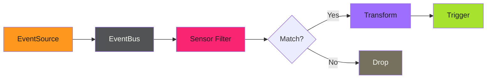

**Key decision points:**

1. **EventSource**: Receives raw events, normalizes format, publishes to EventBus
2. **Sensor Filter**: Evaluates event data against filter expressions
3. **Transform**: Modifies event payload before trigger execution
4. **Trigger**: Executes action (workflow, HTTP request, Kubernetes resource)

---

#### Routing Patterns

| Pattern | Use Case | Complexity |
| --------- | ---------- | ------------ |
| [Simple Filtering](filtering.md) | Route events based on field values | Low |
| [Multi-Trigger Actions](multi-trigger.md) | Execute multiple actions from one event | Medium |
| [Event Transformation](transformation.md) | Modify payloads before triggering | Medium |
| [Conditional Routing](conditional.md) | Complex decision trees | High |

---

#### Quick Example: Image Tag Filtering

Filter container registry events to only process production tags:

```yaml
apiVersion: argoproj.io/v1alpha1
kind: Sensor
metadata:
  name: prod-image-filter
spec:
  dependencies:
    - name: image-push
      eventSourceName: container-registry
      eventName: push
      filters:
        data:
          - path: body.tag
            type: string
            value:
              - "v*"
              - "release-*"
```

This Sensor only triggers when images are pushed with tags starting with `v` or `release-`. Development tags like `dev-123` or `feature-xyz` are silently dropped.

---

> **Filter Evaluation**
>
> Filters are evaluated in order. The first matching filter wins. If no filters match, the event is dropped without triggering any action. Use the [Sensor troubleshooting guide](../../../patterns/argo-events/troubleshooting/sensors.md) to debug filter issues.
>

---

#### Related

- [Simple Filtering](filtering.md) - Basic filter expressions
- [Multi-Trigger Actions](multi-trigger.md) - Fan-out patterns
- [Sensor Configuration](../../../patterns/argo-events/setup/sensors.md) - Basic Sensor setup
- [Official Sensor Docs](https://argoproj.github.io/argo-events/concepts/sensor/) - Complete reference

### Reliability Patterns

Production event systems must handle failures gracefully. Network blips, service outages, and malformed events are inevitable. These patterns ensure events don't get lost and systems recover automatically. For the complete reference, see the [official Argo Events reliability docs](https://argoproj.github.io/argo-events/sensors/more-about-sensors-and-triggers/).

---

#### Reliability Architecture

Multiple layers of protection prevent event loss:

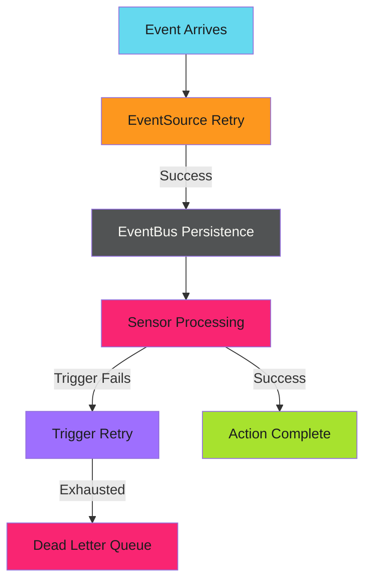

---

#### Reliability Patterns

| Pattern | Purpose | Complexity |
| --------- | --------- | ------------ |
| [Retry Strategies](retry.md) | Handle transient failures | Low |
| [Dead Letter Queues](dead-letter.md) | Capture failed events | Medium |
| [Backpressure Handling](backpressure.md) | Prevent overload | Medium |

---

#### Quick Example: Trigger Retry

Add retry logic to handle transient failures:

```yaml
triggers:
  - template:
      name: deploy-with-retry
      argoWorkflow:
        operation: submit
        source:
          resource:
##            # ...
    retryStrategy:
      steps: 3
      duration: 10s
      factor: 2
      jitter: 0.1
```

This retries failed triggers up to 3 times with exponential backoff:

- First retry: ~10 seconds
- Second retry: ~20 seconds
- Third retry: ~40 seconds

The jitter adds randomness to prevent thundering herd.

---

#### EventBus Durability

The EventBus provides at-least-once delivery. Events persist until acknowledged:

```yaml
apiVersion: argoproj.io/v1alpha1
kind: EventBus
metadata:
  name: default
spec:
  jetstream:
    version: "2.9.11"
    persistence:
      accessMode: ReadWriteOnce
      storageClassName: standard
      volumeSize: 10Gi
    replicas: 3
```

With persistence enabled, events survive EventBus pod restarts. The 3-replica configuration provides high availability.

---

> **At-Least-Once Semantics**
>
> Argo Events guarantees at-least-once delivery, not exactly-once. Your workflows must be idempotent - processing the same event twice should produce the same result. See [Idempotency Patterns](../../efficiency/idempotency/index.md) for implementation strategies.
>

---

#### Related

- [Retry Strategies](retry.md) - Transient failure handling
- [Dead Letter Queues](dead-letter.md) - Failed event capture
- [EventBus Configuration](../../../patterns/argo-events/setup/event-bus.md) - Persistence setup
- [High Availability](../../../patterns/argo-events/reliability/high-availability.md) - Production HA architecture
- [Official Reliability Docs](https://argoproj.github.io/argo-events/sensors/more-about-sensors-and-triggers/) - Complete reference

### Troubleshooting

When events don't trigger workflows, debugging can be challenging. Events flow through multiple components, and failures can be silent. This section covers systematic approaches to identify and fix issues.

---

#### Debugging Flow

Start at the source and work forward:


Check each component in order. The failure is usually at the first component that doesn't show expected behavior.

---

#### Troubleshooting Guides

| Guide | When to Use |
| ------- | ------------- |
| [EventSource Issues](eventsources.md) | Events not arriving from external systems |
| [Sensor Issues](sensors.md) | Events arrive but don't trigger actions |
| [Common Patterns](common-patterns.md) | Frequently encountered problems and solutions |

---

#### Quick Diagnostic Commands

```bash
### Check EventSource status
kubectl get eventsources -n argo-events
kubectl describe eventsource <name> -n argo-events

### Check EventBus health
kubectl get eventbus -n argo-events
kubectl logs -n argo-events -l eventbus-name=default

### Check Sensor status
kubectl get sensors -n argo-events
kubectl describe sensor <name> -n argo-events
kubectl logs -n argo-events -l sensor-name=<name>

### Check recent workflows
kubectl get workflows -n argo-workflows --sort-by=.metadata.creationTimestamp | tail -10
```

---

#### Logging Levels

Increase verbosity for debugging:

```yaml
### EventSource with debug logging
spec:
  template:
    container:
      env:
        - name: LOG_LEVEL
          value: debug
```

```yaml
### Sensor with debug logging
spec:
  template:
    container:
      env:
        - name: DEBUG_LOG
          value: "true"
```

Return to `error` or `info` after debugging to reduce log volume.

---

> **Silent Failures**
>
> Argo Events often fails silently. Filters that don't match, conditions that evaluate false, and malformed events produce no errors. When "nothing happens," systematic component-by-component verification is essential.
>

---

#### Related

- [EventSource Issues](eventsources.md) - Debug event ingestion
- [Sensor Issues](sensors.md) - Debug event processing
- [Common Patterns](common-patterns.md) - Known issues and fixes
- [Official Troubleshooting](https://argoproj.github.io/argo-events/FAQ/) - Argo Events troubleshooting guide

## Argo Workflows Patterns

Production Argo Workflows patterns: reusable templates…

Production patterns for Argo Workflows: reusable templates, error handling, concurrency control, workflow composition, and scheduled automation.

---

#### Why Argo Workflows?

Kubernetes provides primitives (Pods, Jobs, CronJobs), but building complex automation from primitives is painful. You end up with shell scripts that check Pod status in loops, cleanup logic scattered across multiple places, and debugging that requires correlating logs from dozens of sources.

Argo Workflows provides higher-level abstractions designed for automation. Define workflows declaratively. Let the controller handle scheduling, retries, and cleanup. Visualize execution in a purpose-built UI. Focus on what the automation does, not how to orchestrate it.

---

#### Pattern Categories

| Category | Description |
| ---------- | ------------- |
| [WorkflowTemplate Patterns](templates/index.md) | Reusable workflow definitions with error handling, volumes, and RBAC |
| [Concurrency Control](concurrency/index.md) | Mutex synchronization, semaphores, and TTL strategies |
| [Workflow Composition](composition/index.md) | Parent/child workflows, orchestration, and cross-workflow communication |
| [Scheduled Workflows](scheduled/index.md) | CronWorkflow patterns and GitHub integration |

---

#### Quick Start

1. **Define WorkflowTemplates** - Create reusable, tested building blocks
2. **Add Error Handling** - Configure retry strategies for transient failures
3. **Control Concurrency** - Use mutexes or semaphores for shared resources
4. **Compose Workflows** - Chain templates into complex pipelines
5. **Schedule Automation** - Run workflows on cron schedules

---

#### Troubleshooting

##### Workflow Stuck in Pending

1. Check service account permissions: `kubectl describe rolebinding -n argo-workflows`
2. Verify resource quotas: `kubectl describe quota -n argo-workflows`
3. Check node resources: `kubectl top nodes`
4. Look for mutex waits: `kubectl get workflows -l workflows.argoproj.io/sync-id`

##### Workflow Failed with RBAC Error

1. Verify ServiceAccount exists in workflow namespace
2. Check ClusterRoleBinding subjects match namespace
3. Use `kubectl auth can-i` to test permissions:

```bash
kubectl auth can-i patch deployments \
  --as=system:serviceaccount:argo-workflows:my-sa \
  -n target-namespace
```

##### Mutex Deadlock

1. Find workflows waiting on mutex: `kubectl get workflows -l workflows.argoproj.io/sync-id`
2. Identify the workflow holding the lock
3. Check if the holding workflow is stuck or failed
4. Terminate stuck workflows to release mutex

---

> **Prerequisites**
>
> Argo Workflows must be installed in your cluster. See the [official installation guide](https://argo-workflows.readthedocs.io/en/latest/quick-start/) for setup instructions.
>

---

#### Related

- [Argo Events Setup](../../patterns/argo-events/setup/index.md) - EventSource, EventBus, and Sensor configuration
- [ConfigMap as Cache](../efficiency/idempotency/caches.md) - Volume mounts for zero-API reads
- [Event-Driven Deployments](../../blog/posts/2025-12-14-event-driven-deployments-argo.md) - The journey to zero-latency automation

### Concurrency Control

When multiple workflows operate on shared resources, conflicts are inevitable. Two builds writing to the same output directory corrupt each other. Two deployments running simultaneously leave the system in an undefined state. Two cache rebuilds compete for the same ConfigMap.

Concurrency control prevents these conflicts. Argo Workflows provides several mechanisms: mutexes for exclusive access, semaphores for limited parallelism, and TTL strategies for cleanup.

---

#### Why Concurrency Control Matters

Without concurrency control, the system behavior depends on timing. Sometimes workflows complete successfully. Sometimes they fail mysteriously. Sometimes they produce incorrect results that aren't detected until much later.

Consider a documentation build pipeline triggered by Git pushes. Developer A pushes a change and the build starts. Developer B pushes another change before A's build completes. Now two builds run simultaneously, both reading from and writing to the same directories.

Mutex synchronization ensures only one build runs at a time. B's build waits for A's to complete. The output is always consistent. The tradeoff is latency. B waits instead of starting immediately. But consistent results are worth more than fast chaos.

---

#### Patterns

| Pattern | Description |
| --------- | ------------- |
| [Mutex Synchronization](mutex.md) | Exclusive access to shared resources |
| [Semaphores](semaphores.md) | Limited concurrent access |
| [TTL Strategy](ttl.md) | Automatic cleanup of completed workflows |

---

#### Quick Start

1. **Identify shared resources** - What can only be accessed by one workflow at a time?
2. **Choose the right pattern** - Mutex for exclusive access, semaphore for limited parallelism
3. **Configure TTL** - Prevent unbounded growth of completed workflows
4. **Test under load** - Verify behavior when multiple workflows trigger simultaneously

---

> **Start with Mutex**
>
> When in doubt, start with a mutex. It's simpler to configure and debug. Only switch to semaphores when you need controlled parallelism.
>

---

#### Related

- [WorkflowTemplate Patterns](../templates/index.md) - Basic workflow structure
- [Workflow Composition](../composition/index.md) - Parent/child workflow coordination
- [Scheduled Workflows](../scheduled/index.md) - CronWorkflow concurrency policies

### Scheduled Workflows

CronWorkflows run automation on a schedule: hourly builds, nightly backups, weekly reports. They combine the reliability of Kubernetes cron jobs with the power of Argo Workflows, enabling complex scheduled automation that survives cluster restarts and handles failures gracefully.

---

#### Why CronWorkflows?

Kubernetes CronJobs work for simple scheduled tasks. But they have limitations:

- Single-container jobs only
- Limited failure handling
- No workflow visualization
- Basic retry logic

CronWorkflows provide the full power of Argo Workflows on a schedule. Multi-step pipelines, sophisticated retry strategies, visual debugging, and artifact management are all available for scheduled automation.

---

#### Patterns

| Pattern | Description |
| --------- | ------------- |
| [Basic CronWorkflow](basic.md) | Simple scheduled execution |
| [Concurrency Policies](concurrency-policy.md) | Handling overlapping runs |
| [Orchestration](orchestration.md) | Scheduled pipelines that spawn child workflows |
| [GitHub Integration](github-integration.md) | Triggering GitHub Actions from schedules |

---

#### Quick Start

1. **Define the schedule** using cron syntax
2. **Set concurrency policy** to handle overlaps appropriately
3. **Configure history limits** to prevent resource accumulation
4. **Add monitoring** for schedule misses and failures

---

#### Cron Syntax Quick Reference

| Expression | Meaning |
| ------------ | --------- |
| `0 * * * *` | Every hour at minute 0 |
| `0 0 * * *` | Daily at midnight |
| `0 0 * * 0` | Weekly on Sunday at midnight |
| `0 0 1 * *` | Monthly on the 1st at midnight |
| `*/15 * * * *` | Every 15 minutes |
| `0 9-17 * * 1-5` | Hourly 9am-5pm, Mon-Fri |

> **Use UTC Unless Specified**
>
> CronWorkflows default to UTC. Use the `timezone` field for local time scheduling.
>

---

#### Related

- [WorkflowTemplate Patterns](../templates/index.md): Building workflow templates to schedule
- [Concurrency Control](../concurrency/index.md): Mutex and semaphore patterns
- [Workflow Composition](../composition/index.md): Complex scheduled pipelines

### Workflow Composition

As automation pipelines grow, a single monolithic workflow becomes unmaintainable. Composition patterns let you build complex pipelines from smaller, reusable pieces. A parent workflow can spawn children, wait for their completion, and orchestrate the overall flow.

---

#### Why Compose Workflows?

The obvious approach to building a multi-stage pipeline is putting everything in one WorkflowTemplate. Clone the repository, run tests, build the artifact, deploy to staging, run integration tests, and promote to production. All of this runs as a single workflow with sequential steps.

This works until it doesn't.

The problems emerge gradually. First, you need the same build step in a different pipeline. So you copy it. Now you have two copies. Then someone fixes a bug in one copy but forgets the other.

Then you need to run just the build step for debugging. But you can't, because it's entangled with everything else.

Composition solves this by treating workflows as functions. Each workflow does one thing well. Parent workflows orchestrate the pieces. When you need the build step elsewhere, you call it. When you need to test the build step in isolation, you run it directly.

The tradeoff is complexity. Composed workflows have more moving parts, more YAML files, more potential failure points. Use composition when the benefits of reusability outweigh the costs of coordination.

---

#### Patterns

| Pattern | Description |
| --------- | ------------- |
| [Spawning Child Workflows](spawning-children.md) | Create and wait for child workflow completion |
| [Parallel Execution](parallel.md) | Run multiple workflows simultaneously |
| [DAG Orchestration](dag.md) | Dependency-based execution ordering |
| [Cross-Workflow Communication](communication.md) | Passing data and triggering decoupled workflows |

---

#### Quick Start

1. **Extract reusable logic** into separate WorkflowTemplates
2. **Create a parent workflow** that spawns children
3. **Define success/failure conditions** for proper status propagation
4. **Test each child independently** before composing

---

> **Test Children First**
>
> Always test child workflows independently before composing them into a parent. Debugging failures in composed workflows is much harder than debugging standalone workflows.
>

---

#### Related

- [WorkflowTemplate Patterns](../templates/index.md) - Building the components to compose
- [Concurrency Control](../concurrency/index.md) - Preventing conflicts between composed workflows
- [Scheduled Workflows](../scheduled/index.md) - Time-based orchestration

### WorkflowTemplate Patterns

WorkflowTemplates are the foundation of reusable automation in Argo Workflows. Rather than defining workflows inline or copying YAML between projects, WorkflowTemplates let you create versioned, tested building blocks that can be invoked by events, schedules, or other workflows.

---

#### Why WorkflowTemplates Matter

The naive approach to workflow automation is embedding all logic directly in the triggering resource: a Sensor, CronWorkflow, or manual submission. This works for simple cases but quickly becomes unmaintainable.

Consider a documentation build pipeline. The first version might be a simple script triggered by a GitHub push. But then you need the same build for scheduled refreshes. And manual triggers for debugging. And a "full rebuild" variant that processes all repositories instead of just the changed one.

Without WorkflowTemplates, you end up with four copies of nearly identical YAML. When you fix a bug or add a feature, you update one copy and forget the others. Drift accumulates. Debugging becomes archaeology.

WorkflowTemplates solve this by extracting the workflow logic into a standalone resource. Triggers reference the template by name. Updates happen in one place. The template becomes a contract: "give me these parameters, and I'll do this work."

---

#### Patterns

| Pattern | Description |
| --------- | ------------- |
| [Basic Structure](basic-structure.md) | Fundamental WorkflowTemplate anatomy and parameter handling |
| [Retry Strategy](retry-strategy.md) | Error handling with exponential backoff |
| [Init Containers](init-containers.md) | Multi-stage pipelines with sequential setup |
| [Volume Patterns](volume-patterns.md) | Persistent storage, secrets, and configuration |
| [RBAC Configuration](rbac.md) | Security and permission management |

---

#### Quick Start

1. **Define the template** with clear parameter contracts
2. **Add error handling** with retry strategies for transient failures
3. **Configure volumes** for data persistence and secrets
4. **Set up RBAC** with minimal required permissions

---

> **Start Simple**
>
> Begin with basic structure and retry strategy. Add init containers and custom volumes only when the simpler approach proves insufficient.
>

---

#### Related

- [Concurrency Control](../concurrency/index.md) - Mutex synchronization and TTL strategies
- [Workflow Composition](../composition/index.md) - Child workflows and orchestration
- [Scheduled Workflows](../scheduled/index.md) - CronWorkflow patterns

## Efficiency Patterns

Optimize automation with idempotency and work…

Patterns for avoiding unnecessary work and ensuring safe retries.

> **Two Strategies**
>
> Idempotency makes reruns safe. Work avoidance prevents reruns entirely. Use both together for maximum efficiency.
>

---

#### Overview

Efficiency patterns optimize **what** your automation does and **whether** it needs to do it.

| Pattern | When to Use | Strategy |
| --------- | ------------- | ---------- |
| [Idempotency](idempotency/index.md) | Operations may be retried | Same input = same result |
| [Work Avoidance](work-avoidance/index.md) | Results can be cached | Skip if already done |

---

#### Decision Flow

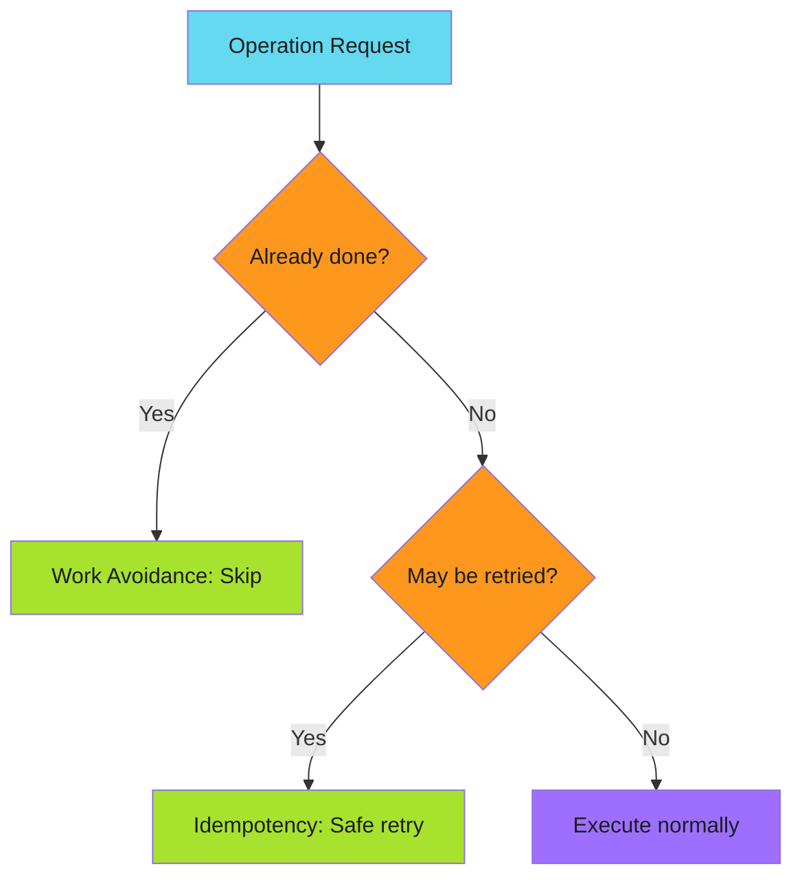

---

#### Quick Reference

| Scenario | Pattern | Reasoning |
| ---------- | --------- | ----------- |
| Re-running same operation | Idempotency | Same result every time |
| Resource already exists | Idempotency | Create-or-update safely |
| Content unchanged | Work Avoidance | Skip unnecessary work |
| Build artifact cached | Work Avoidance | Reuse previous results |

---

#### Key Difference

| Aspect | Idempotency | Work Avoidance |
| -------- | ------------- | ---------------- |
| Goal | Safe to retry | Avoid doing work |
| Mechanism | Deterministic result | Change detection |
| Trade-off | Complexity vs reliability | Cache invalidation vs speed |

---

*Idempotency makes retries safe. Work avoidance makes retries unnecessary.*

### Idempotency

Build automation that survives reruns.

Workflows fail. Networks timeout. APIs return 500s. Rate limits hit. Runners crash. When failure happens, idempotent operations let you click "rerun" and walk away.

> **Definition**
>
>
> An operation is idempotent if running it multiple times produces the same result as running it once.
>

#### Why It Matters

When your workflow fails at step 47 of 50, you have three options:

1. **Rerun from beginning** - Only safe if workflow is idempotent
2. **Manual intervention** - Fix state by hand, then continue
3. **Abandon and start fresh** - Delete partial state, try again later

> **The Scalable Choice**
>
>
> Safe reruns are the only scalable choice. Manual intervention and abandoning runs require human effort, don't scale, and introduce errors.
>

#### In This Section

| Page | Description |
| ------ | ------------- |
| [Pros and Cons](pros-and-cons.md) | Tradeoffs of investing in idempotency |
| [Decision Matrix](decision-matrix.md) | When to invest, when to skip |
| [Implementation Patterns](patterns/index.md) | Five patterns with code examples |
| [Real-World Example](real-world-example.md) | File distribution across 40 repositories |
| [Testing](testing.md) | How to verify idempotency |
| [Cache Considerations](caches.md) | The hidden challenge of cached state |

#### Quick Reference

```bash
### Idempotent: Running twice produces same result
mkdir -p /tmp/mydir    # Creates dir if missing, no-op if exists

### Not idempotent: Running twice fails or creates duplicates
mkdir /tmp/mydir       # Fails if directory exists
```

For CI/CD pipelines, idempotency means:

- Reruns don't create duplicate PRs
- Reruns don't create duplicate commits
- Reruns don't corrupt data
- Partial failures can be recovered by rerunning

### Implementation Patterns

Five patterns for making operations idempotent. Each has tradeoffs; choose based on your constraints.

---

#### Pattern Overview

| Pattern | Best For | Tradeoff |
| --------- | ---------- | ---------- |
| [Check-Before-Act](check-before-act.md) | Creating resources | Race conditions possible |
| [Upsert](upsert.md) | APIs with atomic operations | Not universally available |
| [Force Overwrite](force-overwrite.md) | Content that can be safely replaced | Destructive if misused |
| [Unique Identifiers](unique-identifiers.md) | Natural deduplication | ID logic can be complex |
| [Tombstone Markers](tombstone-markers/index.md) | Multi-step operations | Markers need cleanup |

---

#### Quick Reference

##### [Check-Before-Act](check-before-act.md)

The most common pattern. Check if the target state exists before attempting to create it.

```bash
if git ls-remote --heads origin "$BRANCH" | grep -q "$BRANCH"; then
  git checkout -B "$BRANCH" "origin/$BRANCH"
else
  git checkout -b "$BRANCH"
fi
```

##### [Create-or-Update (Upsert)](upsert.md)

Use APIs or commands that handle both cases atomically.

```bash
gh release create v1.0.0 --notes "Release" || gh release edit v1.0.0 --notes "Release"
```

##### [Force Overwrite](force-overwrite.md)

Don't check, just overwrite. Safe when overwriting with identical content is acceptable.

```bash
git push --force-with-lease origin "$BRANCH"
```

##### [Unique Identifiers](unique-identifiers.md)

Generate deterministic IDs so duplicate operations target the same resource.

```bash
BRANCH="update-$(sha256sum file.txt | cut -c1-8)"
```

##### [Tombstone/Marker Files](tombstone-markers/index.md)

Leave markers indicating operations completed.

```bash
MARKER=".completed-$RUN_ID"
[ -f "$MARKER" ] && exit 0
### Do work...
touch "$MARKER"
```

---

#### Choosing a Pattern

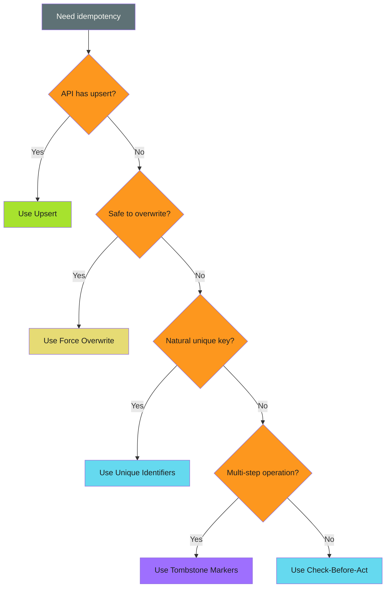

| Scenario | Recommended Pattern |
| ---------- | ------------------- |
| Creating resources (PRs, branches, files) | [Check-Before-Act](check-before-act.md) |
| Updating existing resources | [Upsert](upsert.md) or [Force Overwrite](force-overwrite.md) |
| Operations with natural keys | [Unique Identifiers](unique-identifiers.md) |
| Complex multi-step operations | [Tombstone Markers](tombstone-markers/index.md) |
| API supports atomic operations | [Upsert](upsert.md) |

> **Combine Patterns**
>
>
> Real-world automation often combines multiple patterns. A workflow might use Check-Before-Act for PR creation, Force Overwrite for branch updates, and Unique Identifiers for naming.
>

### Tombstone/Marker Files

Leave a trail so you know where you've been.

---

#### The Pattern

```bash
MARKER=".completed-$OPERATION_ID"

if [ -f "$MARKER" ]; then
  echo "Already completed"
  exit 0
fi

### Do the work...

touch "$MARKER"
```

Create a marker file (or database record) when an operation completes. On rerun, check for the marker and skip if present.

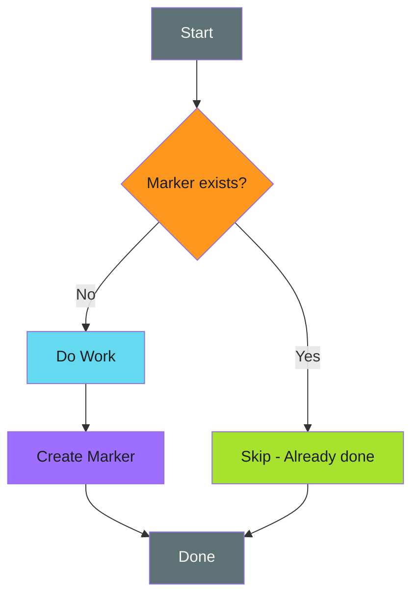

> **Universal Fallback**
>
>
> Tombstone markers work for any operation, even external API calls with no natural idempotency. If you can't use other patterns, markers are always an option.
>

---

#### When to Use

> **Poor Fit**
>
>
> - Simple operations where check-before-act suffices
> - When marker storage is unreliable
> - High-frequency operations (marker overhead adds up)
> - When operation result changes over time (markers become stale)
>

---

#### Examples

##### Basic Marker File

```bash
MARKER="/tmp/.migration-completed-v2"

if [ -f "$MARKER" ]; then
  echo "Migration already completed"
  exit 0
fi

run_database_migration

touch "$MARKER"
echo "Migration completed"
```

##### Run-Scoped Markers

```bash
### Unique per workflow run
MARKER=".done-${GITHUB_RUN_ID}-${GITHUB_RUN_ATTEMPT}"

if [ -f "$MARKER" ]; then
  echo "This run already completed"
  exit 0
fi

perform_deployment

touch "$MARKER"
```

##### Operation-Scoped Markers

```bash
### Track each item in a batch
process_item() {
  local item="$1"
  local marker=".processed-$(echo "$item" | sha256sum | cut -c1-16)"

  if [ -f "$marker" ]; then
    echo "Skipping $item (already processed)"
    return 0
  fi

  do_work_on "$item"

  touch "$marker"
  echo "Processed $item"
}

for item in "${ITEMS[@]}"; do
  process_item "$item"
done
```

##### Markers with Metadata

```bash
MARKER=".completed-$OPERATION"

if [ -f "$MARKER" ]; then
  echo "Completed at: $(cat "$MARKER")"
  exit 0
fi

perform_operation

### Store completion time and details
echo "$(date -Iseconds) by ${GITHUB_ACTOR:-unknown}" > "$MARKER"
```

##### Directory-Based Markers

```bash
### Use directories for atomic marker creation
MARKER_DIR=".markers/$OPERATION_ID"

if [ -d "$MARKER_DIR" ]; then
  echo "Already completed"
  exit 0
fi

perform_operation

mkdir -p "$MARKER_DIR"
echo "$RESULT" > "$MARKER_DIR/result.json"
```

---

#### In This Section

- [CI/CD Examples](ci-cd-examples.md) - GitHub Actions, artifacts, and caches
- [Edge Cases](edge-cases.md) - Gotchas, anti-patterns, and mitigations

---

#### Comparison with Other Patterns

| Aspect | [Check-Before-Act](../check-before-act.md) | [Unique Identifiers](../unique-identifiers.md) | Tombstone Markers |
| -------- | ----------------- | ------------------- | ------------------- |
| Tracks completion | No | No | Yes |
| Works for any operation | No | No | Yes |
| Requires storage | No | No | Yes |
| Can track partial progress | No | No | Yes |
| Cleanup required | No | No | Yes |

---

#### Summary

Tombstone markers are the universal fallback for idempotency.

> **Key Takeaways**
>
>
> 1. **Check marker first** - skip if present
> 2. **Create marker last** - only after success
> 3. **Include context** - operation ID, content hash, timestamp
> 4. **Plan for cleanup** - markers accumulate without maintenance
> 5. **Handle edge cases** - partial completion, stale markers, concurrent access
>

### Work Avoidance

Skip work when the outcome won't change.

> **Detect Before Execute**
>
> Check if work is needed before starting it. Avoid creating PRs for unchanged content, running builds for unchanged code, or processing already-processed items.
>

---

#### Overview

Work avoidance detects when an operation isn't needed and skips it entirely. Unlike [idempotency](../idempotency/index.md) (which makes reruns safe), work avoidance prevents the run from happening at all.

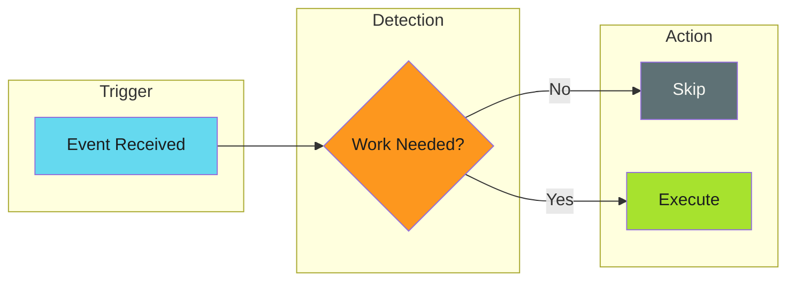

---

#### Work Avoidance vs Idempotency

Both patterns make automation safe to rerun, but they optimize for different things:

| Concern | Idempotency | Work Avoidance |
| ------- | ----------- | -------------- |
| Focus | Safe re-execution | Skipping execution |
| Question | "Can I run this again safely?" | "Should I run this at all?" |
| Resource usage | Uses resources on rerun | Saves resources |
| Implementation | Logic inside operation | Logic before operation |

Best practice: Apply **work avoidance first**, then ensure remaining operations are **idempotent**.

---

#### Techniques

Work avoidance uses different techniques depending on what you're checking:

| Technique | Question | Best For |
| --------- | -------- | -------- |
| [Content Hashing](techniques/content-hashing.md) | "Is the content different?" | File comparisons, config sync |
| [Volatile Field Exclusion](techniques/volatile-field-exclusion.md) | "Did anything meaningful change?" | Version bumps, timestamps |
| [Existence Checks](techniques/existence-checks.md) | "Does it already exist?" | Resource creation (PRs, branches) |
| [Cache-Based Skip](techniques/cache-based-skip.md) | "Is the output already built?" | Build artifacts, dependencies |
| [Queue Cleanup](techniques/queue-cleanup.md) | "Should queued work execute?" | Mutex-locked workflows |

See [Techniques Overview](techniques/index.md) for detailed comparisons and when to use each.

---

#### When to Apply

Work avoidance is valuable when:

- **Distribution workflows** push files to many repositories
- **Release automation** bumps versions without content changes
- **Scheduled jobs** run regardless of whether work exists
- **Monorepo builds** trigger on any change but only need subset builds
- **API synchronization** needs to detect actual drift
- **Mutex-locked workflows** queue identical operations behind a lock

---

#### Anti-Patterns

Common mistakes that undermine work avoidance:

- **Over-aggressive skipping** - Checking existence, not content
- **Ignoring error states** - Trusting markers without validation
- **Stripping too much** - Destroying semantic content with broad patterns
- **Stale cache keys** - Missing inputs that affect output

See [Anti-Patterns](anti-patterns.md) for details and fixes.

---

#### Quick Example

A file distribution workflow that skips version-only changes:

```yaml
- name: Check for meaningful changes
  id: check
  run: |
##    # Strip version line before comparing
    strip_version() {
      sed '/^version:.*# x-release-please-version$/d' "$1"
    }

    SOURCE=$(strip_version "source/CONFIG.md")
    TARGET=$(git show HEAD:CONFIG.md 2>/dev/null | \
      sed '/^version:.*# x-release-please-version$/d' || echo "")

    if [ "$SOURCE" = "$TARGET" ]; then
      echo "skip=true" >> $GITHUB_OUTPUT
    else
      echo "skip=false" >> $GITHUB_OUTPUT
    fi

- name: Distribute file
  if: steps.check.outputs.skip != 'true'
  run: ./distribute.sh
```

This applies [Volatile Field Exclusion](techniques/volatile-field-exclusion.md) to avoid creating PRs for version-only changes.

---

#### Implementation Examples

- [GitHub Actions: Work Avoidance](../../../patterns/github-actions/use-cases/work-avoidance/index.md) - CI/CD implementation patterns
- [File Distribution](../../../patterns/github-actions/use-cases/file-distribution/index.md) - Real-world workflow using these patterns

---

#### Related

- [Idempotency](../idempotency/index.md) - Making operations safe to repeat
- [Graceful Degradation](../../error-handling/graceful-degradation/index.md) - Fallback when detection fails
- [Three-Stage Design](../../architecture/three-stage-design.md) - Workflow structure that enables work avoidance

### Work Avoidance Techniques

Techniques for detecting when work can be safely skipped.

> **Layer Your Checks**
>
> Start with cheap checks (existence), then content hashes, then semantic comparison. Each layer catches different scenarios.
>

---

#### Overview

Each technique answers a specific question:

| Technique | Question | Best For |
| ----------- | ---------- | ---------- |
| [Content Hashing](content-hashing.md) | "Is the content different?" | File comparisons, config sync |
| [Volatile Field Exclusion](volatile-field-exclusion.md) | "Did anything meaningful change?" | Version bumps, timestamps |
| [Existence Checks](existence-checks.md) | "Does it already exist?" | Resource creation (PRs, branches) |
| [Cache-Based Skip](cache-based-skip.md) | "Is the output already built?" | Build artifacts, dependencies |
| [Queue Cleanup](queue-cleanup.md) | "Should queued work execute?" | Mutex-locked workflows |

---

#### Combining Techniques

Techniques can be layered for maximum efficiency:

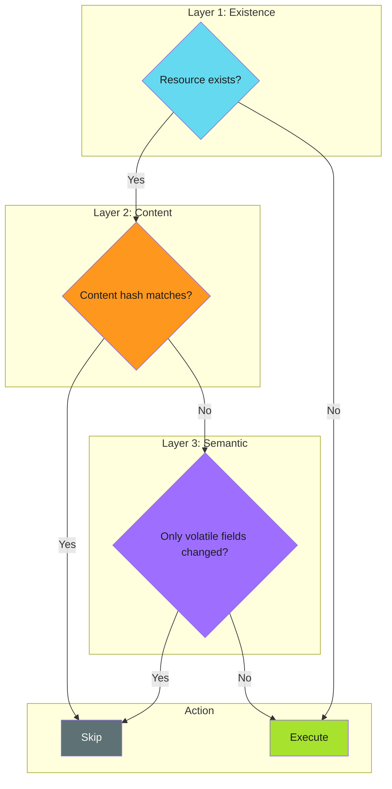

---

#### Choosing a Technique

| Scenario | Recommended Technique |
| ---------- | ---------------------- |
| File distribution with version bumps | [Volatile Field Exclusion](volatile-field-exclusion.md) |
| OCI image rebuilds | [Content Hashing](content-hashing.md) |
| PR/branch creation | [Existence Checks](existence-checks.md) |
| Dependency installation | [Cache-Based Skip](cache-based-skip.md) |
| API state synchronization | [Content Hashing](content-hashing.md) |
| Generated file deployment | [Volatile Field Exclusion](volatile-field-exclusion.md) |
| Idempotent workflows with mutex locks | [Queue Cleanup](queue-cleanup.md) |

---

#### Related

- [Work Avoidance Overview](../index.md) - Pattern introduction
- [Anti-Patterns](../anti-patterns.md) - Common mistakes to avoid

## Error Handling Patterns

Master when to fail fast vs…

Patterns for detecting, reporting, and recovering from failures.

> **Core Principle**
>
> Fail fast on **precondition failures**. Degrade gracefully on **runtime failures**.
>

---

#### Overview

Error handling is about **when** and **how** your automation responds to problems.

| Pattern | When to Use | Strategy |
| --------- | ------------- | ---------- |
| [Fail Fast](fail-fast/index.md) | Invalid input, missing config | Stop immediately, report clearly |
| [Prerequisite Checks](prerequisite-checks/index.md) | Complex preconditions | Validate all upfront before work |
| [Graceful Degradation](graceful-degradation/index.md) | Fallbacks exist | Degrade to safer state, continue |

---

#### Decision Flow

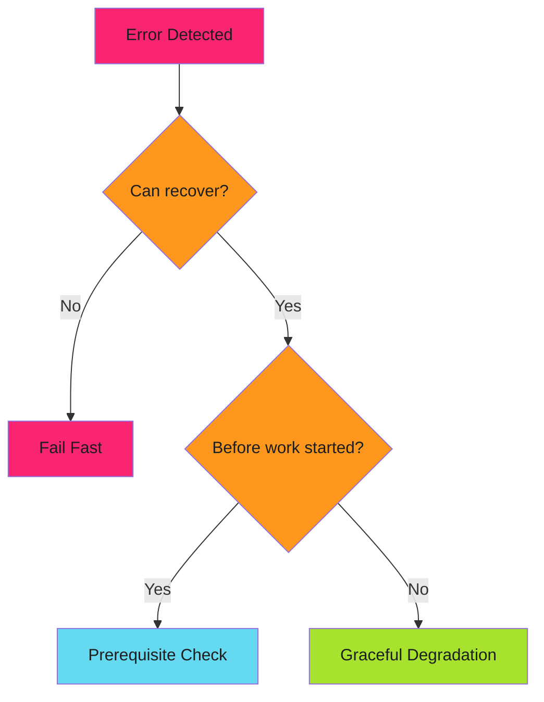

---

#### Quick Reference

| Scenario | Pattern | Reasoning |
| ---------- | --------- | ----------- |
| Missing required config | Fail Fast | Can't continue safely |
| Invalid user input | Fail Fast | User error, report immediately |
| Complex deployment requirements | Prerequisite Checks | Validate tools, access, state |
| API timeout | Graceful Degradation | Retry or use backup |
| Service unavailable | Graceful Degradation | Fall back to alternatives |

---

*Fail fast when you can't recover. Degrade gracefully when you can.*

### Fail Fast

Detect and report problems as early as possible, before they cascade into larger failures.

> **Key Insight**
>
> Fail before you start, not in the middle. Validate preconditions before executing expensive or irreversible operations.
>

---

#### Overview

Fail fast is a design pattern that validates preconditions before executing expensive or irreversible operations. When validation fails, the system immediately reports the error rather than proceeding and failing later in an unpredictable state.

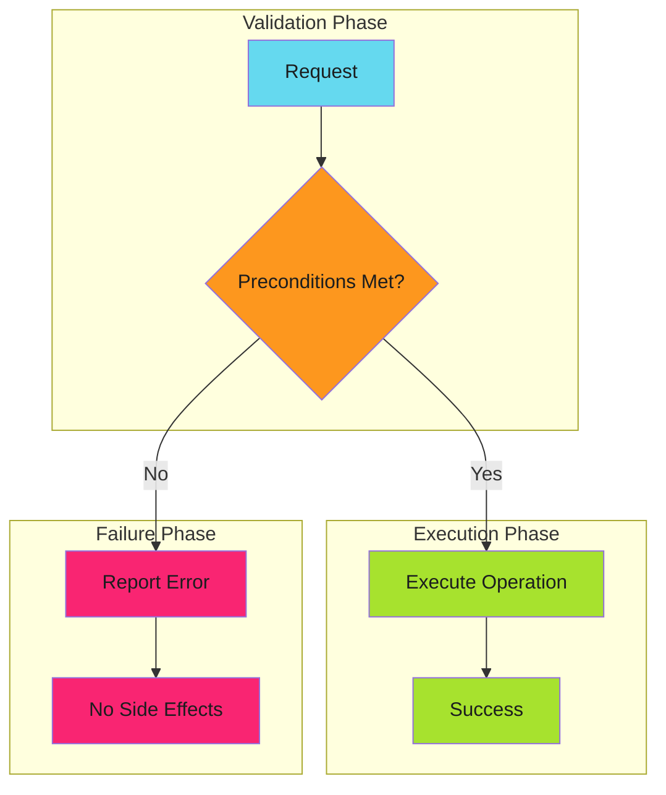

The key insight: **fail before you start, not in the middle**.

---

#### When to Apply

| Scenario | Apply Fail Fast? | Reasoning |
| ---------- | ------------------ | ----------- |
| Invalid user input | Yes | User error, report immediately |
| Missing required config | Yes | Can't continue safely |
| Insufficient permissions | Yes | Operation will fail anyway |
| Resource allocation failure | Yes | Partial allocation is worse |
| Network timeout | No | Use [graceful degradation](../graceful-degradation/index.md) |
| Cache miss | No | Expensive path still works |

**Decision rule**: Fail fast on **precondition failures**. Degrade gracefully on **runtime failures**.

---

#### Real-World Examples

##### GitHub Actions Workflow Validation

```yaml
jobs:
  validate:
    runs-on: ubuntu-latest
    steps:
##      # Fail fast: Check all preconditions before expensive operations
      - name: Validate environment
        run: |
##          # Required secrets
          [ -n "${{ secrets.DEPLOY_TOKEN }}" ] || { echo "::error::DEPLOY_TOKEN not set"; exit 1; }

##          # Required tools
          command -v kubectl >/dev/null || { echo "::error::kubectl not found"; exit 1; }

##          # Required access
          kubectl auth can-i create deployments || { echo "::error::No deploy permission"; exit 1; }

##      # Now safe to proceed with expensive operations
      - name: Deploy
        run: kubectl apply -f manifests/
```

##### Go Function with Precondition Validation

```go
func ProcessOrder(order *Order) error {
    // Fail fast: validate all preconditions upfront
    if order == nil {
        return errors.New("order is nil")
    }
    if order.CustomerID == "" {
        return errors.New("customer ID required")
    }
    if len(order.Items) == 0 {
        return errors.New("order has no items")
    }
    if order.Total <= 0 {
        return errors.New("invalid order total")
    }

    // All preconditions met, safe to proceed
    return processValidOrder(order)
}
```

---

#### Fail Fast vs Graceful Degradation

These patterns are **complementary**, not contradictory:

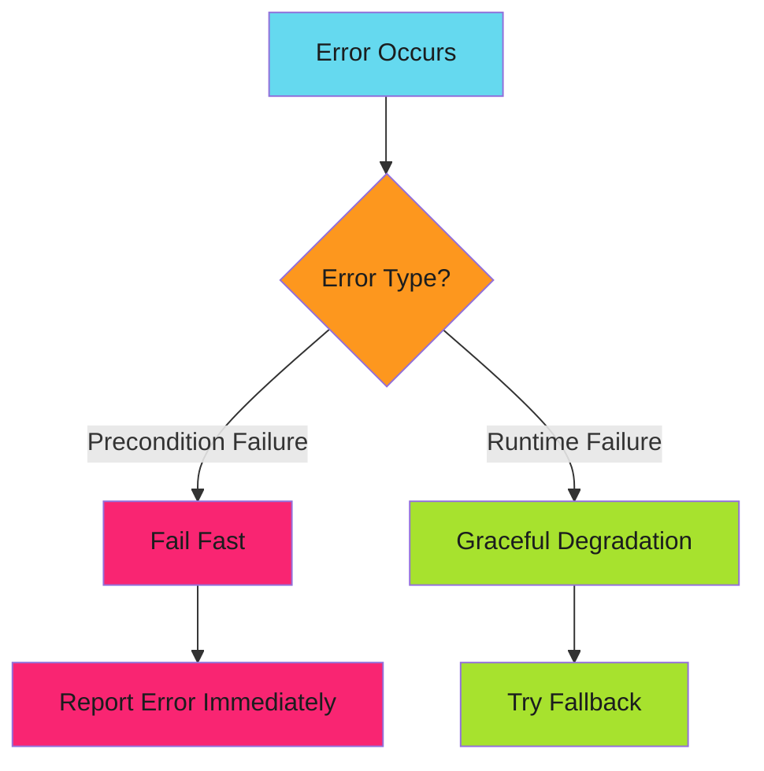

| Error Type | Pattern | Example |
| ------------ | --------- | --------- |
| Missing config | Fail Fast | Can't start without database URL |
| Database timeout | Graceful Degradation | Retry, then use cache |
| Invalid input | Fail Fast | Reject malformed request |
| API unavailable | Graceful Degradation | Use backup endpoint |
| Insufficient permissions | Fail Fast | Don't attempt forbidden operation |
| Rate limited | Graceful Degradation | Exponential backoff |

---

#### Fail Fast Techniques

Comprehensive techniques for implementing fail fast patterns:

##### [Early Termination](techniques/early-termination.md)

Stop execution immediately when errors occur:

- Shell strict mode (`set -euo pipefail`)
- GitHub Actions matrix fail-fast
- Go error propagation
- Circuit breakers

##### [Strict Mode Execution](techniques/strict-mode.md)

Enable strictest validation and error detection:

- Shell/TypeScript/Go strict modes
- Linter enforcement
- Schema validation

##### [Assertion Patterns](techniques/assertions.md)

Validate assumptions and fail if they're wrong:

- Runtime assertions
- Contract validation (pre/post conditions)
- Invariant checks
- Type guards

##### [Error Escalation](techniques/error-escalation.md)

Determine when to throw vs return, panic vs recover:

- Throw vs return error
- Error aggregation vs first-error-wins
- Panic vs recoverable errors
- Exit codes

##### [Timeout Enforcement](techniques/timeouts.md)

Prevent operations from running indefinitely:

- Operation timeouts
- Job timeouts
- Circuit breaker timeouts
- Deadlock detection

---

#### Anti-Patterns

##### 1. Late Validation

Validating after side effects have occurred.

```go
// Bad: creates file before validating
func ProcessFile(path string, data []byte) error {
    f, err := os.Create(path)
    if err != nil {
        return err
    }
    defer f.Close()

    if len(data) == 0 {
        return errors.New("empty data")  // File already created!
    }
    return f.Write(data)
}

// Good: validate before side effects
func ProcessFile(path string, data []byte) error {
    if len(data) == 0 {
        return errors.New("empty data")
    }

    f, err := os.Create(path)
    if err != nil {
        return err
    }
    defer f.Close()

    return f.Write(data)
}
```

##### 2. Swallowing Errors

Continuing despite failures.

```yaml
### Bad: ignores validation failure
- name: Validate and deploy
  run: |
    ./validate.sh || true  # Swallowed!
    ./deploy.sh

### Good: fail on validation error
- name: Validate
  run: ./validate.sh

- name: Deploy
  run: ./deploy.sh
```

##### 3. Partial Execution

Executing some operations before checking all preconditions.

```go
// Bad: partial execution on failure
func TransferFunds(from, to string, amount int) error {
    if err := debit(from, amount); err != nil {
        return err
    }
    // What if 'to' account doesn't exist?
    if err := credit(to, amount); err != nil {
        return err  // Money debited but not credited!
    }
    return nil
}

// Good: validate everything first
func TransferFunds(from, to string, amount int) error {
    // Validate all preconditions
    if !accountExists(from) {
        return errors.New("source account not found")
    }
    if !accountExists(to) {
        return errors.New("destination account not found")
    }
    if balance(from) < amount {
        return errors.New("insufficient funds")
    }

    // Now safe to execute
    return executeTransfer(from, to, amount)
}
```

##### 4. Vague Error Messages

Failing fast but not explaining why.

```bash
### Bad: unhelpful error
[ -f "$CONFIG" ] || exit 1

### Good: actionable error message
[ -f "$CONFIG" ] || { echo "Config file not found: $CONFIG. Create it from config.example.yml"; exit 1; }
```

---

#### Implementation Checklist

Before implementing fail fast:

- [ ] **Identify all preconditions** for the operation
- [ ] **Order validations** by cost (cheapest first)
- [ ] **Validate before side effects** (file creation, API calls, etc.)
- [ ] **Provide actionable error messages** that help users fix the problem
- [ ] **Return appropriate error codes** (HTTP 400 vs 500, exit 1 vs 2)
- [ ] **Log validation failures** for debugging
- [ ] **Test invalid inputs** explicitly in your test suite

---

#### Relationship to Other Patterns

| Pattern | How Fail Fast Applies |
| --------- | ---------------------- |
| [Graceful Degradation](../graceful-degradation/index.md) | Complementary: fail fast on preconditions, degrade on runtime |
| [Prerequisite Checks](../prerequisite-checks/index.md) | Specialized form of fail fast for complex preconditions |
| [Idempotency](../../efficiency/idempotency/index.md) | Fail fast prevents partial state that breaks idempotency |

---

#### Further Reading

- [Techniques Overview](techniques/early-termination.md) - Comprehensive fail fast techniques
- [Graceful Degradation](../graceful-degradation/index.md) - The complementary pattern for runtime failures
- [Prerequisite Checks](../prerequisite-checks/index.md) - Structured approach to precondition validation

### Graceful Degradation

When the optimal path fails, fall back to progressively more expensive but reliable alternatives.

> **Key Insight**
>
> Degrade performance, not availability. Every operation should have a guaranteed fallback that always succeeds.
>

---

#### Overview

Graceful degradation is a design principle that ensures systems continue operating when components fail. Rather than crashing or returning errors, the system automatically falls back to slower but working alternatives.

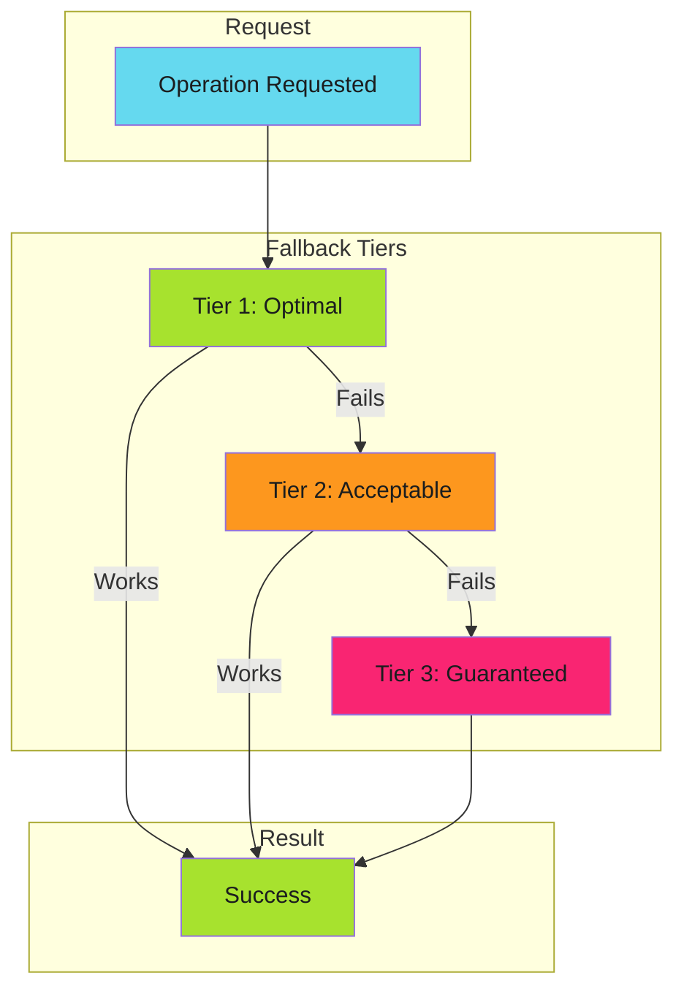

The key insight: **degrade performance, not availability**.

---

#### The Tiered Fallback Pattern

Every graceful degradation implementation follows this structure:

| Tier | Characteristics | Example |
| ------ | ----------------- | --------- |
| **Tier 1: Optimal** | Fast, cheap, preferred | Volume mount read |
| **Tier 2: Acceptable** | Slower, costlier, reliable | API call |
| **Tier 3: Guaranteed** | Expensive but always works | Full rebuild |

Each tier must:

1. **Detect failure** of the previous tier
2. **Attempt its operation** independently
3. **Report which tier succeeded** (observability)

---

#### Real-World Examples

##### Cache Access Pattern

From [From 5 Seconds to 5 Milliseconds](../../../blog/posts/2025-11-29-from-5-seconds-to-5-milliseconds.md):

```text
Volume Mount → API Call → Rebuild Cache
    1-5ms        50ms        5000ms
```

```yaml
### Kubernetes volume mount with optional flag
volumes:
  - name: cache-volume
    configMap:
      name: deployment-cache
      optional: true  # Tier 1 can fail gracefully
```

```go
func GetDeployments(image string) ([]Deployment, error) {
    // Tier 1: Try volume mount
    if data, err := os.ReadFile("/etc/cache/deployments.json"); err == nil {
        return parseDeployments(data, image)
    }

    // Tier 2: Try API call
    if data, err := k8s.GetConfigMap("deployment-cache"); err == nil {
        return parseDeployments(data, image)
    }

    // Tier 3: Rebuild from cluster scan
    return scanClusterForImage(image)
}
```

##### CI/CD Dependency Resolution

```text
Artifact Cache → Dependency Cache → Fresh Install
    seconds          minutes          minutes+
```

```yaml
- uses: actions/cache@v4
  id: artifact-cache
  with:
    path: dist/
    key: build-${{ hashFiles('src/**') }}

- uses: actions/cache@v4
  if: steps.artifact-cache.outputs.cache-hit != 'true'
  id: dep-cache
  with:
    path: node_modules/
    key: deps-${{ hashFiles('package-lock.json') }}

- name: Install dependencies
  if: steps.dep-cache.outputs.cache-hit != 'true'
  run: npm ci

- name: Build
  if: steps.artifact-cache.outputs.cache-hit != 'true'
  run: npm run build
```

##### API Resilience

```text
Primary Endpoint → Secondary Endpoint → Cached Response → Static Fallback
```

##### Authentication

```text
SSO → API Token → Service Account → Anonymous (read-only)
```

---

#### Graceful Degradation vs Fail Fast

These patterns are **complementary**, not contradictory:

| Scenario | Pattern | Reasoning |
| ---------- | --------- | ----------- |
| **Precondition not met** | Fail Fast | Don't waste resources on doomed operations |
| **Runtime component fails** | Graceful Degradation | Continue with fallback |
| **Invalid input** | Fail Fast | User error, report immediately |
| **Network timeout** | Graceful Degradation | Infrastructure issue, retry/fallback |
| **Missing required config** | Fail Fast | Can't continue safely |
| **Cache miss** | Graceful Degradation | Expensive path still works |

**Decision rule**: Fail fast on **precondition failures**. Degrade gracefully on **runtime failures**.

---

#### Anti-Patterns

##### 1. Silent Degradation

Degrading without logging or alerting means you won't know when Tier 1 is broken.

```go
// Bad: silent fallback
func getData() []byte {
    if data, _ := cache.Get(); data != nil {
        return data
    }
    return fetchFromAPI()  // No indication we're in degraded mode
}

// Good: observable fallback
func getData() []byte {
    if data, err := cache.Get(); err == nil {
        metrics.CacheHit()
        return data
    }
    metrics.CacheMiss()
    log.Warn("cache miss, falling back to API")
    return fetchFromAPI()
}
```

##### 2. No Guaranteed Tier

Every chain needs a final tier that **always succeeds**.

```go
// Bad: can fail completely
func getConfig() (*Config, error) {
    if cfg := cache.Get(); cfg != nil {
        return cfg, nil
    }
    return api.FetchConfig()  // What if API is also down?
}

// Good: guaranteed fallback
func getConfig() *Config {
    if cfg := cache.Get(); cfg != nil {
        return cfg
    }
    if cfg, err := api.FetchConfig(); err == nil {
        return cfg
    }
    return DefaultConfig()  // Always works
}
```

##### 3. Expensive Default Path

Using Tier 3 as the happy path defeats the purpose.

```yaml
### Bad: always does full install
- run: npm ci
- uses: actions/cache/save@v4
  with:
    path: node_modules/

### Good: cache-first approach
- uses: actions/cache@v4
  id: cache
  with:
    path: node_modules/
    key: deps-${{ hashFiles('package-lock.json') }}

- if: steps.cache.outputs.cache-hit != 'true'
  run: npm ci
```

##### 4. No Observability

You need to know:

- Which tier is serving traffic
- How often fallbacks occur
- Latency per tier

```yaml
- name: Report cache tier
  run: |
    if [ "${{ steps.mount-cache.outcome }}" = "success" ]; then
      echo "cache_tier=mount" >> metrics.txt
    elif [ "${{ steps.api-cache.outcome }}" = "success" ]; then
      echo "cache_tier=api" >> metrics.txt
    else
      echo "cache_tier=rebuild" >> metrics.txt
    fi
```

---

#### Implementation Checklist

Before implementing graceful degradation:

- [ ] **Define all tiers** before writing code
- [ ] **Identify the guaranteed tier** that always succeeds
- [ ] **Instrument each tier** with metrics/logs
- [ ] **Alert on tier shifts** (e.g., Tier 1 failure rate > 5%)
- [ ] **Test fallback paths** in CI, not just production
- [ ] **Document expected latencies** for each tier
- [ ] **Set SLOs per tier** (Tier 1: p99 < 10ms, Tier 2: p99 < 500ms)

---

#### Relationship to Other Patterns

| Pattern | How Graceful Degradation Applies |
| --------- | ---------------------------------- |
| [Caching](../../efficiency/idempotency/caches.md) | Fallback tiers when cache misses |
| [Work Avoidance](../../efficiency/work-avoidance/index.md) | When detection fails, do the work anyway |
| [Idempotency](../../efficiency/idempotency/index.md) | Safe retries as fallback mechanism |
| [Fail Fast](../fail-fast/index.md) | Complementary: fail fast on preconditions, degrade on runtime |
| [Error Handling](../../../patterns/github-actions/actions-integration/error-handling/index.md) | Recovery strategy selection |

---

#### Further Reading

- [From 5 Seconds to 5 Milliseconds](../../../blog/posts/2025-11-29-from-5-seconds-to-5-milliseconds.md) - The cache optimization story that demonstrates this pattern
- [Cache Considerations](../../efficiency/idempotency/caches.md) - Cache-resilient idempotency strategies

### Prerequisite Checks

Validate all preconditions before executing expensive or irreversible operations.

> **Key Insight**
>
> Check everything, then do everything. Consolidate validation into a dedicated phase before any work begins.
>

---

#### Overview

Prerequisite checks are a structured approach to [fail fast](../fail-fast/index.md) validation. Instead of scattering validation throughout code, you consolidate all precondition checks into a dedicated phase that runs before any work begins.

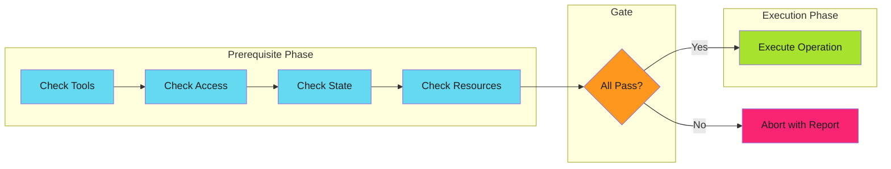

The key insight: **check everything, then do everything**.

---

#### Categories of Prerequisites

| Category | What to Check | Example | Guide |
| ---------- | --------------- |---------| ------- |
| **Environment** | Required tools and variables | `kubectl`, `$DATABASE_URL` | [Environment](checks/environment.md) |
| **Access** | Permissions are granted | API tokens, RBAC roles | [Permissions](checks/permissions.md) |
| **State** | System is in expected state | Resource exists, not locked | [State](checks/state.md) |
| **Input** | Inputs are valid | Required fields, formats | [Input](checks/input.md) |
| **Dependencies** | Dependencies are ready | Upstream jobs, services | [Dependencies](checks/dependencies.md) |

---

#### Quick Example

```yaml
### GitHub Actions prerequisite check
- name: Validate prerequisites
  run: |
    errors=()

##    # Environment
    [[ -n "${{ secrets.DEPLOY_TOKEN }}" ]] || errors+=("DEPLOY_TOKEN not set")

##    # Tools
    command -v kubectl >/dev/null || errors+=("kubectl not installed")

##    # Permissions
    kubectl auth can-i create deployments -n production || errors+=("No deploy permission")

##    # State
    kubectl get namespace production >/dev/null || errors+=("Namespace missing")

##    # Report
    if [ ${#errors[@]} -gt 0 ]; then
      echo "::error::Prerequisite check failed"
      printf '%s\n' "${errors[@]}"
      exit 1
    fi

    echo "All prerequisites met"
```

---

#### Check Categories

##### [Environment Validation](checks/environment.md)

Check that the environment has everything needed before starting work:

- Required environment variables
- Required tools installed
- Network connectivity

##### [Permission Checks](checks/permissions.md)

Verify access rights before attempting operations:

- API token scopes
- GitHub App permissions
- Kubernetes RBAC
- Cloud IAM roles

##### [State Preconditions](checks/state.md)

Validate system state before operations:

- Resource existence
- No naming conflicts
- Service health
- Branch exists

##### [Input Validation](checks/input.md)

Validate all inputs before processing:

- Required inputs provided
- Format validation
- Cross-field validation

##### [Dependency Checks](checks/dependencies.md)

Verify dependencies are ready:

- Upstream jobs succeeded
- Required artifacts available
- External services reachable
- API rate limits

---

#### Implementation Guide

See [Implementation Patterns](implementation.md) for:

- Check ordering strategy (cost-based)
- Implementation patterns (fail-first vs collect-all vs structured)
- Common CI/CD prerequisites checklist
- Anti-patterns to avoid

---

#### Implementation Checklist

Before implementing prerequisite checks:

- [ ] **List all prerequisites** for the operation
- [ ] **Categorize by type** (tools, access, state, resources, config)
- [ ] **Order by cost** (cheapest first)
- [ ] **Make checks read-only** (no side effects)
- [ ] **Provide actionable errors** (what failed, how to fix)
- [ ] **Collect all errors** (don't stop at first failure, unless fast feedback required)
- [ ] **Test prerequisite failures** explicitly
- [ ] **Document prerequisites** for operators

---

#### When to Apply

| Scenario | Apply Prerequisite Checks? | Reasoning |
| ---------- | ---------------------------- | ----------- |
| Kubernetes deployment | Yes | Check cluster access, namespace, resources |
| GitHub Actions workflow | Yes | Check secrets, tools, permissions |
| Database migration | Yes | Check connectivity, schema version, backup |
| API request handling | Depends | Check inputs yes, runtime state no |
| File processing | Depends | Check file exists yes, content format no |

**Decision rule**: Use prerequisite checks for **validation you can do upfront**, not validation that requires starting the operation.

---

#### Relationship to Other Patterns

| Pattern | How Prerequisite Checks Applies |
| --------- | -------------------------------- |
| [Fail Fast](../fail-fast/index.md) | Prerequisite checks are structured fail-fast validation |
| [Graceful Degradation](../graceful-degradation/index.md) | Prerequisites determine if graceful degradation is even possible |
| [Idempotency](../../efficiency/idempotency/index.md) | Check-before-act is a prerequisite pattern |
| [Work Avoidance](../../efficiency/work-avoidance/index.md) | Prerequisites can include "work already done" checks |

---

#### Further Reading

- [Implementation Patterns](implementation.md) - Check ordering, patterns, anti-patterns
- [Environment Checks](checks/environment.md) - Tools, variables, connectivity
- [Permission Checks](checks/permissions.md) - Tokens, RBAC, IAM
- [State Checks](checks/state.md) - Resources, conflicts, health
- [Input Validation](checks/input.md) - Required, format, cross-field
- [Dependency Checks](checks/dependencies.md) - Jobs, artifacts, services
- [Fail Fast](../fail-fast/index.md) - The broader pattern prerequisite checks implement
- [Error Handling](../index.md) - When to fail vs degrade gracefully

## Github Actions

### Actions Integration

This guide explains how to integrate your GitHub Core App with GitHub Actions
workflows for organization-level automation.

> **What You'll Learn**
>
> Generate short-lived tokens, use them with GitHub CLI and APIs, implement common workflow patterns, and handle errors gracefully.
>

#### Prerequisites

Before integrating, ensure you have:

1. **Core App created and installed** - See [GitHub App Setup](../../../secure/github-apps/index.md)
2. **Secrets configured** - `CORE_APP_ID` and `CORE_APP_PRIVATE_KEY` stored in GitHub
3. **Required permissions** - App has permissions for your automation tasks

#### Authentication Methods

GitHub Apps support three authentication methods, each serving different use cases:

| Method | Scope | Expiration | Primary Use Case |
|--------|-------|------------|------------------|
| **[JWT](jwt-authentication/index.md)** | App-level | 10 minutes | Installation discovery, app metadata, bootstrapping |
| **[Installation Tokens](token-generation/index.md)** | Repository/Org | 1 hour | Repository operations, API access, automation |
| **[OAuth](oauth-authentication/index.md)** | User context | Configurable | User-specific operations, web flows |

> **Which authentication method should I use?**
>
>
> - **Most workflows** → Installation Tokens (via `actions/create-github-app-token`)
> - **App management** → JWT (list installations, app configuration)
> - **User operations** → OAuth (actions on behalf of a user)
>
> See the [Authentication Decision Guide](../../../secure/github-apps/authentication-decision-guide.md) for detailed selection criteria.
>

#### What's Covered

This section walks through the complete integration lifecycle:

**Authentication Methods:**

- [JWT Authentication](jwt-authentication/index.md) - App-level authentication for installation discovery and management
- [Installation Tokens](token-generation/index.md) - Generate short-lived tokens from Core App credentials
- [OAuth Authentication](oauth-authentication/index.md) - User-context authentication for web and device flows
- [Token Lifecycle](token-lifecycle/index.md) - Token expiration, refresh strategies, and caching patterns

**Integration Patterns:**

- [Using Tokens](using-tokens.md) - Integrate tokens with GitHub CLI, Git, and APIs
- [Workflow Patterns](token-generation/workflow-patterns.md) - Common automation patterns
- [Token Validation](token-validation.md) - Verify token scope and permissions
- [Workflow Permissions](workflow-permissions.md) - Configure workflow-level permissions

**Operations:**

- [Error Handling](error-handling/index.md) - Handle authentication errors and token expiration
- [Security Best Practices](security-best-practices.md) - Keep tokens secure
- [Troubleshooting](troubleshooting.md) - Debug common issues
- [Performance Optimization](performance-optimization.md) - Optimize for speed

#### References

- [actions/create-github-app-token](https://github.com/actions/create-github-app-token)
- [GitHub Actions Permissions](https://docs.github.com/en/actions/security-guides/automatic-token-authentication)
- [GitHub CLI Manual](https://cli.github.com/manual/)
- [GitHub GraphQL API](https://docs.github.com/en/graphql)
- [GitHub Core App Setup](../../../secure/github-apps/index.md)

### Error Handling

Robust error handling prevents workflow failures, reduces debugging time, and improves automation reliability. Handle token expiration, permission errors, and rate limits with retry strategies and actionable error messages.

> **Don't Fail Silently**
>
> Always check for failures and provide actionable error messages. Silent failures waste hours of debugging.
>

#### Overview

Error handling for GitHub App tokens addresses:

- **Token expiration (401)** - Expired tokens after 1 hour
- **Permission errors (403)** - Missing app permissions or installation scopes
- **Rate limits (429)** - API usage limits and retry strategies
- **Network failures** - Transient connectivity issues
- **Validation errors (422)** - Invalid request payloads

> **Error Handling Strategy**
>
>
> 1. **Detect** - Identify error type from HTTP status codes
> 2. **Classify** - Determine if error is retryable
> 3. **Retry** - Use exponential backoff for transient errors
> 4. **Escalate** - Provide actionable messages for permanent failures
>

#### Token Authentication Error Flow

```mermaid
flowchart TD
    A["API Call"] --> B{"HTTP Status"}

    B -->|"200 OK"| C["Success"]
    B -->|"401 Unauthorized"| D["Token Expired"]
    B -->|"403 Forbidden"| E["Permission Error"]
    B -->|"429 Rate Limited"| F["Rate Limit"]
    B -->|"5xx Server Error"| G["Transient Error"]

    D --> D1["Refresh Token"]
    D1 --> D2["Retry Request"]
    D2 --> B

    E --> E1{"Installation<br/>Exists?"}
    E1 -->|"No"| E2["Install App"]
    E1 -->|"Yes"| E3["Grant Permissions"]
    E2 --> H["Configuration Required"]
    E3 --> H

    F --> F1["Check Headers"]
    F1 --> F2["Wait for Reset"]
    F2 --> B

    G --> G1["Exponential Backoff"]
    G1 --> G2{"Max Retries?"}
    G2 -->|"No"| B
    G2 -->|"Yes"| I["Fail"]

    %% Ghostty Hardcore Theme
    style A fill:#515354,stroke:#ccccc7,stroke-width:2px,color:#ccccc7
    style B fill:#fd971e,stroke:#e6db74,stroke-width:2px,color:#1b1d1e
    style C fill:#a7e22e,stroke:#a7e22e,stroke-width:2px,color:#1b1d1e
    style D fill:#f92572,stroke:#ff669d,stroke-width:2px,color:#1b1d1e
    style E fill:#f92572,stroke:#ff669d,stroke-width:2px,color:#1b1d1e
    style F fill:#9e6ffe,stroke:#9e6ffe,stroke-width:2px,color:#1b1d1e
    style G fill:#66d9ef,stroke:#66d9ef,stroke-width:2px,color:#1b1d1e
    style I fill:#f92572,stroke:#ff669d,stroke-width:2px,color:#1b1d1e
    style H fill:#fd971e,stroke:#e6db74,stroke-width:2px,color:#1b1d1e
    style D1 fill:#515354,stroke:#ccccc7,stroke-width:1px,color:#ccccc7
    style D2 fill:#515354,stroke:#ccccc7,stroke-width:1px,color:#ccccc7
    style E1 fill:#515354,stroke:#ccccc7,stroke-width:1px,color:#ccccc7
    style E2 fill:#515354,stroke:#ccccc7,stroke-width:1px,color:#ccccc7
    style E3 fill:#515354,stroke:#ccccc7,stroke-width:1px,color:#ccccc7
    style F1 fill:#515354,stroke:#ccccc7,stroke-width:1px,color:#ccccc7
    style F2 fill:#515354,stroke:#ccccc7,stroke-width:1px,color:#ccccc7
    style G1 fill:#515354,stroke:#ccccc7,stroke-width:1px,color:#ccccc7
    style G2 fill:#515354,stroke:#ccccc7,stroke-width:1px,color:#ccccc7
```

#### Token Expiration (401 Errors)

##### Handle Token Generation Failures

```yaml
- name: Generate token
  id: app_token
  uses: actions/create-github-app-token@v2
  with:
    app-id: ${{ secrets.CORE_APP_ID }}
    private-key: ${{ secrets.CORE_APP_PRIVATE_KEY }}
    owner: adaptive-enforcement-lab
  continue-on-error: true

- name: Check token generation
  if: steps.app_token.outcome == 'failure'
  run: |
    echo "::error::Token generation failed"
    echo "::error::Check:"
    echo "  - App ID is correct: ${{ secrets.CORE_APP_ID != '' }}"
    echo "  - Private key is configured"
    echo "  - App is installed on: adaptive-enforcement-lab"
    echo "  - Installation is not suspended"
    exit 1
```

**Common causes**:

- Invalid or missing App ID
- Malformed private key (check newlines, PEM format)
- App not installed on target organization
- Installation suspended or disabled

##### Detect Expired Tokens

```yaml
- name: API call with expiration handling
  env:
    GH_TOKEN: ${{ steps.app_token.outputs.token }}
  run: |
##    # Capture both stdout and stderr
    if ! response=$(gh api user --jq .login 2>&1); then
      if echo "$response" | grep -q "401\|Bad credentials"; then
        echo "::error::Token expired or invalid"
        echo "::error::Token age may exceed 1 hour"
        exit 1
      else
        echo "::error::API call failed: $response"
        exit 1
      fi
    fi

    echo "Authenticated as: $response"
```

##### Auto-Refresh with Retry

```yaml
- name: API call with auto-refresh on expiration
  env:
    APP_ID: ${{ secrets.CORE_APP_ID }}
    PRIVATE_KEY: ${{ secrets.CORE_APP_PRIVATE_KEY }}
  run: |
##    # Function to generate fresh token
    generate_token() {
      gh api /app/installations \
        --jq '.[0].id' | xargs -I {} \
        gh api /app/installations/{}/access_tokens \
        -X POST --jq .token
    }

##    # Function to call API with auto-refresh on 401
    api_call_with_refresh() {
      local endpoint="$1"
      local max_attempts=2
      local attempt=1

      while [ $attempt -le $max_attempts ]; do
##        # Attempt API call
        if response=$(gh api "$endpoint" 2>&1); then
          echo "$response"
          return 0
        fi

##        # Check if error is 401 (expired token)
        if echo "$response" | grep -q "401\|Bad credentials"; then
          if [ $attempt -lt $max_attempts ]; then
            echo "::warning::Token expired, refreshing (attempt $attempt/$max_attempts)"

##            # Refresh token
            export GH_TOKEN=$(generate_token)
            echo "::notice::Token refreshed successfully"

            ((attempt++))
            sleep 2
          else
            echo "::error::Failed to refresh token after $max_attempts attempts"
            return 1
          fi
        else
##          # Non-401 error - fail immediately
          echo "::error::API call failed: $response"
          return 1
        fi
      done
    }

##    # Initial token
    export GH_TOKEN=$(generate_token)

##    # Make API calls with auto-refresh
    api_call_with_refresh "user"
    api_call_with_refresh "orgs/adaptive-enforcement-lab/repos"
```

> **Use actions/create-github-app-token Auto-Refresh**
>
>
> The `actions/create-github-app-token@v2` action automatically refreshes tokens in long-running jobs. Manual refresh is only needed for custom token generation. See [Token Lifecycle Management](../token-lifecycle/index.md).
>

#### Permission Errors (403 Forbidden)

##### Detect Permission Issues

```yaml
- name: Operation with permission validation
  env:
    GH_TOKEN: ${{ steps.app_token.outputs.token }}
  run: |
    endpoint="/repos/adaptive-enforcement-lab/example-repo/collaborators"

##    # Attempt operation and capture error
    if ! response=$(gh api "$endpoint" 2>&1); then
      if echo "$response" | grep -q "403\|Forbidden"; then
        echo "::error::Permission denied for: $endpoint"
        echo "::error::Required permissions:"
        echo "  - App permission: 'members' (read)"
        echo "  - Installation scope: 'adaptive-enforcement-lab/example-repo'"
        echo ""
        echo "::error::Verify app configuration at:"
        echo "  https://github.com/organizations/adaptive-enforcement-lab/settings/apps"
        exit 1
      else
        echo "::error::API call failed: $response"
        exit 1
      fi
    fi

    echo "$response"
```

##### Permission Error Diagnostic

```yaml
- name: Diagnose permission error
  if: failure()
  env:
    GH_TOKEN: ${{ steps.app_token.outputs.token }}
  run: |
    echo "::group::Diagnostic Information"

##    # Check token validity
    echo "Token status:"
    if gh api user --jq '.login' 2>/dev/null; then
      echo "  ✅ Token is valid"
    else
      echo "  ❌ Token is invalid or expired"
    fi

##    # Check installation access
    echo ""
    echo "Installation scope:"
    gh api /app/installations \
      --jq '.[] | "  - \(.account.login) (ID: \(.id))"'

##    # Attempt to identify missing permission
    echo ""
    echo "::error::Common 403 causes:"
    echo "  1. App lacks required repository/organization permissions"
    echo "  2. Installation doesn't include target repository"
    echo "  3. Repository is private but app has 'public_only' access"
    echo "  4. Organization requires approval for app installation"

    echo "::endgroup::"
```

##### Common Permission Patterns

| Operation | Required Permission | Scope |
|----------|-------------------|-------|
| Read repository contents | `contents: read` | Repository |
| Create issues | `issues: write` | Repository |
| Create pull requests | `pull_requests: write` | Repository |
| Manage deployments | `deployments: write` | Repository |
| Read organization members | `members: read` | Organization |
| Manage repository settings | `administration: write` | Repository |

> **Organization vs Repository Permissions**
>
>
> Some permissions require **organization-level** access. Installing the app on individual repositories won't grant these permissions.
>

#### Rate Limiting (429 Errors)

### File Distribution

Automated file distribution across multiple repositories using GitHub Actions and GitHub Apps.

> **Pattern Overview**
>
> A three-stage workflow that discovers targets, distributes files in parallel, and reports results. Idempotent design ensures safe reruns.
>

#### Problem

Maintaining consistent files (documentation, configuration, policies) across many repositories requires:

- Manual updates to each repository
- Tracking which repos need updates
- Creating PRs and waiting for reviews
- Ensuring nothing gets missed

#### Solution

An automated distribution workflow that:

- Monitors changes to source files in a central repository
- Automatically distributes updates to target repositories
- Creates or updates pull requests in each target
- Provides visibility through workflow summaries

#### Patterns Applied

This workflow implements patterns from the [Developer Guide](../../../../patterns/index.md):

| Pattern | Purpose |
| ------- | ------- |
| [Three-Stage Design](../../../../patterns/architecture/three-stage-design.md) | Separates discovery, execution, and reporting |
| [Matrix Distribution](../../../../patterns/architecture/matrix-distribution/index.md) | Parallelizes operations with conditional logic |
| [Idempotency](../../../../patterns/efficiency/idempotency/index.md) | Ensures safe reruns after partial failures |
| [Work Avoidance](../../../../patterns/efficiency/work-avoidance/index.md) | Skips version-only changes |

#### Implementation Guide

##### Core Workflow

- [Architecture](architecture.md) - Three-stage workflow overview
- [Stage 1: Discovery](discovery-stage.md) - Query organization for target repositories
- [Stage 2: Distribution](distribution-stage.md) - Parallel distribution to each repository
- [Stage 3: Summary](summary-stage.md) - Aggregate and display results

##### Configuration

- [Workflow Configuration](workflow-config.md) - Triggers and permissions
- [Supporting Scripts](supporting-scripts.md) - Branch preparation and helper scripts

##### Reliability

- [Idempotency](idempotency.md) - Safe re-execution guarantees
- [Error Handling](error-handling.md) - Failure strategies and reporting
- [Troubleshooting](troubleshooting.md) - Common issues and solutions

##### Extensions

- [Extension Patterns](extension-patterns.md) - Multi-file, conditional, and template distribution

##### Operations

- [Performance](performance.md) - Parallel processing and rate limits
- [Monitoring](monitoring.md) - Workflow summaries and metrics
- [Security](security.md) - Token scope and audit trails

#### Best Practices

1. **Start Small** - Test with 2-3 repositories before full rollout
2. **Monitor First Run** - Watch logs carefully on initial deployment
3. **Gradual Rollout** - Increase `max-parallel` gradually
4. **Clear Documentation** - Document what files are distributed and why
5. **Review Process** - Ensure PRs are reviewed before merging

#### Prerequisites

- [GitHub App Setup](../../../../secure/github-apps/index.md) - Organization-level GitHub App
- [Actions Integration](../../actions-integration/index.md) - Token generation in workflows

#### External References

- [GitHub Actions Matrix Strategy](https://docs.github.com/en/actions/using-jobs/using-a-matrix-for-your-jobs)
- [GitHub GraphQL API](https://docs.github.com/en/graphql)

### Installation Token Generation

Installation tokens provide automated, secure access to repositories where your GitHub App is installed. Use installation tokens for GitHub Actions workflows, CI/CD automation, and cross-repository operations.

> **When to Use Installation Tokens**
>
>
> Installation tokens are for **automated repository operations**. Use JWT for app-level operations and OAuth for user-attributed actions.
>

#### Overview

Installation tokens authenticate your GitHub App for specific repository operations. They enable:

- **Cross-repository automation** - Operate across multiple repositories
- **Organization-wide workflows** - Access all repositories in your organization
- **Automated processes** - No user interaction required
- **Scoped permissions** - Limit access to specific repositories
- **Short-lived credentials** - 1-hour expiration for security

> **Token Limitations**
>
>
> - 1-hour expiration (automatic refresh available)
> - Requires GitHub App installation on target repositories
> - Permissions limited to app's configured scope
> - Cannot perform user-attributed actions
>

#### Token Scoping Decision

```mermaid
flowchart TD
    A["What repositories<br/>need access?"] --> B{"Access pattern?"}

    B -->|"All org repos<br/>(flexible scope)"| C["Organization-Scoped Token"]
    B -->|"Specific repos only<br/>(minimal scope)"| D["Repository-Scoped Token"]
    B -->|"Current repo only<br/>(workflow repo)"| E["Default Token"]

    C --> C1["Use owner parameter"]
    C --> C2["Access all installed repos"]
    C --> C3["Best for dynamic workflows"]

    D --> D1["Use repositories parameter"]
    D --> D2["Explicit allow list"]
    D --> D3["Best for security"]

    E --> E1["No parameters needed"]
    E --> E2["Single repo access"]
    E --> E3["Simplest pattern"]

    %% Ghostty Hardcore Theme
    style A fill:#515354,stroke:#ccccc7,stroke-width:2px,color:#ccccc7
    style B fill:#fd971e,stroke:#e6db74,stroke-width:2px,color:#1b1d1e
    style C fill:#a7e22e,stroke:#bded5f,stroke-width:2px,color:#1b1d1e
    style D fill:#9e6ffe,stroke:#9e6ffe,stroke-width:2px,color:#1b1d1e
    style E fill:#66d9ee,stroke:#a1efe4,stroke-width:2px,color:#1b1d1e
    style C1 fill:#515354,stroke:#ccccc7,stroke-width:1px,color:#ccccc7
    style C2 fill:#515354,stroke:#ccccc7,stroke-width:1px,color:#ccccc7
    style C3 fill:#515354,stroke:#ccccc7,stroke-width:1px,color:#ccccc7
    style D1 fill:#515354,stroke:#ccccc7,stroke-width:1px,color:#ccccc7
    style D2 fill:#515354,stroke:#ccccc7,stroke-width:1px,color:#ccccc7
    style D3 fill:#515354,stroke:#ccccc7,stroke-width:1px,color:#ccccc7
    style E1 fill:#515354,stroke:#ccccc7,stroke-width:1px,color:#ccccc7
    style E2 fill:#515354,stroke:#ccccc7,stroke-width:1px,color:#ccccc7
    style E3 fill:#515354,stroke:#ccccc7,stroke-width:1px,color:#ccccc7
```

#### Basic Usage

##### Single Repository Token

Generate a token scoped to the current repository.

```yaml
name: Single Repo Operation

on:
  workflow_dispatch:

jobs:
  example:
    runs-on: ubuntu-latest
    steps:
      - name: Generate repository token
        id: app_token
        uses: actions/create-github-app-token@v2
        with:
          app-id: ${{ secrets.CORE_APP_ID }}
          private-key: ${{ secrets.CORE_APP_PRIVATE_KEY }}

      - name: Use token
        env:
          GH_TOKEN: ${{ steps.app_token.outputs.token }}
        run: |
##          # Token scoped to current repository only
          gh api repos/${{ github.repository }} --jq .full_name
```

**Output**: Token accessible via `${{ steps.app_token.outputs.token }}`

**Scope**: Current repository only (where workflow runs)

#### Organization-Scoped Tokens

Generate tokens with access to all repositories where the app is installed.

```yaml
name: Organization-Wide Operation

on:
  workflow_dispatch:

jobs:
  org-scope:
    runs-on: ubuntu-latest
    steps:
      - name: Generate org-scoped token
        id: app_token
        uses: actions/create-github-app-token@v2
        with:
          app-id: ${{ secrets.CORE_APP_ID }}
          private-key: ${{ secrets.CORE_APP_PRIVATE_KEY }}
          owner: adaptive-enforcement-lab  # Organization name

      - name: List all org repositories
        env:
          GH_TOKEN: ${{ steps.app_token.outputs.token }}
        run: |
          echo "## Organization Repositories" >> $GITHUB_STEP_SUMMARY
          gh repo list adaptive-enforcement-lab \
            --limit 100 \
            --json name,description,visibility \
            --jq '.[] | "- **\(.name)** (\(.visibility)): \(.description)"' \
            >> $GITHUB_STEP_SUMMARY
```

> **Owner Parameter is Critical**
>
>
> - **With `owner`**: Access all repositories in the organization
> - **Without `owner`**: Access only the current repository
> - Must match your GitHub organization name exactly
>

**Use cases**:

- Discovery workflows (list all repositories)
- Cross-repository automation
- Organization-wide policy enforcement
- Dynamic repository targeting

#### Repository-Scoped Tokens

Limit token access to specific repositories for enhanced security.

```yaml
name: Multi-Repository Operation

on:
  workflow_dispatch:

jobs:
  repo-scope:
    runs-on: ubuntu-latest
    steps:
      - name: Generate repo-scoped token
        id: app_token
        uses: actions/create-github-app-token@v2
        with:
          app-id: ${{ secrets.CORE_APP_ID }}
          private-key: ${{ secrets.CORE_APP_PRIVATE_KEY }}
          repositories: |
            frontend-app
            backend-api
            infrastructure

      - name: Check repository status
        env:
          GH_TOKEN: ${{ steps.app_token.outputs.token }}
        run: |
          for repo in frontend-app backend-api infrastructure; do
            echo "Checking $repo..."
            gh api repos/adaptive-enforcement-lab/$repo \
              --jq '{name: .name, default_branch: .default_branch, private: .private}'
          done
```

> **Security Best Practice**
>
>
> Use repository-scoped tokens when you know exactly which repositories need access. This follows the principle of least privilege.
>

**Benefits**:

- Explicit allow list of repositories
- Reduces blast radius if token is compromised
- Clear audit trail of intended access
- Enforces access boundaries

#### When NOT to Use Installation Tokens

> **Don't Use Installation Tokens For**
>
>
> - **User-attributed actions** - Use OAuth instead
> - **App-level operations** - Use JWT (list installations, get app manifest)
> - **Public repository read-only access** - Use `GITHUB_TOKEN` if simpler
> - **Personal repository access** - Use OAuth for user's private repos
> - **Operations requiring user identity** - Actions appear as "bot" with installation tokens
>

#### Next Steps

- [Workflow Patterns](workflow-patterns.md) - Cross-repository automation patterns
- [Use Cases](use-cases.md) - Real-world implementation examples
- [Lifecycle and Security](lifecycle-security.md) - Token management and security best practices

### JWT Authentication

JSON Web Tokens (JWTs) provide app-level authentication for GitHub Apps. Use JWTs to manage app metadata, discover installations, and bootstrap token generation workflows.

> **When to Use JWT**
>
>
> JWT authentication is for **app-level operations only**. Use installation tokens for repository operations and OAuth for user operations.
>

#### Overview

JWTs authenticate your GitHub App itself, not a specific installation. They enable:

- **Installation discovery** - List where your app is installed
- **App metadata retrieval** - Get app configuration and manifest
- **Installation management** - Suspend or configure installations
- **Bootstrap workflows** - Generate installation tokens dynamically

> **JWT Limitations**
>
>
> - Cannot access repository contents
> - Cannot create issues, pull requests, or commits
> - 10-minute expiration (maximum allowed)
> - App-level permissions only
>

#### JWT vs Installation Token Decision

```mermaid
flowchart TD
    A["Need to authenticate?"] --> B{"What scope?"}

    B -->|"App-level<br/>(installations, manifest)"| C["Use JWT"]
    B -->|"Repository-level<br/>(code, PRs, issues)"| D["Use Installation Token"]

    C --> C1["List installations"]
    C --> C2["Get app manifest"]
    C --> C3["Manage installations"]

    D --> D1["Access repositories"]
    D --> D2["Create PRs/issues"]
    D --> D3["Commit code"]

    %% Ghostty Hardcore Theme
    style A fill:#515354,stroke:#ccccc7,stroke-width:2px,color:#ccccc7
    style B fill:#fd971e,stroke:#e6db74,stroke-width:2px,color:#1b1d1e
    style C fill:#9e6ffe,stroke:#9e6ffe,stroke-width:2px,color:#1b1d1e
    style D fill:#f92572,stroke:#ff669d,stroke-width:2px,color:#1b1d1e
    style C1 fill:#515354,stroke:#ccccc7,stroke-width:1px,color:#ccccc7
    style C2 fill:#515354,stroke:#ccccc7,stroke-width:1px,color:#ccccc7
    style C3 fill:#515354,stroke:#ccccc7,stroke-width:1px,color:#ccccc7
    style D1 fill:#515354,stroke:#ccccc7,stroke-width:1px,color:#ccccc7
    style D2 fill:#515354,stroke:#ccccc7,stroke-width:1px,color:#ccccc7
    style D3 fill:#515354,stroke:#ccccc7,stroke-width:1px,color:#ccccc7
```

#### JWT Generation Methods

##### Method 1: GitHub CLI (Recommended for Workflows)

The GitHub CLI handles JWT generation automatically when using GitHub App credentials.

```yaml
jobs:
  list-installations:
    runs-on: ubuntu-latest
    steps:
      - name: List app installations
        env:
          GH_APP_ID: ${{ secrets.CORE_APP_ID }}
          GH_APP_PRIVATE_KEY: ${{ secrets.CORE_APP_PRIVATE_KEY }}
        run: |
##          # gh CLI generates JWT automatically
          gh api /app/installations \
            --jq '.[] | {id: .id, account: .account.login}'
```

**How it works**:

- `GH_APP_ID` + `GH_APP_PRIVATE_KEY` triggers automatic JWT generation
- JWT is generated on-demand for each API call
- No manual token handling required

##### Method 2: Manual JWT Generation (Advanced)

For custom implementations or languages without GitHub CLI support.

```yaml
jobs:
  manual-jwt:
    runs-on: ubuntu-latest
    steps:
      - name: Generate JWT manually
        id: jwt
        env:
          APP_ID: ${{ secrets.CORE_APP_ID }}
          PRIVATE_KEY: ${{ secrets.CORE_APP_PRIVATE_KEY }}
        run: |
##          # Install JWT tool
          npm install -g jsonwebtoken

##          # Create JWT generation script
          cat > generate-jwt.js << 'EOF'
          const jwt = require('jsonwebtoken');
          const fs = require('fs');

          const appId = process.env.APP_ID;
          const privateKey = process.env.PRIVATE_KEY;

          const now = Math.floor(Date.now() / 1000);
          const payload = {
            iat: now - 60,        // Issued 60 seconds in past
            exp: now + (10 * 60), // Expires in 10 minutes
            iss: appId
          };

          const token = jwt.sign(payload, privateKey, { algorithm: 'RS256' });
          console.log(token);
          EOF

##          # Generate JWT
          JWT_TOKEN=$(node generate-jwt.js)
          echo "::add-mask::$JWT_TOKEN"
          echo "token=$JWT_TOKEN" >> $GITHUB_OUTPUT

      - name: Use JWT
        env:
          GITHUB_TOKEN: ${{ steps.jwt.outputs.token }}
        run: |
          curl -H "Authorization: Bearer $GITHUB_TOKEN" \
               -H "Accept: application/vnd.github+json" \
               https://api.github.com/app
```

> **Security: Mask JWT Token**
>
>
> Always use `echo "::add-mask::$JWT_TOKEN"` to prevent token exposure in logs.
>

##### Method 3: Python Implementation

For Python-based workflows and automation.

```yaml
jobs:
  python-jwt:
    runs-on: ubuntu-latest
    steps:
      - name: Generate JWT with Python
        id: jwt
        env:
          APP_ID: ${{ secrets.CORE_APP_ID }}
          PRIVATE_KEY: ${{ secrets.CORE_APP_PRIVATE_KEY }}
        run: |
          pip install PyJWT cryptography

          python << 'EOF'
          import jwt
          import time
          import os

          app_id = os.environ['APP_ID']
          private_key = os.environ['PRIVATE_KEY']

          now = int(time.time())
          payload = {
              'iat': now - 60,
              'exp': now + (10 * 60),
              'iss': app_id
          }

          token = jwt.encode(payload, private_key, algorithm='RS256')

##          # Mask token in logs
          print(f"::add-mask::{token}")

##          # Output token
          with open(os.environ['GITHUB_OUTPUT'], 'a') as f:
              f.write(f"token={token}\n")
          EOF

      - name: Use JWT
        env:
          GITHUB_TOKEN: ${{ steps.jwt.outputs.token }}
        run: |
          curl -H "Authorization: Bearer $GITHUB_TOKEN" \
               https://api.github.com/app/installations
```

#### Common Use Cases

##### Use Case 1: List All Installations

Discover all organizations and repositories where your app is installed.

```yaml
name: Audit App Installations

on:
  workflow_dispatch:
  schedule:
    - cron: '0 0 * * 0'  # Weekly on Sunday

jobs:
  list-installations:
    runs-on: ubuntu-latest
    steps:
      - name: List installations
        id: installations
        env:
          GH_APP_ID: ${{ secrets.CORE_APP_ID }}
          GH_APP_PRIVATE_KEY: ${{ secrets.CORE_APP_PRIVATE_KEY }}
        run: |
          echo "## App Installations" >> $GITHUB_STEP_SUMMARY
          echo "" >> $GITHUB_STEP_SUMMARY

          gh api /app/installations --jq '.[] | {
            id: .id,
            account: .account.login,
            type: .account.type,
            repos: .repository_selection,
            created: .created_at
          }' | while read -r line; do
            echo "- $line" >> $GITHUB_STEP_SUMMARY
          done

      - name: Export installation IDs
        id: export
        env:
          GH_APP_ID: ${{ secrets.CORE_APP_ID }}
          GH_APP_PRIVATE_KEY: ${{ secrets.CORE_APP_PRIVATE_KEY }}
        run: |
          INSTALLATION_IDS=$(gh api /app/installations --jq '[.[] | .id] | join(",")')
          echo "ids=$INSTALLATION_IDS" >> $GITHUB_OUTPUT

    outputs:
      installation_ids: ${{ steps.export.outputs.ids }}
```

##### Use Case 2: Retrieve App Manifest

Get your app's configuration and permissions.

```yaml
jobs:
  check-app-config:
    runs-on: ubuntu-latest
    steps:
      - name: Get app details
        env:
          GH_APP_ID: ${{ secrets.CORE_APP_ID }}
          GH_APP_PRIVATE_KEY: ${{ secrets.CORE_APP_PRIVATE_KEY }}
        run: |
          echo "## App Configuration" >> $GITHUB_STEP_SUMMARY
          echo "" >> $GITHUB_STEP_SUMMARY

##          # Get app metadata
          gh api /app --jq '{
            name: .name,
            slug: .slug,
            owner: .owner.login,
            html_url: .html_url,
            created_at: .created_at,
            updated_at: .updated_at
          }' >> $GITHUB_STEP_SUMMARY

          echo "" >> $GITHUB_STEP_SUMMARY
          echo "## Permissions" >> $GITHUB_STEP_SUMMARY
          echo "" >> $GITHUB_STEP_SUMMARY

##          # Get permissions
          gh api /app --jq '.permissions | to_entries[] |
            "- **\(.key)**: \(.value)"' >> $GITHUB_STEP_SUMMARY
```

##### Use Case 3: Bootstrap Installation Tokens

Use JWT to discover installations, then generate installation tokens for each.

```yaml
name: Cross-Installation Operation

on:
  workflow_dispatch:

jobs:
  discover:
    runs-on: ubuntu-latest
    outputs:
      installations: ${{ steps.list.outputs.installations }}
    steps:
      - name: List installations (JWT)
        id: list
        env:
          GH_APP_ID: ${{ secrets.CORE_APP_ID }}
          GH_APP_PRIVATE_KEY: ${{ secrets.CORE_APP_PRIVATE_KEY }}
        run: |
##          # Use JWT to discover installations
          INSTALLATIONS=$(gh api /app/installations --jq '[.[] | {
            id: .id,
            account: .account.login
          }]')

          echo "installations=$INSTALLATIONS" >> $GITHUB_OUTPUT

  process:
    needs: discover
    runs-on: ubuntu-latest
    strategy:
      matrix:
        installation: ${{ fromJson(needs.discover.outputs.installations) }}
    steps:
      - name: Generate installation token
        id: token
        uses: actions/create-github-app-token@v2
        with:
          app-id: ${{ secrets.CORE_APP_ID }}
          private-key: ${{ secrets.CORE_APP_PRIVATE_KEY }}
          owner: ${{ matrix.installation.account }}

      - name: Operate on installation
        env:
          GH_TOKEN: ${{ steps.token.outputs.token }}
        run: |
          echo "Processing: ${{ matrix.installation.account }}"
          gh repo list ${{ matrix.installation.account }} --limit 5
```

> **Two-Stage Authentication**
>
>
> This pattern is the primary use case for JWTs: use JWT for discovery, then switch to installation tokens for actual operations.
>

##### Use Case 4: Installation Health Check

Monitor installation status and permissions.

```yaml
jobs:
  health-check:
    runs-on: ubuntu-latest
    steps:
      - name: Check installation health
        env:
          GH_APP_ID: ${{ secrets.CORE_APP_ID }}
          GH_APP_PRIVATE_KEY: ${{ secrets.CORE_APP_PRIVATE_KEY }}
        run: |
          echo "## Installation Health Report" >> $GITHUB_STEP_SUMMARY
          echo "" >> $GITHUB_STEP_SUMMARY

          gh api /app/installations | jq -r '.[] |
            "### \(.account.login)\n" +
            "- **ID**: \(.id)\n" +
            "- **Type**: \(.account.type)\n" +
            "- **Status**: \(.suspended_at // "Active")\n" +
            "- **Repository Access**: \(.repository_selection)\n" +
            "- **Created**: \(.created_at)\n"
          ' >> $GITHUB_STEP_SUMMARY

      - name: Alert on suspended installations
        env:
          GH_APP_ID: ${{ secrets.CORE_APP_ID }}
          GH_APP_PRIVATE_KEY: ${{ secrets.CORE_APP_PRIVATE_KEY }}
        run: |
          SUSPENDED=$(gh api /app/installations --jq '
            [.[] | select(.suspended_at != null) | .account.login] |
            join(", ")

          if [ -n "$SUSPENDED" ]; then
            echo "::warning::Suspended installations: $SUSPENDED"
          fi
```

### Matrix Filtering and Deduplication

GitHub Actions matrix builds run jobs in parallel. By default, they run everything. Every time.

> **Performance Optimization**
>
> These patterns reduce workflow execution time and cost. Combine multiple techniques for maximum efficiency.
>

This wastes compute. Changed one microservice? Don't rebuild all 47. Modified a Helm chart? Don't run Go tests.

Filtering prevents redundant work. Deduplication eliminates duplicate configurations. Dynamic generation builds matrices based on what changed.

Run only what matters. Skip the rest.

---

#### The Problem with Static Matrices

Every push triggers all matrix combinations:

```yaml
jobs:
  test:
    strategy:
      matrix:
        service: [api, auth, billing, notifications, scheduler, worker]
        environment: [dev, staging, prod]
    runs-on: ubuntu-latest
    steps:
      - name: Test ${{ matrix.service }} in ${{ matrix.environment }}
        run: make test-${{ matrix.service }}
```

One-line change to `api` service triggers:

- 6 services × 3 environments = **18 jobs**
- Only 3 jobs (api in dev/staging/prod) are relevant
- 15 jobs run unnecessarily

Cost: 15 × average_runtime × compute_rate = wasted money.

---

#### Pattern Categories

##### Path-Based Filtering

Control when workflows run based on file changes:

- **[Path Filtering Patterns](path-filtering.md)** - Static path filters, dynamic matrices, and Dorny paths filter

##### Matrix Optimization

Reduce redundant job combinations:

- **[Matrix Optimization Patterns](matrix-optimization.md)** - Deduplication, conditional expansion, directory discovery

##### Caching and Artifacts

Skip work already done:

- **[Caching and Artifact Patterns](caching-artifacts.md)** - Dependency tracking, caching, artifact reuse

##### Advanced Techniques

Combine patterns for maximum efficiency:

- **[Advanced Matrix Patterns](advanced-patterns.md)** - Fast-fail strategies, combining filters

---

#### Matrix Size Comparison

| Scenario | Static Matrix | Dynamic Matrix | Savings |
| ---------- | --------------- | ---------------- | --------- |
| 10 services, 1 changed | 10 jobs | 1 job | 90% |
| 5 charts, 2 changed | 10 jobs (lint+test) | 4 jobs | 60% |
| 3 platforms, code unchanged (cached) | 3 builds | 0 builds | 100% |
| Monorepo with 20 microservices | 20 jobs | 3 jobs (avg) | 85% |

---

#### When to Use Each Pattern

| Pattern | Use Case | Complexity |
| --------- | ---------- | ------------ |
| **Path Filters** | Single workflow, simple triggers | Low |
| **Dynamic Matrix** | Monorepo, many services | Medium |
| **Dorny Paths Filter** | Shared dependencies, cross-cutting changes | Low |
| **Deduplication** | Overlapping test configurations | Low |
| **Conditional Expansion** | Different rigor per event (push vs PR) | Medium |
| **Directory Discovery** | Auto-scaling as repo grows | Medium |
| **Dependency Tracking** | Expensive vendor/build operations | Low |
| **Fast-Fail** | Critical checks vs optional validations | Low |
| **Caching** | Deterministic builds | Medium |
| **Artifacts** | Build once, test many | Low |
| **Combined Filters** | Maximum work avoidance | High |

---

#### Debugging Matrix Generation

Matrix doesn't run as expected? Debug with:

```yaml
- name: Debug matrix
  run: |
    echo "Matrix JSON: ${{ needs.detect-changes.outputs.matrix }}"
    echo "${{ needs.detect-changes.outputs.matrix }}" | jq .
```

Common issues:

- Empty matrix `{"include":[]}` runs zero jobs (check `if` condition)
- Invalid JSON breaks `fromJson()` (validate with `jq`)
- Missing quotes in shell scripts mangle arrays

---

#### Cost Impact

Real-world example from monorepo with 30 microservices:

**Before (static matrix)**:

- 30 services × 5 checks = 150 jobs per push
- Average 3 minutes per job = 450 minutes
- 1000 pushes/month = 450,000 minutes
- At $0.008/minute = **$3,600/month**

**After (dynamic matrix + filtering)**:

- Average 3 services changed per push
- 3 services × 5 checks = 15 jobs per push
- 15 × 3 minutes = 45 minutes
- 1000 pushes/month = 45,000 minutes
- At $0.008/minute = **$360/month**

Savings: **$3,240/month (90% reduction)**

---

#### Related Patterns

- **[Work Avoidance](../index.md)** - Overview of efficiency patterns
- **[Hub and Spoke](../../../../../patterns/architecture/hub-and-spoke/index.md)** - Argo Workflows parallel execution
- **[Idempotency](../../../../../patterns/efficiency/idempotency/index.md)** - Re-runnable jobs

---

*Changed one file. Matrix ran one job. The other 29 stayed idle. Compute saved. Time saved. Money saved.*

### OAuth User Authentication

OAuth enables GitHub Apps to act on behalf of users, preserving user identity in audit logs and respecting user-level permissions. Use OAuth when operations must be attributed to users rather than automated workflows.

> **When to Use OAuth**
>
>
> OAuth is for **user-context operations only**. Use installation tokens for automation and JWT for app-level operations.
>

#### Overview

OAuth authentication provides user-context access for GitHub Apps. It enables:

- **User attribution** - Actions appear as the user in audit logs
- **User permissions** - Respect individual user access levels
- **Personal repository access** - Access to user's private repositories
- **Interactive applications** - Web apps and CLI tools requiring user authorization
- **Long-lived sessions** - Tokens valid until revoked

> **OAuth Limitations**
>
>
> - Not suitable for automated workflows (no user present)
> - Requires user consent for each installation
> - Rate limits apply per user (5,000/hour)
> - More complex setup than installation tokens
>

#### OAuth vs Other Methods

```mermaid
flowchart TD
    A["Need user context?"] --> B{"Who initiates<br/>the action?"}

    B -->|"Human user<br/>(web app, CLI)"| C["Use OAuth"]
    B -->|"Automated process<br/>(GitHub Actions)"| D["Use Installation Token"]

    C --> C1["User attribution required"]
    C --> C2["Personal repos access"]
    C --> C3["User-level permissions"]

    D --> D1["No user present"]
    D --> D2["Organization repos"]
    D --> D3["App-level permissions"]

    %% Ghostty Hardcore Theme
    style A fill:#515354,stroke:#ccccc7,stroke-width:2px,color:#ccccc7
    style B fill:#fd971e,stroke:#e6db74,stroke-width:2px,color:#1b1d1e
    style C fill:#a7e22e,stroke:#bded5f,stroke-width:2px,color:#1b1d1e
    style D fill:#f92572,stroke:#ff669d,stroke-width:2px,color:#1b1d1e
    style C1 fill:#515354,stroke:#ccccc7,stroke-width:1px,color:#ccccc7
    style C2 fill:#515354,stroke:#ccccc7,stroke-width:1px,color:#ccccc7
    style C3 fill:#515354,stroke:#ccccc7,stroke-width:1px,color:#ccccc7
    style D1 fill:#515354,stroke:#ccccc7,stroke-width:1px,color:#ccccc7
    style D2 fill:#515354,stroke:#ccccc7,stroke-width:1px,color:#ccccc7
    style D3 fill:#515354,stroke:#ccccc7,stroke-width:1px,color:#ccccc7
```

#### OAuth Flow Types

GitHub Apps support two OAuth flows:

##### Web Application Flow

For web applications with server-side backends.

**Characteristics**:

- User redirects to GitHub authorization page
- Server exchanges authorization code for token
- Secure token storage on server
- Suitable for web applications

##### Device Flow

For CLI tools and applications without web browsers.

**Characteristics**:

- User enters code on GitHub website
- Device polls for authorization
- No redirect URI required
- Suitable for headless environments

#### Web Application Flow

##### Flow Diagram

```mermaid
sequenceDiagram

%% Ghostty Hardcore Theme
    participant U as User
    participant A as Your App
    participant G as GitHub
    participant R as Repository

    U->>A: Click "Login with GitHub"
    A->>A: Generate state parameter
    A->>U: Redirect to GitHub OAuth
    U->>G: Authorize application
    G->>U: Redirect with code
    U->>A: Return with code + state
    A->>A: Validate state
    A->>G: Exchange code for token
    G->>A: Return access token
    A->>A: Store token securely
    A->>R: API operations as user

    Note over U,R: Token valid until revoked

```

##### Step 1: Direct User to GitHub

Generate authorization URL with required parameters.

```python
import secrets
import urllib.parse

### Generate state for CSRF protection
state = secrets.token_urlsafe(32)
### Store state in session for later validation

### Your GitHub App OAuth settings
client_id = "Iv1.your_client_id"
redirect_uri = "https://your-app.com/auth/callback"

### Authorization URL
params = {
    'client_id': client_id,
    'redirect_uri': redirect_uri,
    'state': state,
    'scope': 'repo user',  # Request needed scopes
}

auth_url = f"https://github.com/login/oauth/authorize?{urllib.parse.urlencode(params)}"

### Redirect user to auth_url
```

> **CSRF Protection Required**
>
>
> Always use the `state` parameter to prevent cross-site request forgery attacks. Generate a random value, store it in the user session, and validate it in the callback.
>

##### Step 2: Handle Callback

Exchange authorization code for access token.

```python
import requests

def handle_oauth_callback(code, state, session_state):
##    # Validate state parameter
    if state != session_state:
        raise ValueError("Invalid state parameter - possible CSRF attack")

##    # Exchange code for token
    token_url = "https://github.com/login/oauth/access_token"

    payload = {
        'client_id': 'Iv1.your_client_id',
        'client_secret': 'your_client_secret',  # From GitHub App settings
        'code': code,
        'redirect_uri': 'https://your-app.com/auth/callback',
    }

    headers = {
        'Accept': 'application/json',
    }

    response = requests.post(token_url, json=payload, headers=headers)
    response.raise_for_status()

    token_data = response.json()

    return {
        'access_token': token_data['access_token'],
        'token_type': token_data['token_type'],
        'scope': token_data['scope'],
    }
```

> **Client Secret Security**
>
>
> - Never expose client secret in frontend code
> - Store in environment variables or secrets manager
> - Rotate regularly (every 90 days minimum)
> - Use separate secrets for development/production
>

##### Step 3: Use Access Token

Make authenticated API requests as the user.

```python
def create_issue_as_user(access_token, repo_owner, repo_name, title, body):
    """Create GitHub issue with user attribution"""

    url = f"https://api.github.com/repos/{repo_owner}/{repo_name}/issues"

    headers = {
        'Authorization': f'Bearer {access_token}',
        'Accept': 'application/vnd.github+json',
        'X-GitHub-Api-Version': '2022-11-28',
    }

    payload = {
        'title': title,
        'body': body,
    }

    response = requests.post(url, json=payload, headers=headers)
    response.raise_for_status()

    return response.json()

### Usage
issue = create_issue_as_user(
    access_token=user_token,
    repo_owner='adaptive-enforcement-lab',
    repo_name='example-repo',
    title='User-created issue',
    body='This issue was created by the authenticated user via OAuth',
)

print(f"Created issue #{issue['number']} as {issue['user']['login']}")
```

##### Complete Web Application Example

```python
from flask import Flask, redirect, request, session, url_for
import requests
import secrets

app = Flask(__name__)
app.secret_key = 'your-secret-key-here'  # Use secure secret in production

GITHUB_CLIENT_ID = 'Iv1.your_client_id'
GITHUB_CLIENT_SECRET = 'your_client_secret'
REDIRECT_URI = 'http://localhost:5000/callback'

@app.route('/')
def index():
    if 'github_token' in session:
        return f"""
        <h1>Authenticated!</h1>
        <p>Token: {session['github_token'][:20]}...</p>
        <a href="/create-issue">Create Test Issue</a> |
        <a href="/logout">Logout</a>
        """
    else:
        return '<a href="/login">Login with GitHub</a>'

@app.route('/login')
def login():
##    # Generate and store state
    state = secrets.token_urlsafe(32)
    session['oauth_state'] = state

##    # Build authorization URL
    params = {
        'client_id': GITHUB_CLIENT_ID,
        'redirect_uri': REDIRECT_URI,
        'state': state,
        'scope': 'repo user',
    }

    auth_url = f"https://github.com/login/oauth/authorize"
    return redirect(f"{auth_url}?{'&'.join(f'{k}={v}' for k, v in params.items())}")

@app.route('/callback')
def callback():
##    # Validate state
    if request.args.get('state') != session.get('oauth_state'):
        return 'Invalid state parameter', 400

##    # Exchange code for token
    code = request.args.get('code')

    token_response = requests.post(
        'https://github.com/login/oauth/access_token',
        json={
            'client_id': GITHUB_CLIENT_ID,
            'client_secret': GITHUB_CLIENT_SECRET,
            'code': code,
            'redirect_uri': REDIRECT_URI,
        },
        headers={'Accept': 'application/json'},
    )

    token_data = token_response.json()

##    # Store token in session (use secure storage in production)
    session['github_token'] = token_data['access_token']

    return redirect(url_for('index'))

@app.route('/create-issue')
def create_issue():
    if 'github_token' not in session:
        return redirect(url_for('login'))

##    # Create issue as authenticated user
    response = requests.post(
        'https://api.github.com/repos/adaptive-enforcement-lab/test-repo/issues',
        json={
            'title': 'Test Issue from OAuth',
            'body': 'Created via OAuth user authentication',
        },
        headers={
            'Authorization': f"Bearer {session['github_token']}",
            'Accept': 'application/vnd.github+json',
        },
    )

    issue = response.json()
    return f"Created issue #{issue['number']}"

@app.route('/logout')
def logout():
    session.clear()
    return redirect(url_for('index'))

if __name__ == '__main__':
    app.run(debug=True)
```

#### Device Flow

### Token Lifecycle Management

Installation tokens expire after 1 hour. Long-running workflows require refresh strategies, caching patterns, and rate limit awareness to maintain continuous operation.

> **When to Use This Guide**
>
>
> Use these patterns for workflows running longer than 1 hour, or workflows that need to optimize API rate limits across multiple jobs.
>

#### Overview

Installation token lifecycle management enables:

- **Long-running workflows** - Multi-hour operations without interruption
- **Token refresh automation** - Automatic renewal before expiration
- **Rate limit optimization** - Efficient token usage across job matrices
- **Caching strategies** - Share tokens across concurrent jobs
- **Error recovery** - Graceful handling of expired tokens

> **Token Expiration**
>
>
> Installation tokens expire **exactly 1 hour after generation**. Plan refresh strategies for workflows exceeding 50 minutes to account for clock drift and API latency.
>

#### Token Expiration Timeline

```mermaid
gantt

%% Ghostty Hardcore Theme
    title Installation Token Lifecycle
    dateFormat X
    axisFormat %M min

    section Token A
    Valid (60 min)           :active, t1, 0, 60
    Expired                  :crit, 60, 120

    section Refresh Window
    Safe operation           :done, 0, 50
    Refresh recommended      :active, 50, 55
    Critical (refresh now)   :crit, 55, 60
    Token expired            :crit, 60, 120

    section Token B (refreshed)
    Generation               :milestone, 55, 0
    Valid (60 min)           :active, t2, 55, 115

```

##### Expiration Characteristics

| Token Type | Lifetime | Refresh Available | Auto-Refresh |
|-----------|----------|-------------------|--------------|
| Installation token | 1 hour | ✅ Yes | ✅ Via `actions/create-github-app-token@v2` |
| JWT | 10 minutes | ❌ No (regenerate) | ❌ No |
| OAuth token | Until revoked | ❌ No (re-authenticate) | ❌ No |

#### Refresh Strategies

##### Strategy 1: Automatic Refresh (Recommended)

The `actions/create-github-app-token@v2` action automatically refreshes tokens in long-running jobs.

```yaml
name: Long-Running Workflow with Auto-Refresh

on:
  workflow_dispatch:

jobs:
  long-operation:
    runs-on: ubuntu-latest
    steps:
      - name: Generate token
        id: app_token
        uses: actions/create-github-app-token@v2
        with:
          app-id: ${{ secrets.CORE_APP_ID }}
          private-key: ${{ secrets.CORE_APP_PRIVATE_KEY }}
          owner: adaptive-enforcement-lab

      - name: Long-running operation (2+ hours)
        env:
          GH_TOKEN: ${{ steps.app_token.outputs.token }}
        run: |
##          # Action automatically refreshes token in background
          for i in {1..150}; do
            echo "Iteration $i at $(date)"

##            # API calls use fresh token automatically
            gh api user --jq .login

##            # Sleep for 1 minute (150 iterations = 2.5 hours)
            sleep 60
          done
```

**How it works**:

- Action spawns background process to monitor token age
- Automatically generates new token 5 minutes before expiration
- Updates `GITHUB_TOKEN` environment variable with new token
- Transparent to workflow - no manual intervention needed

> **Auto-Refresh Best Practice**
>
>
> Always use `actions/create-github-app-token@v2` for long-running workflows. Manual refresh is only needed for custom token generation implementations.
>

##### Strategy 2: Manual Refresh with Time Check

For workflows with custom token generation or explicit refresh control.

```yaml
name: Manual Token Refresh

on:
  workflow_dispatch:

jobs:
  manual-refresh:
    runs-on: ubuntu-latest
    steps:
      - name: Multi-hour operation with manual refresh
        env:
          APP_ID: ${{ secrets.CORE_APP_ID }}
          PRIVATE_KEY: ${{ secrets.CORE_APP_PRIVATE_KEY }}
        run: |
##          # Function to generate token
          generate_token() {
            TOKEN=$(gh api /app/installations \
              --jq '.[0].id' | xargs -I {} \
              gh api /app/installations/{}/access_tokens \
              -X POST --jq .token)
            echo "$TOKEN"
          }

##          # Function to check if token needs refresh
          needs_refresh() {
            local token_age=$1
            local max_age=3300  # 55 minutes in seconds
            [ $token_age -gt $max_age ]
          }

##          # Initial token generation
          export GH_TOKEN=$(generate_token)
          TOKEN_CREATED=$(date +%s)

##          # Long-running operation
          for i in {1..150}; do
##            # Calculate token age
            CURRENT_TIME=$(date +%s)
            TOKEN_AGE=$((CURRENT_TIME - TOKEN_CREATED))

##            # Refresh if needed
            if needs_refresh $TOKEN_AGE; then
              echo "::notice::Token age: $((TOKEN_AGE / 60)) minutes - refreshing"
              export GH_TOKEN=$(generate_token)
              TOKEN_CREATED=$(date +%s)
            fi

##            # Perform API operation
            gh api repos/adaptive-enforcement-lab/example-repo \
              --jq '.full_name + " (iteration " + ($i | tostring) + ")"' \
              --arg i "$i"

            sleep 60
          done
```

##### Strategy 3: Step-Based Refresh

Refresh token between workflow steps.

```yaml
name: Step-Based Token Refresh

on:
  workflow_dispatch:

jobs:
  step-refresh:
    runs-on: ubuntu-latest
    steps:
      - name: Generate initial token
        id: token_1
        uses: actions/create-github-app-token@v2
        with:
          app-id: ${{ secrets.CORE_APP_ID }}
          private-key: ${{ secrets.CORE_APP_PRIVATE_KEY }}
          owner: adaptive-enforcement-lab

      - name: Phase 1 (up to 55 minutes)
        env:
          GH_TOKEN: ${{ steps.token_1.outputs.token }}
        run: |
##          # First batch of operations
          for repo in repo-1 repo-2 repo-3; do
            gh api repos/adaptive-enforcement-lab/$repo
##            # Heavy processing...
            sleep 1000  # ~16 minutes per repo
          done

      - name: Refresh token before phase 2
        id: token_2
        uses: actions/create-github-app-token@v2
        with:
          app-id: ${{ secrets.CORE_APP_ID }}
          private-key: ${{ secrets.CORE_APP_PRIVATE_KEY }}
          owner: adaptive-enforcement-lab

      - name: Phase 2 (next 55 minutes)
        env:
          GH_TOKEN: ${{ steps.token_2.outputs.token }}
        run: |
##          # Second batch of operations
          for repo in repo-4 repo-5 repo-6; do
            gh api repos/adaptive-enforcement-lab/$repo
##            # Heavy processing...
            sleep 1000
          done
```

> **Step Refresh Pattern**
>
>
> Use step-based refresh when you have natural breaking points in your workflow. This provides explicit control and makes token lifecycle visible in workflow logs.
>

##### Strategy 4: Job-Level Refresh with Matrix

Share refreshed tokens across matrix jobs using artifacts.

```yaml
name: Matrix with Token Refresh

on:
  workflow_dispatch:

jobs:
  generate-token:
    runs-on: ubuntu-latest
    outputs:
      token: ${{ steps.app_token.outputs.token }}
    steps:
      - name: Generate fresh token
        id: app_token
        uses: actions/create-github-app-token@v2
        with:
          app-id: ${{ secrets.CORE_APP_ID }}
          private-key: ${{ secrets.CORE_APP_PRIVATE_KEY }}
          owner: adaptive-enforcement-lab

  process:
    needs: generate-token
    runs-on: ubuntu-latest
    strategy:
      matrix:
        repo: [repo-1, repo-2, repo-3, repo-4, repo-5]
    steps:
      - name: Use shared token
        env:
          GH_TOKEN: ${{ needs.generate-token.outputs.token }}
        run: |
##          # All matrix jobs use same token
          gh api repos/adaptive-enforcement-lab/${{ matrix.repo }}

  refresh-token:
    needs: process
    runs-on: ubuntu-latest
    if: always()
    outputs:
      token: ${{ steps.new_token.outputs.token }}
    steps:
      - name: Generate refreshed token
        id: new_token
        uses: actions/create-github-app-token@v2
        with:
          app-id: ${{ secrets.CORE_APP_ID }}
          private-key: ${{ secrets.CORE_APP_PRIVATE_KEY }}
          owner: adaptive-enforcement-lab

  continue-processing:
    needs: [process, refresh-token]
    runs-on: ubuntu-latest
    if: always()
    strategy:
      matrix:
        repo: [repo-6, repo-7, repo-8, repo-9, repo-10]
    steps:
      - name: Use refreshed token
        env:
          GH_TOKEN: ${{ needs.refresh-token.outputs.token }}
        run: |
          gh api repos/adaptive-enforcement-lab/${{ matrix.repo }}
```

#### Token Caching Patterns

### Work Avoidance in GitHub Actions

Apply [work avoidance patterns](../../../../patterns/efficiency/work-avoidance/index.md) to skip unnecessary CI/CD operations.

> **Skip Before Execute**
>
> Detect unchanged content, cached builds, and irrelevant paths before running expensive operations.
>

---

#### When to Apply

Work avoidance is valuable in GitHub Actions when:

- **Distribution workflows** push files to many repositories
- **Release automation** bumps versions without content changes
- **Scheduled jobs** run regardless of whether work exists
- **Monorepo builds** trigger on any change but only need subset builds

---

#### Implementation Patterns

| Pattern | Operator Manual | Engineering Pattern |
| --------- | ----------------- | --------------------- |
| Skip version-only changes | [Content Comparison](content-comparison.md) | [Volatile Field Exclusion](../../../../patterns/efficiency/work-avoidance/techniques/volatile-field-exclusion.md) |
| Skip unchanged paths | [Path Filtering](path-filtering.md) | N/A (native GitHub feature) |
| Skip cached builds | [Cache-Based Skip](cache-based-skip.md) | [Cache-Based Skip](../../../../patterns/efficiency/work-avoidance/techniques/cache-based-skip.md) |

---

#### Quick Reference

##### Check for Meaningful Changes

```yaml
- name: Check for meaningful changes
  id: check
  run: |
##    # Strip version line before comparing
    strip_version() {
      sed '/^version:.*# x-release-please-version$/d' "$1"
    }

    SOURCE=$(strip_version "source/CONFIG.md")
    TARGET=$(git show HEAD:CONFIG.md 2>/dev/null | \
      sed '/^version:.*# x-release-please-version$/d' || echo "")

    if [ "$SOURCE" = "$TARGET" ]; then
      echo "skip=true" >> $GITHUB_OUTPUT
    else
      echo "skip=false" >> $GITHUB_OUTPUT
    fi

- name: Distribute file
  if: steps.check.outputs.skip != 'true'
  run: ./distribute.sh
```

##### Path-Based Filtering

```yaml
on:
  push:
    paths:
      - 'src/**'
      - 'package.json'
    paths-ignore:
      - '**.md'
      - 'docs/**'
```

##### Cache-Based Skip

```yaml
- name: Check cache
  id: cache
  uses: actions/cache@v4
  with:
    path: dist/
    key: build-${{ hashFiles('src/**') }}

- name: Build
  if: steps.cache.outputs.cache-hit != 'true'
  run: npm run build
```

---

#### Related

- [Work Avoidance Pattern](../../../../patterns/efficiency/work-avoidance/index.md) - Conceptual pattern and techniques
- [File Distribution](../file-distribution/index.md) - Applies these patterns at scale
- [Idempotency](../file-distribution/idempotency.md) - Complementary pattern for safe reruns

## Reliability

### Chaos Engineering for Kubernetes

Chaos engineering transforms reliability from a passive afterthought into an active practice. Instead of waiting for failures to happen, you intentionally inject faults into your systems under controlled conditions. This reveals weaknesses before they become production incidents.

The discipline requires three things: intent, control, and measurement. You run deliberate experiments to test system resilience, limit blast radius to prevent cascade failures, and validate that your observability actually detects the problems you've designed for.

This guide provides production-proven experiment patterns using Chaos Mesh and LitmusChaos, complete with YAML configurations, success criteria, and rollback procedures.

#### Why Chaos Engineering Matters

Traditional testing validates happy paths. Chaos engineering validates failure handling: the code paths that matter most when systems break.

##### Common discovery patterns

- **Graceful degradation failures**: Service stops responding instead of falling back to defaults
- **Cascading timeouts**: One slow dependency freezes the entire request tree
- **Resource starvation**: Memory leaks or unbounded connections exhaust limits under sustained load
- **Unbalanced blast radius**: Single pod deletion crashes unrelated services due to hard dependencies
- **Silent observability gaps**: Actual failures do not trigger alerts because monitoring missed the edge case

Chaos experiments expose these patterns in controlled test windows before they cause customer impact.

#### Navigation

##### Core Concepts

- **[Tools Comparison](tools-comparison.md)**: Chaos Mesh vs LitmusChaos capabilities and selection guidance
- **[Blast Radius Control](blast-radius.md)**: Targeting strategies, progressive intensity, and automatic rollback
- **[Validation Patterns](validation.md)**: SLI monitoring, incident detection testing, and auto-remediation verification

##### Practical Implementation

- **[Experiment Catalog](experiments.md)**: Pod deletion, network latency, memory pressure, and dependency failure scenarios
- **[Running Experiments Safely](operations.md)**: Pre-experiment checklist, execution best practices, and post-experiment analysis
- **[Observability Integration](observability.md)**: Key metrics, alert rules, and common pitfalls

#### Quick Start

```yaml
### Example: Simple pod deletion experiment
apiVersion: chaos-mesh.org/v1alpha1
kind: PodChaos
metadata:
  namespace: chaos-testing
  name: pod-deletion-staging
spec:
  action: pod-kill
  mode: fixed
  value: 1
  selector:
    namespaces:
      - staging
    labelSelectors:
      app: api-gateway
  duration: 2m
  schedule:
    cron: "0 2 * * 1-4"  # 2 AM, Monday-Thursday
```

> **Start Small, Scale Systematically**
>
> Begin with single-pod experiments in staging. Progress to production only after validating success criteria, rollback procedures, and observability coverage.
>

#### Scaling Chaos Programs

Start small, systematize, scale:

**Phase 1: Experiment pilots** (Week 1 to 2)

- Single service, single experiment type
- Manual execution, documented runbook
- Build team confidence

**Phase 2: Recurring schedule** (Week 3 to 4)

- Weekly chaos window same time
- Automated via Argo Workflows
- Team on call rotation established

**Phase 3: Hypothesis driven experiments** (Month 2)

- Design experiments based on incident postmortems
- Validate fixes with chaos before deploying
- Track mean time to failure improvements

**Phase 4: GameDays** (Month 3 and beyond)

- Entire team participates
- Multi service scenarios
- Incident response training
- Cross team collaboration

**Phase 5: Continuous chaos** (Month 6 and beyond)

- Steady state fault injection
- Detection validation on every deployment
- Automatic experiment catalog updates
- Chaos engineering as standard practice

#### References and Further Reading

- **Chaos Mesh**: Complete documentation and experiment types at chaos-mesh.org/docs
- **LitmusChaos**: Orchestration and experiment library at litmuschaos.io
- **Principles of Chaos Engineering**: Foundational concepts at principlesofchaos.org
- **SLO/SLI/SLA primer**: Track what matters during chaos
- **Incident Postmortems**: Use them to design targeted experiments

### Chaos Experiment Design

Chaos without validation is just breaking things. Proper experiment design transforms fault injection into reliability engineering.

> **Core Principle**
>
> Every chaos experiment must have a hypothesis, measurable success criteria, controlled blast radius, and automated validation. If you can't measure it, you can't learn from it.
>

#### Navigation

This section covers the complete methodology for designing and executing chaos experiments:

##### Core Topics

- **[Hypothesis Formation](hypothesis.md)** - Structure hypotheses, define observable outcomes, start specific
- **[Success Criteria](success-criteria.md)** - SLI-based validation, observable metrics, recovery verification
- **[Blast Radius Control](blast-radius.md)** - Targeting strategies, progressive intensity, automatic rollback
- **[SLI Monitoring](sli-monitoring.md)** - Baseline measurement, live tracking, recovery validation
- **[Validation Patterns](validation.md)** - Incident detection testing, auto-remediation verification, experiment catalog

#### Quick Reference

##### Hypothesis Template

```text
Given: [Normal operating conditions]
When: [Specific failure injected]
Then: [Expected system behavior]
And: [Observable metrics that validate behavior]
```

##### Success Criteria Checklist

- [ ] Baseline metrics captured before chaos
- [ ] Live metrics tracked during chaos
- [ ] Recovery metrics measured after chaos
- [ ] Comparison shows system returned to baseline
- [ ] No degradation persists after experiment ends

##### Blast Radius Constraints

- Start with 1 pod, 30 seconds
- Progress to 10% after 2 weeks
- Require compensating controls for production
- Configure automatic rollback on threshold breach

##### Pre-Experiment Checklist

- [ ] Experiment documented in runbook with owner
- [ ] On-call team notified of chaos window
- [ ] Blast radius explicitly validated
- [ ] Rollback procedure tested in staging
- [ ] SLI dashboards visible and alert thresholds set
- [ ] No ongoing production incidents
- [ ] Low-traffic window selected
- [ ] Escalation path established

#### Related Patterns

- **[Chaos Engineering Overview](../index.md)** - Framework introduction
- **[Observability](../observability.md)** - Monitoring, metrics, and SLOs
- **[Experiments](../experiments.md)** - Complete experiment catalog

---

*Hypothesis formed. Success criteria defined. Blast radius controlled. Validation automated. Chaos is science, not randomness.*

## Security

### Secure-by-Design Pattern Library

Building security into architecture from the ground up, not bolting it on afterward. These patterns enforce security properties at the application, network, and admission control layers, making violations visible and costly.

#### Pattern Categories

This library covers four fundamental security principles:

##### [Zero Trust Patterns](zero-trust.md)

Zero trust rejects implicit trust. Every service, workload, and request proves its identity and intent.

- Service Mesh mTLS with certificate rotation
- Mutual authentication for all inter-service communication
- Network-level verification instead of implicit trust

##### [Defense in Depth](defense-in-depth.md)

Defense in depth layers multiple security controls. Compromise at one layer does not compromise the system.

- Pod security contexts with restrictive capabilities
- Network policies with default-deny rules
- Resource limits and read-only filesystems

##### [Least Privilege](least-privilege.md)

Least privilege grants only the minimum permissions required for a task.

- Scoped ServiceAccounts with minimal RBAC
- Resource-level permission granularity
- Cross-namespace isolation by default

##### [Fail Secure](fail-secure.md)

Fail secure means the system defaults to denying access. Failures default to safe states.

- Admission control with webhook failure modes
- Policy enforcement before object admission
- Audit logging of all decisions

#### Integration Patterns

##### [End-to-End Deployment](integration.md)

Complete example combining all patterns:

- Zero trust mTLS communication
- Defense in depth pod hardening
- Least privilege RBAC configuration
- Fail secure admission controls

##### [Security Audit Checklist](integration.md#security-audit-checklist)

Verification checklist before deployment:

- [ ] Zero Trust: mTLS policies in place
- [ ] Defense in Depth: Pod security contexts enforced
- [ ] Network Policies: Default-deny rules configured
- [ ] Least Privilege: Minimal RBAC permissions
- [ ] Fail Secure: Admission webhooks with failurePolicy: Fail

#### Quick Reference

##### Security Properties Matrix

| Pattern | Primary Control | Threat Mitigated | Implementation Cost |
|---------|----------------|------------------|---------------------|
| **Zero Trust mTLS** | Network encryption | MITM attacks, lateral movement | Medium (service mesh) |
| **Pod Security Context** | Process isolation | Privilege escalation | Low (YAML config) |
| **Network Policies** | Network isolation | Unauthorized access | Low (YAML config) |
| **Scoped RBAC** | Permission control | Lateral movement | Medium (design effort) |
| **Admission Webhooks** | Policy enforcement | Configuration bypass | High (webhook service) |

> **Security Is Not Optional**
>
> These patterns are not suggestions. They're requirements for production systems. Skipping defense-in-depth or fail-secure controls creates exploitable vulnerabilities.
>

##### Common Anti-Patterns

- **Privilege escalation for convenience**: `allowPrivilegeEscalation: true` defeats most controls
- **PERMISSIVE mTLS mode**: Leaves window for plaintext traffic
- **Cluster-admin role bindings**: Workloads should never have cluster-admin
- **failurePolicy: Ignore**: Causes bypass of policies if webhook unavailable
- **Wildcard RBAC permissions**: `verbs: ["*"]` violates least privilege

#### References

- [Kubernetes Security Best Practices](https://kubernetes.io/docs/concepts/security/pod-security-standards/)
- [Istio Security Policies](https://istio.io/latest/docs/concepts/security/)
- [NIST Cybersecurity Framework](https://www.nist.gov/cyberframework)
- [CIS Kubernetes Benchmarks](https://www.cisecurity.org/benchmark/kubernetes)
- [OWASP Top 10 for Kubernetes](https://www.cisa.gov/kubernetes-hardening-guidance)

---

*Security by design, not by accident. Enforce properties through architecture, not documentation.*
