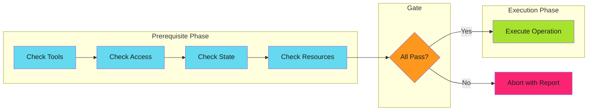

# Prerequisite Checks

## When to Use This Skill

Prerequisite checks are a structured approach to [fail fast](../fail-fast/index.md) validation. Instead of scattering validation throughout code, you consolidate all precondition checks into a dedicated phase that runs before any work begins.

The key insight: **check everything, then do everything**.

---

## Prerequisites

| Category | What to Check | Example | Guide |
| ---------- | --------------- |---------| ------- |
| **Environment** | Required tools and variables | `kubectl`, `$DATABASE_URL` | [Environment](checks/environment.md) |
| **Access** | Permissions are granted | API tokens, RBAC roles | [Permissions](checks/permissions.md) |
| **State** | System is in expected state | Resource exists, not locked | [State](checks/state.md) |
| **Input** | Inputs are valid | Required fields, formats | [Input](checks/input.md) |
| **Dependencies** | Dependencies are ready | Upstream jobs, services | [Dependencies](checks/dependencies.md) |

---

## When to Apply

| Scenario | Apply Prerequisite Checks? | Reasoning |
| ---------- | ---------------------------- | ----------- |
| Kubernetes deployment | Yes | Check cluster access, namespace, resources |
| GitHub Actions workflow | Yes | Check secrets, tools, permissions |
| Database migration | Yes | Check connectivity, schema version, backup |
| API request handling | Depends | Check inputs yes, runtime state no |
| File processing | Depends | Check file exists yes, content format no |

**Decision rule**: Use prerequisite checks for **validation you can do upfront**, not validation that requires starting the operation.

---

## Implementation

See [Implementation Patterns](implementation.md) for:

- Check ordering strategy (cost-based)
- Implementation patterns (fail-first vs collect-all vs structured)
- Common CI/CD prerequisites checklist
- Anti-patterns to avoid

---

## Techniques

### Relationship to Other Patterns

| Pattern | How Prerequisite Checks Applies |
| --------- | -------------------------------- |
| [Fail Fast](../fail-fast/index.md) | Prerequisite checks are structured fail-fast validation |
| [Graceful Degradation](../graceful-degradation/index.md) | Prerequisites determine if graceful degradation is even possible |
| [Idempotency](../../efficiency/idempotency/index.md) | Check-before-act is a prerequisite pattern |
| [Work Avoidance](../../efficiency/work-avoidance/index.md) | Prerequisites can include "work already done" checks |

---

*See [reference.md](reference.md) for additional techniques and detailed examples.*

## Examples

See [examples.md](examples.md) for code examples.

## Full Reference

See [reference.md](reference.md) for complete documentation.
## References

- [Source Documentation](https://adaptive-enforcement-lab.com/patterns/error-handling/)
- [AEL Patterns](https://adaptive-enforcement-lab.com/patterns/)
