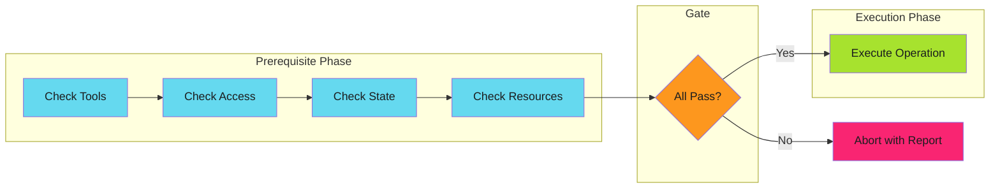

# Prerequisite Checks - Examples


## Example 1: example-1.mermaid





## Example 2: example-2.yaml


```yaml
# GitHub Actions prerequisite check
- name: Validate prerequisites
  run: |
    errors=()

    # Environment
    [[ -n "${{ secrets.DEPLOY_TOKEN }}" ]] || errors+=("DEPLOY_TOKEN not set")

    # Tools
    command -v kubectl >/dev/null || errors+=("kubectl not installed")

    # Permissions
    kubectl auth can-i create deployments -n production || errors+=("No deploy permission")

    # State
    kubectl get namespace production >/dev/null || errors+=("Namespace missing")

    # Report
    if [ ${#errors[@]} -gt 0 ]; then
      echo "::error::Prerequisite check failed"
      printf '%s\n' "${errors[@]}"
      exit 1
    fi

    echo "All prerequisites met"
```


