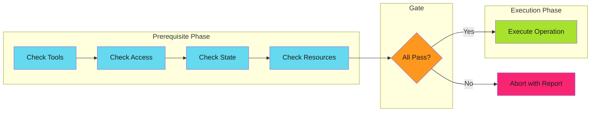

# Prerequisite Checks - Reference

This is the complete reference documentation extracted from the source.

# Prerequisite Checks

Validate all preconditions before executing expensive or irreversible operations.

> **Key Insight**
>
> Check everything, then do everything. Consolidate validation into a dedicated phase before any work begins.
>

---

## Overview

Prerequisite checks are a structured approach to [fail fast](../fail-fast/index.md) validation. Instead of scattering validation throughout code, you consolidate all precondition checks into a dedicated phase that runs before any work begins.



The key insight: **check everything, then do everything**.

---

## Categories of Prerequisites

| Category | What to Check | Example | Guide |
| ---------- | --------------- |---------| ------- |
| **Environment** | Required tools and variables | `kubectl`, `$DATABASE_URL` | [Environment](checks/environment.md) |
| **Access** | Permissions are granted | API tokens, RBAC roles | [Permissions](checks/permissions.md) |
| **State** | System is in expected state | Resource exists, not locked | [State](checks/state.md) |
| **Input** | Inputs are valid | Required fields, formats | [Input](checks/input.md) |
| **Dependencies** | Dependencies are ready | Upstream jobs, services | [Dependencies](checks/dependencies.md) |

---

## Quick Example

```yaml
# GitHub Actions prerequisite check
- name: Validate prerequisites
  run: |
    errors=()

    # Environment
    [[ -n "${{ secrets.DEPLOY_TOKEN }}" ]] || errors+=("DEPLOY_TOKEN not set")

    # Tools
    command -v kubectl >/dev/null || errors+=("kubectl not installed")

    # Permissions
    kubectl auth can-i create deployments -n production || errors+=("No deploy permission")

    # State
    kubectl get namespace production >/dev/null || errors+=("Namespace missing")

    # Report
    if [ ${#errors[@]} -gt 0 ]; then
      echo "::error::Prerequisite check failed"
      printf '%s\n' "${errors[@]}"
      exit 1
    fi

    echo "All prerequisites met"
```

---

## Check Categories

### [Environment Validation](checks/environment.md)

Check that the environment has everything needed before starting work:

- Required environment variables
- Required tools installed
- Network connectivity

### [Permission Checks](checks/permissions.md)

Verify access rights before attempting operations:

- API token scopes
- GitHub App permissions
- Kubernetes RBAC
- Cloud IAM roles

### [State Preconditions](checks/state.md)

Validate system state before operations:

- Resource existence
- No naming conflicts
- Service health
- Branch exists

### [Input Validation](checks/input.md)

Validate all inputs before processing:

- Required inputs provided
- Format validation
- Cross-field validation

### [Dependency Checks](checks/dependencies.md)

Verify dependencies are ready:

- Upstream jobs succeeded
- Required artifacts available
- External services reachable
- API rate limits

---

## Implementation Guide

See [Implementation Patterns](implementation.md) for:

- Check ordering strategy (cost-based)
- Implementation patterns (fail-first vs collect-all vs structured)
- Common CI/CD prerequisites checklist
- Anti-patterns to avoid

---

## Implementation Checklist

Before implementing prerequisite checks:

- [ ] **List all prerequisites** for the operation
- [ ] **Categorize by type** (tools, access, state, resources, config)
- [ ] **Order by cost** (cheapest first)
- [ ] **Make checks read-only** (no side effects)
- [ ] **Provide actionable errors** (what failed, how to fix)
- [ ] **Collect all errors** (don't stop at first failure, unless fast feedback required)
- [ ] **Test prerequisite failures** explicitly
- [ ] **Document prerequisites** for operators

---

## When to Apply

| Scenario | Apply Prerequisite Checks? | Reasoning |
| ---------- | ---------------------------- | ----------- |
| Kubernetes deployment | Yes | Check cluster access, namespace, resources |
| GitHub Actions workflow | Yes | Check secrets, tools, permissions |
| Database migration | Yes | Check connectivity, schema version, backup |
| API request handling | Depends | Check inputs yes, runtime state no |
| File processing | Depends | Check file exists yes, content format no |

**Decision rule**: Use prerequisite checks for **validation you can do upfront**, not validation that requires starting the operation.

---

## Relationship to Other Patterns

| Pattern | How Prerequisite Checks Applies |
| --------- | -------------------------------- |
| [Fail Fast](../fail-fast/index.md) | Prerequisite checks are structured fail-fast validation |
| [Graceful Degradation](../graceful-degradation/index.md) | Prerequisites determine if graceful degradation is even possible |
| [Idempotency](../../efficiency/idempotency/index.md) | Check-before-act is a prerequisite pattern |
| [Work Avoidance](../../efficiency/work-avoidance/index.md) | Prerequisites can include "work already done" checks |

---

## Further Reading

- [Implementation Patterns](implementation.md) - Check ordering, patterns, anti-patterns
- [Environment Checks](checks/environment.md) - Tools, variables, connectivity
- [Permission Checks](checks/permissions.md) - Tokens, RBAC, IAM
- [State Checks](checks/state.md) - Resources, conflicts, health
- [Input Validation](checks/input.md) - Required, format, cross-field
- [Dependency Checks](checks/dependencies.md) - Jobs, artifacts, services
- [Fail Fast](../fail-fast/index.md) - The broader pattern prerequisite checks implement
- [Error Handling](../index.md) - When to fail vs degrade gracefully

