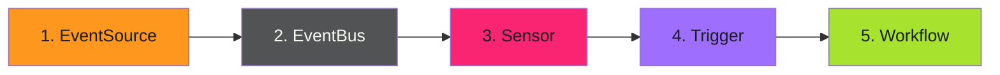

# Troubleshooting - Examples


## Example 1: example-1.mermaid





## Example 2: example-2.sh


```bash
# Check EventSource status
kubectl get eventsources -n argo-events
kubectl describe eventsource <name> -n argo-events

# Check EventBus health
kubectl get eventbus -n argo-events
kubectl logs -n argo-events -l eventbus-name=default

# Check Sensor status
kubectl get sensors -n argo-events
kubectl describe sensor <name> -n argo-events
kubectl logs -n argo-events -l sensor-name=<name>

# Check recent workflows
kubectl get workflows -n argo-workflows --sort-by=.metadata.creationTimestamp | tail -10
```


## Example 3: example-3.yaml


```yaml
# EventSource with debug logging
spec:
  template:
    container:
      env:
        - name: LOG_LEVEL
          value: debug
```


## Example 4: example-4.yaml


```yaml
# Sensor with debug logging
spec:
  template:
    container:
      env:
        - name: DEBUG_LOG
          value: "true"
```


