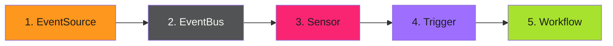

# Troubleshooting - Troubleshooting

When events don't trigger workflows, debugging can be challenging. Events flow through multiple components, and failures can be silent. This section covers systematic approaches to identify and fix issues.

---

## Debugging Flow

Start at the source and work forward:



Check each component in order. The failure is usually at the first component that doesn't show expected behavior.

---

## Troubleshooting Guides

| Guide | When to Use |
| ------- | ------------- |
| [EventSource Issues](eventsources.md) | Events not arriving from external systems |
| [Sensor Issues](sensors.md) | Events arrive but don't trigger actions |
| [Common Patterns](common-patterns.md) | Frequently encountered problems and solutions |

---

## Quick Diagnostic Commands

```bash
# Check EventSource status
kubectl get eventsources -n argo-events
kubectl describe eventsource <name> -n argo-events

# Check EventBus health
kubectl get eventbus -n argo-events
kubectl logs -n argo-events -l eventbus-name=default

# Check Sensor status
kubectl get sensors -n argo-events
kubectl describe sensor <name> -n argo-events
kubectl logs -n argo-events -l sensor-name=<name>

# Check recent workflows
kubectl get workflows -n argo-workflows --sort-by=.metadata.creationTimestamp | tail -10
```

---

## Logging Levels

Increase verbosity for debugging:

```yaml
# EventSource with debug logging
spec:
  template:
    container:
      env:
        - name: LOG_LEVEL
          value: debug
```

```yaml
# Sensor with debug logging
spec:
  template:
    container:
      env:
        - name: DEBUG_LOG
          value: "true"
```

Return to `error` or `info` after debugging to reduce log volume.

---

> **Silent Failures**
>
> Argo Events often fails silently. Filters that don't match, conditions that evaluate false, and malformed events produce no errors. When "nothing happens," systematic component-by-component verification is essential.
>

---

## Related

- [EventSource Issues](eventsources.md) - Debug event ingestion
- [Sensor Issues](sensors.md) - Debug event processing
- [Common Patterns](common-patterns.md) - Known issues and fixes
- [Official Troubleshooting](https://argoproj.github.io/argo-events/troubleshooting/) - Argo Events troubleshooting guide
