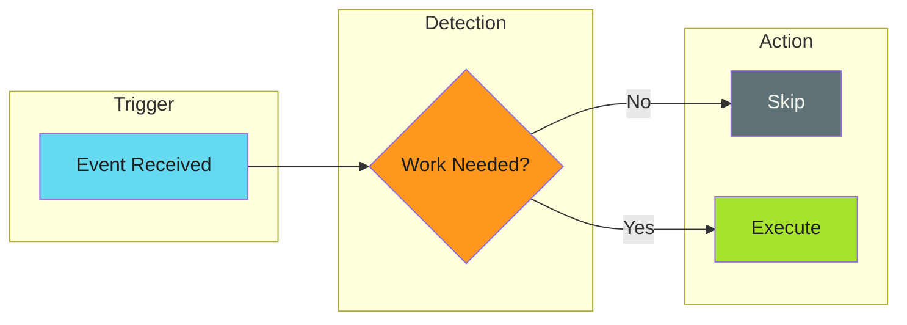

# Work Avoidance

## When to Use This Skill

Work avoidance detects when an operation isn't needed and skips it entirely. Unlike [idempotency](../idempotency/index.md) (which makes reruns safe), work avoidance prevents the run from happening at all.

---

## When to Apply

Work avoidance is valuable when:

- **Distribution workflows** push files to many repositories
- **Release automation** bumps versions without content changes
- **Scheduled jobs** run regardless of whether work exists
- **Monorepo builds** trigger on any change but only need subset builds
- **API synchronization** needs to detect actual drift
- **Mutex-locked workflows** queue identical operations behind a lock

---

## Implementation

- [GitHub Actions: Work Avoidance](../../../patterns/github-actions/use-cases/work-avoidance/index.md) - CI/CD implementation patterns
- [File Distribution](../../../patterns/github-actions/use-cases/file-distribution/index.md) - Real-world workflow using these patterns

---

## Techniques

### Techniques

Work avoidance uses different techniques depending on what you're checking:

| Technique | Question | Best For |
| --------- | -------- | -------- |
| [Content Hashing](techniques/content-hashing.md) | "Is the content different?" | File comparisons, config sync |
| [Volatile Field Exclusion](techniques/volatile-field-exclusion.md) | "Did anything meaningful change?" | Version bumps, timestamps |
| [Existence Checks](techniques/existence-checks.md) | "Does it already exist?" | Resource creation (PRs, branches) |
| [Cache-Based Skip](techniques/cache-based-skip.md) | "Is the output already built?" | Build artifacts, dependencies |
| [Queue Cleanup](techniques/queue-cleanup.md) | "Should queued work execute?" | Mutex-locked workflows |

See [Techniques Overview](techniques/index.md) for detailed comparisons and when to use each.

---

## Comparison

Both patterns make automation safe to rerun, but they optimize for different things:

| Concern | Idempotency | Work Avoidance |
| ------- | ----------- | -------------- |
| Focus | Safe re-execution | Skipping execution |
| Question | "Can I run this again safely?" | "Should I run this at all?" |
| Resource usage | Uses resources on rerun | Saves resources |
| Implementation | Logic inside operation | Logic before operation |

Best practice: Apply **work avoidance first**, then ensure remaining operations are **idempotent**.

---

## Anti-Patterns to Avoid

Skip work when the outcome won't change.

> **Detect Before Execute**
>
> Check if work is needed before starting it. Avoid creating PRs for unchanged content, running builds for unchanged code, or processing already-processed items.
>

---

## Overview

Work avoidance detects when an operation isn't needed and skips it entirely. Unlike [idempotency](../idempotency/index.md) (which makes reruns safe), work avoidance prevents the run from happening at all.

*See [examples.md](examples.md) for detailed code examples.*

---

## Work Avoidance vs Idempotency

Both patterns make automation safe to rerun, but they optimize for different things:

| Concern | Idempotency | Work Avoidance |
| ------- | ----------- | -------------- |
| Focus | Safe re-execution | Skipping execution |
| Question | "Can I run this again safely?" | "Should I run this at all?" |
| Resource usage | Uses resources on rerun | Saves resources |
| Implementation | Logic inside operation | Logic before operation |

Best practice: Apply **work avoidance first**, then ensure remaining operations are **idempotent**.

---

## Techniques

Work avoidance uses different techniques depending on what you're checking:

| Technique | Question | Best For |
| --------- | -------- | -------- |
| [Content Hashing](techniques/content-hashing.md) | "Is the content different?" | File comparisons, config sync |
| [Volatile Field Exclusion](techniques/volatile-field-exclusion.md) | "Did anything meaningful change?" | Version bumps, timestamps |
| [Existence Checks](techniques/existence-checks.md) | "Does it already exist?" | Resource creation (PRs, branches) |
| [Cache-Based Skip](techniques/cache-based-skip.md) | "Is the output already built?" | Build artifacts, dependencies |
| [Queue Cleanup](techniques/queue-cleanup.md) | "Should queued work execute?" | Mutex-locked workflows |

See [Techniques Overview](techniques/index.md) for detailed comparisons and when to use each.

---

## When to Apply

Work avoidance is valuable when:

- **Distribution workflows** push files to many repositories
- **Release automation** bumps versions without content changes
- **Scheduled jobs** run regardless of whether work exists
- **Monorepo builds** trigger on any change but only need subset builds
- **API synchronization** needs to detect actual drift
- **Mutex-locked workflows** queue identical operations behind a lock

---

## Anti-Patterns

Common mistakes that undermine work avoidance:

- **Over-aggressive skipping** - Checking existence, not content
- **Ignoring error states** - Trusting markers without validation
- **Stripping too much** - Destroying semantic content with broad patterns
- **Stale cache keys** - Missing inputs that affect output

See [Anti-Patterns](anti-patterns.md) for details and fixes.

---

## Quick Example

A file distribution workflow that skips version-only changes:

*See [examples.md](examples.md) for detailed code examples.*

This applies [Volatile Field Exclusion](techniques/volatile-field-exclusion.md) to avoid creating PRs for version-only changes.

---

## Implementation Examples

- [GitHub Actions: Work Avoidance](../../../patterns/github-actions/use-cases/work-avoidance/index.md) - CI/CD implementation patterns
- [File Distribution](../../../patterns/github-actions/use-cases/file-distribution/index.md) - Real-world workflow using these patterns

---

## Related

- [Idempotency](../idempotency/index.md) - Making operations safe to repeat
- [Graceful Degradation](../../error-handling/graceful-degradation/index.md) - Fallback when detection fails
- [Three-Stage Design](../../architecture/three-stage-design.md) - Workflow structure that enables work avoidance

### Overview

Work avoidance detects when an operation isn't needed and skips it entirely. Unlike [idempotency](../idempotency/index.md) (which makes reruns safe), work avoidance prevents the run from happening at all.

*See [examples.md](examples.md) for detailed code examples.*

---

### Work Avoidance vs Idempotency

Both patterns make automation safe to rerun, but they optimize for different things:

| Concern | Idempotency | Work Avoidance |
| ------- | ----------- | -------------- |
| Focus | Safe re-execution | Skipping execution |
| Question | "Can I run this again safely?" | "Should I run this at all?" |
| Resource usage | Uses resources on rerun | Saves resources |
| Implementation | Logic inside operation | Logic before operation |

Best practice: Apply **work avoidance first**, then ensure remaining operations are **idempotent**.

---

### Techniques

Work avoidance uses different techniques depending on what you're checking:

| Technique | Question | Best For |
| --------- | -------- | -------- |
| [Content Hashing](techniques/content-hashing.md) | "Is the content different?" | File comparisons, config sync |
| [Volatile Field Exclusion](techniques/volatile-field-exclusion.md) | "Did anything meaningful change?" | Version bumps, timestamps |
| [Existence Checks](techniques/existence-checks.md) | "Does it already exist?" | Resource creation (PRs, branches) |
| [Cache-Based Skip](techniques/cache-based-skip.md) | "Is the output already built?" | Build artifacts, dependencies |
| [Queue Cleanup](techniques/queue-cleanup.md) | "Should queued work execute?" | Mutex-locked workflows |

See [Techniques Overview](techniques/index.md) for detailed comparisons and when to use each.

---

### When to Apply

Work avoidance is valuable when:

- **Distribution workflows** push files to many repositories
- **Release automation** bumps versions without content changes
- **Scheduled jobs** run regardless of whether work exists
- **Monorepo builds** trigger on any change but only need subset builds
- **API synchronization** needs to detect actual drift
- **Mutex-locked workflows** queue identical operations behind a lock

---

### Anti-Patterns

Common mistakes that undermine work avoidance:

- **Over-aggressive skipping** - Checking existence, not content
- **Ignoring error states** - Trusting markers without validation
- **Stripping too much** - Destroying semantic content with broad patterns
- **Stale cache keys** - Missing inputs that affect output

See [Anti-Patterns](anti-patterns.md) for details and fixes.

---

### Quick Example

A file distribution workflow that skips version-only changes:

*See [examples.md](examples.md) for detailed code examples.*

This applies [Volatile Field Exclusion](techniques/volatile-field-exclusion.md) to avoid creating PRs for version-only changes.

---

### Implementation Examples

- [GitHub Actions: Work Avoidance](../../../patterns/github-actions/use-cases/work-avoidance/index.md) - CI/CD implementation patterns
- [File Distribution](../../../patterns/github-actions/use-cases/file-distribution/index.md) - Real-world workflow using these patterns

---

### Related

- [Idempotency](../idempotency/index.md) - Making operations safe to repeat
- [Graceful Degradation](../../error-handling/graceful-degradation/index.md) - Fallback when detection fails
- [Three-Stage Design](../../architecture/three-stage-design.md) - Workflow structure that enables work avoidance

## Examples

See [examples.md](examples.md) for code examples.

## Related Patterns

- Idempotency
- Graceful Degradation
- Three-Stage Design

## References

- [Source Documentation](https://adaptive-enforcement-lab.com/patterns/efficiency/)
- [AEL Patterns](https://adaptive-enforcement-lab.com/patterns/)
