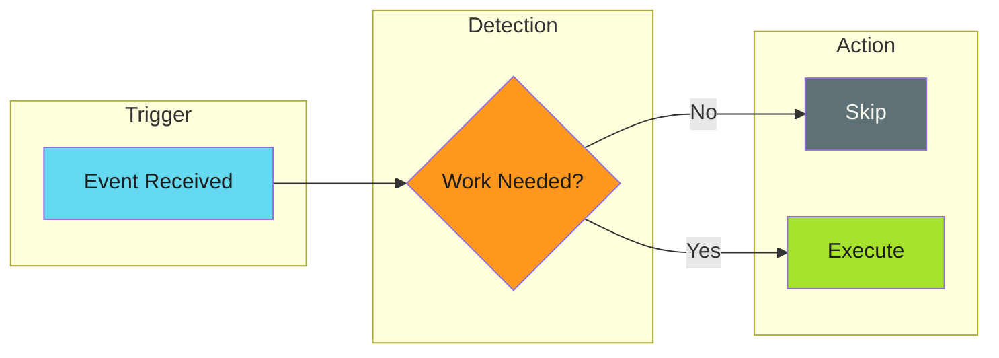

# Work Avoidance - Examples


## Example 1: example-1.mermaid





## Example 2: example-2.yaml


```yaml
- name: Check for meaningful changes
  id: check
  run: |
    # Strip version line before comparing
    strip_version() {
      sed '/^version:.*# x-release-please-version$/d' "$1"
    }

    SOURCE=$(strip_version "source/CONFIG.md")
    TARGET=$(git show HEAD:CONFIG.md 2>/dev/null | \
      sed '/^version:.*# x-release-please-version$/d' || echo "")

    if [ "$SOURCE" = "$TARGET" ]; then
      echo "skip=true" >> $GITHUB_OUTPUT
    else
      echo "skip=false" >> $GITHUB_OUTPUT
    fi

- name: Distribute file
  if: steps.check.outputs.skip != 'true'
  run: ./distribute.sh
```


