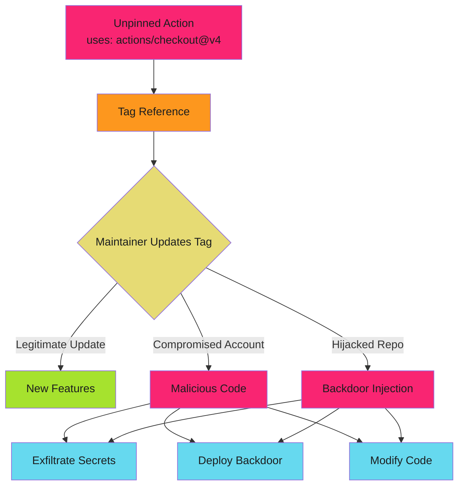

# Action Pinning Overview - Examples


## Example 1: example-1.mermaid





## Example 2: example-2.yaml


```yaml
- uses: actions/checkout@v4
- uses: actions/setup-node@v3
```


## Example 3: example-3.yaml


```yaml
# actions/checkout v4.1.1
- uses: actions/checkout@b4ffde65f46336ab88eb53be808477a3936bae11

# actions/setup-node v3.8.1
- uses: actions/setup-node@5e21ff4d9bc1a8cf6de233a3057d20ec6b3fb69d
```


## Example 4: example-4.sh


```bash
# Attacker commands
git tag -d v3
git tag v3 <malicious-commit-sha>
git push --force --tags
```


## Example 5: example-5.yaml


```yaml
# Action looks safe
- uses: trusted-org/deploy-action@v2
```


## Example 6: example-6.js


```javascript
// action.js imports compromised package
const utils = require('internal-deploy-utils');  // Typosquatted package
```


## Example 7: example-7.yaml


```yaml
name: Secure CI
on: [push]

permissions:
  contents: read

jobs:
  test:
    runs-on: ubuntu-latest
    steps:
      # SHA-pinned actions with version comments
      - uses: actions/checkout@b4ffde65f46336ab88eb53be808477a3936bae11  # v4.1.1
      - uses: actions/setup-node@5e21ff4d9bc1a8cf6de233a3057d20ec6b3fb69d  # v3.8.1

      - name: Install dependencies
        run: npm ci

      - name: Run tests
        run: npm test
```


## Example 8: example-8.yaml


```yaml
# .github/dependabot.yml
version: 2
updates:
  - package-ecosystem: "github-actions"
    directory: "/"
    schedule:
      interval: "weekly"
    labels:
      - "dependencies"
      - "github-actions"
```


## Example 9: example-9.yaml


```yaml
# Internal shared action
- uses: my-org/shared-workflows/.github/actions/deploy@main
```


## Example 10: example-10.yaml


```yaml
# Action runs in container
- uses: docker://alpine:3.18
```


## Example 11: example-11.yaml


```yaml
# Digest-pinned container
- uses: docker://alpine@sha256:abc123...
```


## Example 12: example-12.text


```text
Settings → Actions → General → Allow select actions and reusable workflows
```


