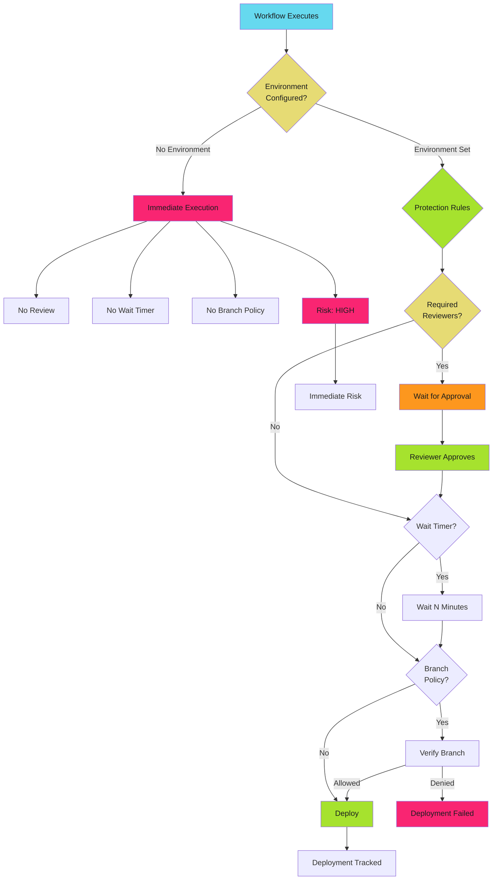

# Environment Protection Patterns - Examples


## Example 1: example-1.mermaid





## Example 2: example-2.yaml


```yaml
name: Production Deploy
on:
  push:
    branches: [main]

permissions:
  contents: read
  id-token: write

jobs:
  deploy:
    runs-on: ubuntu-latest
    environment: production
    steps:
      - uses: actions/checkout@b4ffde65f46336ab88eb53be808477a3936bae11  # v4.1.1

      - uses: google-github-actions/auth@55bd3a7c6e2ae7cf1877fd1ccb9d54c0503c457c  # v2.1.2
        with:
          workload_identity_provider: ${{ secrets.WIF_PROVIDER }}
          service_account: ${{ secrets.WIF_SERVICE_ACCOUNT }}

      - name: Deploy to production
        run: ./scripts/deploy.sh production
```


## Example 3: example-3.yaml


```yaml
name: Production Deploy with Wait Timer
on:
  push:
    branches: [main]

permissions:
  contents: read
  id-token: write

jobs:
  deploy:
    runs-on: ubuntu-latest
    environment:
      name: production
      url: https://app.example.com
    steps:
      - uses: actions/checkout@b4ffde65f46336ab88eb53be808477a3936bae11  # v4.1.1

      - uses: google-github-actions/auth@55bd3a7c6e2ae7cf1877fd1ccb9d54c0503c457c  # v2.1.2
        with:
          workload_identity_provider: ${{ secrets.WIF_PROVIDER }}
          service_account: ${{ secrets.WIF_SERVICE_ACCOUNT }}

      - run: ./scripts/deploy.sh production
```


## Example 4: example-4.yaml


```yaml
name: Multi-Environment Deploy
on:
  push:
    branches: [main, 'release/**', 'hotfix/**']

permissions:
  contents: read
  id-token: write

jobs:
  deploy-production:
    runs-on: ubuntu-latest
    environment: production
    if: github.ref == 'refs/heads/main'
    steps:
      - uses: actions/checkout@b4ffde65f46336ab88eb53be808477a3936bae11  # v4.1.1
      - uses: google-github-actions/auth@55bd3a7c6e2ae7cf1877fd1ccb9d54c0503c457c  # v2.1.2
        with:
          workload_identity_provider: ${{ secrets.WIF_PROVIDER }}
          service_account: ${{ secrets.WIF_SERVICE_ACCOUNT }}
      - run: ./scripts/deploy.sh production

  deploy-staging:
    runs-on: ubuntu-latest
    environment: staging
    if: startsWith(github.ref, 'refs/heads/release/')
    steps:
      - uses: actions/checkout@b4ffde65f46336ab88eb53be808477a3936bae11  # v4.1.1
      - uses: google-github-actions/auth@55bd3a7c6e2ae7cf1877fd1ccb9d54c0503c457c  # v2.1.2
        with:
          workload_identity_provider: ${{ secrets.WIF_PROVIDER }}
          service_account: ${{ secrets.WIF_SERVICE_ACCOUNT }}
      - run: ./scripts/deploy.sh staging
```


## Example 5: example-5.yaml


```yaml
name: Multi-Environment Deploy
on:
  workflow_dispatch:
    inputs:
      environment:
        required: true
        type: choice
        options:
          - staging
          - production

permissions:
  contents: read
  id-token: write

jobs:
  deploy:
    runs-on: ubuntu-latest
    environment: ${{ github.event.inputs.environment }}
    steps:
      - uses: actions/checkout@b4ffde65f46336ab88eb53be808477a3936bae11  # v4.1.1

      - uses: google-github-actions/auth@55bd3a7c6e2ae7cf1877fd1ccb9d54c0503c457c  # v2.1.2
        with:
          workload_identity_provider: ${{ secrets.WIF_PROVIDER }}
          service_account: ${{ secrets.WIF_SERVICE_ACCOUNT }}

      - run: ./scripts/deploy.sh ${{ github.event.inputs.environment }}
```


## Example 6: example-6.yaml


```yaml
name: Production Triple Gate
on:
  push:
    branches: [main]

permissions:
  contents: read
  id-token: write

jobs:
  security-scan:
    runs-on: ubuntu-latest
    permissions:
      contents: read
      security-events: write
    steps:
      - uses: actions/checkout@b4ffde65f46336ab88eb53be808477a3936bae11  # v4.1.1
      - uses: aquasecurity/trivy-action@84384bd6e777ef152729993b8145ea352e9dd3ef  # 0.17.0
        with:
          scan-type: 'fs'
          format: 'sarif'
          output: 'trivy-results.sarif'
      - uses: github/codeql-action/upload-sarif@cdcdbb579706841c47f7063dda365e292e5cad7a  # v2.13.4
        with:
          sarif_file: 'trivy-results.sarif'

  deploy:
    runs-on: ubuntu-latest
    needs: security-scan
    environment:
      name: production
      url: https://app.example.com
    steps:
      - uses: actions/checkout@b4ffde65f46336ab88eb53be808477a3936bae11  # v4.1.1

      - uses: google-github-actions/auth@55bd3a7c6e2ae7cf1877fd1ccb9d54c0503c457c  # v2.1.2
        with:
          workload_identity_provider: ${{ secrets.WIF_PROVIDER }}
          service_account: ${{ secrets.WIF_SERVICE_ACCOUNT }}

      - name: Deploy to production
        run: ./scripts/deploy.sh production

      - name: Notify deployment
        if: always()
        run: |
          curl -X POST https://slack.com/api/chat.postMessage \
            -H "Authorization: Bearer ${{ secrets.SLACK_BOT_TOKEN }}" \
            -d "channel=deployments" \
            -d "text=Production deployment ${{ job.status }} for ${{ github.sha }}"
```


