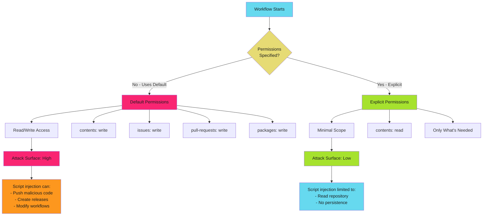

# GITHUB_TOKEN Permissions Overview

## When to Use This Skill

Lock down workflow permissions. The GITHUB_TOKEN grants access to repository resources. Default permissions give too much. Explicit minimal permissions prevent privilege escalation.

> **The Risk**
>
>
> Default `permissions: write-all` grants workflows the ability to push code, modify releases, create issues, and access packages. A compromised workflow or script injection can weaponize these permissions for persistent access.
>

## What is GITHUB_TOKEN?

GitHub automatically creates a unique `GITHUB_TOKEN` secret for each workflow run. This token authenticates the workflow to the GitHub API with repository-scoped permissions.

**Token Lifecycle**:

1. GitHub generates token when workflow job starts
2. Token available via `${{ secrets.GITHUB_TOKEN }}` or `${{ github.token }}`
3. Token expires when job completes
4. Token scope limited to repository where workflow runs

**Key Characteristics**:

- **Automatic**: No manual secret creation required
- **Ephemeral**: Lives only for duration of job
- **Repository-scoped**: Cannot access other repositories (except with special configuration)
- **Configurable**: Permissions can be restricted per workflow or per job

## The Permission Problem



## Default Permissions

GitHub's default permissions vary based on repository settings and organization policies.

### Repository-Level Defaults

Navigate to repository Settings → Actions → General → Workflow permissions.

Three options available:

#### Option 1: Read and Write Permissions (Default)

```yaml
# Implicit default - NO permissions block specified
name: CI
on: [push]

jobs:
  build:
    runs-on: ubuntu-latest
    steps:
      - uses: actions/checkout@b4ffde65f46336ab88eb53be808477a3936bae11  # v4.1.1
      - run: echo "Token has broad write access"
```

**Grants**:

- `contents: write`
- `metadata: read`
- `issues: write`
- `pull-requests: write`
- `statuses: write`

**Risk**: Workflow can modify code, create releases, open issues. Script injection becomes code execution with persistence.

#### Option 2: Read Permissions Only

```yaml
# Org/repo configured for read-only defaults
# Still implicit - no permissions block needed
name: CI
on: [push]

jobs:
  build:
    runs-on: ubuntu-latest
    steps:
      - uses: actions/checkout@b4ffde65f46336ab88eb53be808477a3936bae11  # v4.1.1
      - run: echo "Token has read-only access"
```

**Grants**:

- `contents: read`
- `metadata: read`

**Better**: Reduces attack surface, but still relies on implicit configuration.

#### Option 3: Explicit Permissions (Recommended)

```yaml
# Explicit permissions - ALWAYS SPECIFY
name: CI
on: [push]

permissions:
  contents: read

jobs:
  build:
    runs-on: ubuntu-latest
    steps:
      - uses: actions/checkout@b4ffde65f46336ab88eb53be808477a3936bae11  # v4.1.1
      - run: echo "Token has explicitly scoped access"
```

**Grants**: Only what you specify. No reliance on repository configuration.

**Best Practice**: Always use explicit permissions. Never rely on defaults.

## Least Privilege Principle

Grant workflows the minimum permissions required to complete their task. Nothing more.

### Why Least Privilege Matters

**Without Least Privilege**: Compromised action with default `contents: write` can push backdoors to `.github/workflows/`, establishing persistent access.

**With Least Privilege**: Workflow with `permissions: { contents: read }` blocks write attempts. Push fails with "Resource not accessible by integration". Attack contained.

### Implementing Least Privilege

Start with minimal permissions, add only what's needed:

```yaml
# Step 1: Start minimal
permissions:
  contents: read

# Step 2: Add permissions as errors occur
permissions:
  contents: read        # Checkout code
  pull-requests: write  # Post test results as comment
```

## Complete Permissions Matrix

All available GITHUB_TOKEN permissions with scope definitions.

| Permission | Read Scope | Write Scope |
| ---------- | ---------- | ----------- |
| **actions** | View workflow runs and artifacts | Cancel, re-run, delete workflow runs |
| **attestations** | View attestations | Create attestations for artifacts |
| **checks** | View check runs | Create, update check runs (status checks) |
| **contents** | Read repository files, commits, refs | Push commits, create tags, create releases |
| **deployments** | View deployment status | Create deployment statuses |
| **discussions** | Read discussions | Create, edit discussions |
| **id-token** | Request OIDC token | N/A (write enables OIDC token request) |
| **issues** | Read issues | Create, edit, close issues, add labels |
| **packages** | Download packages | Upload, delete packages |
| **pages** | View Pages builds | Deploy to GitHub Pages |
| **pull-requests** | Read PRs and reviews | Create, edit PRs, request reviewers, merge |
| **repository-projects** | Read projects (classic) | Create, edit projects |
| **security-events** | View code scanning alerts | Upload SARIF files to Security tab |
| **statuses** | View commit statuses | Create commit statuses |

### Metadata Permission

**Special Case**: `metadata: read` is always granted. Cannot be modified. Allows access to repository metadata like name, description, topics.

## Default vs Explicit Permissions Comparison

| Aspect | Default Permissions | Explicit Permissions |
| ------ | ------------------- | -------------------- |
| **Configuration** | Inherited from repo/org settings | Declared in workflow file |
| **Portability** | Breaks when repo settings change | Works consistently across repos |
| **Visibility** | Hidden - must check repo settings | Visible in workflow file |
| **Security Posture** | Varies by configuration | Consistently minimal |
| **Attack Surface** | Often excessive | Minimized to requirements |
| **Maintenance** | Relies on external policy | Self-documenting in code |
| **Best Practice** | Avoid | Always use |

## Read vs Write Scope Explained

### Read Scope

**Enables**:

- GET requests to GitHub API
- Viewing repository data
- Downloading artifacts and packages

**Cannot**:

- Modify repository
- Create resources
- Delete data

**Example**: CI workflow that only tests code

```yaml
permissions:
  contents: read  # Checkout code for testing
```

### Write Scope

**Enables**:

- POST, PATCH, PUT, DELETE requests to GitHub API
- Creating and modifying resources
- Pushing code, creating releases, posting comments

**Requires Justification**: Every write permission must have a documented reason.

**Example**: Release workflow that creates GitHub release

```yaml
permissions:
  contents: write  # Create release and upload assets
```

### Permission Escalation Risk

`contents: write` allows workflows to modify themselves, enabling persistent backdoors. Prefer `contents: read` with `pull-requests: write` for commenting without repository modification.

## Workflow-Level vs Job-Level Permissions

### Workflow-Level Permissions

Applied to all jobs unless overridden at job level.

```yaml
permissions:
  contents: read

jobs:
  test:
    # Inherits contents: read
    runs-on: ubuntu-latest
    steps:
      - uses: actions/checkout@b4ffde65f46336ab88eb53be808477a3936bae11  # v4.1.1
      - run: npm test
```

### Job-Level Permissions

Override workflow-level for specific jobs requiring additional permissions.

```yaml
permissions:
  contents: read  # Default

jobs:
  comment:
    permissions:
      contents: read
      pull-requests: write  # Escalate for this job only
    runs-on: ubuntu-latest
    steps:
      - run: gh pr comment ${{ github.event.number }} --body "Tests passed"
```

**Best Practice**: Default to minimal workflow-level permissions, escalate only for specific jobs.

## Common Permission Patterns

| Pattern | Permissions | Use Case |
| ------- | ----------- | -------- |
| **Read-Only CI** | `contents: read` | Test, lint, build |
| **PR Comment** | `contents: read`, `pull-requests: write` | Post coverage, scan results |
| **Security Scan** | `contents: read`, `security-events: write` | Upload SARIF to Security tab |
| **Release** | `contents: write` | Create releases, push tags |
| **OIDC Federation** | `id-token: write`, `contents: read` | Cloud auth without secrets |
| **Package Publish** | `contents: read`, `packages: write` | Publish to GitHub Packages |

## Troubleshooting Permission Errors

**"Resource not accessible by integration"**: Add missing permission to `permissions` block.

**"Must have admin access to organization"**: Use GitHub App with org-level permissions instead of GITHUB_TOKEN.

**Token works locally but fails in Actions**: Personal tokens have broader scope than GITHUB_TOKEN. Adjust workflow permissions or use GitHub App.

## Security Best Practices

**Always use explicit permissions**: Never rely on repository defaults.

```yaml
permissions:
  contents: read
```

**Scope to job when possible**: Escalate only where needed.

```yaml
permissions:
  contents: read

jobs:
  release:
    permissions:
      contents: write
```

**Document permissions**: Add comments explaining why each permission is required.

**Avoid `contents: write`**: Enables workflow self-modification. Use pull requests for changes when possible.

**Use OIDC instead of secrets**: Prefer `id-token: write` for cloud authentication over long-lived credentials.

**Review permission escalations**: Require security review for `.github/workflows/` changes that add permissions.

## Next Steps

Ready to implement minimal permissions? Continue with:

- **[Permission Templates](templates.md)**: Copy-paste templates for common workflow types (CI, release, deployment, security scanning)
- **[Job-Level Scoping](job-scoping.md)**: Advanced patterns for multi-job workflows with different permission requirements
- **[Complete Examples](../examples/index.md)**: Production workflows demonstrating all security patterns

## Quick Reference

| Workflow Type | Required Permissions | Notes |
| ------------- | -------------------- | ----- |
| **CI/Test** | `contents: read` | Basic testing, no modifications |
| **PR Comment** | `contents: read`, `pull-requests: write` | Post results to PR |
| **Security Scan** | `contents: read`, `security-events: write` | Upload SARIF to Security tab |
| **Release** | `contents: write` | Create release, push tags |
| **Deploy (OIDC)** | `id-token: write`, `contents: read` | Cloud deployment without secrets |
| **Package Publish** | `contents: read`, `packages: write` | Publish to GitHub Packages |
| **GitHub Pages** | `contents: read`, `pages: write` | Deploy to Pages |

---

> **Start Minimal, Escalate as Needed**
>
>
> Begin with `permissions: { contents: read }` for every workflow. Add permissions only when you encounter "Resource not accessible" errors. Document why each permission is required.


## Implementation

See the full implementation guide in the [source documentation](https://adaptive-enforcement-lab.com/secure/github-actions-security/).


## Key Principles

**Always use explicit permissions**: Never rely on repository defaults.

```yaml
permissions:
  contents: read
```

**Scope to job when possible**: Escalate only where needed.

```yaml
permissions:
  contents: read

jobs:
  release:
    permissions:
      contents: write
```

**Document permissions**: Add comments explaining why each permission is required.

**Avoid `contents: write`**: Enables workflow self-modification. Use pull requests for changes when possible.

**Use OIDC instead of secrets**: Prefer `id-token: write` for cloud authentication over long-lived credentials.

**Review permission escalations**: Require security review for `.github/workflows/` changes that add permissions.


## Techniques


### Common Permission Patterns

| Pattern | Permissions | Use Case |
| ------- | ----------- | -------- |
| **Read-Only CI** | `contents: read` | Test, lint, build |
| **PR Comment** | `contents: read`, `pull-requests: write` | Post coverage, scan results |
| **Security Scan** | `contents: read`, `security-events: write` | Upload SARIF to Security tab |
| **Release** | `contents: write` | Create releases, push tags |
| **OIDC Federation** | `id-token: write`, `contents: read` | Cloud auth without secrets |
| **Package Publish** | `contents: read`, `packages: write` | Publish to GitHub Packages |

*See [reference.md](reference.md) for additional techniques and detailed examples.*


## Comparison

| Aspect | Default Permissions | Explicit Permissions |
| ------ | ------------------- | -------------------- |
| **Configuration** | Inherited from repo/org settings | Declared in workflow file |
| **Portability** | Breaks when repo settings change | Works consistently across repos |
| **Visibility** | Hidden - must check repo settings | Visible in workflow file |
| **Security Posture** | Varies by configuration | Consistently minimal |
| **Attack Surface** | Often excessive | Minimized to requirements |
| **Maintenance** | Relies on external policy | Self-documenting in code |
| **Best Practice** | Avoid | Always use |


## Examples

See [examples.md](examples.md) for code examples.


## Troubleshooting

See [troubleshooting.md](troubleshooting.md) for common issues and solutions.


## Full Reference

See [reference.md](reference.md) for complete documentation.
## References

- [Source Documentation](https://adaptive-enforcement-lab.com/secure/github-actions-security/)
- [AEL Secure](https://adaptive-enforcement-lab.com/secure/)
