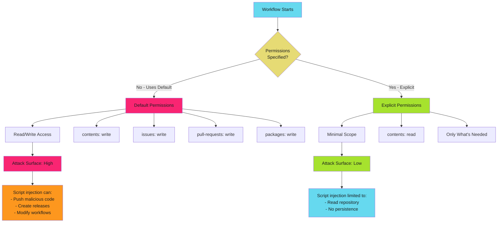

# GITHUB_TOKEN Permissions Overview - Examples


## Example 1: example-1.mermaid





## Example 2: example-2.yaml


```yaml
# Implicit default - NO permissions block specified
name: CI
on: [push]

jobs:
  build:
    runs-on: ubuntu-latest
    steps:
      - uses: actions/checkout@b4ffde65f46336ab88eb53be808477a3936bae11  # v4.1.1
      - run: echo "Token has broad write access"
```


## Example 3: example-3.yaml


```yaml
# Org/repo configured for read-only defaults
# Still implicit - no permissions block needed
name: CI
on: [push]

jobs:
  build:
    runs-on: ubuntu-latest
    steps:
      - uses: actions/checkout@b4ffde65f46336ab88eb53be808477a3936bae11  # v4.1.1
      - run: echo "Token has read-only access"
```


## Example 4: example-4.yaml


```yaml
# Explicit permissions - ALWAYS SPECIFY
name: CI
on: [push]

permissions:
  contents: read

jobs:
  build:
    runs-on: ubuntu-latest
    steps:
      - uses: actions/checkout@b4ffde65f46336ab88eb53be808477a3936bae11  # v4.1.1
      - run: echo "Token has explicitly scoped access"
```


## Example 5: example-5.yaml


```yaml
# Step 1: Start minimal
permissions:
  contents: read

# Step 2: Add permissions as errors occur
permissions:
  contents: read        # Checkout code
  pull-requests: write  # Post test results as comment
```


## Example 6: example-6.yaml


```yaml
permissions:
  contents: read  # Checkout code for testing
```


## Example 7: example-7.yaml


```yaml
permissions:
  contents: write  # Create release and upload assets
```


## Example 8: example-8.yaml


```yaml
permissions:
  contents: read

jobs:
  test:
    # Inherits contents: read
    runs-on: ubuntu-latest
    steps:
      - uses: actions/checkout@b4ffde65f46336ab88eb53be808477a3936bae11  # v4.1.1
      - run: npm test
```


## Example 9: example-9.yaml


```yaml
permissions:
  contents: read  # Default

jobs:
  comment:
    permissions:
      contents: read
      pull-requests: write  # Escalate for this job only
    runs-on: ubuntu-latest
    steps:
      - run: gh pr comment ${{ github.event.number }} --body "Tests passed"
```


## Example 10: example-10.yaml


```yaml
permissions:
  contents: read
```


## Example 11: example-11.yaml


```yaml
permissions:
  contents: read

jobs:
  release:
    permissions:
      contents: write
```


