# GKE Security Hardening Guide - Reference

This is the complete reference documentation extracted from the source.


# GKE Security Hardening Guide

Production-ready security configuration for Google Kubernetes Engine clusters. This guide covers control plane hardening, data plane isolation, identity and access management, and runtime security enforcement.

## Overview

> **Defense in Depth**
>
>
> GKE security hardening follows a layered approach:
>
> 1. **Control plane** - Private clusters, authenticated access, audit logging
> 2. **Network** - VPC-native networking, network policies, egress controls
> 3. **Identity** - Workload Identity Federation, least-privilege IAM, audit trails
> 4. **Runtime** - Pod Security Standards, admission controllers, monitoring
>

This guide uses Pulumi for Infrastructure as Code, enabling repeatable, auditable cluster deployments across environments (QAC, DEV, STG, PRD).

> **Environment Promotion Order**
>
>
> Always promote changes through: **QAC → DEV → STG → PRD → OPS**
>
> Never skip environments in the promotion pipeline.
>

## Prerequisites

- GCP project with billing enabled
- `gcloud` CLI installed and authenticated
- Pulumi 3.0+
- kubectl configured for cluster access
- Appropriate IAM permissions (Project Editor or Security Admin roles)

> **Production Warning**
>
>
> These configurations enforce strict security controls. Test in QAC/DEV before production deployment.
>

## Architecture

```mermaid
graph TB
    subgraph "Control Plane (Private)"
        API[API Server]
        ETCD[etcd]
        SCH[Scheduler]
    end

    subgraph "Data Plane (VPC-Native)"
        WI[Workload Identity]
        NP[Network Policies]
        PSS[Pod Security Standards]
    end

    subgraph "Security Layer"
        BA[Binary Authorization]
        CA[Cloud Armor]
        PSC[Private Service Connect]
    end

    API --> WI
    API --> NP
    API --> PSS
    BA --> API
    CA --> API
    PSC --> API

    %% Ghostty Hardcore Theme
    style API fill:#2D4263
    style WI fill:#4A7A8C
    style BA fill:#6B8E9F
    style CA fill:#6B8E9F

```



## Quick Start

```bash
# Clone infrastructure repository
git clone https://github.com/your-org/gke-infrastructure.git
cd gke-infrastructure

# Initialize Pulumi stack
pulumi stack init qac

# Configure cluster
pulumi config set gcp_project $PROJECT_ID
pulumi config set cluster_name qac-cluster
pulumi config set environment qac
pulumi config set team platform
pulumi config set cost_center engineering
pulumi config set admin_cidr_block 203.0.113.0/24

# Preview and deploy
pulumi preview
pulumi up

# Get cluster credentials
gcloud container clusters get-credentials qac-cluster \
  --region us-central1 \
  --project $PROJECT_ID
```

> **Verification**
>
>
> After deployment, verify the security posture using the verification checklists in each configuration module.
>

## Configuration Modules

This guide is split into focused modules:

- **[Cluster Configuration](cluster-configuration/index.md)** - Private GKE, Workload Identity, Shielded Nodes
- **[Network Security](network-security/index.md)** - VPC-native networking, Network Policies, Private Service Connect
- **[IAM Configuration](iam-configuration/index.md)** - Least-privilege IAM, audit logging, service accounts
- **[Runtime Security](runtime-security/index.md)** - Pod Security Standards, admission controllers, monitoring

## Common Misconfigurations to Avoid

| Misconfiguration | Risk | Fix |
|------------------|------|-----|
| Public cluster endpoint | Exposed API server | Set `privateClusterConfig.enablePrivateNodes = true` |
| Metadata server enabled | Pod can access node credentials | Set `workloadMetadataConfig.mode = "GKE_METADATA"` |
| No network policies | All-to-all traffic | Apply default-deny + explicit policies |
| Privileged containers | Root container escape | Set `securityContext.privileged = false` |
| No admission controllers | Insecure pods deployed | Deploy validating/mutating webhooks |
| No audit logging | Compliance blind spot | Enable GKE Cloud Logging sink |
| Overpermissioned service accounts | Lateral movement | Use Workload Identity + least-privilege IAM |
| Public container registry | Image tampering | Use private Artifact Registry + Binary Auth |

> **Attack Surface Reduction**
>
>
> Each misconfiguration listed above represents a verified attack vector. Fix all items before production deployment.
>

## Verification Checklist

```bash
#!/bin/bash
# Comprehensive security verification

CLUSTER="prod-cluster"
REGION="us-central1"

echo "=== Cluster Configuration ==="
gcloud container clusters describe $CLUSTER --region $REGION \
  --format="value(privateClusterConfig.enablePrivateNodes)" | grep -q "True" && echo "✓ Private cluster" || echo "✗ Public cluster"

gcloud container clusters describe $CLUSTER --region $REGION \
  --format="value(workloadIdentityConfig.workloadPool)" | grep -q "svc.id.goog" && echo "✓ Workload Identity enabled" || echo "✗ Workload Identity disabled"

gcloud container clusters describe $CLUSTER --region $REGION \
  --format="value(databaseEncryption.state)" | grep -q "ENCRYPTED" && echo "✓ Database encryption enabled" || echo "✗ Database encryption disabled"

echo ""
echo "=== Network Configuration ==="
gcloud container clusters describe $CLUSTER --region $REGION \
  --format="value(networkingConfig.useIpAliases)" | grep -q "True" && echo "✓ VPC-native networking" || echo "✗ Routes-based networking"

gcloud container clusters describe $CLUSTER --region $REGION \
  --format="value(networkPolicy.enabled)" | grep -q "True" && echo "✓ Network policies enabled" || echo "✗ Network policies disabled"

echo ""
echo "=== Pod Security ==="
kubectl get ns -o jsonpath='{range .items[*]}{.metadata.name}{"\t"}{.metadata.labels.pod-security\.kubernetes\.io/enforce}{"\n"}{end}' | column -t

echo ""
echo "=== IAM Configuration ==="
gcloud iam service-accounts list --format="table(email,displayName)"

echo ""
echo "=== Audit Logging ==="
gcloud logging sinks list --filter="destination:*storage*" --format="table(name,destination)"
```

## Environment-Specific Configurations

### QAC (Quality Assurance/Control)

```yaml
# Pulumi.qac.yaml
environment          = "qac"
kubernetes_version   = "1.28"
machine_type         = "e2-medium"
min_node_count       = 1
max_node_count       = 3
enable_monitoring    = true
pod_security_standard = "baseline"
```

### DEV (Development)

```yaml
# Pulumi.dev.yaml
environment          = "dev"
kubernetes_version   = "1.28"
machine_type         = "e2-standard-2"
min_node_count       = 1
max_node_count       = 5
enable_monitoring    = true
pod_security_standard = "baseline"
```

### STG (Staging)

```yaml
# Pulumi.stg.yaml
environment          = "stg"
kubernetes_version   = "1.28"
machine_type         = "e2-standard-4"
min_node_count       = 2
max_node_count       = 10
enable_monitoring    = true
pod_security_standard = "restricted"
```

### PRD (Production)

```yaml
# Pulumi.prd.yaml
environment          = "prd"
kubernetes_version   = "1.28"
machine_type         = "e2-standard-4"
min_node_count       = 3
max_node_count       = 20
enable_monitoring    = true
pod_security_standard = "restricted"
enable_binary_auth   = true
enable_cloud_armor   = true
```

> **Progressive Hardening**
>
>
> Notice security controls increase from QAC to PRD. Baseline standards in development, restricted standards in production.
>

## References

- [GKE Security Hardening](https://cloud.google.com/kubernetes-engine/docs/how-to/hardening-your-cluster)
- [Workload Identity Federation](https://cloud.google.com/kubernetes-engine/docs/how-to/workload-identity)
- [Binary Authorization](https://cloud.google.com/binary-authorization)
- [Pod Security Standards](https://kubernetes.io/docs/concepts/security/pod-security-standards/)
- [Network Policies](https://kubernetes.io/docs/concepts/services-networking/network-policies/)
- [Cloud Armor](https://cloud.google.com/armor)
- [CIS Kubernetes Benchmark](https://www.cisecurity.org/cis-benchmarks/)

## Related Content

- [Enforce](../../../enforce/index.md): Compliance enforcement and policy automation
- [Secure](../../index.md): Security discovery and remediation
- [Patterns](../../../patterns/index.md): Reusable security patterns

