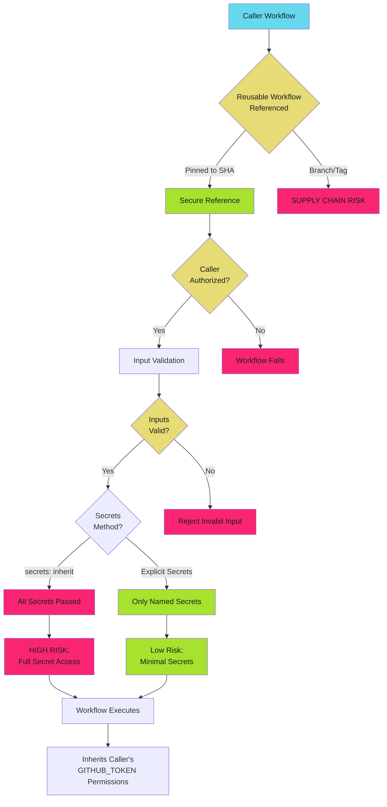

# Reusable Workflow Security - Examples


## Example 1: example-1.mermaid





## Example 2: example-2.yaml


```yaml
# .github/workflows/reusable-deploy.yml
# DO NOT USE - COMMAND INJECTION VULNERABILITY
name: Reusable Deploy
on:
  workflow_call:
    inputs:
      environment:
        required: true
        type: string

jobs:
  deploy:
    runs-on: ubuntu-latest
    steps:
      # DANGER: No input validation, allows command injection
      - run: ./scripts/deploy.sh ${{ inputs.environment }}
```


## Example 3: example-3.yaml


```yaml
# .github/workflows/reusable-deploy.yml
name: Reusable Deploy
on:
  workflow_call:
    inputs:
      environment:
        required: true
        type: choice
        options:
          - dev
          - staging
          - production

permissions:
  contents: read
  id-token: write

jobs:
  deploy:
    runs-on: ubuntu-latest
    environment: ${{ inputs.environment }}
    steps:
      # Safe: choice type restricts to valid values
      - uses: actions/checkout@b4ffde65f46336ab88eb53be808477a3936bae11  # v4.1.1

      - uses: google-github-actions/auth@55bd3a7c6e2ae7cf1877fd1ccb9d54c0503c457c  # v2.1.2
        with:
          workload_identity_provider: ${{ secrets.WIF_PROVIDER }}
          service_account: ${{ secrets.WIF_SERVICE_ACCOUNT }}

      - name: Deploy to environment
        run: ./scripts/deploy.sh ${{ inputs.environment }}
```


## Example 4: example-4.yaml


```yaml
# .github/workflows/reusable-deploy.yml
name: Reusable Deploy
on:
  workflow_call:
    inputs:
      environment:
        required: true
        type: string
        description: 'Deployment environment (dev, staging, production)'

permissions:
  contents: read
  id-token: write

jobs:
  deploy:
    runs-on: ubuntu-latest
    steps:
      - name: Validate environment input
        run: |
          case "${{ inputs.environment }}" in
            dev|staging|production)
              echo "Valid environment: ${{ inputs.environment }}"
              ;;
            *)
              echo "::error::Invalid environment. Allowed: dev, staging, production"
              exit 1
              ;;
          esac

      - uses: actions/checkout@b4ffde65f46336ab88eb53be808477a3936bae11  # v4.1.1

      - uses: google-github-actions/auth@55bd3a7c6e2ae7cf1877fd1ccb9d54c0503c457c  # v2.1.2
        with:
          workload_identity_provider: ${{ secrets.WIF_PROVIDER }}
          service_account: ${{ secrets.WIF_SERVICE_ACCOUNT }}

      - name: Deploy to environment
        env:
          ENVIRONMENT: ${{ inputs.environment }}
        run: ./scripts/deploy.sh "$ENVIRONMENT"
```


## Example 5: example-5.yaml


```yaml
# .github/workflows/reusable-release.yml
name: Reusable Release
on:
  workflow_call:
    inputs:
      version:
        required: true
        type: string
        description: 'Semantic version (e.g., v1.2.3)'
      prerelease:
        required: false
        type: boolean
        default: false
      deploy:
        required: false
        type: boolean
        default: true

permissions:
  contents: write
  id-token: write

jobs:
  validate:
    runs-on: ubuntu-latest
    outputs:
      valid: ${{ steps.check.outputs.valid }}
    steps:
      - name: Validate version format
        id: check
        run: |
          VERSION="${{ inputs.version }}"

          # Validate semantic version format
          if [[ ! "$VERSION" =~ ^v[0-9]+\.[0-9]+\.[0-9]+(-[a-zA-Z0-9]+)?$ ]]; then
            echo "::error::Invalid version format. Expected: vX.Y.Z or vX.Y.Z-prerelease"
            exit 1
          fi

          echo "valid=true" >> $GITHUB_OUTPUT

  release:
    runs-on: ubuntu-latest
    needs: validate
    steps:
      - uses: actions/checkout@b4ffde65f46336ab88eb53be808477a3936bae11  # v4.1.1

      - name: Create release
        env:
          VERSION: ${{ inputs.version }}
          PRERELEASE: ${{ inputs.prerelease }}
          GH_TOKEN: ${{ github.token }}
        run: |
          PRERELEASE_FLAG=""
          if [ "$PRERELEASE" = "true" ]; then
            PRERELEASE_FLAG="--prerelease"
          fi

          gh release create "$VERSION" $PRERELEASE_FLAG \
            --title "Release $VERSION" \
            --generate-notes

  deploy:
    runs-on: ubuntu-latest
    needs: release
    if: inputs.deploy == true
    environment: production
    steps:
      - uses: actions/checkout@b4ffde65f46336ab88eb53be808477a3936bae11  # v4.1.1

      - uses: google-github-actions/auth@55bd3a7c6e2ae7cf1877fd1ccb9d54c0503c457c  # v2.1.2
        with:
          workload_identity_provider: ${{ secrets.WIF_PROVIDER }}
          service_account: ${{ secrets.WIF_SERVICE_ACCOUNT }}

      - name: Deploy release
        env:
          VERSION: ${{ inputs.version }}
        run: ./scripts/deploy-release.sh "$VERSION"
```


## Example 6: example-6.yaml


```yaml
# Caller workflow
jobs:
  deploy:
```


