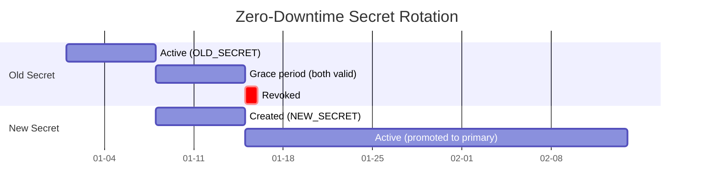

# Secret Rotation Patterns

## When to Use This Skill

Secrets don't age well. Automate rotation before credentials become liabilities.

> **The Risk**
>
>
> Long-lived credentials are time bombs. Every day a secret remains unchanged increases the probability it has already leaked. Rotation limits blast radius when compromise happens, not if.


## Implementation

See the full implementation guide in the [source documentation](https://adaptive-enforcement-lab.com/secure/github-actions-security/).


## Techniques


### Why Rotate Secrets?

Static credentials persist in memory, logs, backups, and artifacts long after you think they're gone.

**Rotation Benefits**:

- **Limit blast radius**: Compromised credentials expire automatically
- **Detect breaches**: Failed rotation indicates credential misuse
- **Compliance**: Meet regulatory requirements for credential lifecycle
- **Reduce sprawl**: Forces inventory of what secrets exist and where
- **Audit trail**: Rotation events signal credential usage patterns

**Without Rotation**:

- Credentials persist indefinitely in GitHub audit logs
- Ex-employees retain access via copied credentials
- Leaked credentials remain valid forever
- No mechanism to detect unauthorized usage
- Compliance violations accumulate


### Rotation Schedule Recommendations

Not all secrets require the same rotation frequency. Risk-based scheduling balances security and operational overhead.

### Rotation Tiers

| Tier | Access Scope | Rotation Frequency | Examples |
| ---- | ------------ | ------------------ | -------- |
| **Critical** | Production write access, infrastructure control | **7-14 days** | Production deploy keys, cloud admin credentials, database root passwords |
| **High** | Production read access, sensitive data | **30 days** | Production API tokens, secrets managers, monitoring credentials |
| **Medium** | Non-production environments, limited scope | **90 days** | Staging credentials, package registry tokens, integration test accounts |
| **Low** | Read-only access, public services | **180 days** | Artifact storage, CDN tokens, external API read keys |

### Event-Driven Rotation

Rotate immediately when:

- **Employee departure**: Any team member with access leaves
- **Breach detected**: Credential found in logs, artifacts, or public repos
- **Service compromise**: Upstream service reports security incident
- **Workflow changes**: Modifications to `.github/workflows/` with secret access
- **Access expansion**: Secret shared with additional repositories or teams


### Zero-Downtime Rotation Strategy

Rotating secrets without breaking active workflows requires overlapping validity periods.

### Dual-Secret Pattern

Maintain two versions of each secret during rotation window.



**Implementation**:

1. **T-0**: Generate new credential, store as `SECRET_NAME_NEW`
2. **T+1h**: Update service to accept both old and new credentials
3. **T+24h**: Update GitHub secret `SECRET_NAME` with new value
4. **T+48h**: Verify all workflows using new credential
5. **T+7d**: Revoke old credential from service
6. **T+14d**: Remove `SECRET_NAME_NEW` from GitHub (cleanup)

### Rotation Workflow

Automate rotation with scheduled GitHub Actions workflow.

```yaml
name: Rotate Production Secrets

on:
  schedule:
    # Run monthly on 1st at 02:00 UTC
    - cron: '0 2 1 * *'
  workflow_dispatch:  # Manual trigger

permissions:
  contents: read

jobs:
  rotate-deploy-key:
    runs-on: ubuntu-latest
    environment: production  # Requires approval
    steps:
      # google-github-actions/auth v2.1.0
      - uses: google-github-actions/auth@f112390a2df9932162083945e46d439060d66ec2
        with:
          workload_identity_provider: ${{ secrets.GCP_WIF_PROVIDER }}
          service_account: 'secret-rotator@project.iam.gserviceaccount.com'

      - name: Generate new SSH key
        id: keygen
        run: |
          ssh-keygen -t ed25519 -N '' -f deploy_key -C "deploy-$(date +%Y%m%d)"
          echo "public_key=$(cat deploy_key.pub)" >> $GITHUB_OUTPUT
          echo "private_key<<EOF" >> $GITHUB_OUTPUT
          cat deploy_key >> $GITHUB_OUTPUT
          echo "EOF" >> $GITHUB_OUTPUT

      - name: Store new key in Secret Manager
        run: |
          # Store with version suffix for dual-key pattern
          echo "${{ steps.keygen.outputs.private_key }}" | \
            gcloud secrets versions add deploy-key-new --data-file=-

      - name: Update authorized_keys on servers
        run: |
          # Add new key to authorized_keys (old key still valid)
          gcloud compute ssh deploy-target \
            --command="echo '${{ steps.keygen.outputs.public_key }}' >> ~/.ssh/authorized_keys"

      - name: Verify new key works
        run: |
          # Test deployment with new key
          ssh -i deploy_key -o StrictHostKeyChecking=no deploy@target 'echo "New key verified"'

      - name: Update GitHub secret
        env:
          GH_TOKEN: ${{ secrets.ROTATION_GITHUB_TOKEN }}
        run: |
          # Update repository secret via GitHub CLI
          gh secret set DEPLOY_KEY --body "${{ steps.keygen.outputs.private_key }}"

      - name: Schedule old key revocation
        run: |
          # Store revocation timestamp in Secret Manager
          date -d '+7 days' -u +%Y-%m-%dT%H:%M:%SZ | \
            gcloud secrets versions add deploy-key-revoke-at --data-file=-
```

**Revocation Workflow** (7 days later):

```yaml
name: Revoke Old Secrets

on:
  schedule:
    # Run daily at 03:00 UTC
    - cron: '0 3 * * *'
  workflow_dispatch:

permissions:
  contents: read

jobs:
  revoke-expired:
    runs-on: ubuntu-latest
    environment: production
    steps:
      # google-github-actions/auth v2.1.0
      - uses: google-github-actions/auth@f112390a2df9932162083945e46d439060d66ec2
        with:
          workload_identity_provider: ${{ secrets.GCP_WIF_PROVIDER }}
          service_account: 'secret-rotator@project.iam.gserviceaccount.com'

      - name: Check revocation schedule
        id: check
        run: |
          revoke_at=$(gcloud secrets versions access latest --secret=deploy-key-revoke-at || echo "")
          if [[ -z "$revoke_at" ]]; then
            echo "No revocation scheduled"
            exit 0
          fi

          if [[ $(date -u +%s) -ge $(date -d "$revoke_at" +%s) ]]; then
            echo "revoke=true" >> $GITHUB_OUTPUT
          else
            echo "Not yet time to revoke (scheduled for $revoke_at)"
            exit 0
          fi

      - name: Remove old key from authorized_keys
        if: steps.check.outputs.revoke == 'true'
        run: |
          # Remove all but most recent key from servers
          gcloud compute ssh deploy-target \
            --command="tail -n1 ~/.ssh/authorized_keys > ~/.ssh/authorized_keys.new && mv ~/.ssh/authorized_keys.new ~/.ssh/authorized_keys"

      - name: Delete revocation marker
        if: steps.check.outputs.revoke == 'true'
        run: |
          gcloud secrets delete deploy-key-revoke-at --quiet
```


### Notification Patterns

Alert teams before credentials expire. Proactive notifications prevent outages.

### Expiration Tracking

Store secret metadata with expiration dates.

```yaml
name: Secret Expiration Monitor

on:
  schedule:
    # Run weekly on Monday at 09:00 UTC
    - cron: '0 9 * * 1'
  workflow_dispatch:

permissions:
  contents: read
  issues: write  # Create expiration warnings

jobs:
  check-expiration:
    runs-on: ubuntu-latest
    steps:
      - uses: actions/checkout@b4ffde65f46336ab88eb53be808477a3936bae11  # v4.1.1

      - name: Check secret ages
        id: check
        run: |
          # Read secret inventory with last rotation dates
          expiring=$(python3 << 'EOF'
          import json
          from datetime import datetime, timedelta

          with open('.github/secret-inventory.json') as f:
              inventory = json.load(f)

          now = datetime.now()
          expiring_secrets = []

          for secret in inventory['secrets']:
              last_rotated = datetime.fromisoformat(secret['last_rotated'])
              age_days = (now - last_rotated).days
              max_age = secret['rotation_tier_days']

              days_remaining = max_age - age_days

              if days_remaining <= 7:
                  expiring_secrets.append({
                      'name': secret['name'],
                      'days_remaining': days_remaining,
                      'tier': secret['tier']
                  })

          print(json.dumps(expiring_secrets))
          EOF
          )

          echo "expiring=$expiring" >> $GITHUB_OUTPUT

      - name: Create warning issue
        if: steps.check.outputs.expiring != '[]'
        env:
          GH_TOKEN: ${{ secrets.GITHUB_TOKEN }}
        run: |
          expiring='${{ steps.check.outputs.expiring }}'

          body=$(cat << EOF
          ## ⚠️ Secrets Expiring Soon

          The following secrets require rotation:

          $(echo "$expiring" | jq -r '.[] | "- **\(.name)** (Tier \(.tier)): \(.days_remaining) days remaining"')

          **Action Required**: Trigger rotation workflows in the next 7 days.

          See [Secret Rotation Patterns](https://adaptive-enforcement-lab.com/secure/github-actions-security/secrets/rotation/) for procedures.
          EOF
          )

          gh issue create \
            --title "Secret Rotation Required" \
            --label "security,secrets,rotation" \
            --body "$body"
```

### Slack Notification Integration

```yaml
      - name: Send Slack alert
        if: steps.check.outputs.expiring != '[]'
        run: |
          expiring='${{ steps.check.outputs.expiring }}'

          payload=$(cat << EOF
          {
            "text": "🔐 Secret Rotation Alert",
            "blocks": [
              {
                "type": "header",
                "text": {
                  "type": "plain_text",
                  "text": "⚠️ Secrets Expiring Soon"
                }
              },
              {
                "type": "section",
                "text": {
                  "type": "mrkdwn",
                  "text": "The following secrets need rotation:\n\n$(echo "$expiring" | jq -r '.[] | "• *\(.name)* (Tier \(.tier)): \(.days_remaining) days"')"
                }
              },
              {
                "type": "actions",
                "elements": [
                  {
                    "type": "button",
                    "text": {
                      "type": "plain_text",
                      "text": "Rotate Now"
                    },
                    "url": "${{ github.server_url }}/${{ github.repository }}/actions/workflows/rotate-secrets.yml"
                  }
                ]
              }
            ]
          }
          EOF
          )

          curl -X POST -H 'Content-type: application/json' \

*See [reference.md](reference.md) for additional techniques and detailed examples.*


## Examples

See [examples.md](examples.md) for code examples.


## Full Reference

See [reference.md](reference.md) for complete documentation.
## References

- [Source Documentation](https://adaptive-enforcement-lab.com/secure/github-actions-security/)
- [AEL Secure](https://adaptive-enforcement-lab.com/secure/)
