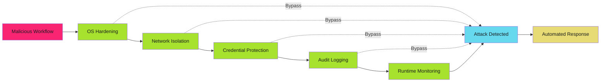

# Self-Hosted Runner Hardening - Examples


## Example 1: example-1.mermaid





## Example 2: example-2.sh


```bash
#!/bin/bash
# Minimal Ubuntu server hardening for GitHub Actions runner

set -euo pipefail

echo "==> Applying OS hardening for GitHub Actions runner"

# Remove unnecessary packages
apt-get purge -y \
  snapd \
  cloud-init \
  lxd \
  landscape-client \
  landscape-common \
  telnet \
  rsh-client \
  rsh-redone-client

# Remove package management tools that workflows should not use
apt-get purge -y apt-listchanges

# Update all packages
apt-get update
apt-get upgrade -y
apt-get autoremove -y

# Install security tools
apt-get install -y \
  unattended-upgrades \
  auditd \
  aide \
  fail2ban \
  ufw \
  apparmor \
  apparmor-utils

echo "==> OS hardening complete"
```


## Example 3: example-3.sh


```bash
# /etc/apt/apt.conf.d/50unattended-upgrades
# Automatic security updates configuration

Unattended-Upgrade::Allowed-Origins {
    "${distro_id}:${distro_codename}-security";
    "${distro_id}ESMApps:${distro_codename}-apps-security";
    "${distro_id}ESM:${distro_codename}-infra-security";
};

Unattended-Upgrade::DevRelease "false";
Unattended-Upgrade::AutoFixInterruptedDpkg "true";
Unattended-Upgrade::MinimalSteps "true";
Unattended-Upgrade::Remove-Unused-Kernel-Packages "true";
Unattended-Upgrade::Remove-Unused-Dependencies "true";
Unattended-Upgrade::Automatic-Reboot "true";
Unattended-Upgrade::Automatic-Reboot-Time "03:00";
```


## Example 4: example-4.sh


```bash
# /etc/apt/apt.conf.d/20auto-upgrades
# Enable automatic updates

APT::Periodic::Update-Package-Lists "1";
APT::Periodic::Download-Upgradeable-Packages "1";
APT::Periodic::AutocleanInterval "7";
APT::Periodic::Unattended-Upgrade "1";
```


## Example 5: example-5.sh


```bash
#!/bin/bash
# CIS Ubuntu Linux 22.04 LTS Benchmark Level 1 (selected controls)

set -euo pipefail

echo "==> Applying CIS benchmarks for runner hardening"

# 1.1.1.1 - Disable unused filesystems
cat > /etc/modprobe.d/disable-filesystems.conf <<EOF
install cramfs /bin/true
install freevxfs /bin/true
install jffs2 /bin/true
install hfs /bin/true
install hfsplus /bin/true
install udf /bin/true
EOF

# 1.5.1 - Configure bootloader permissions
chmod 600 /boot/grub/grub.cfg

# 3.1.1 - Disable IP forwarding (unless runner needs it)
cat >> /etc/sysctl.d/99-runner-hardening.conf <<EOF
net.ipv4.ip_forward = 0
net.ipv6.conf.all.forwarding = 0
EOF

# 3.2.1 - Disable packet redirect sending
cat >> /etc/sysctl.d/99-runner-hardening.conf <<EOF
net.ipv4.conf.all.send_redirects = 0
net.ipv4.conf.default.send_redirects = 0
EOF

# 3.3.1 - Disable source routed packet acceptance
cat >> /etc/sysctl.d/99-runner-hardening.conf <<EOF
net.ipv4.conf.all.accept_source_route = 0
net.ipv4.conf.default.accept_source_route = 0
net.ipv6.conf.all.accept_source_route = 0
net.ipv6.conf.default.accept_source_route = 0
EOF

# 3.3.2 - Disable ICMP redirect acceptance
cat >> /etc/sysctl.d/99-runner-hardening.conf <<EOF
net.ipv4.conf.all.accept_redirects = 0
net.ipv4.conf.default.accept_redirects = 0
net.ipv6.conf.all.accept_redirects = 0
net.ipv6.conf.default.accept_redirects = 0
EOF

# 3.3.3 - Enable bad error message protection
cat >> /etc/sysctl.d/99-runner-hardening.conf <<EOF
net.ipv4.icmp_ignore_bogus_error_responses = 1
EOF

# 3.3.4 - Enable reverse path filtering
cat >> /etc/sysctl.d/99-runner-hardening.conf <<EOF
net.ipv4.conf.all.rp_filter = 1
net.ipv4.conf.default.rp_filter = 1
EOF

# 3.3.5 - Enable TCP SYN cookies
cat >> /etc/sysctl.d/99-runner-hardening.conf <<EOF
net.ipv4.tcp_syncookies = 1
EOF

# Apply sysctl settings
sysctl -p /etc/sysctl.d/99-runner-hardening.conf

# 5.2.1 - Configure SSH server (if enabled)
if systemctl is-enabled ssh; then
    sed -i 's/^#PermitRootLogin.*/PermitRootLogin no/' /etc/ssh/sshd_config
    sed -i 's/^#PasswordAuthentication.*/PasswordAuthentication no/' /etc/ssh/sshd_config
    sed -i 's/^#PubkeyAuthentication.*/PubkeyAuthentication yes/' /etc/ssh/sshd_config
    systemctl restart ssh
fi

echo "==> CIS benchmark hardening complete"
```


## Example 6: example-6.sh


```bash
#!/bin/bash
# Create dedicated runner user with minimal privileges

set -euo pipefail

RUNNER_USER="github-runner"
RUNNER_HOME="/opt/github-runner"

# Create runner user (system account, no shell, no password)
useradd \
  --system \
  --home-dir "$RUNNER_HOME" \
  --create-home \
  --shell /usr/sbin/nologin \
  --comment "GitHub Actions Runner" \
  "$RUNNER_USER"

# Lock the account (prevent password login)
passwd -l "$RUNNER_USER"

# Set restrictive permissions on runner home
chmod 750 "$RUNNER_HOME"
chown -R "$RUNNER_USER:$RUNNER_USER" "$RUNNER_HOME"

# Create workspace directory with isolation
mkdir -p "$RUNNER_HOME/_work"
chmod 700 "$RUNNER_HOME/_work"
chown "$RUNNER_USER:$RUNNER_USER" "$RUNNER_HOME/_work"

echo "==> Runner user created: $RUNNER_USER"
```


## Example 7: example-7.sh


```bash
# /etc/sudoers.d/github-runner
# ONLY if specific commands require elevation (avoid if possible)

# Allow runner to restart specific service (example only)
github-runner ALL=(ALL) NOPASSWD: /usr/bin/systemctl restart myapp.service

# Prevent everything else
github-runner ALL=(ALL) !ALL
```


## Example 8: example-8.sh


```bash
# /etc/fstab
# Restrictive mount options for runner workspace

# Example: Mount runner workspace with noexec, nosuid, nodev
tmpfs /opt/github-runner/_work tmpfs noexec,nosuid,nodev,size=8G,mode=0700,uid=github-runner,gid=github-runner 0 0

# Alternative: Dedicated partition for runner workspace
/dev/sdb1 /opt/github-runner/_work ext4 noexec,nosuid,nodev,noatime 0 2
```


## Example 9: example-9.sh


```bash
# /etc/apparmor.d/github-runner
# AppArmor profile for GitHub Actions runner

#include <tunables/global>

/opt/github-runner/bin/Runner.Listener {
  #include <abstractions/base>
  #include <abstractions/nameservice>

  # Runner binary and libraries
  /opt/github-runner/** r,
  /opt/github-runner/bin/Runner.Listener rix,

  # Workspace access (read-write)
  /opt/github-runner/_work/** rw,

  # Network access (required for GitHub API)
  network inet stream,
  network inet6 stream,

  # Deny access to sensitive system paths
  deny /etc/shadow r,
  deny /root/** rw,
  deny /home/** rw,
  deny /var/log/** rw,

  # Deny execution of shells (prevent interactive backdoors)
  deny /bin/bash x,
  deny /bin/sh x,
  deny /bin/dash x,

  # Deny cloud metadata endpoints
  deny network inet to 169.254.169.254,
  deny network inet to fd00:ec2::254,
}
```


## Example 10: example-10.sh


```bash
# Enable AppArmor profile
apparmor_parser -r /etc/apparmor.d/github-runner
aa-enforce /opt/github-runner/bin/Runner.Listener
```


