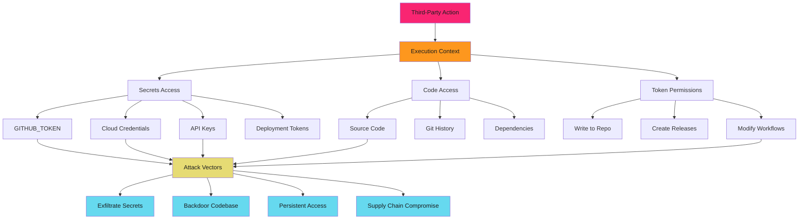
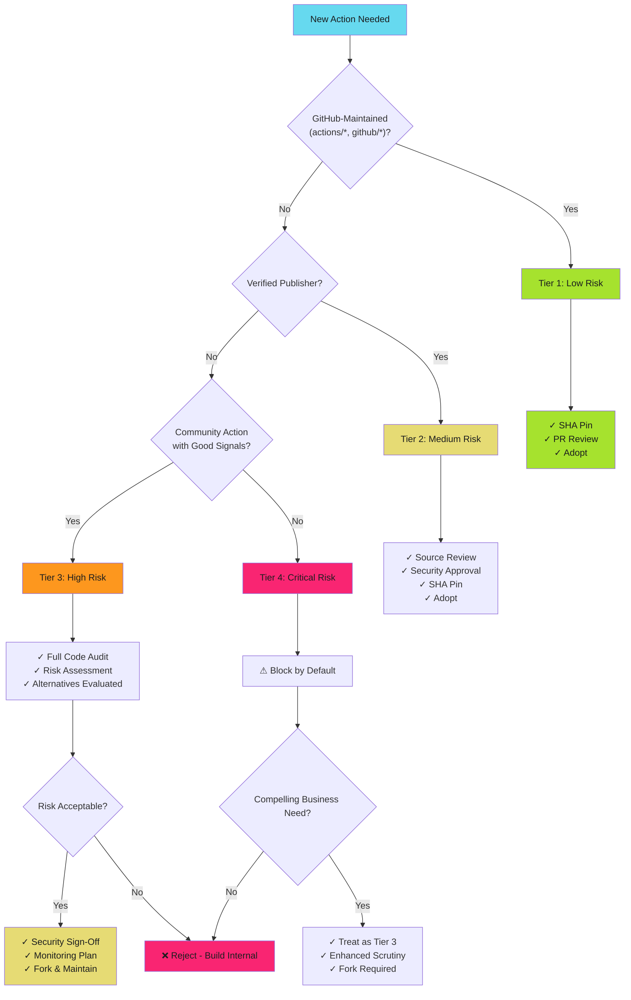

# Third-Party Action Risk Assessment - Examples


## Example 1: example-1.mermaid





## Example 2: example-2.mermaid





## Example 3: example-3.yaml


```yaml
# Bad - tag reference
- uses: community/action@v2

# Good - SHA pinned with version comment
- uses: community/action@a1b2c3d4e5f6...  # v2.1.0
```


