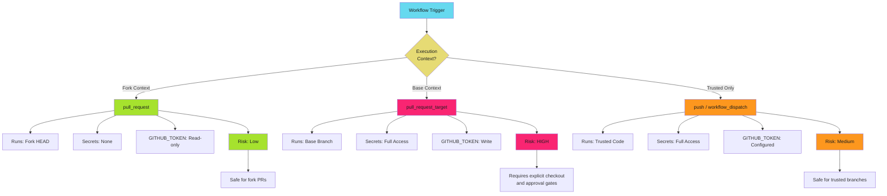

# Workflow Trigger Security - Reference

This is the complete reference documentation extracted from the source.


# Workflow Trigger Security

Workflow triggers control when code executes and in what security context. Choose the wrong trigger and attackers can inject code, escalate privileges, or exfiltrate secrets from forks.

> **The Risk**
>
>
> Trigger misconfiguration is the leading cause of GitHub Actions privilege escalation. `pull_request_target` runs fork code in the base repository context with full secret access. External contributors can weaponize this to steal credentials, push malicious code, or compromise your infrastructure.
>

## The Trigger Security Model

GitHub Actions triggers fall into three security categories based on execution context and secret access.



## `pull_request` vs `pull_request_target`

Understanding the difference between these triggers is critical for fork security.

### `pull_request` Trigger

**Security Context**: Runs in fork's security context

**Code Executed**: From pull request HEAD

**Secret Access**: None

**GITHUB_TOKEN Permissions**: Read-only by default

**Safe For**: Public repositories accepting fork contributions

**Use Cases**: Testing, linting, build verification, security scanning

**Example Safe Fork CI**:

```yaml
name: Fork CI
on:
  pull_request:
    branches: [main]

permissions:
  contents: read  # Explicit read-only

jobs:
  test:
    runs-on: ubuntu-latest
    steps:
      # Safe: Checkout fork PR code in isolated context
      - uses: actions/checkout@b4ffde65f46336ab88eb53be808477a3936bae11  # v4.1.1

      # Safe: No secrets, runs untrusted code
      - name: Run tests
        run: npm test

      # Safe: Read-only token cannot modify repository
      - name: Verify build
        run: npm run build
```

**Why This Is Safe**:

1. Fork code runs in isolated context
2. No access to repository secrets
3. GITHUB_TOKEN is read-only
4. Cannot push code or modify releases
5. Cannot access organization resources

### `pull_request_target` Trigger

**Security Context**: Runs in base repository context

**Code Executed**: From base branch, NOT pull request code

**Secret Access**: Full repository and organization secrets

**GITHUB_TOKEN Permissions**: Write by default

**Dangerous For**: Any workflow that checks out or executes PR code

**Valid Use Cases**: Commenting on PRs, labeling PRs, triggering external systems, publishing previews after approval

**Example DANGEROUS Pattern**:

```yaml
# DO NOT USE THIS PATTERN - SEVERE SECURITY RISK
name: Dangerous PR Target
on:
  pull_request_target:  # Base context with secrets
    branches: [main]

jobs:
  deploy-preview:
    runs-on: ubuntu-latest
    steps:
      # DANGER: Checks out fork code in base context with secrets
      - uses: actions/checkout@b4ffde65f46336ab88eb53be808477a3936bae11  # v4.1.1
        with:
          ref: ${{ github.event.pull_request.head.sha }}

      # DANGER: Executes fork code with full secret access
      - run: npm run deploy-preview
        env:
          AWS_SECRET: ${{ secrets.AWS_SECRET }}
```

**Why This Is Dangerous**:

1. Fork code executes in base repository security context
2. Full access to all secrets
3. GITHUB_TOKEN has write permissions by default
4. Attacker can exfiltrate credentials in malicious `package.json` scripts
5. Attacker can push code, create releases, or modify workflows

**Example Safe Pattern with Approval**:

```yaml
name: Safe PR Target with Approval
on:
  pull_request_target:
    branches: [main]

permissions:
  pull-requests: write  # Only PR comments
  contents: read        # No repository modification

jobs:
  deploy-preview:
    runs-on: ubuntu-latest
    environment: pr-previews
    steps:
      - uses: actions/checkout@b4ffde65f46336ab88eb53be808477a3936bae11  # v4.1.1
        with:
          ref: ${{ github.event.pull_request.head.sha }}

      - uses: google-github-actions/auth@55bd3a7c6e2ae7cf1877fd1ccb9d54c0503c457c  # v2.1.2
        with:
          workload_identity_provider: ${{ secrets.WIF_PROVIDER }}
          service_account: ${{ secrets.WIF_SERVICE_ACCOUNT }}

      - run: npm run deploy-preview
```

**Safe Pattern Requirements**:

1. Minimal permissions (no `contents: write`)
2. Environment protection with required reviewers
3. OIDC authentication instead of stored secrets
4. Explicit checkout only after approval gate
5. Audit logging for all preview deployments

### Trigger Comparison Table

| Aspect | `pull_request` | `pull_request_target` |
| ------ | -------------- | --------------------- |
| **Execution Context** | Fork HEAD | Base branch |
| **Secret Access** | None | Full access |
| **GITHUB_TOKEN** | Read-only | Write |
| **Use Case** | Test fork PRs | Comment on PRs |
| **Risk Level** | Low | High |
| **Safe for Forks** | Yes | Only with approval |

## Fork Workflow Security Patterns

### Pattern 1: Two-Stage Fork CI

Separate untrusted fork testing from privileged operations.

```yaml
# Stage 1: Test fork code with pull_request
name: Fork Tests
on:
  pull_request:
    branches: [main]

permissions:
  contents: read

jobs:
  test:
    runs-on: ubuntu-latest
    steps:
      - uses: actions/checkout@b4ffde65f46336ab88eb53be808477a3936bae11  # v4.1.1
      - run: npm test
```

```yaml
# Stage 2: Post results with workflow_run
name: Post Test Results
on:
  workflow_run:
    workflows: ["Fork Tests"]
    types: [completed]

permissions:
  pull-requests: write
  contents: read

jobs:
  comment:
    runs-on: ubuntu-latest
    if: github.event.workflow_run.event == 'pull_request'
    steps:
      - uses: actions/github-script@60a0d83039c74a4aee543508d2ffcb1c3799cdea  # v7.0.1
        with:
          script: |
            await github.rest.issues.createComment({
              issue_number: ${{ github.event.workflow_run.pull_requests[0].number }},
              owner: context.repo.owner,
              repo: context.repo.repo,
              body: 'Tests completed. Check workflow run for results.'
            });
```

Stage 1 runs untrusted code without secrets. Stage 2 runs trusted code with write permissions. The `workflow_run` trigger bridges the security boundary.

### Pattern 2: Approval Gate for Fork Deployments

Require manual approval before deploying fork code.

```yaml
name: Preview Deployment
on:
  pull_request_target:
    branches: [main]

permissions:
  contents: read
  pull-requests: write

jobs:
  deploy-preview:
    runs-on: ubuntu-latest
    environment: pr-previews
    steps:
      - uses: actions/checkout@b4ffde65f46336ab88eb53be808477a3936bae11  # v4.1.1
        with:
          ref: ${{ github.event.pull_request.head.sha }}

      - uses: google-github-actions/auth@55bd3a7c6e2ae7cf1877fd1ccb9d54c0503c457c  # v2.1.2
        with:
          workload_identity_provider: ${{ secrets.WIF_PROVIDER }}
          service_account: ${{ secrets.WIF_SERVICE_ACCOUNT }}

      - run: npm run deploy-preview
```

Configure the `pr-previews` environment in Settings → Environments with required reviewers and deployment branch restrictions.

### Pattern 3: Fork PR Security Validation

```yaml
name: Fork Security Scan
on:

