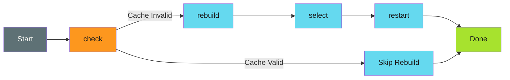

# Command Architecture - Examples


## Example 1: example-1.mermaid





## Example 2: example-2.text


```text
myctl
├── orchestrate          # Main workflow
├── check                # Cache status
├── rebuild              # Force cache rebuild
├── select               # List deployments
├── restart              # Restart deployments
├── version              # Show version info
└── completion           # Shell completion scripts
    ├── bash
    ├── zsh
    └── fish
```


