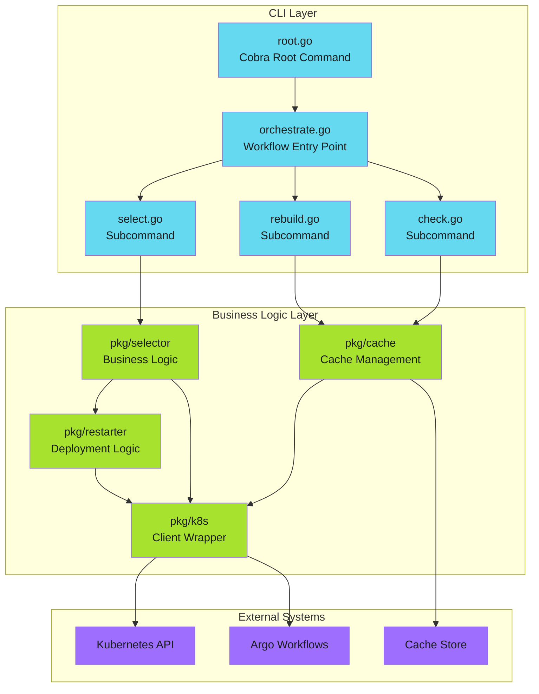

# Go CLI Architecture - Examples


## Example 1: example-1.mermaid





## Example 2: example-2.text


```text
myctl/
├── cmd/
│   ├── root.go           # Cobra root command, global flags
│   ├── orchestrate.go    # Main workflow orchestrator
│   ├── check.go          # Cache check command
│   ├── rebuild.go        # Cache rebuild command
│   └── select.go         # Deployment selector
├── pkg/
│   ├── cache/            # Cache management logic
│   │   ├── cache.go
│   │   └── cache_test.go
│   ├── k8s/              # Kubernetes client wrapper
│   │   ├── client.go
│   │   └── client_test.go
│   ├── selector/         # Business logic
│   │   ├── selector.go
│   │   └── selector_test.go
│   └── restarter/        # Deployment restart logic
│       ├── restarter.go
│       └── restarter_test.go
├── Dockerfile
├── go.mod
├── go.sum
└── main.go               # Entry point
```


