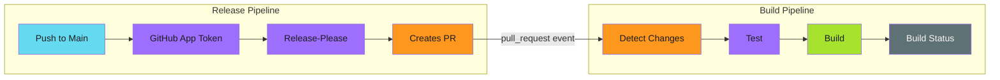

# Modular Release Pipelines

## When to Use This Skill

This guide covers implementing release automation with:

- **Release-please** for version bumping and changelog generation
- **GitHub App authentication** for proper workflow triggering
- **Change detection** to skip unnecessary builds
- **Cascade rebuilds** when shared dependencies change

---

## Prerequisites

Before implementing release pipelines, set up a GitHub App for your organization:

- [GitHub App Setup](../../secure/github-apps/index.md) - Create and configure the App
- [Token Generation](../../patterns/github-actions/actions-integration/token-generation/index.md) - Generate tokens in workflows

---

## Implementation

See the full implementation guide in the source documentation.

## Examples

See [examples.md](examples.md) for code examples.

## References

- [Source Documentation](https://adaptive-enforcement-lab.com/build/release-pipelines/)
- [AEL Build](https://adaptive-enforcement-lab.com/build/)
