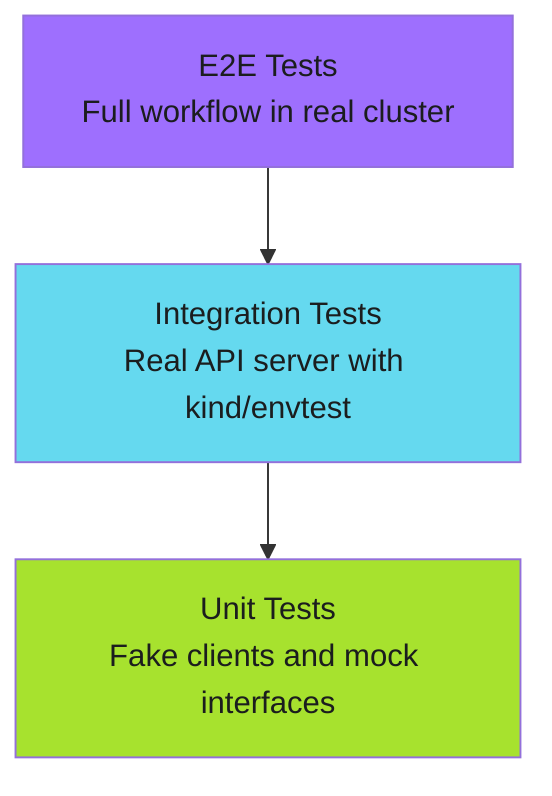

# Testing Strategies

## When to Use This Skill

A well-tested CLI uses different testing strategies at different levels. This section covers:

- **[Unit Testing](unit-testing.md)** - Fake clients and interface-based design
- **[Integration Testing](integration-testing.md)** - envtest and real API servers
- **[E2E Testing](e2e-testing.md)** - Full workflow tests in CI/CD

---


## Implementation

See the full implementation guide in the [source documentation](https://adaptive-enforcement-lab.com/build/go-cli-architecture/).


## Key Principles

| Practice | Description |
| ---------- | ------------- |
| **Interface first** | Design for testability with interfaces |
| **Table-driven tests** | Cover edge cases systematically |
| **Parallel tests** | Use `t.Parallel()` where safe |
| **Build tags** | Separate integration tests with `//go:build integration` |
| **Clean up** | Always clean up test resources |

---

*Test at the right level. Unit tests catch logic bugs. Integration tests catch API issues. E2E tests catch workflow bugs.*


## Techniques


### Overview

A well-tested CLI uses different testing strategies at different levels. This section covers:

- **[Unit Testing](unit-testing.md)** - Fake clients and interface-based design
- **[Integration Testing](integration-testing.md)** - envtest and real API servers
- **[E2E Testing](e2e-testing.md)** - Full workflow tests in CI/CD

---


### Testing Pyramid



---


### Test Organization

```text
myctl/
├── cmd/
│   ├── check.go
│   └── check_test.go        # Command tests
├── pkg/
│   ├── k8s/
│   │   ├── client.go
│   │   ├── client_test.go   # Unit tests with fakes
│   │   └── fake_client.go   # Test doubles
│   └── selector/
│       ├── selector.go
│       └── selector_test.go
└── test/
    ├── e2e/                  # E2E tests
    └── fixtures/             # Test resources
```

---


### Makefile Targets

```makefile
.PHONY: test test-unit test-integration test-e2e

test: test-unit

test-unit:
    go test -v -race ./...

test-integration:
    go test -v -tags=integration ./pkg/...

test-e2e:
    ./test/e2e/run.sh
```

---


### Best Practices

| Practice | Description |
| ---------- | ------------- |
| **Interface first** | Design for testability with interfaces |
| **Table-driven tests** | Cover edge cases systematically |
| **Parallel tests** | Use `t.Parallel()` where safe |
| **Build tags** | Separate integration tests with `//go:build integration` |
| **Clean up** | Always clean up test resources |

---

*Test at the right level. Unit tests catch logic bugs. Integration tests catch API issues. E2E tests catch workflow bugs.*


## Examples

See [examples.md](examples.md) for code examples.
## References

- [Source Documentation](https://adaptive-enforcement-lab.com/build/go-cli-architecture/)
- [AEL Build](https://adaptive-enforcement-lab.com/build/)
