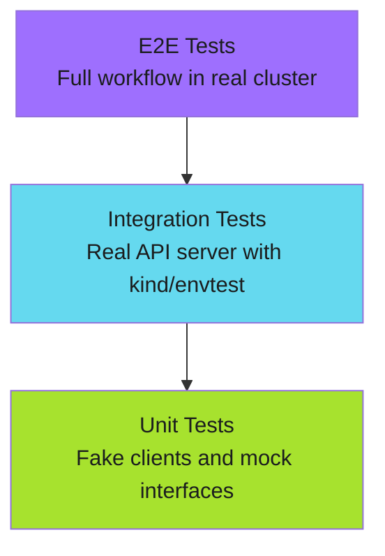

# Testing Strategies - Examples


## Example 1: example-1.mermaid





## Example 2: example-2.text


```text
myctl/
├── cmd/
│   ├── check.go
│   └── check_test.go        # Command tests
├── pkg/
│   ├── k8s/
│   │   ├── client.go
│   │   ├── client_test.go   # Unit tests with fakes
│   │   └── fake_client.go   # Test doubles
│   └── selector/
│       ├── selector.go
│       └── selector_test.go
└── test/
    ├── e2e/                  # E2E tests
    └── fixtures/             # Test resources
```


## Example 3: example-3.makefile


```makefile
.PHONY: test test-unit test-integration test-e2e

test: test-unit

test-unit:
    go test -v -race ./...

test-integration:
    go test -v -tags=integration ./pkg/...

test-e2e:
    ./test/e2e/run.sh
```


