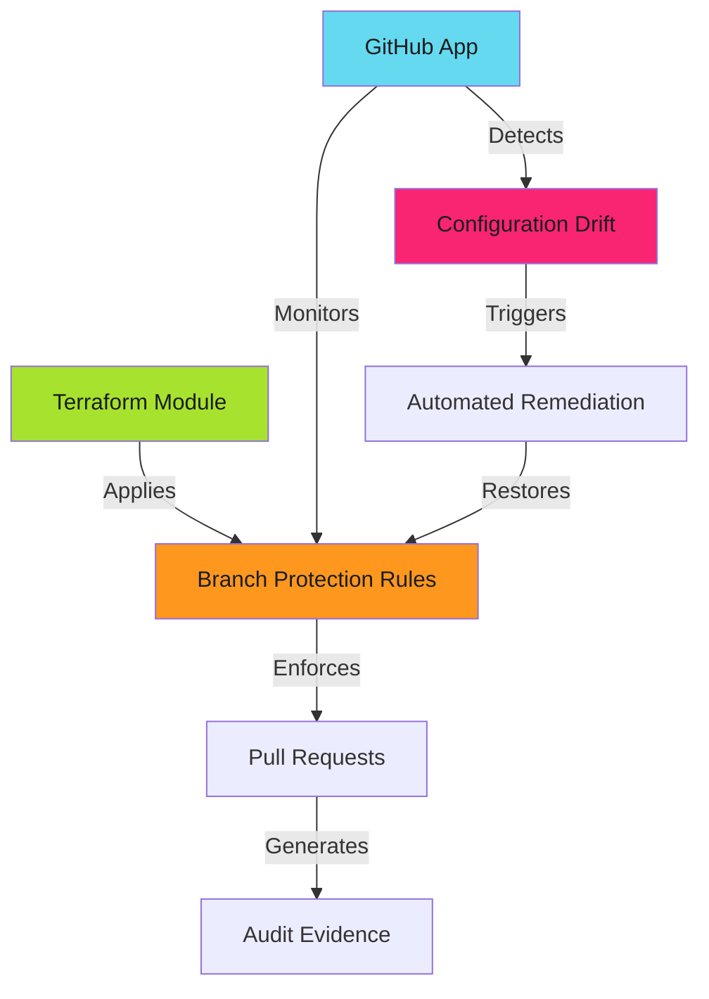

# Branch Protection Enforcement Patterns

## When to Use This Skill

**Key Components**:

- **Terraform modules** - Declare protection rules as code
- **GitHub Apps** - Monitor and enforce compliance organization-wide
- **Drift detection** - Identify unauthorized changes
- **Automated remediation** - Restore protection without manual intervention
- **Audit collection** - Capture evidence for compliance reporting

---

## Prerequisites

- GitHub organization with admin access
- Terraform or OpenTofu (for IaC deployment)
- GitHub App with appropriate permissions (for automated enforcement)
- Basic understanding of Git workflow and branch protection concepts

---

## Implementation

See the full implementation guide in the source documentation.

## Examples

See [examples.md](examples.md) for code examples.

## References

- [Source Documentation](https://adaptive-enforcement-lab.com/enforce/branch-protection/)
- [AEL Enforce](https://adaptive-enforcement-lab.com/enforce/)
