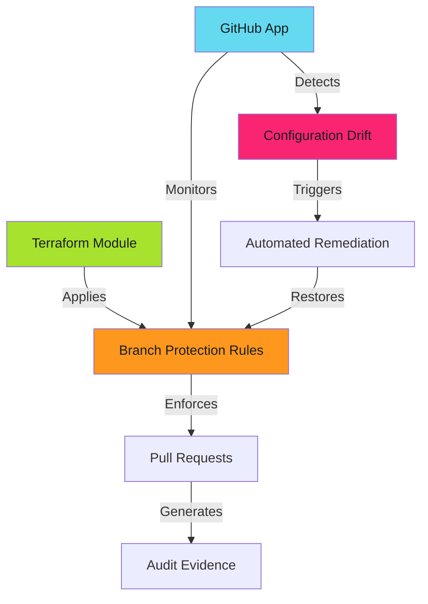

# Branch Protection Enforcement Patterns - Examples


## Example 1: example-1.mermaid





## Example 2: example-2.sh


```bash
gh api --method PUT \
  repos/org/repo/branches/main/protection \
  --input protection-config.json
```


