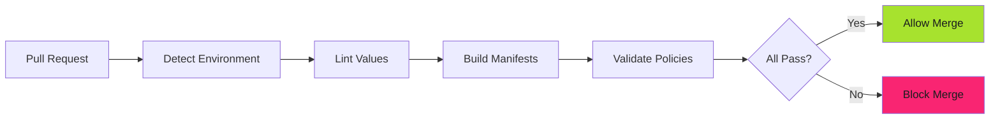

# CI Integration: Automated Policy Enforcement

## When to Use This Skill

CI integration enforces policies automatically in every pull request using the **same policy-platform container** developers run locally.

**Key Principle**: CI uses identical validation to local development. No surprises.

---

## Implementation

See the full implementation guide in the [source documentation](https://adaptive-enforcement-lab.com/enforce/policy-as-code/).

## Examples

See [examples.md](examples.md) for code examples.

## Full Reference

See [reference.md](reference.md) for complete documentation.
## References

- [Source Documentation](https://adaptive-enforcement-lab.com/enforce/policy-as-code/)
- [AEL Enforce](https://adaptive-enforcement-lab.com/enforce/)
