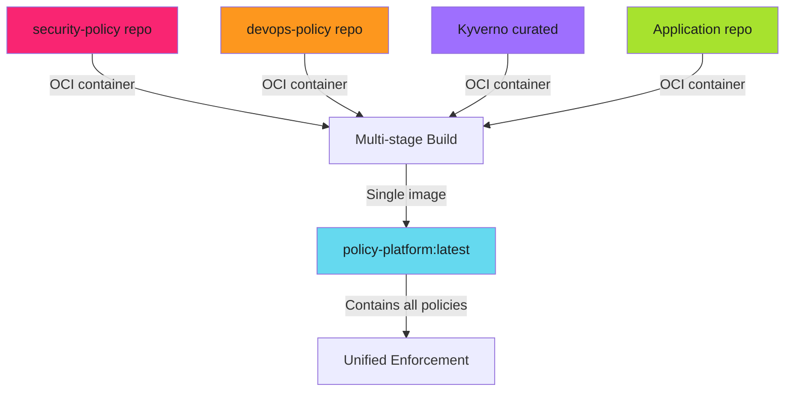

# Multi-Source Policy Aggregation

## When to Use This Skill

Real-world policy management requires aggregating policies from different teams and sources:

> **Policy Repos as OCI Containers**
>
> Each policy repository is **also** an OCI container. Multi-stage Docker builds pull them all automatically. No manual copying or Git submodules.
>

---

## Implementation

See the full implementation guide in the source documentation.

## Examples

See [examples.md](examples.md) for code examples.

## References

- [Source Documentation](https://adaptive-enforcement-lab.com/enforce/policy-as-code/)
- [AEL Enforce](https://adaptive-enforcement-lab.com/enforce/)
