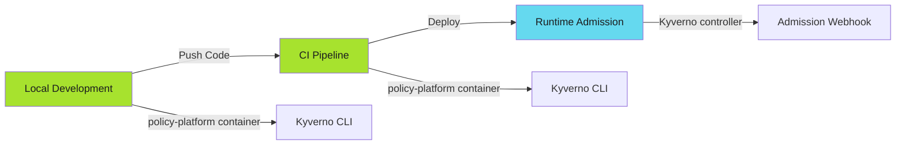

# Policy-as-Code: End-to-End Enforcement

## When to Use This Skill

Policy-as-Code ensures compliance through automated enforcement at three critical checkpoints:



**The Core Principle**: Same policies, three enforcement points. Zero gaps.

---


## Prerequisites

- Kubernetes cluster (for runtime deployment)
- Container runtime (Docker/Podman for local dev)
- CI platform (GitHub Actions, Bitbucket Pipelines, GitLab CI)
- Basic Kyverno knowledge (see [Kyverno guide](kyverno/index.md))

---


## Implementation

> **Start Local, Scale Up**
>
> Test policies locally first. Fix violations in seconds, not hours. Only after local validation works should you move to CI integration and runtime deployment.
>

**Step 1**: Run policies locally

```bash
docker run policy-platform:latest \
  kyverno apply /repos/security-policy/ \
  --resource deployment.yaml
```

**Step 2**: Add to CI pipeline

```yaml
- name: Policy Check
  image: policy-platform:latest
  script:
    - kyverno apply /repos/security-policy/ --resource app.yaml
```

**Step 3**: Deploy Kyverno to cluster

```bash
helm install kyverno kyverno/kyverno -f kyverno-values.yaml
helm install policy-reporter policy-reporter/policy-reporter
```

---


## Key Principles

### 1. Single Source of Truth

Policies live in Git repositories. Everything derives from there.

### 2. Container-Based Distribution

One container runs everywhere. No "works on my machine."

### 3. Progressive Enforcement

Local (warn) → CI (fail) → Runtime (block).

### 4. Separation of Concerns

- **Policy repos**: Define rules
- **Policy-platform**: Package and distribute
- **Kyverno**: Enforce at runtime

---


## Examples

See [examples.md](examples.md) for code examples.


## Full Reference

See [reference.md](reference.md) for complete documentation.


## Related Patterns

- SDLC Hardening
- Kyverno Implementation
- Pre-commit Hooks
- CI/CD Patterns

## References

- [Source Documentation](https://adaptive-enforcement-lab.com/enforce/policy-as-code/)
- [AEL Enforce](https://adaptive-enforcement-lab.com/enforce/)
